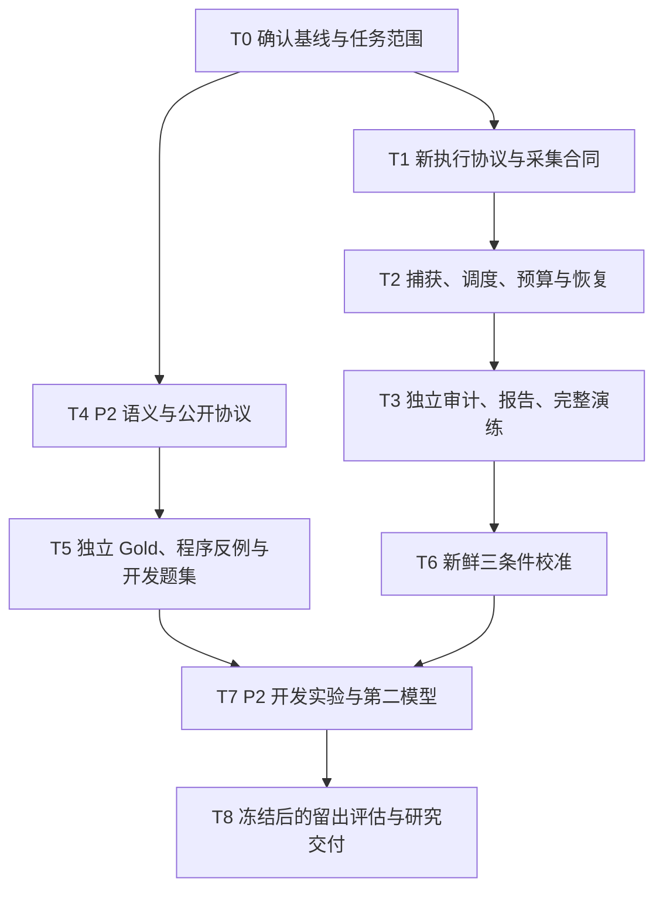

# DisasterTrace 后续整合计划 V1

日期：2026-09-07。状态：规划完成，新增功能与实验尚未执行。

本文整合 `plan_v2/` 中的四份方案，并对照当前代码核验关键前提。建议下一阶段优先形成可用于论文的研究原型：先解释现有评测差异，再建立自动可验证的动态证据任务，最后验证跨模型与留出泛化。

本轮只制定计划，没有修改 benchmark 源码、重跑测试或调用模型。下文的接口、模块、实验规模与工期均为拟议设计。已完成的 GitHub 私有审查快照保持为历史基线；本文不是新的实验启动记录。

## 1. 总体判断

下一阶段应有两个明确交付物：

1. **一个能够可靠执行、恢复、审计和解释结果的校准执行包。** 用它回答 P1 的差距有多少随输出说明和 token 上限改变，避免把格式成功率直接解释成记忆能力。
2. **一个独立的 P2 动态证据任务包。** 用部分更新、同窗口纠正和可恢复缺失，测模型能否选择正确版本、保留未变事实、维护来源，并区分有无足够证据。

两者可并行进行离线开发。P2 的真实模型比较在执行设置和新任务协议冻结后开展。继续使用自动参考答案与确定性评分，不新增逐题人工标注、专家判分或 LLM judge。

首要研究问题是：**在持续收到气象资料时，LLM 能否根据公开的更新规则维护正确的事实与来源？** 当前阶段不主张天气预测能力、真实应急决策最优性或模型内部记忆机制。

## 2. 四份方案如何整合

| 编号 | 输入方案 | 本计划重点吸收的内容 |
| --- | --- | --- |
| A | [仓库审阅后的增量实施计划](plan_v2/DisasterTrace_NEXT_STEPS_AFTER_REVIEW.md) | 两条轨道、三类语义、恢复与保留指标、明确的执行停止条件 |
| B | [基于 a23f73a 的实施与实验计划](plan_v2/DISASTERTRACE_NEXT_STEPS_A23F73A.md) | 评分机会与调用尝试分开、12 条程序微轨迹、源组与模板划分、载体机制边界 |
| C | [2026-09-07 下一阶段执行计划](plan_v2/DISASTERTRACE_NEXT_STEPS_2026-09-07.md) | 解析前响应捕获、仅读取公共视图的独立 oracle、单写入者账本、内容身份 |
| D | [下一阶段 Codex 执行计划](plan_v2/DISASTERTRACE_NEXT_PHASE_CODEX_PLAN.md) | 错误响应捕获缺口、旧 metadata 严格校验、新协议 provider 适配、验收与研究主张对应 |

四份方案的主要分歧按下表统一。目录名等实现选择直接给出推荐，不作为当前工作阻塞。

| 分歧 | 统一建议 | 原因与边界 |
| --- | --- | --- |
| 先校准还是先开发 P2 | 校准执行线与 P2 离线语义线并行，真实 P2 比较在后 | 避免付费等待阻塞研究开发，也避免在不稳定接口上解释能力差异 |
| 三条件还是四条件 | 保留三条件、270 个新机会 | 能回答两个局部对比；只有研究完整交互时再加 `legacy_8192` |
| 60 / 180 / 240 秒 | 新执行修订建议统一 180 秒阻塞超时与 180 秒总 deadline | 180 与 240 都不是实测结论；先选较小共同工程起点，不能按失败条件临时放宽 |
| P2 使用 4、5 或 6 检查点 | 第一版按 5 个检查点设计，先验证每个点的任务角色 | 采用 3 源组的开发规模时为 270 次；A 的 216 次来自另一套 6 根场景、6 检查点设计，C 的 216 次来自 3 源组、4 检查点，二者不可混用 |
| P2 单实体还是多实体 | 每轨迹只查询一个实体和窗口，输入允许有限的其他实体/窗口干扰 | 输出保持简单，同时能检验错误作用域覆盖 |
| FactKey 包含单位还是观测类型 | 使用实体、变量、有效窗口、measurement kind；单位按变量固定并验证 | 单位不匹配视为无效输入，不通过另造键静默接受；跨单位推理后置 |
| 新模块命名不同 | P2 统一放在 `src/disastertrace/controlled/`，协议 `disastertrace_controlled_v1` | 与 NHC V1、评分 V2、阶段 P2 分开命名，避免误改旧协议 |
| 截断 journal 是否自动恢复 | 自动化只允许离线核验完整前缀；发现损坏即停止网络续跑 | 不依据不完整日志推断某次请求肯定未发出 |
| heldout 默认重复 1 / 2 / 3 次 | 先用公式列预算，开发完成后统一冻结 R | 增加重复测服务随机性，不能增加独立风暴数 |

## 3. 已核实的起点与缺口

审阅基线为 `a23f73adadcbec077b9fcf2aecf8f45dfa4fe061`。本轮只读核对确认：Git 工作区干净；原项目与上传副本的 37 个非缓存源码文件、24 个测试文件逐字节一致。因此四份方案针对的代码基线仍适用。

| 已有成果 | 后续如何使用 |
| --- | --- |
| 12 候选风暴、36 公告、32 份解析成功、10 完整风暴 | 复用准入结果和排除记录；不重做抓取或更换失败事件 |
| 3 开发风暴、7 留出风暴 | 开发使用 Ida / Florence / Dorian；7 风暴暂无真实推理结果 |
| NHC 20 轨迹、100 检查点；开发 30、留出 70 | 检查点和分支均属于风暴内相关样本 |
| P1 共 90 个响应、91 次尝试 | 保留完整失败与原 attempt 79 未知收费记录 |
| 三方法的 schema 为 14/30、30/30、24/30；known grounding 为 39/96、96/96、76/96 | 作为历史发现；20 个 length、2 个其他结构错误使格式/预算成为优先解释因素 |
| 新输出契约、270 槽校准准备、54 初始请求、1,080 程序回答 | 复用规格与程序诊断；后续真实请求仍需自己的真实前序回答 |
| 上传时新环境 684 项测试通过，build / prepare / verify 成功 | 复用已保存验证记录；本次规划未重新执行，不把历史数字写成新结果 |
| 精简 references 已随仓库交付 | 需要核对清单与持续回归，当前不是“全部资料缺失” |

关键代码核对如下。路径相对于 GitHub 仓库中的 `disastertrace-starter/`，行号对应审阅基线。

| 源码位置 | 核对结论 | 后续处理 |
| --- | --- | --- |
| `automated/collection.py:24`、`:122` | 旧采集使用 legacy renderer，通用 collector 没有货币额度控制 | 新增契约感知编排与一个实验级账本 |
| `automated/calibration.py:277` | `score_rehearsal` 限定程序诊断和零请求 | 保留限制；另建实际采集审计和报告入口 |
| `automated/calibration.py:119` | 校准配置构造校验固定 60 秒 | 从旧准备包派生有明确差异的新执行包，不能只修改外部 JSON |
| `automated/provider.py:230`、`:297` | urllib 参数不是总 deadline；HTTPError 会丢弃正文，部分失败在返回前抛异常；`complete` 内部再次 prepare | 新路径发送已经保存的 prepared bytes，并在解析前捕获可用响应 |
| `automated/provider.py:163` | 公开请求固定旧协议、五字段和 POLICY | P2 独立校验/适配；不放宽旧 guard 为任意字典 |
| `automated/dynamic.py:142`、`evidence_support.py:347` | Gold 与支持规则按最新整份公告，不支持稀疏 patch 的字段继承 | 这是旧任务的既定语义；P2 另写参考答案和 scorer |
| `automated/calibration.py:178` | 现有筛选正确区分 schema 与 length，允许两者重叠，且标 `evidence_validated=false` | 不改门槛、不把所有问题都称为 bug；新增有实际证据绑定的选择入口 |
| `automated/workflow.py:35`、`:56` | 源码哈希和快照只覆盖 `automated/*.py`，不递归 | P2 及新运行资源必须有独立的完整递归清单，不能假定旧 ID 已保护它们 |

## 4. 阶段路线与完成门槛



| 阶段 | 交付物 | 验收门槛 | 模型 API |
| --- | --- | --- | --- |
| T0 基线与开发边界 | 基线差异、历史保护清单、开发分支方案、回归入口规格 | 原始记录可定位；新旧代码/数据/协议身份清楚 | 无 |
| T1 执行规格 | `CALIBRATION_EXECUTION_V1_1.md`、状态与接口合同 | 三条件、超时、捕获、账务和报告规则一致，旧协议保持 | 无 |
| T2 采集与恢复 | 新采集器、response capture、单账本、单调度器 | 全矩阵 fake transport 与故障注入通过 | 无 |
| T3 审计与交付 | 独立 audit、actual/projection、报告、执行包 | 篡改测试与完整演练通过；标记 `CALIBRATION_EXECUTION_PREPARED` | 无 |
| T4 P2 语义 | 四字段新协议、三个任务族、版本/来源规则 | 每条规则有可执行例子；公开请求和私有 Gold 严格分离 | 无 |
| T5 P2 离线任务 | 双实现 Gold、公共 oracle、12 微轨迹、开发清单 | 正确程序通过、定向错误程序在预定机会失败；`P2_OFFLINE_READY` | 无 |
| T6 输出校准 | 一个新鲜三条件开发矩阵与分析 | 完整审计后选共同 cap，或如实输出 `no_selection` | 最多 270 次的新范围 |
| T7 P2 开发验证 | DeepSeek 完整开发结果、第二模型适配与比较 | 格式/语义/来源错误分开；任务与设置具备冻结条件 | 独立范围，见第 10 节 |
| T8 留出与交付 | 按风暴/能力族报告、复现包、研究主张表 | 冻结后评估；全部失败与分母保留 | 根据冻结矩阵单独计算 |

第一轮实施的默认目标是 **T0–T3 与 T4–T5 的离线交付**。若工作分批，先验收 T1、T4 的可读规格，再并行实现 T2–T3、T5。执行包准备好后再明确实际 API 范围，不需要现在逐项询问目录名、函数名和代码组织。

## 5. T0–T3：校准执行线

### 5.1 开发位置和回归策略

后续实施建议从当前 Git 仓库建立 `next-phase-v1` 分支/独立 worktree，同时保留原始无 Git 项目和审阅提交。每个工作包使用全新输出目录；运行中的实验使用冻结执行副本，不边跑边修改代码。

历史 P1 的原回答、失败、未知账目、旧 source/answer parser、V1/V2 scorer、准入/split 与已冻结 manifest 为保护对象。新增实现变化需要新的 build/execution 身份，不能修改历史 manifest 绕过校验。

规划阶段直接引用已经完成的环境验证。实施时在首次实质改动后运行受影响回归，阶段合并时运行 `tests/` 全套与新输出目录的 build / prepare / verify。建立一个离线 CI 入口：依赖安装可访问包源，测试阶段阻断外部网络；慢服务测试只使用 loopback。依赖优先清华镜像，保留已验证 Python 3.10 环境快照。

### 5.2 冻结三个校准条件

| 条件 | instruction | max_tokens | 新响应机会 |
| --- | --- | ---: | ---: |
| `legacy_4096` | 原契约 | 4096 | 90 |
| `explicit_4096` | 明确公共契约 | 4096 | 90 |
| `explicit_8192` | 同一明确公共契约 | 8192 | 90 |

完整规模：3 条件 × 3 方法 × 3 开发风暴 × 2 分支 × 5 检查点 × 1 重复 = 270 槽位、54 条独立载体轨迹。保持既有风暴轮换执行顺序、单请求顺序执行、high reasoning、thinking enabled，无额外 JSON mode、示例答案、修复或自动重试。

两个对比只解释 `explicit_4096 - legacy_4096` 与 `explicit_8192 - explicit_4096`。它们包含早期回答改变后续载体的间接影响，不识别完整契约×预算交互，也不单独识别内部记忆或单轮格式效应。P1 旧回答不能代替新鲜 legacy 对照。

推荐新执行修订采用所有条件共同的 `socket_timeout_seconds=180` 与 `total_deadline_seconds=180`。总 deadline 用单调时钟覆盖进入网络发送至有界响应接收完成；准备、持久化和解析另计时。到期必须终止或隔离底层网络工作，不能只用主线程等待超时或 `Future.cancel()` 声称传输结束。后台仍可能发送或响应尚未可靠落盘时，不得发起下一请求。

通过慢首字节、持续小块返回、连接不结束等本地服务验证触发与终止行为。客户端停止等待后仍可能已发生服务端生成和收费。AFS 的 fsync 不承诺受网络 deadline 强制中止；落盘失败或无法确认持久化时保留预留并按 unknown 停止。

旧 60 秒协议和准备包保持可验证。新执行包记录父 preparation ID、精确配置差异、新 transport 实现和执行 ID；实际执行前统一确定这份修订。180 秒不足时报告失败并另立实验，不在本矩阵中按条件调整到 240 秒。

### 5.3 最少需要补齐的组件

| 建议模块，均尚未新增 | 职责 |
| --- | --- |
| `automated/live_calibration.py` | 契约感知 prepare / rehearse / run / resume，按轨迹恢复载体 |
| `automated/provider_capture.py` | 发送已绑定 bytes；有界捕获响应；deadline；版本化 metadata |
| `automated/run_store.py` | 全矩阵调度、稳定机会/尝试 ID、单 writer、追加 journal、恢复 |
| `automated/budget_ledger.py` | 一个实验共享的金额预留、结算、未知收费与次数上限 |
| `automated/live_calibration_audit.py` | 从协议、原文、响应与日志独立重建曝光、载体与账目 |
| `automated/calibration_report.py` | 实际轨迹审计后投影、冻结 scorer、固定分母报告与共同 cap 选择 |

按实际边界创建模块，不先生成空文件。复用 `render_calibration_request`、`ProviderClient.prepare`、严格 JSON/答案 parser、schedule 和既有预算业务规则；不启动或改写历史专用 runner。

请求链路必须是：**本轨迹前序有效真实回答 → 契约 renderer → prepared bytes 落盘 → 预留及发送意图落盘 → 单次发送 → 响应捕获 → envelope/usage 验证 → 答案解析 → 载体与账本提交。**

仅按 schema 接受载体：事实错误但结构有效的答案原样传播；结构无效答案保留为失败，不替换已有有效载体。Gold、诊断程序回答、其他条件或分支的回答都不能进入真实载体。只有 c0 请求可以提前完全确定；后续请求必须等待本轨迹的实际回答。

机会 ID 与尝试 ID 分开。轨迹 ID 至少包含 experiment、arm、method、event、branch、repeat；机会再加 checkpoint。记录公开请求、wire bytes、前后 carrier、原始响应、合同/配置/代码/来源的哈希，以及各层独立状态。

### 5.4 错误响应捕获和账本恢复

在解析前捕获可获取的有界响应，区分完整 body、前缀截断和没有 body。覆盖 HTTP 4xx/5xx、非 UTF-8、无效 envelope、超大 body、空 content 与 length。最终答案只解析 `content`，不从 `reasoning_content` 补答案。保存允许列表内的响应标识，不保存 Authorization。

任何正文、前缀、临时文件或 journal 持久化前都先检查凭据反射，包含非 UTF-8 字节和分块边界；发现后执行明确标记的脱敏或不保存策略，不能先原样落盘再补标记，也不能把处理后内容宣称为未改写原文。处理失败仍保留不泄漏内容的错误状态与费用不确定性。

新增 capture 字段放在版本化外层；旧 completion metadata 的精确字段校验继续有效。错误 body 不是合法模型回答，也不自动提供可结算 usage。

```text
PLANNED -> PREPARED -> RESERVED -> SEND_INTENT_DURABLE
        -> RESPONSE_DURABLE -> USAGE_SETTLED -> DECISION_RECORDED -> FINALIZED
```

| 恢复时看到的状态 | 允许的处理 |
| --- | --- |
| 无 durable send intent，且 journal 完整 | 在证明未发送后恢复原机会 |
| 有 send intent，无完整响应 | 标记 unknown，保留预留并停止新网络调用，不自动重发 |
| 完整响应已落盘，后续状态未完成 | 离线解析、幂等结算和重建载体，不再发送 |
| 合法 envelope/usage，但答案 schema 无效 | 正常结算，答案记失败，下一机会继续使用原有效载体 |
| usage 缺失/非法、模型不符、额度假设失效 | 留存证据与预留并停止；离线出部分报告 |
| journal 尾部截断、断链或中部损坏 | 保留原文件，离线检查可验证前缀；不自动从该前缀恢复网络 |

一个实验、一个账本、一个不依赖随意更换输出目录的启动归属。金额使用 Decimal 或整数最小单位；调用前满足：

```text
保守已结算金额 + 保留的未知预留 + 下一次请求预留 <= 本实验额度
```

沿用经版本绑定的全上下文保守预留，不用字符数/4或历史平均 token 作为硬上界。reasoning 如已计入 completion，不重复计费。实际时段/缓存的费用估计和保守放行账分别报告。旧 attempt 79 的账目与额度不转入新实验。

建议单协调进程、追加 journal、原子文件提交和可重建摘要。在实际部署的 `/mnt/afs/` 文件系统上测试双启动、进程中断、读回和 fsync 失败，不默认 SQLite WAL 或本地锁具备跨节点语义。第一版不提供跨机器自动接管；进程终止测试也不能证明断电或服务端 exactly-once。

恢复资格与范围随执行协议一次明确绑定：完整日志且可证明未发送的机会可在同一额度内恢复；unknown、日志损坏或配置变化停止。这避免每次正常恢复都临时制定新规则，也不复用已消费的 P1 启动授权。

### 5.5 独立审计、评分与退出条件

审计器从可信的冻结协议/schedule/source 重新构建公共输入、载体接受序列、wire body、费用和所有槽位状态，不信任 collector 的 `verified=true` 或汇总数字。允许共享 schema/哈希工具，关键重建路径单独验证。

对照测试须覆盖配置/指令越权、未来证据、跨轨迹载体、错误接受状态、重复机会、删除失败、未知预留清零和非 instruction 投影修改，包括重算局部哈希后的不一致。**本地审计不能证明完全重写且内部一致的日志必然来自服务商**；保存材料一致性与 provider 身份认证分开表述，程序 transport 不因改一个标签而成为真实结果。

NHC 的新实际轨迹先审计，再另存只替换 instruction 的 legacy compatibility projection，最后用冻结 V1/V2 scorer 评分。实际曝光与投影分别绑定哈希；保留 `score_rehearsal` 的程序限定。P2 使用自己的直接评分协议，不扩张这层历史兼容。

共同 cap 选择沿用现有规则：只有完整且审计通过的 270 响应矩阵、有效 usage 和 metadata 才能正式选择。分别检查 explicit 4096、8192，每种方法均需 schema ≥29/30、length ≤1/30；选满足条件的最小共同 cap。所有 `finish_reason=length` 都计入，哪怕答案可解析。否则 `no_selection`，不得按方法选最优 cap 或只补失败 cell。

T3 的退出门槛是完整 270 槽 fake transport 演练、54 轨迹隔离、各持久化边界故障注入、独立审计和历史保护检查通过。演练明确标为程序数据。准备好执行包即结束本阶段，不以无限增加审计条数作为进度目标。

## 6. T4–T5：P2 的最小新任务

### 6.1 两条轨道和事实定义

NHC 原文轨道维持最新已交付整份报告的既定语义。P2 使用明确标记的研究生成记录：可借用开发风暴的来源格式或值域，但生成数值、修订关系和交付时间不冒充官方 NHC 历史更正。两条轨道分别出表，不合并总分。

每个 P2 根场景清单列出父来源哈希、实际继承的值/文本、生成字段、变换规则和 seed；仅贴上风暴名称不构成来源派生。如果场景完全由通用模板与随机数生成，按合成根场景分组，不称为新的真实风暴实例。第一版检验的是气象事实更新语义，不能由数值范围检查宣称具备物理天气过程真实性。

P2 统一事实键：

```text
(entity_id, variable, valid_start, valid_end, measurement_kind)
```

变量为最大持续风速 mph、中心气压 mb、纬度 degree、经度 degree。第一版固定单位、有限精度十进制和严格范围，不引入单位转换/文本近似蕴含。来源的 issued_at、实验 delivered_at、目标 valid window 分别保存并公开相应含义。

每次查询一个实体/窗口，模型输出完整四字段 state，使用 known/unknown 与逐字段 citation；action 沿用公开 100 mph 研究规则，仅作辅助。港口重开字段留在旧轨道。P2 parser/provider validator 独立实现，旧五字段和 POLICY 不变。

输入以 `SET/PATCH` 和明确的逐键 `supersedes` 表示更新，遗漏表示无更新。record ID 标识不可变内容，delivery ID 标识投递；重复投递不能伪装为新版本。第一版只准入同键单根、无环、无分叉链，并要求引用的父版本已可见。缺失恢复轨迹在未见初始支持时不构造需要隐藏父版本的 correction。

未定义冲突、跨键替代、同 ID 不同内容、无效单位或无法建立 Gold 的样本进入准入失败清单，不把它们标成模型应该回答 unknown 的任务。unknown 仅表示协议有效且当前没有足够已交付支持。

### 6.2 三个能力族与五检查点

以下是待实现的语义模板，数值仅作示意。每个匹配对预先定义自己的关系，不要求所有分支事实相同。

| 家族 | c0 | c1 | c2 | c3 | c4 | 必须检验 |
| --- | --- | --- | --- | --- | --- | --- |
| U1 部分更新与保留 | 空证据 | 四字段初值 | 只更新 wind | 更新 pressure 或 no-op 对照 | 重放旧记录 | 更新字段正确；未改字段保留值和各自来源 |
| U2 同窗口纠正 | 空证据 | 窗口 W 的初版 | 同 W 纠正，匹配支为 W2 根记录 SET | 重放 W 旧版 | 加另一实体/窗口的新记录 | 纠正生效；旧版不复活；其他键不覆盖目标 |
| U3 可恢复缺失 | 空证据 | 完整支见全部支持；延迟支缺目标字段 | 目标仍缺，加入无关更新 | 延迟支恢复足够支持 | 省略/重复目标字段 | 同字段 unknown→known；已见有效事实不因省略而丢失 |

U1 中，例如初值 wind=90、pressure=980，后仅 wind=110：压力仍为 980，并引用初始记录。不得让 harness 自动合并模型的部分答案来替模型完成保留任务。

U2 的 W2 匹配支使用独立根记录，不保留指向 W 初版的 `supersedes`；若以后增加 W2 修订，必须先交付同 W2 的父版本。目标窗口仍查询 W。不同分支都须是合法任务，不能仅替换窗口标签而制造跨键纠正。

U2 中另有“同值新权威来源”的预设子情形：值不变仍要更新引用；重复同一个 record 则无来源刷新。若按 FactKey 取 latest-issued 的程序在单链时序下正确，应保留为有效 baseline，不能要求它失败来证明模型必须依赖 `supersedes`。

U3 的所有支持副本在首次曝光前一起控制，包括重复正文、摘要、卡片 metadata 和能推出目标的其他资料。模型历史不会创造 Gold，也不能因为已见原文后来未重述就要求遗忘。第一版不研究撤销、过期或 known→unknown。

先做 3 家族 × 2 最小情形 × 2 匹配分支 = **12 条程序微轨迹**，默认各 5 检查点。这些是软件验收 fixtures，不是全部追加到真实开发矩阵的样本。真实矩阵每个来源组×家族只选择一个预声明根场景：默认前两个来源组使用值变化情形，第三组覆盖同值来源刷新/无关更新情形；逐家族在清单中写明实际分配和定向反例覆盖。

测试模板能表达上述角色后，再生成开发清单。若决定每个来源组完整覆盖两种情形，P2 开发请求数应从 270 翻倍为 540，所有后续规模同步重新计算。需要额外检查点时同样在模型调用前修订，不能按已观察到的模型失败增删检查点。

### 6.3 自动 Gold 可信性

采用两条不同的语义路径：

- **Compiler A**：从受控事件/投递记录按事实键归约，得到各检查点权威值和允许来源。
- **Public oracle B**：仅读取模型实际可见的公共卡片/文本、时间、查询范围和公开规则；独立解析并在可见版本图中求解，不读取 A 的最终状态或隐藏 annotations。

双方可共享类型与数值/哈希工具，不共享决定权威版本的 reducer 或解析结果。正确程序也只读公共视图；用小型显式预期 fixtures、有限状态穷举及变形测试共同验证，避免“两份程序复制同一个语义错误”。这些是软件规格测试，不是人工逐题标注真实 benchmark。

必要关系：patch 遗漏保持；独立键操作可交换；旧版重复无效；同值新版本刷新来源；时间整体平移和 ID 双射改名保持关系；无关实体/窗口不影响目标；全部支持延后只改变相关可回答时点；文本/locator 同步移动不改变支持；future/Gold sentinel 不进入公开请求。

| 程序控制 | 预声明失败位置 |
| --- | --- |
| correct public oracle | 应全部正确；失败先查任务或评分器 |
| latest-arrival / global-latest-document | U2 旧版重放/跨窗口，U1 未改字段 |
| clear-omitted / overwrite-all | U1 保留机会 |
| always-unknown / always-known | U3 有支持/无支持的匹配机会 |
| always-copy-previous | U1 必要更新、U3 支持恢复 |
| correct-value-wrong-source | 同值来源刷新、保留字段错误引用 |
| per-key-latest-issued | 保留其实际结果；第一版可能通过，不预设必须失败 |

每个能力族须有对应错误程序在预先指定的机会失败，并保留 easy/no-op 控制。模型全对也是有效结果；不以“某模型必须出错”作为题目准入条件。

### 6.4 模块、版本身份与离线完成标准

`controlled/` 按需实现 schema、generator、renderer、compiler、public_oracle、provider_adapter、runtime、scorer、controls 和 audit。P2 provider 适配只复用安全传输、捕获和预算；旧协议请求投到新适配器或反向误投均应发送前失败。

新增递归 `implementation_manifest`，覆盖所有实际导入的新代码、共享依赖代码、模板、schema 和规则资源；仅绑定目录名不够。`dataset_content_id` 绑定来源内容、语义、生成器、Gold、split 和模板；`execution_id` 绑定实现、环境、路径、provider 和参数。旧身份计算保持原样。

跨两个路径重建时，内容身份和语义产物应一致，路径/执行身份可不同；修改任何影响标签、可见性或划分的代码/资源必须改变对应内容身份。T5 通过后才固定开发矩阵，不能用旧 `automated/*.py` 指纹声明已覆盖整个 P2。

## 7. 评分与报告：怎样知道 benchmark 变好了

改进标准是测量更可解释、语义有覆盖、错误能定位，不要求模型分数一定下降。

| 指标 | 固定分母及含义 |
| --- | --- |
| 输出/执行覆盖 | schema-valid、received、not-sent、unknown-attempt 分别除以计划检查点；失败原因独立列 |
| 已知字段联合正确率 | 值正确且引用当前合法字段版本 / Gold-known 机会；作为主要质量指标 |
| 更新成功 | 应改变值或权威版本的目标键正确 / 预定义更新机会；值变化与来源刷新再拆分 |
| 保留成功 | 不受该更新影响的键仍正确且来源合法 / 预定义保留机会；保留原错误不算成功 |
| 纠正与抗旧版覆盖 | 同键纠正后的正确版本采用率、旧版重放后的正确保留率 |
| 可回答性 | known 正确、unknown 正确分别报告，可等权平均；辅助列过度拒答、无支持确定作答 |
| 支持恢复 | 支持重新到达后的固定 checkpoint 是否答对；后续多步恢复曲线为诊断，不改变主分母 |
| 匹配对双通过 | 两分支分别对各自 Gold 正确；两边同样错误不给分 |
| 来源正确性 | 数值支持与当前权威来源分开诊断；P2 要求当前合法版本，不能只匹配同数字 |
| 成本与时延 | 实际 usage、保守账、收到响应费用估计、未知预留、超时数分别列 |

没有机会的 rate 为 null。length、empty、schema failure 可重叠，不相加为独立错误总数。模型依赖的“此前答错后恢复率”只作条件诊断，不能取代固定 Gold 转移分母。

未发送机会保留在端到端完成率与系统分数中，同时明确是执行缺失，不解释为模型知识错误。有效回答条件正确率只能作为补充。NHC、P2 与已有 DisasterBench 计划控制分别出表，action 不包装为独立的真实决策能力。

报告先给每风暴/来源组的原始分子分母，再给等权 event macro 与 pooled counts。方法在同一组内配对；3 开发风暴只作描述，7 留出组的区间也需谨慎。模型重复、检查点、字段、匹配分支不作为新增独立天气事件。

## 8. T6–T8：真实实验顺序与判断规则

### 8.1 先完成 DeepSeek 输出校准

在 T3 执行包、当前官方价格/模型限制与实际调用范围都明确后，执行新的最多 270 次校准。模型继续以历史使用的 `deepseek-v4-flash` 为候选，执行前核对当时服务可用性和设置；不能把旧别名当作永久不变的权重版本。

| 观察 | 后续动作 |
| --- | --- |
| explicit 4096 已过共同门槛 | 采用 4096 作为下一开发起点；保存所有方法的事实/来源错误 |
| 只有 explicit 8192 过门槛 | 共同采用 8192，解释为输出设置选择 |
| 格式稳定后三方法都接近满分 | NHC 保留为参考控制，研究重点移到 P2 |
| 两个 cap 均未达共同门槛，且失败以格式/length 为主 | `no_selection`；另立统一推理/输出接口诊断，暂不进 heldout |
| 矩阵不完整、账务或审计失败 | 出部分报告与完整计划分母，不选择共同 cap |

不额外默认增加付费 canary、暖缓存或第四条件。如果后续确需这些调用，事先纳入独立清单与成本。

### 8.2 再做 P2 开发比较

建议起始矩阵为 3 开发来源组 × 3 家族 × 2 匹配分支 × 5 检查点 = 每方法 90 个机会；3 方法、1 模型、1 重复共 **270 次**。这是另一批新实验，与输出校准的 270 次分开。

P2 公共协议与四字段输出不同，NHC 校准出的 cap 只是起点。先检查请求/载体最坏大小、schema 与程序 transport；对这个冻结的 P2 开发矩阵预设同样的共同可靠性检查：每家族×方法 30 槽内 schema ≥29、length ≤1，全部收到并审计通过。该标准仍是开发筛选，不是总体可靠性置信保证。

若 P2 在此设置下格式不稳定，完整保留这一版本的结果，另起统一执行修订和新的开发矩阵；不只补跑失败题，也不继续用这批结果声称已经测到纯语义难度。

第二模型优先来自不同模型家族，复用同一公共任务与自动评分。具体模型/provider 后续再选；DeepSeek 的 high/thinking 参数、tokenizer 和 cap 不能直接解释为跨模型等算力。第二模型需要独立、预声明的开发接口/预算检查，其请求数计入预算，不伪装成免费预检。

### 8.3 何时进入 heldout

协议、生成器、模板组合、split、scorer、指标、全部模型配置、重复数和执行顺序冻结后，再进行留出推理。第一版优先让 P2 提供研究贡献，NHC 留出表作为参考验证，避免把大部分预算花在已接近天花板的简单抽取上。

同一风暴、生成根场景、来源派生、匹配分支、改写和翻译必须归在同一组。新 seed 不等于新独立事件；如果受控值/结构主要由模板决定，需分别报告来源泛化、种子泛化与预留操作组合泛化。只保留风暴 split 不能证明未见模板泛化。

七风暴来源公开且已被管道读取，不能称为保密或无预训练污染。若看过留出模型结果后改协议、scorer 或筛题规则，该结果转为探索性；新的确认性评估需要未用于调参的来源/场景组，不只是换 seed。

## 9. 开源参考的使用方式

| 来源 | 当前/近期用途 | 本阶段边界 |
| --- | --- | --- |
| 本项目已有 NHC、CyPortQA、DisasterBench 快照 | 直接复用数据来源、模板画像和计划一致性控制 | 不重新下载全部仓库，不把模板数当样本数 |
| STATE-Bench、STALE、时态记忆相关工作 | T4 时做任务语义/对照/划分对照表，定位重复与研究缺口 | 本轮未新增核验其最新实现，不声称已复现 baseline |
| EarthVerse 等可执行评测设计 | 参考公开/私有边界、答案单元和可追溯执行思想 | 暂不整套迁移 runner 或工具平台 |
| Hypothesis 与现有 pytest | 语义变形、有限状态空间、崩溃边界测试 | 不以测试数量替代任务有效性论证 |

后续若需下载新增开源代码，固定 commit、许可、最小依赖与适配范围；先写清要复用的具体功能，再决定是否引入。研究对照表是 T4 的小型文献/代码核对产物，不让大型框架迁移挡住校准主线。

## 10. 请求规模与预算边界

以下是规划算式，不是启动授权，也不是未来账单报价。已有 USD 3 仅保留为输出校准的候选条件停止额度：逐次预留后释放已验证的余量，可能在完整矩阵前停下。不能用 P1 低费用外推保证新实验完成。

| 实验单元 | 请求数 | 含义 |
| --- | ---: | --- |
| DeepSeek 三条件输出校准 | 270 | 3 条件 × 3 方法 × 30 开发检查点 |
| P2 首模型开发 | 270 | 3 来源组 × 3 家族 × 2 分支 × 5 点 × 3 方法 |
| P2 第二模型同矩阵 | 270 | 同任务，一次重复；额外接口/预算检查记为 Q2 |
| 以上三个完整矩阵合计 | 810 + Q2 | 尚不含任何留出推理或额外重复 |
| NHC 留出候选 | 420R | 7 风暴 × 2 分支 × 5 点 × 3 方法 × 2 模型 × R |
| P2 留出候选 | 1260R | 7 来源组 × 3 家族 × 2 分支 × 5 点 × 3 方法 × 2 模型 × R |

留出公式仅在沿用上述任务布局时成立，最终必须从冻结 schedule 自动计算。R=1 是预算参考，不预先承诺 R=2/3。先评估新增独立来源组和操作组合的价值，再决定是否增加同源重复。

在每次实际执行前，形成一页具体范围：实验目的、模型/provider、完整 schedule、共同参数、价格快照、次数/金额上限、恢复规则及预计可完成条件。届时沿用用户已经明确的范围；范围未明确的新增付费实验再作一次集中确认，不逐个条件反复询问。

## 11. 排期、优先级与暂缓事项

以下为现有环境可用条件下的粗略工程工作量，不含服务等待与真实推理时间。

| 工作 | 预计工作量 | 可并行关系 |
| --- | --- | --- |
| T0–T1 基线与执行规格 | 0.5–1 天 | 可同时开始 P2 语义梳理 |
| T2–T3 捕获/账本/恢复/审计/报告 | 3–5 天 | 与 T4–T5 分模块并行，最后集中集成 |
| T4–T5 三族协议、双实现与程序包 | 3–5 天 | 不等待真实 API 校准 |
| T6 校准分析与执行设置冻结 | 0.5–1 天分析，推理另计 | 准备期间继续完善离线文档与复现 |
| T7 P2 开发、第二模型适配及分析 | 2–4 天工程/分析，推理另计 | 第二模型选择可提前，实际预算独立 |
| T8 留出与论文证据包 | 根据冻结范围排期 | 不能通过增加 checkpoint 宣称扩大独立样本 |

近期暂缓：大型 Agent/GIS 框架、多个新灾种、多模态、训练、主动难例搜索、真实港口业务评分、conflict/retract/expiry 全套语义、内部记忆机制主张。它们各自需要新协议或独立研究问题，不能靠增加模块数量证明 benchmark 更成熟。

如果开发任务饱和，下一版按事先定义的维度增加版本链深度、独立键交错、无关记录和保留距离，同时保留原简单层。不要按某个模型的失败来构造唯一主测试集。

## 12. 后续首轮执行清单

1. 读取当前仓库约束与最新状态，确认与 a23f73a 的实际差异；建立开发分支/工作副本和历史保护清单。
2. 先完成 T1 执行规格与 T4 三族语义草案，明确接口、deadline、响应捕获、账本恢复、public/private 边界。
3. 为 confirmed gaps 写回归/故障测试，再实现新采集链；P2 同时编写最小 fixtures、独立公共 oracle 和负控。
4. 运行完整 fake transport 矩阵、故障恢复和独立审计，生成实际命令、退出码、失败记录及历史哈希检查。
5. 交付 `CALIBRATION_EXECUTION_PREPARED` 与 `P2_OFFLINE_READY` 两个可检查结果；未通过的门槛列具体原因，不用历史测试数替代。
6. 准备新的真实校准范围与预算说明，再执行已经明确获准的调用；没有调用范围时继续独立离线工作。

本计划默认按“论文研究原型优先”排序。若用户更重视通用评测工具，T0–T5 的必要技术工作基本相同，但 T7 前增加第二 provider 的适配合同、配置验证和复现接口，留出实验相应后置。当前不需要用户替我们选择模块名、数据库或每个测试细节。

## 13. 研究交付与来源定位

最终研究包至少包含：任务数据卡、公开语义、版本/来源清单、自动 Gold 双实现验证、程序控制矩阵、全部真实输入/响应与失败、按组指标、费用未知项，以及“每条研究主张对应哪一份实验”的表格。

建议论文证据结构：输出格式/预算如何影响已有比较；三个可执行动态证据任务如何设计与验证；模型的更新、保留、作用域和来源错误；冻结后的跨模型与分组泛化。是否具备足够研究新意，需要相关工作核对和 P2 结果支持，不由高测试数或某方法满分自动成立。

当前可核对材料：

- [详细审查说明](../github_review/disastertrace-benchmark/disastertrace-starter/REVIEW_FOR_CHATGPT_PRO.md)
- [当前实现状态](../github_review/disastertrace-benchmark/disastertrace-starter/IMPLEMENTATION_STATUS.md)
- [已冻结校准协议](../github_review/disastertrace-benchmark/disastertrace-starter/docs/CALIBRATION_PROTOCOL_V1.md)
- [P1 实验报告](../github_review/disastertrace-benchmark/disastertrace-starter/work/p1-deepseek-background-continuation-v1/report/REPORT.md)
- [上传时的新环境验证](../github_review/disastertrace-benchmark/handoff_validation/README.md)
- [固定提交](https://github.com/sisuolv/disastertrace-benchmark/tree/a23f73adadcbec077b9fcf2aecf8f45dfa4fe061)

四份原方案保存在 `plan_v2/`，本轮未改写；本计划作为它们的统一后续执行入口。以后若实际范围改变，应新增修订记录，明确哪些决策改变以及哪些历史结果仍保持原定义。
