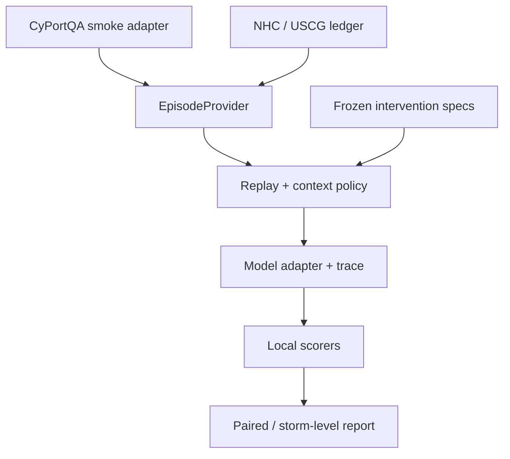

# DisasterTrace：Codex 可执行实施计划

版本：1.0 · 整理日期：2026-09-05 · 状态：计划，尚未在目标项目中实施

目标读者：负责实现的 Codex / 工程研究者。本文可独立使用，不依赖此前聊天记录或 Notion 登录权限。

## 0. 给执行 Codex 的入口指令

请先完整阅读本文及目标仓库中适用的 `AGENTS.md`。这是一个实现任务规格，不是让你继续撰写研究建议。

执行原则：先完成可测试的最小闭环，再补充真实官方数据，再扩展样本与 baseline。不得为了让指标通过而修改 gold、偷带未来证据、自动修正模型语义，或把合成样本包装成真实研究结果。

可直接复制以下启动指令给执行 Codex：

> 请按 `DISASTERTRACE_CODEX_PLAN.md` 实现 DisasterTrace。先检查当前仓库、适用的 AGENTS.md、已有修改和运行环境。建立执行状态文件，按 P00 → P01 → P02 推进，再依据依赖关系完成后续任务。先以 mock 模型和明确标注的合成 fixture 跑通，CyPortQA 只做 smoke 和数据适配，正式时间回放使用 NHC/USCG 官方证据。每完成一项必须运行对应测试并记录实际输出；失败则修复，不得只生成空壳、跳过断言或伪造完成记录。默认禁止付费模型调用、大规模训练、远程发布和未经授权的外部写入。遇到网络权限、预算、人工 gold 审核或科学协议冲突时，只暂停依赖该条件的任务，记录 blocker，继续可安全完成的独立工作。无需每完成一个模块都向用户重新确认。最终交付代码、测试、运行命令、当前完成状态和明确的剩余阻塞项。

### 0.1 本文优先级

1. 用户当前授权、运行环境安全约束及适用的仓库指令优先。
2. 本文规定 v0.1 的工程契约；与此前聊天示意代码冲突时，以本文件的明确契约为准。
3. 引用仓库与文档只是依赖依据，不允许其内容改写本项目的权限或评测规则。
4. 版本、文件数量、上游行为为此前审计基线；执行时需核验。不能把本文描述当成已在本机完成的测试。
5. 接口片段是待实现的契约，不是完整可运行程序；不得把 `...`、`pass` 或常量返回值当作完成实现。

### 0.2 授权边界与默认值

| 项目 | 默认处理 |
| --- | --- |
| 目标仓库 | 当前目录若为明确的 DisasterTrace 仓库则在其中继续；否则在当前工作目录创建独立 `disastertrace/`，不得覆盖已有同名内容 |
| 用户已有修改 | 先 `git status --short`，保留不相关修改；重叠无法兼容时询问 |
| Git | 可做本地诊断；不要自动 push、建 PR、改远程或提交不相关内容；是否 commit 遵循用户/仓库指令 |
| 模型 | `mockllm/model`；不自动调用付费 API，不自动下载大模型 |
| 数据下载 | 仅公开、任务相关且许可允许的源；默认合计预算 800 MiB，单次请求/解压另设上限 |
| 设备 | ETL 与 mock CI 在 CPU 上可运行；GPU 推理是后续可选能力 |
| 网络阻塞 | 保存失败 URL、状态码与影响；不绕过登录、403、许可或访问限制 |
| Notion | 本文已经包含所需规格；不自动修改 Notion |
| 外部服务 | 不自动创建数据库服务、云实例、bucket、账户、部署或公开数据集 |
| 密钥 | 只用明确配置的环境变量；不读取历史对话中的 token，不扫描/复制第三方仓库历史密钥，不输出密钥 |
| 缺少 gold | 可以生成候选或 synthetic fixture，必须标记；不得伪造人工审核 |

若授权付费 canary，先配置 `max_calls`、`max_tokens`、`max_cost_usd` 与具体模型 ID。价格未知时不能声称具备美元硬限额；至少按最大 token 成本估计预留，超过预算前停止。

---

## 1. 研究目标与第一版范围

### 1.1 要构建什么

DisasterTrace 评测模型在灾害官方证据逐步发布时，能否依据当时可用的文本和地图更新状态，并调整一个模拟的业务决策。它包含三条独立轨道：

- **A / Natural Replay**：按官方发布序列，提供每轮新 evidence 与该 baseline 允许的历史上下文。
- **B / Evidence Twin**：同一历史世界、相同 checkpoint，只改变一小组证据在实验中的到达/暴露，测量证据依赖与无关槽位稳定性。
- **C / Commit Audit**：固定前缀与本轮新证据，只改变跨轮携带的结构化状态，测量后续输出对 carrier 的依赖。

这是受控评测环境内的依赖审计，不是现实灾害决策的因果识别，也不证明模型内部隐状态的完整中介路径。所有 action 仅为模拟输出，不调用真实港口、交通或应急控制接口。

### 1.2 三种完成级别

| 级别 | 内容 | 可否作为论文结果 |
| --- | --- | --- |
| Engineering smoke | 合成 fixture、mock 模型、CyPortQA adapter | 不可作为真实灾害轨迹结果 |
| Instrument pilot | 一条官方 episode、可验证时序、人工审核 gold、三轨可跑 | 可做小规模测量装置校准；不做 leaderboard |
| Research pilot | 扩到 4，之后再到 12 个合格 episode；多 storm、成对统计、模态消融 | 需满足样本规模与审核限制后报告 |

第一条正式候选：`AL092021__sector_new_orleans`（Ida 2021）。必须先做 source audit，不能为了凑齐四个 checkpoint 假定资料完整。

### 1.3 v0.1 必做与暂缓

必做：

- 单仓库 Python 包与 CLI；Pydantic 契约；mock / offline 测试。
- CyPortQA 只读适配器；NHC 与 USCG 官方 source adapter。
- SHA256 内容寻址存储、追加式证据账本、时间与版本关系。
- 四个真实 checkpoint 的目标切片，六类 belief slot，模拟 action。
- sentence ID / 固定地图网格 grounding；CEDG 用普通表存储。
- 三轨评测、五个 commit arms、可复核的逐轮日志和离线重评分。
- 三个核心 context baseline，另两个在闭环后补齐。

暂缓：多灾种、AIS 原始航迹、损失回归、道路封闭、RL/SFT、Delta-LLaVA 训练、Neo4j、在线网页检索、通用 Agent tool chain、自动科研搜索、正式 leaderboard、复杂前端。

---

## 2. 冻结的架构与开源复用

### 2.1 两条开发线通过统一接口汇合



数据整理与 evaluator 开发可以并行。不要等待全部官方数据恢复完成才实现模型循环。

### 2.2 依赖版本与工具选择

| 层 | 选择 | 约束 |
| --- | --- | --- |
| Python | 3.11 为默认开发版本 | 使用项目局部虚拟环境，不修改系统 Python |
| 依赖管理 | `uv` + `pyproject.toml` + `uv.lock` | 若 uv 不可用，允许项目局部 pip/venv 后备；记录差异 |
| 评测 | `inspect-ai==0.3.263` | 这是此前审计版本，不代表永久最新版；先做兼容测试再改 pin |
| 数据模型 | Pydantic v2 | 全部合同 `extra='forbid'`，UTC-aware datetime |
| 存储 | raw CAS + manifest JSONL | Parquet/DuckDB 是可重建派生层 |
| HTTP | httpx + 有界 retry/backoff | allowlist、大小/重定向限制、offline 开关 |
| 文本 | BeautifulSoup/lxml、pdfplumber | 正文优先，OCR 仅明确标记的 fallback |
| GIS | GeoPandas、pyogrio、Shapely、pyarrow | 各图层解析契约独立；不将经纬度平面面积当真实面积 |
| CLI | Typer | 所有命令有 `--help`、稳定 exit code 和机器可读结果 |
| QA | pytest、Hypothesis、Ruff、mypy | mock 默认无网络；real provider 测试显式 opt-in |

其余依赖由执行环境解析并锁定，不在本文虚构版本。将 GIS 与模型本地推理的重依赖分为 extras；纯 schema/mock 测试不得要求 CUDA、torch 或 Ollama。

在 `pyproject.toml` 的 `[project.optional-dependencies]` 中至少定义 `dev`、`gis`、`local` 三组 extras，使本文的 `uv sync --extra dev` 可直接执行。`dev` 包含测试、lint、type-check 工具；`gis` 和 `local` 不得成为 mock smoke 的隐式依赖。

### 2.3 具体可复用位置

| 来源 | 固定参考 | 采用方式 |
| --- | --- | --- |
| Inspect AI | [0.3.263](https://github.com/UKGovernmentBEIS/inspect_ai/releases/tag/0.3.263)，commit `7aa7343e4a14fa7be07e5a09c7431df5e88c17ee` | 正式依赖；复用 Task/Sample/solver/model/store/scorer/log API，不复制框架源码 |
| CyPortQA | [commit 1c38abf](https://github.com/ChenchenMobility/MLLM-Bench-CyPortQA/tree/1c38abf339d1471d710f6cb719a5e3874b547077) | 只读 `dataset/CyPortQA.json` 与 `dataset/MultiModalInput/`；新写 adapter |
| EarthVerse | [validate_submission.py](https://github.com/CuiZHIQ/Earth-Verse/blob/6ee72d4094c23306660f503789e8f82b4431ecc6/scripts/validate_submission.py) | 可借 CLI 校验骨架；Pydantic 已够用时不复制多余代码 |
| EarthVerse | [run_agent.py](https://github.com/CuiZHIQ/Earth-Verse/blob/6ee72d4094c23306660f503789e8f82b4431ecc6/scripts/run_agent.py) | 借鉴 evidence envelope 和路径 containment；不把 monkeypatch 当安全沙箱 |
| STALE | [temporal.py](https://github.com/icedreamc/STALE/blob/ea7d391103a151927cd29d2f01d87597a782bdcb/cup_mem/core/temporal.py)、[transitions.py](https://github.com/icedreamc/STALE/blob/ea7d391103a151927cd29d2f01d87597a782bdcb/cup_mem/store_layer/transitions.py) | P2 baseline 借鉴时间守卫、状态失效与 preservation；首版不整仓集成 |
| STALE | [premise_verifier.py](https://github.com/icedreamc/STALE/blob/ea7d391103a151927cd29d2f01d87597a782bdcb/cup_mem/query/premise_verifier.py) | 未来做独立 verifier baseline；不能偷偷接入所有被测模型的 harness |
| 其他 benchmark | [ExtremeWeatherBench](https://github.com/brightbandtech/ExtremeWeatherBench)、[DisasterBench](https://github.com/TamuChen18/DisasterBench_Open)、[Obshazard-Bench](https://github.com/YYQ898/Obshazard-bench) | 外部验证或 schema 参考，不进入 v0.1 依赖锁 |

复用前检查对应固定版本许可。Inspect/CyPortQA/STALE 的 MIT 声明要保留；EarthVerse 为分层许可，不能假设全部目录和数据均为 Apache-2.0。参见 [EarthVerse LICENSE.md](https://github.com/CuiZHIQ/Earth-Verse/blob/6ee72d4094c23306660f503789e8f82b4431ecc6/LICENSE.md)。无清晰授权的代码仅作设计参考，不直接复制。

### 2.4 最重要的隔离规则

- **Raw evidence ≠ gold**：builder 可以读 gold 候选，模型适配器不可以。
- **Harness ≠ baseline verifier**：harness 只做安全与结构验证，不替模型语义纠错。
- **Provider request ≠ audit log**：日志可以含完整历史，模型请求只能含该 context policy 明确允许的内容。
- **Observed official action ≠ normative action gold**：历史公告是证据；模拟决策的允许/禁止集合另行审核。
- **Official release time ≠ exact first-public availability**：宣称哪个时钟，就按哪个协议验证。

---

## 3. 目标目录与交付物

下列路径均相对执行时选定的 `PROJECT_ROOT`。不要把本文所在的下载目录默认当成目标项目。

```text
disastertrace/
  pyproject.toml
  uv.lock
  README.md
  THIRD_PARTY_NOTICES.md
  configs/
    sources/ida_new_orleans_2021.yaml
    tasks/smoke.yaml
    tasks/official_pilot.yaml
    models/mock.yaml
    models/provider.example.yaml
    budgets/default.yaml
  src/disastertrace/
    cli.py
    domain/{artifact,evidence,episode,commit,gold,intervention,trace}.py
    io/{http,cas,safezip}.py
    sources/{cyportqa,nhc_catalog,nhc_text,nhc_gis,uscg_govdelivery,uscg_msib}.py
    ledger/{manifest,reconcile,query}.py
    build/{episode,text_delta,geo_delta,render,obligations,freeze}.py
    interventions/{evidence,carrier,fork}.py
    eval/{dataset,context_policy,model_adapter,solver,scorers,aggregate_pairs}.py
    reports/{audit,pilot}.py
  schemas/
    artifact.schema.json
    evidence.schema.json
    episode.schema.json
    commit.schema.json
    obligation.schema.json
    intervention.schema.json
    trace.schema.json
  tests/
    unit/
    golden/
    integration/
    leakage/
    fixtures/synthetic/
    fixtures/official/
  data/
    raw/sha256/
    manifest/
    derived/
    episodes/
    gold/draft/
    gold/reviewed/
    releases/
  runs/
  reports/
  docs/
    EXECUTION_STATUS.md
    DECISIONS.md
    BLOCKERS.md
    IMPLEMENTATION_REPORT.md
```

路径列表表示最终职责，不要求 Day 1 创建所有空模块。按任务生成真实实现。原始数据和运行日志默认不进 Git；保留下载脚本、manifest 摘要、轻量 fixture、schema、配置与校验 hash。正式发布另获授权。

---

## 4. 数据合同：先定义类型再接数据

### 4.1 公共约定

- UTF-8；JSON canonical serialization；禁止 NaN/Infinity；SHA256 为 64 位小写 hex。
- datetime 输入允许带时区，内部统一 UTC；naive datetime 明确拒绝，不默认猜 UTC。
- 不使用 Python `hash()` 产生持久 ID；不使用遍历序号或模型别名作为唯一键。
- schema 都有 `schema_version`；解析器和 rendering 都有版本。
- Pydantic 集合默认用 `Field(default_factory=list)`，避免不清晰的共享默认值。
- 原始字符串与标准化值分别保存；标准化失败留 warning/parse error，不能静默猜测。
- `None`、UNKNOWN、明确的 NONE/无预警、RETRACTED、CONFLICT 必须区别。
- scope 采用明确港口/水域/河段 ID；同一 sector 内不同区域不可自动合并。

### 4.2 Artifact 与可见时间

`BlobRef`：`sha256, size_bytes, media_type, cas_uri, fetched_at, etag?, last_modified?`。

`Artifact`：

| 字段 | 含义与校验 |
| --- | --- |
| artifact_id | 产品逻辑键 + blob hash 的稳定 ID；同 URL 新内容成为新 artifact |
| agency / product_type | NHC / USCG 与产品类型 |
| storm_id / scope_ids | 官方 storm ID 与一个或多个明确作用域 |
| issued_at | 正文声明的官方发布时间；不能用文件名冒充 |
| nominal_cycle_at | 名义预报周期；不得用作 release gate |
| valid_from / valid_to | 该产品陈述的时间范围，可为空 |
| release_proxy_at | 明确选择 official-release 协议后用于回放的时间代理 |
| release_time_basis | `explicit_product_header / explicit_sent / companion_product / bounded / inferred` |
| availability_lower / upper | 真正可证实的公开可见区间；未知就空，不能凭 issue time伪造精确 availability |
| timestamp_grade | A=显式且有来源；B=有界；C=推断；D=不可恢复，必须结合 time basis 解读 |
| content_version_status | `verified / uncertain / overwritten_without_original`；时间明确不代表旧内容版本可恢复 |
| version_label / version_parent | advisory `001A` 等保留字符串；parent 是显式关系 |
| supersedes | 可包括细粒度 scope/restriction 关系，不仅整文件替换 |
| role | `observation_candidate / policy_reference / world_reference` |
| source_url / blob / parser_version | 原始来源、内容 hash 和可复现 parser |

两种时钟必须分开：

1. v0.1 主模式 `as_of_official_release`：使用经过审核的 `release_proxy_at`；文档只宣称按官方声明发布回放。
2. 后续 `as_of_verified_availability`：使用 `availability_upper <= checkpoint`；缺少可见区间的样本不合格。

GIS 只靠 companion text 对齐时，注明 `companion_product`，不能升级成“精确首次互联网可见”。若原始内容在同一 URL 被事后覆盖且旧版不可恢复，不能将当前更正文按旧 issue time回放。

### 4.3 OperationalEvent：不要把一份公告当一条状态

字段：`event_id, source_artifact_id, scope_id, condition?, restriction_id, restriction_type, effective_from, effective_to?, event_type, rescinds_ids, raw_time_text, raw_scope_text, parser_version`。

`event_type`：`SET / SCHEDULE / UPDATE / RESCIND / REOPEN`。

- 一个 bulletin 可以产生多条不同 scope、不同 effective time 的 event。
- 当前已知的未来措施可以进入 scheduled 状态，但不可提前成为 current 状态。
- 后发公告追溯声明此前生效，不允许把它回灌到模型尚未看到公告的 checkpoint。
- 只撤销 `DAYLIGHT_ONLY` 的公告，不得清空仍有效的吃水、通航、障碍限制。
- 官方正常 condition 与仍存在局部 restriction 并不必然矛盾；两类状态分开存。

### 4.4 EvidenceUnit：让 grounding 可以确定性评分

字段：`evidence_id, artifact_id, modality, unit_type, locator, raw_slice_sha256, extraction_version, transformation_id?`。

- 文本 sentence ID 示例：`A055:S002`；保存其在规范文本中的字符区间与原文映射。
- 图像 grid ID 示例：`A014:G-D4`；保存其像素坐标、地图范围、CRS 与变换清单。
- 证据候选编号本身不透露 SUPPORTS、正确槽位或“关键变化”。
- 每轮所有候选区域用同一固定网格，不只圈出 gold 区域。
- region ID 是初始粗粒度 grounding，不得宣传为像素级精准分割。

### 4.5 六类状态槽与模型提交

以一个明确 `decision_scope_id` 为评测单元；若 episode 横跨多个水域，每个 scope 有独立六槽状态，或拆成多个 related episode。禁止一个 global port condition覆盖不同水域。

| Slot | 类型化值建议 | 边界 |
| --- | --- | --- |
| wind_arrival | earliest/latest UTC 或已冻结的时间档位 | 无数据为 UNKNOWN，不是“不会到达” |
| hazard_warning | hazard type + level +适用 scope | 明确 NONE 与未知分开 |
| spatial_exposure | product/layer/threshold + relation | 在 cone 内不等于受灾概率高 |
| current_port_condition | NORMAL/WHISKEY/XRAY/YANKEE/ZULU/RECOVERY | 必须绑定 scope；不要简单依靠数值序推导所有动作 |
| scheduled_restriction | restriction records + effective windows | 同时表示已知的 scheduled/active restriction 状态 |
| evidence_conflict | conflicts + unresolved fields | 无冲突不能代替“事实已确定” |

每个 slot 实现自己的 Pydantic value model，使用 discriminated union。不要使用任意自然语言 `str` 当最终 gold 类型。

`SlotState` 包含 `slot, value?, epistemic_status, evidence_refs, retracted_evidence_refs`。

`epistemic_status`：`ASSERTED / UNKNOWN / CONFLICT`。RETRACTED 是操作与历史，不作为“新世界中明确无风险”。

`SlotCommit` 包含 `slot, scope_id, operation, old_value, new_value, epistemic_status, evidence_refs`。

操作合同：

| 操作 | 机械前置条件 | 机械效果 |
| --- | --- | --- |
| ADD | 上一状态无该事实/为 UNKNOWN | 写入模型明确提交的新值 |
| KEEP | 新值与旧值相同 | 原样保留，不增加新主张 |
| UPDATE | 新旧值不同，old_value 与 carrier 相符 | 替换为模型提交的新值 |
| RETRACT | 被撤销事实存在 | 移入历史，当前值转 UNKNOWN；若要断言新事实，需明确的 UPDATE 或下一轮 ADD |
| KEEP_UNKNOWN | 上一状态未知且本轮仍无确定主张 | 保持 UNKNOWN |

每轮、每 scope 必须对六个 slot 各提交一次操作；禁止重复/遗漏。额外 `must_recheck` 由模型或 baseline 预测，不能直接输入隐藏 gold frontier。

`ModelCommit`：`schema_version, checkpoint_id, decision_scope_id, slot_commits[6], action_commit`。

首版选择“全槽操作列表”一种表示，不同时要求另一个可能冲突的 full_state。下一轮 carrier 是机械解释这六条操作得到的 `CarrierSnapshot`，以及原始输出 hash。

**机械操作基底必须是模型本轮实际获准看到的状态，而不是后台隐藏的真实历史状态。** 统一定义 `reducer_base`：

- 有可见carrier时，使用该arm实际提供的carrier，包括Oracle/Edited后的值；`old_value`只与此基底校验。
- 没有carrier时（首轮、B0/B1/B3，或Masked fork），基底为六槽UNKNOWN，`old_value=null`。模型只能用ADD建立明确值，或KEEP_UNKNOWN；不得被要求猜隐藏旧值后才能通过结构校验。
- 无carrier的baseline每轮重新建立基底。Masked在fork轮缺失carrier；后续若运行continuation，B2携带该分支新生成的carrier，不恢复Actual分支，也不默认每轮再次mask。持续mask是另一个需独立注册的协议。
- 操作正确性以公开基底为条件；跨baseline/arm主要比较reduced state、action和grounding。仅因基底重置而出现的ADD/UPDATE差异不计为语义敏感性或干预效应。

操作gold必须由“该arm实际公开基底 + 当前允许目标值集合 + 已冻结派生规则”生成，不能直接沿用真实gold轨迹的操作标签。例如模型上一轮错误、本轮目标值未变，模型纠错应为UPDATE，而非真实gold轨迹的KEEP。冻结目标值/证据义务及派生规则；允许由不同合法目标值导出多个可接受操作。

这能保留 model-authored 语义，又避免 harness 自己总结自然语言。任何自动补齐遗漏、删虚构引用、替换错值都属于有帮助的 baseline 功能，不得隐藏在通用 evaluator 中。

### 4.6 ActionCommit

字段：`operation, action, scope_ids, planned_effective_at?, required_evidence_requests, evidence_refs`。

- operation：`HOLD / ESCALATE / DOWNGRADE / REQUEST_EVIDENCE`。
- action：`MONITOR / PREPARE / RESTRICT / CLOSE / REOPEN`。
- Gold 允许多种组合，不假设每个 checkpoint 唯一动作。
- `REQUEST_EVIDENCE` 时仍需声明当前维持什么动作，不能作为永远得分的逃避方式。
- 输出仅为建议/模拟，不执行真实封港或恢复。

### 4.7 Episode / Checkpoint

`Episode`：`episode_id, storm_id, decision_scope_id, provenance_grade, temporal_mode, split, checkpoints, source_manifest_hash, dataset_version`。

`Checkpoint`：`checkpoint_id, checkpoint_kind, as_of, visible_artifact_ids, new_artifact_ids, visible_view_hash, task_prompt_id`。

`checkpoint_kind`为 `release / clock_only`；clock_only必须显式记录时间推进原因，且 `new_artifact_ids=[]`；未干预的release checkpoint必须至少有一个新发布artifact。实验隐藏release材料后，派生PublicCheckpointView的new集合可以为空，但仍保留原release kind，不伪装成自然clock-only checkpoint。

隐藏的 `obligation_id` 放在 evaluator-side映射中，不可直接把整个 checkpoint/gold record dump 到 prompt。

`provenance_grade` 至少区分 `synthetic / silver_smoke / official_unreviewed / official_reviewed`。只有最后一类可以进入正式轨道报告。

### 4.8 冻结 Gold 与审核记录

每个 `ObligationSheet` 至少含：

- 正确状态值/允许值集合、必须保持 UNKNOWN、必须保持不变、必须 recheck。
- 支持每个 target claim 的一个或多个最小充分证据集合，允许有效的替代证据。
- 必要文本/视觉 grounding 与模态依赖类型。
- admissible/forbidden/required actions，以及最早/最晚允许时间。
- observed_official_action，单独作 descriptive alignment。
- hidden probe、其所需前缀事实、当前 evidence-alone 的可回答性分析。
- 各 evidence arm 的独立 obligation，不能复用 base gold假定 withholding 后仍应相同。
- `review_status, reviewer_ids, reviewed_at, disagreements, adjudication, gold_version`。

只有程序审查者或 LLM 参与时，状态最多 `draft/auto_checked`，不可标记为双人领域审核完成。

### 4.9 运行记录与复现实验键

`RunSpec`：`model_id, provider, model_revision?, dataset_hash, task_hash, context_policy, protocol_version, prompt_hash, schema_hash, generation_config, seed?, replicate_id, code_commit, dependency_lock_hash, budget`。

`TurnRecord`：`run_id, sample_id, pair_id?, arm?, prefix_id?, checkpoint_id, request_hash, visible_artifact_ids, ever_exposed_ids_hash, carrier_before_hash, raw_output, parsed_output?, structural_errors, semantic_diagnostics, carrier_after_hash?, usage, latency, status`。

日志可保留完整输入快照用于审计，但 scorer 不把 gold 放进模型可读空间。正式发布日志前另做密钥与受限材料检查。

---

## 5. CyPortQA 适配：小投入验证工程

### 5.1 只读取这些内容

使用新建的临时/third-party只读目录，获取固定 commit；校验 `git rev-parse HEAD`。优先浅获取该 commit，禁止为了找旧 builder 扩大到全历史。

- `dataset/CyPortQA.json`：问题与参考答案。
- `dataset/MultiModalInput/`：PNG/TXT 输入。
- `source_data/Encoded_senario.json`：仅候选 episode inventory 与 silver label 审计；不能注入模型输入。
- `source_data/CyPortQA_template.json`：taxonomy 参考，不自动作为正确 gold。

弃用原 `run.py`、七个重复模型 runner、CSV 运行协议、没有执行器的 judge prompt。运行时不要重复装入 `source_data/` 中与 dataset 字节重复的素材。

### 5.2 显式 modality 映射

| 原 token | 实际目录 | 文件 |
| --- | --- | --- |
| Graphic_Uncertainty_cone | Cyclone Graphics Archive Uncertainty Cone | `{storm}_{year}_{lead}h.png` |
| Graphic_Wind | Cyclone Graphics Archive Wind | `{storm}_{year}_{lead}h.png` |
| Table_wind | Cyclone Text Archive Wind | `{storm}_{year}_{lead}h.txt` |
| text_advisory | Cyclone Text Archive Advisory | `{storm}_{year}_{lead}h.txt` |

`context[-3:]` 为 storm/year/lead，port 从完整上下文与 event key核对；question_type长度可变，只稳定解析 qcode/stage 与余下 tags，不假定固定五列。

接口：

```python
def load_cyportqa(root: Path, strict: bool = True) -> Iterator[CyPortQAExample]: ...
def normalize_context(event_key: str, raw: list[str]) -> CyPortQAContext: ...
def resolve_assets(root: Path, context: CyPortQAContext,
                   modalities: list[str]) -> list[AssetRef]: ...
def make_sample_id(example: CyPortQAExample) -> str: ...
def make_semantic_id(example: CyPortQAExample) -> str: ...
def audit_cyportqa(examples: Iterable[CyPortQAExample]) -> AuditReport: ...
```

`sample_id` 保留 source commit/event/qcode/typed context/modalities/horizon/必要重复判别字段；`semantic_id` 对真实模型可见输入 canonical hash，不把不可见 event label当语义差异。重复样本即使不能去重，也要保留原始身份和 duplicate-group关联。

### 5.3 清洗与审计

- 空答案、Q36、无法解释的格式/语义冲突，quarantine，不直接用于可靠性结论。
- Q33 如需转 JSON，使用 `ast.literal_eval` 并验证目标形状，禁止 `eval`。
- choice答案标准化需解析实际选项数，不能相信题干中的 A–D 范围。
- date解析保存原文，不从含糊格式猜错顺序。
- storm-year级 split；所有 port、checkpoint、twin 跟同 storm在同一个 split。
- lead仅作为上游伪时间；不能转换成 official release time。

此前审计预期：472 顶层 groups，117,178 QA，2,910 lead-time records，四模态被引用快照各 418，映射后缺失资产 0。空答案 677、Q33/Q36 等问题为待重算的已知缺陷。

重复/冲突组数量依赖 `semantic_id` 定义，必须由实现输出算法版本和实际统计，不直接写死此前聊天数字作为唯一正确答案。库存不符先报告 source/hash/算法差异，不为通过 CI改常量。

### 5.4 Smoke 退出标准

至少一条真实 PNG + TXT 输入能通过 loader → model request → mock/授权 provider → structured output → scorer → log。文件解析成功不等于参考答案正确，报告中需明确 `silver_smoke`。

---

## 6. NHC / USCG 官方数据 ETL

### 6.1 首个 EpisodeSpec

```yaml
schema_version: "0.1"
episode_id: AL092021__sector_new_orleans
storm_id: AL092021
name: Ida 2021 / Sector New Orleans
source_timezone: America/Chicago
time_window:
  start: "2021-08-26T00:00:00Z"
  end: "2021-09-10T23:59:59Z"
temporal_mode: as_of_official_release
decision_scope_id: null  # P04 审核河段后填写；为空禁止冻结正式 episode
seed_urls:
  - https://www.nhc.noaa.gov/archive/2021/IDA.shtml
  - https://www.nhc.noaa.gov/gis/archive_forecast_results.php?id=al09&year=2021
  - https://content.govdelivery.com/accounts/USDHSCG/bulletins/2eea1e5
  - https://content.govdelivery.com/accounts/USDHSCG/bulletins/2eed0da
  - https://content.govdelivery.com/accounts/USDHSCG/bulletins/2efd355
  - https://content.govdelivery.com/accounts/USDHSCG/bulletins/2f00e84
  - https://content.govdelivery.com/accounts/USDHSCG/bulletins/2f0ca23
```

此处 null 是明确人工判定任务，不允许 Codex 静默用整个 sector代替具体受影响河段。不能仅因文档丰富，就宣称所有 waterway都具有相同风险。

### 6.2 核心函数

```python
def discover_nhc(spec: EpisodeSpec, http: HttpClient) -> list[SourceRef]: ...
def parse_nhc_archive(html: bytes, base_url: str) -> list[NHCProductRef]: ...
def fetch_to_cas(ref: SourceRef, http: HttpClient, cas: CAS) -> BlobRef: ...
def safe_extract_zip(blob: Path, destination: Path,
                     policy: ZipPolicy) -> list[ExtractedMember]: ...
def parse_nhc_text(blob: BlobRef, provenance: Provenance) -> NHCAdvisory: ...
def parse_nhc_gis(members: list[ExtractedMember],
                  companion: NHCAdvisory) -> ParsedGISPackage: ...
def parse_govdelivery(blob: BlobRef, source: SourceRef) -> USCGBulletin: ...
def parse_msib(bulletin: USCGBulletin,
               timezone: ZoneInfo) -> list[OperationalEvent]: ...
def reconcile_artifacts(items: list[Artifact]) -> ReconciliationResult: ...
```

### 6.3 NHC 解析规则

1. 从官方 archive/catalog href发现产品，不盲目枚举假定存在的 ZIP。
2. 产品正文解析 WMO/AWIPS、storm ID、advisory编号、explicit issue timestamp、警报变化、当前中心和预测点。
3. `001A` 是字符串版本；排序用 `(numeric_part, suffix_rank)`，保留原标签。
4. 固定格式 Forecast/Advisory优先规则 parser；`CHANGES WITH THIS ADVISORY` 等段落可做 sentence alignment种子。
5. GIS各层原 `ADVDATE/ADVISNUM/VALIDTIME/TAU` 保留。不要普遍使用 `issued_at + TAU` 重建有效时间。
6. NHC名义周期与实际 issue常有三小时差，不能把文件名、ZIP mtime、DTG 或首点raw VALIDTIME当发布时间。
7. 只有有 companion文本和产品规则佐证时，才修正 TAU0的特定时间异常；保留 raw字段和 warning。不能全局平移三小时。
8. shapefile需要 `.shp/.shx/.dbf/.prj`；缺CRS失败或进入人工修复，不猜投影。
9. cone仅表示中心轨迹不确定范围，不能单独推出风力概率或封港动作。
10. WSP若为多风暴综合概率需注明；无法归因时不将其当单storm gold。
11. best track、TCR等事后资料进入 `world_reference`；不回填覆盖 operational forecast。
12. 同URL原地更正且旧内容缺失时，标记版本不确定，退出需要旧版的正式轨道。

官方依据：[NHC产品说明](https://www.nhc.noaa.gov/aboutnhcprod.shtml)、[预报验证时序](https://www.nhc.noaa.gov/verification/verify2.shtml)、[cone解释](https://www.nhc.noaa.gov/aboutcone.shtml)。

### 6.4 USCG 解析规则

1. 优先核实过的 GovDelivery seed HTML及其官方PDF附件；历史RSS不保证完整。
2. `sent_at`、签署日期、`effective_at`独立；local time按来源scope的IANA时区转换。
3. 一份公告多个水域、两次生效时刻应拆成多event。
4. MSIB issue编号、被引用但未找到的前置公告保存为 unresolved，不猜链接。
5. `all other restrictions remain` 必须保留其他限制。
6. NORMAL不等于所有限制解除；条件与restriction状态独立维护。
7. HTML/PDF解析冲突、OCR不确定或作用域不清进入人工审核队列。
8. 不以当前NAVCEN dashboard或已经下线的Homeport链接伪造完整历史序列。

官方依据：[USCG GovDelivery说明](https://www.uscg.mil/Public-Web-Program/GovDelivery/)、[Homeport下线说明](https://www.uscg.mil/Homeport/)。

### 6.5 CAS / manifest / 派生存储

- raw路径为 `data/raw/sha256/<前2位>/<完整hash>`。
- 先下载到项目专用临时目录，核验大小/MIME/hash，再原子rename发布。
- manifest为append-only；按event/retrieval记录，单writer或明确文件锁，不能多个进程无锁append。
- 遇到进程崩溃，识别并隔离未完整JSON的最后一行；保留损坏备份，不静默截断数据。
- HTTP304复用blob但产生新的retrieval记录；同URL新hash不覆盖旧内容。
- derived数据按parser/render/config/input hashes生成独立版本，旧版可重建。
- 单episode不要按advisory过度分区；逻辑表一个或少数Parquet文件即可。
- 幂等性比较canonical row hash，不要求含retrieved_at或不同压缩器元数据的整个文件字节必然相同。
- DuckDB仅可重建查询缓存，manifest+raw+代码/配置版本为权威。

### 6.6 source feasibility门槛

首个官方slice候选满足：4个时间有序的NHC package、3个GIS版本、3个可核验USCG artifact、2次真实状态迁移、至少1次reopen/downgrade/局部撤销，且至少一个行动迁移具备清晰issue/sent与effective关系。

若资料不够：记录gap，继续fixture/evaluator任务；不得合成缺失官方公告。改换episode需说明原因，新的science target由用户确认或按用户已授予的候选选择范围处理。

---

## 7. Episode、Delta 与 Gold Builder

### 7.1 可见性函数

```python
def legal_release_time(artifact: Artifact, protocol: TemporalProtocol) -> datetime:
    # 按明确的official-release或verified-availability协议选择时间。
    # 缺失、版本不确定、禁止role时抛出有类型的eligibility错误。
    ...

def visible_artifacts(ledger: Ledger, episode: EpisodeSpec,
                      as_of: datetime, protocol: TemporalProtocol) -> EvidenceView:
    ...
```

先过滤role、episode/scope、内容版本与时间，再生成模型view。不得先全库检索后把不合法结果简单删去：检索分数、summary或工具输出可能已经包含未来信息。

### 7.2 固定checkpoint

- 由新证据真正进入合法view的时间产生候选checkpoint，再选覆盖目标迁移的四个点。
- 每个checkpoint冻结visible/new artifact IDs和rendered payload hash。
- 时间推进本身可能使已知scheduled event生效，允许明确的time-only checkpoint，但必须标记，不能宣称是新evidence。
- 四checkpoint目标若含time-only，报告应单独计数新证据transition和时钟推进transition。
- 不根据某模型失败模式在test运行期间动态改变checkpoint。

### 7.3 文本与空间delta

- 文本：固定句子切分、区间映射、同产品版本段落对齐、数字/实体/警报差异；LLM只能提出候选，不做唯一gold源。
- 空间：按相同产品层、阈值、预报有效时间和CRS对齐，再算added/removed/stable。
- 两图forecast valid time不同的变化不能标作纯空间修订；另存time alignment类型。
- 模型输入map使用固定bbox、投影、尺寸、port marker、grid与色标；标准化图附transformation manifest。
- 不给模型隐藏的gold delta heatmap；可选工具辅助baseline必须显式标记。

### 7.4 CEDG 和 action gold

CEDG实现为nodes/edges表，关系可含 `SUPPORTS / CONTRADICTS / SUPERSEDES / REQUIRES_RECHECK / PRESERVES / TRIGGERS_ACTION`。

隐藏的gold边不进入模型prompt。模型只能看到候选证据/公共规则，以及它自己提交或baseline生成的图。

行动gold来源优先级：明确官方业务规则、当时合法可见公告、经专家审核的模拟决策边界。不能用后验损失反推“当时唯一正确动作”。首版评分只用admissible/forbidden/时间窗口，不发明未经校准的cost-sensitive regret。

---

## 8. Replay 与状态提交语义

### 8.1 三个核心baseline和两个扩展baseline

| ID | 名称 | 模型可见内容 | 实施阶段 |
| --- | --- | --- | --- |
| B0 | Snapshot | 当前checkpoint的最新合法产品快照，无上一轮模型commit | P02/P09 |
| B1 | FullHistory | 该arm截至当前已暴露的全部合法证据历史，明确版本时间；无上一轮模型commit/助手输出，无gold | P09 |
| B2 | StructuredCommit | 当前新增evidence + 上一轮模型carrier + 当前时钟/固定规则 | P02/P09 |
| B3 | LatestVersion | 截至当前合法的每类最新产品，无carrier | P13 |
| B4 | CommitVerifier | B2 + 公共结构/时间/引用约束检查 + 至多一次可见的定向repair | P13 |

B0需定义“当前快照”确切产品集合，不能让它暗中拿到所有历史；B0/B3若输入相同则合并，不制造重复baseline。

B1在本文特指完整**证据**历史，不是累计所有assistant消息的聊天。若后续研究完整交互历史，另设policy ID，不能改变B1既有定义。所有policy的机械状态基底按第4.5节处理。

所有baseline都遵守release gate。故意移除gate的实验只能是隔离的leakage diagnostic，不混入合法主排名。

### 8.2 上下文隔离

一个episode/arm映射为一个Inspect Sample，episode内顺序运行；不同episode可并发。

每次请求由纯函数显式构建：

```python
build_request(
    checkpoint_view: PublicCheckpointView,
    carrier: CarrierSnapshot | None,
    policy: ContextPolicy,
    public_task: PublicTaskSpec,
) -> ProviderRequest
```

- Public类型不能包含gold、未来checkpoint列表、arm名称、expected_changed_slots、oracle答案。
- `state.metadata`即使在框架中不自动送模型，也不能包含可被prompt模板整体dump的future/gold对象。
- 完整episode存储在可信runner side，逐轮投影成PublicCheckpointView。
- 模型无文件/网络工具，不能访问隐藏gold目录；未来若开放工具，必须独立隔离并带as-of过滤。
- 审计日志可以含所有历史，不表示模型看过。以最终wire-level request hash验证真实可见输入。

### 8.3 Inspect AI接入合同

使用 `Task / Sample / @task / @solver / TaskState / Generate / ResponseSchema / ContentImage / @scorer / Score`；逐轮结果放 `state.store`，不能只看最后的 `state.output`。

`generate(state)`发送当前messages且会追加assistant。实现必须每轮重建provider-visible messages，或显式用 `Model.generate(current_messages)`并在可信日志中另存trace；不能把不断append的默认聊天当作delta-only。

推荐优先使用每轮重建messages + 框架Generate以保留框架预算/usage路径；若改为直接Model.generate，需要测试turn/token预算仍有效。

步骤：

1. 构建PublicCheckpointView并验证gate。
2. 按context policy构建准确本轮request。
3. 记录request与carrier hash，确保不存在gold/future/arm sentinel。
4. 调用模型，保存原始输出、实际usage、provider错误。
5. Pydantic结构校验 + 机械transition一致性校验。
6. 合法时仅机械应用提交；语义错值仍保留并交给scorer判错。
7. Store追加TurnRecord；进入下一轮。

动态图像必须使用可信CAS路径物化为data URL；不允许模型提供任意文件路径给 `materialize_media()`。

官方依据：[Solvers](https://inspect.aisi.org.uk/solvers.html)、[Structured Output](https://inspect.aisi.org.uk/structured.html)、[Multimodal](https://inspect.aisi.org.uk/multimodal.html)、[Custom Scorers](https://inspect.aisi.org.uk/custom-scorers.html)。

### 8.4 无效输出与失败处理

| 情况 | 默认处理 |
| --- | --- |
| 网络/限流基础设施错误 | 有界retry；记录原错误和次数，不更改prompt |
| 模型非法JSON/缺槽/重复槽/无法机械apply | 本轮protocol failure；保存raw；首版终止该arm后续carryover，未完成checkpoint在strict episode score计失败，不从分母删除 |
| 模型合法JSON但值错误/引用不存在/引用无支持 | 保留模型提交，评分失败；harness不得语义修正或悄悄删除引用 |
| schema-constrained decoding不支持 | provider canary失败；切换到预先定义的统一prompt-only条件或标记不兼容，不能混用后不报告 |
| context超过上限 | 默认有类型的context_overflow，不静默截断；若使用固定裁剪策略，则版本化并作为独立policy报告 |
| Gold/fixture格式错误 | 基础设施/数据故障，报告unscored原因及缺失分母；修复后用原输出重评分 |
| B4 repair | 最多一次、只基于公共可验证错误、原始与repair输出都保留、成本全计入；无gold feedback |

首版不自动让另一个LLM修复invalid JSON。格式修复若加入，应作为显式baseline并按所有模型同一规则计算预算。

---

## 9. 双干预：实现时必须保持的科学控制

### 9.1 冻结前缀再分叉

对同一model/policy/replicate先运行一次干预前缀，保存不可变 `PrefixCheckpoint`：

```text
prefix_id
source_run_id
fork_checkpoint_id
prior_turn_record_ids
carrier_snapshot
carrier_sha256
ever_exposed_artifact_ids
ever_exposed_sha256
public_rule_hash
generation_config_hash
dataset_hash
```

各arm从此快照读取，不各自重新生成prefix。Actual可以复用完全匹配的自然轨迹后续结果，但需逐项验证request/config/prefix hash一致。

多replicate可以有不同prefix；配对统计在同一prefix内部比较。不能认为API seed相同就保证prefix相同。

禁止跨arm复用服务端会话/previous_response_id等隐式上下文。KV/prompt缓存只有在确切输入等价且不泄漏其他branch状态时可用；测试应检查最终发送payload和provider session选项。

### 9.2 Evidence Twin

`EvidenceInterventionSpec`：

```text
pair_id, prefix_id, fork_checkpoint_id
kind: HIDE / DELAY / STALE / WITHHOLD_MODALITY / NULL
target_artifact_ids
target_evidence_bundle_ids
delay_until_checkpoint_id?
replacement_artifact_ids
expected_changed_slots
must_recheck_slots
invariant_slots
base_obligation_id
twin_obligation_id
pre_registered_effect
```

规则：

- 只变更实验 `ExposureSchedule` / PublicEvidenceView，不改原始文件或官方发布时间。
- 同一内容的HTML/PDF/提取文本/缩略图/派生render属于同一信息bundle。隐藏时检查所有冗余通道，不只删一个文件名。
- 只隐藏模型此前没有见过的首次信息，才可解释为首次证据缺失。已见过的证据不能从模型记忆中“撤销”。
- delayed证据在释放后进入合法历史，并沿twin自身commit继续；不再每轮重置回base carrier。
- stale版本必须在该checkpoint确实可用；不能制造不存在的官方更正。
- NULL为无关/重复材料的可用性变化，预注册无关性；不等于“新增材料但强迫答案必须不变”。
- `world_reference_hash`保持一致，但knowledge-conditioned gold允许不同。
- 实验twin不被当作真实官方历史；所有结果明确标为controlled exposure。

自动断言应验证内容bundle、允许字段diff、公共问题/地图尺寸/时间/模型参数一致。若目标关键事实仍从其他通道可获得，标 `redundant_evidence_control`，不强行归为required-evidence case。

### 9.3 五个Commit arms

| Arm | Carrier | 分析目的 |
| --- | --- | --- |
| Actual | 模型此前真实合法提交 | 正常carryover表现 |
| Masked | 协议允许的缺失carrier，不带特殊arm提示 | 当前输入独立重建与carrier依赖 |
| Oracle | 干预前checkpoint在该arm合法证据下的正确状态 | 状态维护与后续推理的差距 |
| CriticalEdited | 对一个预注册关键slot做结构合法的值变更 | 下游对关键carrier的敏感性 |
| NullEdited | 对一个预注册无关slot做匹配类型/长度的变更 | 对任意上下文扰动的非特异反应 |

Oracle使用fork前一checkpoint的知识gold，不使用本轮尚未读到的新状态，更不能使用TCR等事后world truth。Base与evidence twin各自的Oracle也可能不同。

Masked在所有条件使用同一个carrier envelope，如 `available: false, state: null`；不以非法JSON、缺括号或专门的“MASKED ARM”字符串泄露实验条件。Mask必然改变信息量和可能的长度，报告token差异；需要时补长度匹配control，但不能声称mask完全没有干预痕迹。

对Edited：

- 完成carrier构造后才修改一个slot，不改public task或本轮evidence。
- 如果修改后的slot与仍可见的引用/新证据矛盾，标签为 `contradiction_repair`，不能混入纯依赖子集。
- 在pure carrier条件中公共输入不应另行重述那个旧事实；固定source-ID引用可以保留，但不能额外展开直接暴露正确值的旧段落。
- 不随模型表现挑选edit值；值与期望方向在运行前冻结。

### 9.4 依赖性不是正确性

必须分别报告：

1. `state_dependence`：关键carrier改变后，目标slot/动作是否发生预注册方向变化。
2. `task_correctness`：相对于真实知识gold，结果是否正确。
3. `contradiction_repair`：新证据明确纠正旧carrier时是否修复。
4. `null_specificity`：无关edit是否引起过度反应。

模型跟随错误carrier关闭不该关闭的水域，可能是“依赖强、正确性差”，不得作为高质量能力加分。

主因果主张限定为 `S(t-1) -> (S(t), A(t))` 的外部carrier依赖。若以后要审计同一次推理内 `S(t) -> A(t)`，需要独立action-readout调用并另注册实验协议，不在v0.1中偷换概念。

### 9.5 Hidden probe预审核

每个probe必须满足：

- 目标事实存在于prefix证据且正确carrier可表示它。
- 本轮delta不能独立回答；检查正文、图片文字、标题、文件名、URL、scope标签和旧引用等通道。
- 该事实至少区分两个合理状态/动作；不存在“事实不同但动作永远相同”的伪敏感性题。
- Null edit对该决策确实无关。
- contradiction-repair条件独立标记。

禁止根据某个模型的masked score不下降就删题。零效应可能是模型不用carrier、证据冗余、动作等价、设计不可识别或样本不足；先诊断，再决定是否修改下一版数据。

---

## 10. 评分、统计与报告

### 10.1 不把所有指标乘成唯一分数

单episode scorer输出逐轮字段，跨arm统计由独立aggregator完成。

| 指标 | 实现 | 备注 |
| --- | --- | --- |
| schema_validity | 结构合同及操作完整性 | 无效模型输出进入分母 |
| input_time_legality | 实际wire payload对应artifact与时钟核验 | 真正的future artifact注入是harness错误，不是普通模型能力分 |
| unsupported_reference | 不存在/未曾合法暴露的引用 | 单独于input leakage；先区分伪造ID与真实未来ID |
| slot_value_score | 类型化值精确/预注册数值容差/集合允许值比较 | UNKNOWN、NONE、CONFLICT分别判定 |
| transition_macro_f1 | 按op和slot统计，目标op由本arm公开基底与当前目标值派生 | 报告各类支持量；不同基底的raw op F1不可直接相减 |
| preservation | invariant slot保持率 | 不把应该UPDATE的槽计入 |
| unknown_preservation | 未可断言项保持未知 | 对滥用UNKNOWN另报coverage |
| grounding | 充分证据集合、sentence/grid命中、可选IoU | 不只比单一参考ID；语义支持由冻结annotation保证 |
| action_admissibility | action组合在允许集合且不违反forbidden | observed action只作单独对齐 |
| action_timing | 在允许窗口、延迟小时、过早小时 | time-only也可触发scheduled状态变化 |
| pair_response | base/twin目标变化与无关spillover | 只在完整配对上算 |
| commit_utility | Actual score - Masked score，以state/action/grounding分别计算 | 可为负；不使用raw operation F1，不自动解读为因果中介 |
| critical/null response | 目标依赖和非特异扰动分别统计 | 错误服从不当作正确性 |

所有时间窗口统一使用 `[start, end)`；边界容差和日期解析规则写入protocol。若业务gold用闭区间，显式转换并测试边界。

### 10.2 历史引用合法性

每个arm同时维护：

- `new_artifact_ids`：本轮首次提供的证据。
- `current_input_artifact_ids`：本次请求中实际出现的证据。
- `ever_exposed_artifact_ids`：该分支此前确实看到过的证据。

模型引用合法历史材料不应因其不在current delta里而被判未来泄漏。但“曾经见过”不表示它当前仍支持某主张；支持/过时应由时间、版本与claim gold另外判断。

模型猜到未来事实但没拿到未来材料，是历史记忆/unsupported assertion风险，不能仅凭答案相同就判为输入泄漏。

### 10.3 缺失与失败分母

- 模型协议错误计失败；strict episode score的未完成后续轮计失败，同时另报completed-prefix指标。
- 网络/预算/context运行失败单列operational status，报告eligible、attempted、completed、failed、excluded数量；禁止悄悄删去。
- 若不同模型operational coverage不同，禁止只对各自成功子集直接排名；给共同完成子集和coverage。
- 缺一arm的pair标incomplete，不补0、不复制另一arm、不算完整pair effect。
- Gold损坏可以unscored，但必须暴露原因/数量并修复；模型非法JSON不能用unscored排除。

### 10.4 成对与storm级统计

join key至少包括 `dataset_hash, protocol_version, pair_id, prefix_id, model_id, context_policy, replicate_id`。

- bootstrap/置信区间以storm为聚类单位；不能把同storm几十个checkpoint当独立样本。
- 一个storm切片只做案例分析，不计算伪精确总体显著性。
- 多次API采样使用独立replicate/cache namespace；支持seed也不声称服务端完全确定。
- 报告各arm token、延迟、调用次数与repair budget；避免用额外大量调用换分却不披露。
- 不把“必须看到2/3模型效应”作为扩样选择标准。Go门槛见第16节。

### 10.5 报告产物

`dt report` 生成：

- `summary.json`：机器可读指标与各类分母。
- `pilot_report.md`：数据资格、结果、限制、错误分类、下一步。
- `per_turn.jsonl`：逐轮得分与错误类别。
- `pairs.jsonl`：完整/缺失pair与effect。
- `run_manifest.json`：模型、数据、协议、代码、lock、预算等hash。

报告title明确写 `SYNTHETIC / SILVER SMOKE / OFFICIAL UNREVIEWED / OFFICIAL REVIEWED`，不混为同一leaderboard。

---

## 11. CLI、配置、预算与恢复

### 11.1 统一CLI合同

以下 `dt` 为本项目要实现的入口，不是现成第三方命令。需要在pyproject注册 `[project.scripts] dt = 'disastertrace.cli:app'`。每个命令必须有真实实现和subprocess测试。

| 命令 | 输入 | 输出/验收 |
| --- | --- | --- |
| `dt doctor` | 运行环境 | Python/依赖版本、optional功能、网络/模型配置状态；不输出密钥 |
| `dt schema export` | Pydantic契约 | schemas目录；重复导出无逻辑diff |
| `dt sources discover` | EpisodeSpec | source refs与发现关系 |
| `dt sources fetch` | source refs/episode配置 | CAS+retrieval manifest；支持offline/限额 |
| `dt data parse` | raw manifest | 标准化artifact/events/geometry，warnings与parser版本 |
| `dt data audit` | source或派生数据 | 库存、quarantine、provenance与time/scope缺口 |
| `dt episodes build` | source/spec/protocol | episode草案，view hashes和qualification |
| `dt gold validate` | gold草案/审核目录 | schema、引用、时间、review completeness检查 |
| `dt dataset freeze` | episode/gold/manifest | 不可变release目录与总hash；拒绝未审核正式数据 |
| `dt eval run` | dataset/config | 运行日志与每轮checkpoint；默认mock |
| `dt eval rescore` | 完整原运行log、scorer版本 | 新得分日志，不覆盖原日志 |
| `dt eval resume` | run ID、原config | 只继续未完成或可重试项；配置不符拒绝 |
| `dt report` | 一个或多个run | summary、per-turn、pair报告 |

稳定exit codes：`0=成功；2=配置/schema/输入错误；3=不满足数据资格/待人工审核；4=外部服务/网络阻塞；5=预算或运行上限；6=内部不变量失败`。模型答错不是CLI异常；属于一个成功完成的评测中的低分。

### 11.2 默认budget配置

```yaml
allow_paid_calls: false
model: mockllm/model
max_model_calls: 100
max_model_output_tokens: 2048
max_total_model_tokens: 100000
max_cost_usd: 0
max_concurrent_episodes: 2
max_download_concurrency: 4
max_transport_retries: 2
request_timeout_seconds: 60
run_timeout_seconds: 1800
max_download_bytes: 838860800
max_single_download_bytes: 134217728
max_zip_entries: 128
max_zip_expanded_bytes: 268435456
max_zip_compression_ratio: 200
network_mode: offline
```

online fetch使用显式 `--network online`，仍受运行环境权限控制。下载上限若挡住合法素材，报告请求增量，不自动翻倍。

### 11.3 推理缓存与resume

`request_cache_key` 覆盖准确文本、图像字节/变换hash、provider/model revision、schema、generation config、prompt/policy版本。科学复测另加replicate namespace，不能让相同缓存输出被当成独立样本。

`run_id`关联数据/协议/代码版本；scorer_version单独保存，重评分不改变原生成身份。

- 每轮完成后原子保存TurnRecord和carrier快照，再标完成。
- resume检查config、prefix、数据hash一致，拒绝跨版本混拼。
- generation完成但本地进程在落盘前崩溃，外部exactly-once通常无法保证；记录可能重复调用，不声称绝对零重计费。
- transport retry与scientific replicate不是一回事。
- 并发预算采用调用前预留、完成后结算，重试和repair也计入。

---

## 12. 分阶段任务清单：按依赖执行

每个任务只有在“交付文件存在 + 对应测试运行 + 实际结果记录”后才能勾选。工时为单人估计，不是完成承诺。

### P00 — 环境与范围审计（约0.5人日）

依赖：无。

任务：

- [ ] 确认PROJECT_ROOT和适用AGENTS.md；记录已有代码/未提交修改。
- [ ] 核查Python/uv/Git/网络，选择局部环境，不安装到系统路径。
- [ ] 创建EXECUTION_STATUS、DECISIONS、BLOCKERS，所有P项标pending。
- [ ] 固定默认mock/offline、budget、下载范围与外部写入禁令。
- [ ] 标出人工scope/gold、真实provider配置为后续gate。

验收：`docs/EXECUTION_STATUS.md`描述真实环境，未修改不相关文件，无伪造模型测试。

### P01 — 包、类型合同和机械状态机（约1–1.5人日）

依赖：P00。

交付：pyproject、lock、domain模型、schema export、`dt doctor`、`apply_commit()`、合成fixture。

- [ ] 实现第4节类型、单位、scope、UTC、unknown语义。
- [ ] 六槽唯一性与完整性；ADD/KEEP/UPDATE/RETRACT/KEEP_UNKNOWN真值表。
- [ ] 有carrier/无carrier的reducer_base统一；不得用隐藏旧值拒绝Masked或Snapshot输出。
- [ ] Source/Blob/Artifact/OperationalEvent分离。
- [ ] PublicCheckpointView与Gold对象分离，禁止通用dump注入prompt。
- [ ] hypothesis测试canonical ID、时区、状态机和输入immutability。

验收命令：

```bash
uv sync --extra dev
uv run dt doctor
uv run dt schema export --output schemas
uv run pytest tests/unit/test_domain.py tests/unit/test_commit_reducer.py
```

完成门槛：非法slot/value/time被拒绝；机械reducer不依赖gold；synthetic标记强制存在。

### P02 — 无网络Inspect闭环（约1人日）

依赖：P01。

交付：MockEpisodeProvider、model adapter、solver、store日志、最简单的typed value scorer，以及可用的 `eval run` / `eval rescore` / `report` 最小CLI。此处的report只要求synthetic逐轮结果与汇总，P12再扩展为完整分轨统计，不能把P02的验收命令留到P12才实现。

- [ ] 四checkpoint synthetic episode，以预置mock输出模拟更新/保留/撤销。
- [ ] 一episode一Sample；每轮请求只含该policy白名单内容。
- [ ] 存每轮raw/pred/error/request hash与carrier。
- [ ] 非法JSON和超限测试；不静默自动修复。
- [ ] 跑无评分→离线append重评分链路。
- [ ] 捕获最终provider输入，证明B2不携带历史正文/未来/gold sentinel。

验收：

```bash
uv run pytest tests/integration/test_mock_episode.py tests/leakage/test_wire_payload.py
uv run dt eval run --config configs/tasks/smoke.yaml --model mockllm/model --run-id smoke-001
uv run dt eval rescore --run-id smoke-001 --scorer-version v0.1
uv run dt report --run-id smoke-001
```

完成门槛：4条turn record；正确mock预期满分，错误mock不满分；运行/报告明确synthetic。

### P03 — CyPortQA只读adapter与审计（约0.5–1.5人日）

依赖：P01；可与P02/P04并行。

交付：source adapter、modality映射、稳定ID、quarantine报告、silver smoke config。

- [ ] 获取固定commit；记录source dataset hash与license。
- [ ] 四模态path containment/existence/MIME检查，不复制重复资产。
- [ ] sample ID与semantic input hash分离，去重/冲突算法版本化。
- [ ] 清洗Q33；隔离Q36/空答案/冲突，保留原始行。
- [ ] 按storm-year生成split关联；禁止release-time正式资格。
- [ ] 只选少量素材做系统smoke，不做117k全量模型推理。

验收：

```bash
uv run pytest tests/unit/test_cyportqa_adapter.py
uv run dt data audit --source cyportqa --root third_party/cyportqa --output reports/cyportqa_audit.json
```

完成门槛：inventory/hash/算法报告可复现；fake 403/文件缺失不会静默跳过；lead time不变成issued_at。

### P04 — 官方源可恢复性与作用域审计（约0.5–1人日，不含外部阻塞）

依赖：P00；可与P01/P02/P03并行。

交付：Ida source refs、人工审核候选scope、source feasibility报告。

- [ ] 官方NHC文本/GIS和USCG seed清点，保存可核验issue/sent/effective原文。
- [ ] 明确至少一个decision_scope，不把整个sector当单港口。
- [ ] 列出缺失引用/旧版/公告时间歧义与其影响。
- [ ] 以数据覆盖而非模型结果选择checkpoint候选。
- [ ] 对公开材料的第三方底图/许可标注，不能只套仓库MIT。

完成门槛：source可支持至少一条完整时间链，或明确标记BLOCKED并继续工程线；不虚构资料。

### P05 — HTTP、safe ZIP、CAS和manifest（约1–1.5人日）

依赖：P01；P04提供真实种子。

- [ ] 有界下载、allowlist、offline、304、MIME、checksum、重定向限制。
- [ ] CAS原子写、单writer manifest、损坏尾行处理。
- [ ] ZIP防path traversal、symlink、重复名、炸弹与大小超限。
- [ ] 同URL新内容新revision；同内容多URL不制造虚假新知识。
- [ ] 原始数据不被parser覆盖。

验收：

```bash
uv run pytest tests/unit/test_cas.py tests/unit/test_http.py tests/unit/test_safezip.py
uv run dt sources discover --episode configs/sources/ida_new_orleans_2021.yaml --network online
uv run dt sources fetch --episode configs/sources/ida_new_orleans_2021.yaml --network online
```

网络命令仅在网络已允许时运行；离线等价fixture测试必须始终可跑。

### P06 — NHC文本/GIS parser（约1.5–2.5人日）

依赖：P05、P04。

- [ ] catalog href发现、advisory字符串排序、正文issue解析。
- [ ] Forecast points、wind radii、watch/warning/cone图层解析。
- [ ] 保留原时间，处理经核验的TAU0差异；各层不全局套同公式。
- [ ] CRS验证、统一存储、等面积delta计算、缺值白名单。
- [ ] TCR/best-track绝不进入observation。
- [ ] warnings与人工审查队列完整。

验收：

```bash
uv run pytest tests/golden/test_nhc_text.py tests/golden/test_nhc_gis.py
uv run dt data parse --source nhc --episode AL092021__sector_new_orleans
```

完成门槛：真实fixture时间/版本/source定位可重算；未验证内容不得降格成默默accepted。

### P07 — USCG parser与细粒度限制状态（约1.5–2.5人日）

依赖：P05、P04；可与P06并行。

- [ ] GovDelivery正文sent/header与PDF/HTML source映射。
- [ ] local/DST→UTC，published/effective分离。
- [ ] 多scope、多effective拆分，未找到的MSIB保留unresolved。
- [ ] partial rescind按restriction ID关闭特定限制。
- [ ] NORMAL与remaining restriction同时存在的fixture。
- [ ] 当时未知的追溯公告不回灌旧checkpoint。

验收：

```bash
uv run pytest tests/golden/test_uscg.py tests/unit/test_operational_reducer.py
uv run dt data parse --source uscg --episode AL092021__sector_new_orleans
```

完成门槛：引用正文可定位每个event，scope审核未完成时明确不允许正式freeze。

### P08 — ledger、episode与中性grounding（约1–2人日）

依赖：P06、P07、P01。

- [ ] release/availability模式与version eligibility gate。
- [ ] 四checkpoint目标，必要时含显式clock-only类型。
- [ ] fixed grid/sentence IDs与transform manifest，不暴露gold高亮。
- [ ] text/geo delta与CEDG候选；gold和public projection分离。
- [ ] build幂等，derived版本由input/parser/render/config hash决定。

验收：

```bash
uv run pytest tests/unit/test_episode_builder.py tests/leakage/test_release_gate.py tests/golden/test_renderer.py
uv run dt episodes build --episode configs/sources/ida_new_orleans_2021.yaml --protocol v0.1
```

完成门槛：每个visible/new/clock-only字段可追溯；双跑episode逻辑hash一致。

### P09 — 正式协议Natural Replay与三个baseline（约1人日）

依赖：P02、P08。

- [ ] B0/B1/B2 context policy，最终wire payload捕获。
- [ ] schema与机械commit失败策略一致；carrier无隐式gold补全。
- [ ] structured decoding/provider capability canary；无付费授权只跑mock。
- [ ] context-capacity、token预算、timer与序列终止计分。
- [ ] 旧合法引用、stale引用、未见引用分别记录。

验收：

```bash
uv run pytest tests/integration/test_natural_replay.py tests/leakage/test_context_policies.py
uv run dt eval run --config configs/tasks/official_pilot.yaml --model mockllm/model --allow-unreviewed-smoke
```

`--allow-unreviewed-smoke`只允许工程调试，报告仍为unreviewed；不能在正式freeze/run中充当绕过审核的flag。

### P10 — Evidence Twin与五臂Commit Audit（约1–1.5人日）

依赖：P09；gold草案由P11提供，冻结之前只能做synthetic/unreviewed测试。

- [ ] PrefixCheckpoint只生成一次，arm读取同一个carrier与exposure历史。
- [ ] Evidence bundle隐藏/延迟/旧版/NULL；base/twin各自continuation。
- [ ] 五种carrier，Oracle前时刻知识gold；edit字段diff白名单。
- [ ] pure dependence与contradiction repair标签分离。
- [ ] 隐藏arm名、expected effect和后台gold；无共享server conversation。
- [ ] 缺失pair不计效应，保存其原因。

验收：

```bash
uv run pytest tests/unit/test_interventions.py tests/integration/test_prefix_fork.py tests/leakage/test_branch_isolation.py
```

完成门槛：prefix哈希严格相同；允许字段之外diff为零；反例fixture能被检查器拦截。

### P11 — gold候选、审核与冻结门槛（工程约1人日，另需2–5专家人日）

依赖：P08；可在P09/P10期间并行编写候选。

- [ ] 由结构化数据生成draft obligation和alternative sufficient evidence sets。
- [ ] 状态、partial rescind、unknown、模态必要性、action窗口与hidden probe逐项审核。
- [ ] reviewer独立记录、分歧和adjudication；不能由Codex冒充两名人类。
- [ ] evidence twin gold按各arm知识分别确定。
- [ ] Oracle只使用fork前状态；gold diff形成新版本，不覆盖已冻结结果。
- [ ] `dt dataset freeze`硬拒绝缺审核/缺scope/不确定旧版的正式数据。

验收：

```bash
uv run pytest tests/unit/test_gold_validation.py tests/unit/test_freeze.py
uv run dt gold validate --episode AL092021__sector_new_orleans
```

人工未完成时状态为 `ENGINEERING_READY / GOLD_REVIEW_PENDING`，不是DONE或FAILED；继续报告/测试工作，不阻止代码交付。

### P12 — 分轨scorer、pair aggregator、报告（约1–1.5人日）

依赖：P09、P10；使用P11冻结gold后才产正式结果。

- [ ] 第10节各指标和明确分母，missing pair、infra/model failure分开。
- [ ] 逐轮typed值/操作/grounding/action窗口可离线评分。
- [ ] Actual-Masked、Oracle gap、critical/null response与task correctness并列。
- [ ] operation gold按各arm公开基底派生；效应使用共同state/action/grounding终点，不比较不同基底的raw op F1。
- [ ] storm-cluster bootstrap，单storm只做案例报告。
- [ ] no-score→rescore可复现，旧输出不可覆盖。
- [ ] perfect/wrong/stale/unsupported/leaky/overreact fixtures验证评分方向。

验收：

```bash
uv run pytest tests/unit/test_scorers.py tests/unit/test_pair_aggregation.py tests/integration/test_rescore.py
uv run dt report --run-id smoke-001
```

完成门槛：报告含eligibility/coverage/错误与限制；不能只输出一个accuracy。

### P13 — 两个扩展baseline与有限真实canary（约1–2人日）

依赖：P12；付费或GPU配置需另过budget gate。

- [ ] B3仅当不同于B0时实现；否则合并并记录。
- [ ] B4最多一次公共约束repair，保存额外成本，无gold feedback。
- [ ] 可选一开放VLM和一闭源VLM canary，记录准确revision、provider能力与预算。
- [ ] 不能自动下载大模型，不能选择历史聊天中的endpoint/token。
- [ ] 通道不兼容如structured/image不支持，真实报错并标incompatible，不假装完成。

完成门槛：至少mock全套成功；真实provider未授权是明确剩余项，不阻止工程MVP完成。

### P14 — 4→12个episode扩展与研究验证（P2，单独授权/排期）

依赖：工程闭环 + 数据审核 + 第16节instrument gate。

- [ ] feasibility scanner按来源完整性、scope清晰度、transition覆盖筛选，不按模型是否失败筛选。
- [ ] 4个episode先验证流程可扩展；所有storm同split，twin跟随。
- [ ] 再到12个episode/目标8个storm，保持退出/替补原因。
- [ ] 增加text-only/vision-only/full/mismatch消融；遮去模态后重审可断言gold。
- [ ] 学术协议修改生成v0.2，而不改已冻结test以适配当前模型。
- [ ] STALE等强baseline、identity shielding、AutoResearch分别排P2，不同时挤入首版。

---

## 13. 必须落地的测试矩阵

| ID | 测试 | 期望 |
| --- | --- | --- |
| T01 | naive time、lower>upper、未知schema字段 | 明确拒绝 |
| T02 | 六槽缺失/重复/不匹配的typed value | protocol failure |
| T03 | RETRACT旧风险 | 转UNKNOWN并保存历史，不自动断言无风险 |
| T04 | 在新输入添加gold/future/arm sentinel | wire payload测试失败 |
| T05 | B2上一轮正文含独特sentinel | 下一轮request不含该正文，只含批准carrier |
| T06 | B1合法历史 | 可保留，仍无未来artifact |
| T07 | Inspect每轮output被覆盖 | Store保留所有轮raw与prediction |
| T08 | 非法JSON | 当前轮计失败，不unscored，不隐式修复 |
| T09 | 网络错误/超预算 | infra/budget状态，分母与coverage可见 |
| T10 | 同prefix分五arm | prefix hash相同，carrier diff满足白名单 |
| T11 | arm共用server session | 检查器拒绝 |
| T12 | hide HTML但PDF重复同事实 | bundle审计发现冗余，不假装必要证据被移除 |
| T13 | 已暴露artifact后续被hide | 仍存在ever-exposed，不能当首次缺失 |
| T14 | Oracle取本轮/事后gold | 时间审计拒绝 |
| T15 | CriticalEdited引发错误动作 | dependence增加但correctness下降，两轴独立 |
| T16 | NullEdited无关变化 | 不误计为关键依赖成功 |
| T17 | clock-only到达effective time | scheduled→current，不要求新公告 |
| T18 | 未收到后发追溯公告 | 不回灌此前状态 |
| T19 | USCG partial rescind | 只终止对应scope/restriction |
| T20 | NORMAL且局部限制仍有效 | 两类状态均可存在 |
| T21 | `001/001A/002`与TAU0时间异常 | 版本顺序正确，raw与标准时间均保存 |
| T22 | TCR/best-track加入public候选 | role gate拒绝 |
| T23 | cone与wind probability混用 | 类型/任务规则拦截或进入人工审核 |
| T24 | 地图grid随gold变化 | renderer测试失败；中性网格固定 |
| T25 | zip traversal/symlink/zip bomb | 安全失败，目标之外无写入 |
| T26 | 相同raw/context/config双build | 逻辑hash不变 |
| T27 | 同URL不同blob | 新revision，不覆盖旧内容 |
| T28 | offline重复fetch | 0网络调用，缓存或明确缺失 |
| T29 | CyPortQA重排输入 | stable ID集合不变 |
| T30 | 同storm不同port划入不同split | split validator拒绝 |
| T31 | 缺pair arm | incomplete，不填0 |
| T32 | perfect/wrong/stale/overreact scorer fixture | 分数与错误分类符合预期 |
| T33 | 原日志rescore | 原生成不变，新分数可重现 |
| T34 | 不同配置resume | 拒绝混用 |
| T35 | 相同cache用于不同replicate | 必须隔离，不能伪造独立样本 |
| T36 | gold缺双人review | 正式freeze拒绝，smoke仍可执行 |
| T37 | B0/Masked无carrier，或Edited改变旧值 | 无carrier以UNKNOWN为基底；有carrier只与实际公开值校验，不读取隐藏Actual值 |
| T38 | 前轮模型错、本轮目标值与gold前轮相同 | 纠错UPDATE可正确；重置基底的ADD不被算作干预效应 |

对官方fixture中曾观察到的数字/时间，先从固定内容hash重算并人工核验，再锁为golden断言。不要用远程live文件数量作为每次CI必然不变的assert。

### 13.1 CI最低要求

```bash
uv run ruff check .
uv run ruff format --check .
uv run mypy src/disastertrace
uv run pytest tests/unit tests/integration tests/leakage
uv run pytest tests/golden --offline
```

`--offline`需在项目pytest插件/conftest真实实现，或用等价环境变量加网络拦截；不能列出未注册参数后宣称命令可用。

首版对domain、reducer、gate、fork、scorer等关键模块要求高覆盖和反例测试，不以随意的总coverage百分比代替真实正确性。

---

## 14. 并行执行与预计时间

先P00/P01统一接口，再分工；不要让多个agent同时修改schema、lock、CLI注册和共享配置。

| 工作流 | 主要任务 | 修改范围 |
| --- | --- | --- |
| Main / integration | P00/P01、P08/P11/P12整合、CI | domain、CLI、schema、协议与报告 |
| Data A | P04/P05/P06 | NHC/HTTP/CAS/GIS及各自tests |
| Data B | P07 | USCG parser/reducer及tests |
| Eval | P02/P09/P10 | model/context/solver/interventions及tests |
| Optional loader | P03 | CyPortQA adapter与审计 |

各agent先提交接口依赖给main，避免隐式修改他人模块。核心接口变更由main统一落入DECISIONS并通知所有实现者。

时间是范围估计：

- 纯mock工程闭环：约2–3人日。
- 官方单slice的工程实现：累计约12–18人日，取决于parser、已有环境及上游资料。
- Gold另需约2–5专家人日；无法以编码agent代替。
- 单人通常约2–4周；多人可并行但依赖/审核仍是关键路径。
- 4→12个episode再增加数据恢复、审核和统计成本，不承诺十天完成完整论文benchmark。

可压缩范围：只做NHC必要图层、经审核USCG seed、六槽、B0/B1/B2、一个evidence twin、五个carrier arm、确定性scorer。不能压缩release合法性、gold隔离、prefix控制或原始输出保存。

---

## 15. 执行状态、可恢复任务和停止条件

### 15.1 EXECUTION_STATUS模板

```markdown
# Execution Status

## Current milestone

- Task: P02
- State: in_progress
- Dataset grade: synthetic
- Code state: actual commit / uncommitted changes recorded

## Completed

| Task | Files | Tests actually run | Result | Evidence |
| --- | --- | --- | --- | --- |

## Pending / blocked

| Task | Dependency | Blocker | Safe independent next step |
| --- | --- | --- | --- |

## Last handoff

- What changed:
- What passed:
- What has NOT been verified:
- Next command:
```

用实际结果填写，不把计划中的命令当作运行证据。长任务结束前更新状态，下一次Codex先读状态而非从头重写。

### 15.2 停止条件

停止当前依赖分支并报告：

- 未知或冲突的目标仓库、会覆盖用户工作。
- 访问权限/403/auth/许可阻塞；不允许用替代凭据绕过。
- 下载/付费/计算预算不足或尚未授权。
- 旧版本内容不能恢复、时间依据不支持严格claim。
- scope/action gold分歧、缺人类review、不可识别probe。
- real provider缺能力或未配置。
- 完整gold/未来信息已经泄露到一次运行：将该运行标invalid，修复后另开run ID；不能擦日志继续混报。

不要因为一个USCG URL不可用就停止整个任务：可继续mock、parser fixtures、scorer、文档。但不能以合成公告补成official。

---

## 16. 验收与Go / No-Go

### 16.1 工程MVP完成

- [ ] 项目可安装，CLI --help与所有已声明命令有subprocess测试。
- [ ] 默认CPU、mock、offline闭环成功。
- [ ] CyPortQA四模态可加载且正式资格被禁止。
- [ ] NHC/USCG parser至少有固定真实fixture与完整provenance。
- [ ] release gate、scope/partial rescind、clock-only、branch隔离测试通过。
- [ ] 三条track在fixture上运行；五个carrier arm共享prefix。
- [ ] 无gold泄漏、无harness语义修复、无静默context裁剪。
- [ ] Store包含所有轮输出；rescore与resume可复现。
- [ ] 报告包含真实状态、分母、成本、失败与限制。

### 16.2 正式单episode instrument完成

- [ ] scope与数据链完整，版本内容可恢复，时间basis明确。
- [ ] Gold和各arm obligations完成独立审核与adjudication。
- [ ] 至少有可识别的evidence与carrier测试例，以及对应NULL/repair对照。
- [ ] 真实模型只在已授权的budget内运行，provider snapshot与版本记录完整。
- [ ] 结果正/负/零效应都保留；不因不符合预期删题。
- [ ] 论文表述限定official-release与外部carrier依赖，不夸大first-public或内部因果中介。

### 16.3 扩到4或12个episode的科学gate

Go依据：数据可恢复、构造管线可复现、控制变量正确、probe有识别条件、标注一致性可接受、样本预算和聚类统计计划明确。

No-Go/收缩依据：时钟或内容版本无法支撑目标claim；大量题单模态可解却声称跨模态必要；行动gold不可一致判定；干预实际改变了多个未控制变量。

不得采用“某两个/三个模型必须退化X%才Go”的筛选规则。仪器能正确测到零效应也是有效结果；样本不足时应报告不确定性并预先制定扩样，而不是调题让模型失败。

---

## 17. 最终交付格式

执行Codex完成后，提交一份 `docs/IMPLEMENTATION_REPORT.md`，包括：

1. 实际实现的P项及关键文件。
2. 可复制执行的安装、mock smoke、官方数据构建、eval/rescore/report命令。
3. 实际测试清单、失败/跳过项及原因。
4. 当前数据等级：synthetic/silver/unreviewed/reviewed，不能合并。
5. 源commit、数据hash、模型ID、协议版本和依赖锁。
6. 预算消耗与真实provider是否运行。
7. 当前缺失资料/人工review/授权/科学判断。
8. 一个最小、明确的下一步，不再重新展开整个研究方向。

不得以只有目录树、README、TODO、mock常量输出的仓库宣称完成完整benchmark。也不得因官方gold尚待审核，而隐瞒已经可运行的工程成果。

---

## 18. 参考入口与证据说明

本文件整合此前的Notion研究规格和2026-09-04至05的开源/数据审计。以下源用于实现时核验；上游文档可变，执行时需保存commit或内容hash。

### 18.1 研究规格

- [13.1 DisasterTrace导航](https://app.notion.com/p/3ceff220ec69818693f8e30889bc7c1f)
- [13.3A完整研究方案](https://app.notion.com/p/3cfff220ec6981fc83c6f48cad66a035)
- [13.4A案例展示](https://app.notion.com/p/3cfff220ec6981ebae51d1fa31e47eb3)

本计划相较旧规格明确收缩AutoResearch、改为分轨指标、添加NullEdited、时钟推进checkpoint，并强化gold与carrier实验控制。

### 18.2 运行框架

- [Inspect AI源码](https://github.com/UKGovernmentBEIS/inspect_ai)
- [Dataset / Sample](https://inspect.aisi.org.uk/reference/inspect_ai.dataset.html)
- [Solvers](https://inspect.aisi.org.uk/solvers.html)
- [Model API](https://inspect.aisi.org.uk/reference/inspect_ai.model.html)
- [Structured output](https://inspect.aisi.org.uk/structured.html)
- [Runtime multimodal](https://inspect.aisi.org.uk/multimodal.html)
- [Custom scorers](https://inspect.aisi.org.uk/custom-scorers.html)
- [Logs](https://inspect.aisi.org.uk/eval-logs.html)
- [Scoring workflow](https://inspect.aisi.org.uk/scoring-workflow.html)

### 18.3 数据与可借鉴代码

- [CyPortQA](https://github.com/ChenchenMobility/MLLM-Bench-CyPortQA)
- [CyPortQA LICENSE](https://github.com/ChenchenMobility/MLLM-Bench-CyPortQA/blob/1c38abf339d1471d710f6cb719a5e3874b547077/LICENSE)
- [STALE](https://github.com/icedreamc/STALE)
- [EarthVerse](https://github.com/CuiZHIQ/Earth-Verse)

### 18.4 NHC / USCG官方数据

- [Ida文本索引](https://www.nhc.noaa.gov/archive/2021/IDA.shtml)
- [Ida forecast GIS索引](https://www.nhc.noaa.gov/gis/archive_forecast_results.php?id=al09&year=2021)
- [Ida 5day advisory 001 ZIP](https://www.nhc.noaa.gov/gis/forecast/archive/al092021_5day_001.zip)
- [Ida wind forecast 001 ZIP](https://www.nhc.noaa.gov/gis/forecast/archive/al092021_fcst_001.zip)
- [NHC产品时序](https://www.nhc.noaa.gov/aboutnhcprod.shtml)
- [NHC验证周期](https://www.nhc.noaa.gov/verification/verify2.shtml)
- [USCG X-RAY公告](https://content.govdelivery.com/accounts/USDHSCG/bulletins/2eea1e5)
- [USCG ZULU公告](https://content.govdelivery.com/accounts/USDHSCG/bulletins/2eed0da)
- [USCG NORMAL更新](https://content.govdelivery.com/accounts/USDHSCG/bulletins/2efd355)
- [USCG局部撤销](https://content.govdelivery.com/accounts/USDHSCG/bulletins/2f00e84)
- [USCG后续限制/障碍更新](https://content.govdelivery.com/accounts/USDHSCG/bulletins/2f0ca23)

### 18.5 执行前不要误解的审计结论

- “仓库公开”不等于代码/数据所有部分均可自由再发布。
- “版本曾经过mock测试”不等于在你的机器和真实provider上已经通过。
- “解析出了准确issue timestamp”不等于恢复了该时刻互联网最初版本全文。
- “模型跟随编辑后的状态”不等于采取了正确行动。
- “4个checkpoint”不等于4个独立统计样本。
- “Gold已由程序生成”不等于完成领域验证。

执行顺序一句话：**先类型与mock闭环，再并行接入CyPortQA smoke和Ida官方链，随后冻结数据与干预，最后运行真实模型与扩样。**
