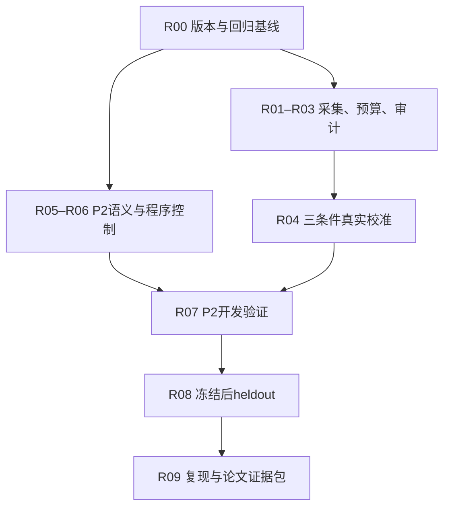
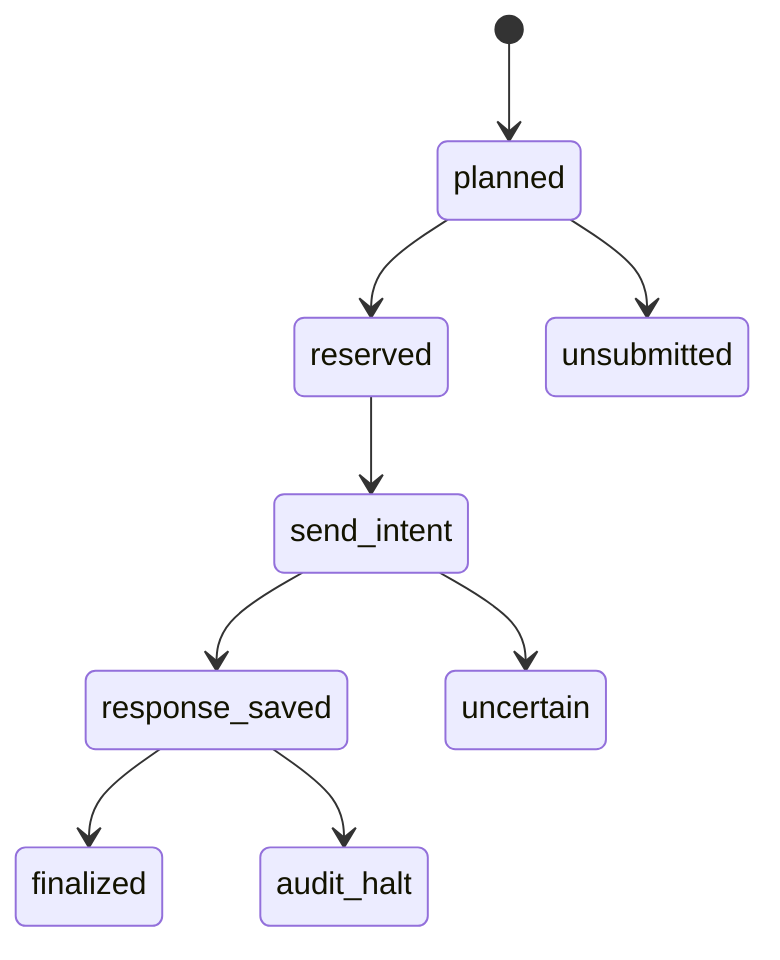

# DisasterTrace：基于当前仓库的下一阶段执行计划

日期：2026-09-07。审查基线：`a23f73adadcbec077b9fcf2aecf8f45dfa4fe061`。

仓库：[sisuolv/disastertrace-benchmark](https://github.com/sisuolv/disastertrace-benchmark)。

本文是增量实施规格，不代表下面的新模块、实验或结果已经完成。除特别说明，代码路径相对于仓库的 `disastertrace-starter/`；根目录文件另行标明。

## 0. 结论与给 Codex 的启动指令

当前已经完成“小规模官方文本资料 + 顺序回放 + 自动评分 + 一轮真实模型开发实验 + 校准离线准备”。下一步最有价值的工作是：

1. 完成支持新输出契约的真实采集、累计预算、恢复和独立审计。
2. 做一次范围明确的三条件校准，判断现有方法差距中格式与输出预算的影响。
3. 并行开发独立的 P2 字段级更新协议，优先覆盖部分更新、同窗口纠正和可恢复缺失。
4. 在开发集验证后冻结协议，最后使用七个 heldout 风暴与第二模型验证泛化。

不从零重建仓库；不重新安排已完成的 P0 评分修订和 P1 实验；不以扩充灾种、模型或框架数量代替解决测量问题。

可复制给 Codex：

> 请依据 DISASTERTRACE_NEXT_STEPS_2026-09-07.md，在现有 disastertrace-starter 上增量实现。先读取当前 AGENTS.md、README_CALIBRATION_V1.md、IMPLEMENTATION_STATUS.md、DECISIONS.md 和 BLOCKERS.md，核对相对审查基线 a23f73adadcbec077b9fcf2aecf8f45dfa4fe061 的变化，不回退用户已有修改。优先完成 R00–R03；P2 的 R05–R06 可并行。全部默认离线，不新增逐题人工标注、专家审核或 LLM judge，不调用模型 API。保留历史 P1、旧源码评分语义和已冻结产物；新增代码使用新版本、新输出目录。每个任务记录实际测试、退出码和剩余问题。R04/R07/R08 的真实调用仅在执行包完成并绑定新的明确范围与预算授权后运行；旧 P1 授权已消耗，不可复用。不要因真实调用尚未授权而停下独立的代码、程序控制、报告和 CI 工作。交付可审阅的新执行包及下一条命令，不伪造运行记录。

本文沿用当前仓库“无需新增逐题人工标注/主观评分”的范围。以前六槽港口决策、必须双人逐题 gold 审核的计划不再作为当前主线门槛。研究者仍需批准公开任务语义和实验范围；这不等于重新增加逐题标注工作。

## 1. 审查依据与当前状态

### 1.1 本次检查了什么

- 通过 GitHub 读取固定 commit 的目录树、评审文档、主要代码、测试和归档记录。
- 核查 `dynamic.py`、`output_contract.py`、`calibration.py`、`collection.py`、`collection_audit.py`、`provider.py`、V2 scorer 与证据支持规则。
- 核查根目录参考资料包、新环境复现记录及 P1 汇总 JSON。
- 对取得的源码执行六项无网络、标准库行为核对：三方法累计证据相同、c2 保留两份资料、新契约只改变 instruction、c1 不含私有/未来 sentinel、旧 reference 的字段缺省语义、新契约进入准备的 wire payload。六项通过，零模型调用。
- 本环境缺少 pytest，尝试针对性 pytest 时在启动前失败。本次没有重跑完整 684 项测试；684/6,979 等数值来自仓库保存记录。

### 1.2 已完成，不应重复开发

| 工作 | 当前证据 | 后续处理 |
| --- | --- | --- |
| 官方资料与准入 | 36 份取得，32 份通过 parser，30 份进入完整事件；10 风暴，3 dev / 7 heldout | 复用冻结 cohort |
| 原 NHC 回放 | 20 episodes，100 checkpoints；受控交付、原文内容未编辑 | 保留为自然文本参考轨道 |
| 三种方法 | snapshot / structured_state / answer_history 均提供累计已交付原文 | 明确只是回答载体不同 |
| P1 | 90 个回答、91 次累计尝试；原 attempt 79 未知费用保留 | 历史结果，不重新续跑 |
| 校准准备 | 9 个配置、54 条轨迹、270 个拟调用机会；54 初始请求、1,080 程序回答、128 准备产物 | 复用，不当作真实模型结果 |
| 参考资料包 | 根 references 已存在；130 checksum 条目核验通过 | 不再列“资料全部缺失”为阻塞 |
| 新环境验证 | 归档日志记录 684 passed in 57.41s；进程耗时 58.049 秒 | 增量回归护栏，不是新模型样本 |
| 既有独立审计 | 6,979 自动检查项 | 保留，但不当作语义正确性的数学证明 |

出处：[根 README](https://github.com/sisuolv/disastertrace-benchmark/blob/a23f73adadcbec077b9fcf2aecf8f45dfa4fe061/README.md)、[参考资料核验](https://github.com/sisuolv/disastertrace-benchmark/blob/a23f73adadcbec077b9fcf2aecf8f45dfa4fe061/references/REVIEW_REFERENCE_VERIFICATION.json)、[新环境测试日志](https://github.com/sisuolv/disastertrace-benchmark/blob/a23f73adadcbec077b9fcf2aecf8f45dfa4fe061/handoff_validation/pytest.log)、[离线重建记录](https://github.com/sisuolv/disastertrace-benchmark/blob/a23f73adadcbec077b9fcf2aecf8f45dfa4fe061/handoff_validation/offline_reproduction.json)。

### 1.3 P1 应怎样解读

| 方法 | 结构有效 | 已知字段 grounded correctness | 全字段 grounding |
| --- | ---: | ---: | ---: |
| snapshot | 14/30 | 39/96 = 40.625% | 69/150 = 46% |
| structured_state | 30/30 | 96/96 = 100% | 150/150 = 100% |
| answer_history | 24/30 | 76/96 ≈ 79.17% | 120/150 = 80% |

记录显示：68 个结构有效回答的值、状态与 action 全部正确；22 个结构无效回答中，20 个触及输出上限；另有一例数值正确而引用位置未获支持。这说明当前数据首先暴露输出可靠性与格式/预算混杂，而非已经证明复杂更新能力存在明显差距。

这里仍不能把“有效回答全对”替换成主成绩：格式无效必须留在固定分母。也不能断言全部差距已被格式解释——载体会影响后续请求，校准仍需新鲜的并行对照。

出处：[P1 保存报告](https://github.com/sisuolv/disastertrace-benchmark/blob/a23f73adadcbec077b9fcf2aecf8f45dfa4fe061/disastertrace-starter/work/p1-deepseek-background-continuation-v1/report/REPORT.md)。

## 2. 优先问题：证据、影响与修正

| 优先级 | 问题及代码证据 | 影响 | 本计划动作 |
| --- | --- | --- | --- |
| 必须先处理 | 旧 instruction 没有完整明确 action 的类型；历史载体提供合法 JSON 实例 | 输出差距不能直接归因于状态维护 | R01–R04：共同显式契约与预算校准 |
| 必须先处理 | collection/audit 仍按 legacy renderer；calibration 只有 prepare/verify | 不能把九次旧 collector 拼成合格新实验 | R01/R03：契约感知采集和独立审计 |
| 必须先处理 | 通用 collector 明确 monetary_cap_enforced=false；旧预算在 artifacts 脚本 | 缺统一累计额度与崩溃后的跨条件恢复 | R02：迁移已验证预算逻辑 |
| P2 前必须处理 | reference_at 按最新整份报告取字段，支持规则也只认最新整份报告 | 稀疏 patch 会错误清空字段、拒绝仍有效的旧引用 | R05：独立字段级协议和 scorer |
| P2 前必须处理 | 原文累计全部保留 | 不能把已见事实后续未重述当成缺失，不能声称当前测记忆依赖 | R05：首次曝光前控制缺失；机制实验另设 |
| P2 前必须处理 | port_reopening_time 固定未知 | 总体未知分可能被固定答法抬高 | P2 主体改为四天气字段，真实字段做可回答/不可回答配对 |
| 后续护栏 | 路径和 automated 全部源码参与 build identity；无 CI/锁文件 | 迁移与小改动让结果比较不便，但不是资料内容错误 | R00/R09：固定环境，新增内容 ID |

必须区分两件事：当前代码正确实现了“最新完整报告”的任务，并不意味着其规则适用于“字段 patch”。P2 应改变协议身份，而不是给旧 scorer 打补丁后悄悄改变 P1 含义。

## 3. 对评审文档八个问题的直接回答

| 问题 | 建议结论 |
| --- | --- |
| 研究定位 | 现阶段最准确为“受控交付下的顺序气象资料抽取与证据更新”。完成 P2 后再主张“动态证据可靠性与显式状态维护”。当前不能主张灾害预测、真实决策或记忆因果机制。 |
| 校准先于扩展吗 | 真实 P2 成绩应在输出设置校准后解释；P2 语义、生成器和程序控制可以现在并行开发。 |
| 三条件够吗 | 足以比较4096下契约差异、explicit下预算差异；不足以识别完整交互项。当前无需第四条件，避免增加90次调用却不解决主要任务单一问题。 |
| 固定分母是否合适 | 保留。主报已知字段grounding，另报格式、值、未知、行动、覆盖与失败；条件正确率仅作诊断。 |
| 自动 Gold 能否可信 | 对受限语法、明确版本关系和确定性数值任务可做强验证；开放自然语言因果判断、真实应急行动不能据此自动可靠评分。 |
| actual/projection 是否可用 | 可作为明确的兼容层，前提是先独立验证真实请求与响应，再只替换 instruction，保留两份哈希。projection本身不能证明真实曝光。 |
| 最小 P2 | 部分更新、同事实键/窗口纠正、可恢复缺失；先不加入 conflict/撤销/过期等新状态。 |
| heldout/发布缺什么 | 资料与新环境记录已打包。主要缺真实校准、第二模型、协议冻结和自动回归；事件独立性与模板泛化需单列。 |

## 4. 路线图与增量复用



R04、R07、R08 的付费调用是后续执行阶段；本次只产规划。各阶段缺调用授权时，仍继续离线部分。

| 现有位置 | 可直接复用 | 不直接复用的部分 |
| --- | --- | --- |
| automated/output_contract.py | contract_spec、render_calibration_request | 不把 explicit 请求伪装为 legacy 实际请求 |
| automated/calibration.py | cells、make_schedule、诊断控制、筛选规则规格 | screen_budget不能直接接未经审计的手填计数 |
| automated/provider.py | prepare、一次HTTP传输、原始响应和usage捕获 | 新P2请求不要绕过其旧五字段校验；增加新协议入口 |
| automated/collection.py | 原始响应保留、有效状态累计、无效状态不更新的规则 | 单方法/legacy路径不是九组合调度器 |
| automated/collection_audit.py | 请求/响应/状态关系的检查思路 | 新契约和新协议需新验证路径 |
| artifacts/p1_deepseek_development/run_experiment.py | BudgetLedger reserve/settle/unknown逻辑及反例 | 不直接调用历史runner或改旧实验 |
| artifacts/p1_deepseek_development/background_resume/resume_background.py | exclusive claim、worker启动与恢复检查思路 | 不迁移硬编码attempt79重发例外 |
| automated/dynamic.py、evidence_support.py、scoring_v2.py | 保留NHC原轨道，作为回归与比较 | 不作为P2 patch的Gold合并器/最新引用规则 |
| automated/common.py | canonical、fingerprint、严格JSON与安全相对路径 | 新账本需额外事务/落盘不变量 |
| 外部benchmark | 已固定的DisasterBench/CyPortQA来源与归属 | 不立即整合Inspect/STALE/EarthVerse完整框架 |

最快的复用对象是当前已经跑通的仓库。此阶段再迁移 Inspect AI 或引入通用 agent 框架，会增加接口和回归成本；待出现多provider并发或大规模日志管理需求后，再做单独适配。

## 5. R00：冻结现状，建立单一回归入口

依赖：无。估计0.5–1工程日。

### 任务

- [ ] 记录HEAD、工作区状态及与本审查commit的差异；不强制checkout旧commit。
- [ ] 在IMPLEMENTATION_STATUS中新建本阶段区段，明确R00–R09和完成门槛。
- [ ] 将历史旧plan/roadmap标为背景；当前入口指向本计划和新live协议。
- [ ] 记录旧P1、旧scorer、源资料和校准准备包的保护清单与hash。
- [ ] 使用已验证Python3.10环境作为首个基准，生成可复现依赖lock/constraints；不强迫更换Python。
- [ ] 增加 `scripts/reproduce_offline.py`：执行资料checksum、tests/、fresh build、prepare、verify；每次使用全新输出目录。
- [ ] 增加一条离线CI定义；实现文件可本地审阅，不因此自动push或触发远程任务。

### 已存在的验收命令

从项目目录运行；下面新输出路径若已存在，换一个新run ID，不覆盖：

```bash
.venv/bin/python -m pytest tests -o addopts= -q
.venv/bin/disastertrace-auto build --references ../references --nhc-snapshot ../references/nhc_cohort_v1 --output work/next-review-build-001
.venv/bin/python -m disastertrace.automated.calibration prepare --build work/next-review-build-001 --provider-config artifacts/p1_deepseek_development/provider.json --output work/next-review-preparation-001
.venv/bin/python -m disastertrace.automated.calibration verify --output work/next-review-preparation-001
```

新增模块会改变implementation ID，因此新增代码后要新build，不能修改旧manifest绕过校验。历史归档测试不自动混入tests/的一次执行。

完成门槛：本环境真实回归记录齐全；网络/环境失败明确记录；不以本文件引用的684代替新一次执行结果。

## 6. R01：新契约真实采集器

依赖：R00。估计1–1.5工程日。

新增建议：`automated/live_calibration.py`。保留现有legacy collector作为历史路径，不改其默认行为。

同时增加 `automated/provider_capture.py`。现有ProviderClient.complete在HTTP错误、超大响应或无效envelope时主要抛出脱敏错误，不能保证完整保存可用响应材料；不能只在complete返回后加写文件就宣称解决。新capture层接收已经持久化的prepared bytes，发送同一份字节并在解析前安全保存有界响应，避免第二次render/prepare改变请求。

### 接口合同

```python
def prepare_live_run(preparation_dir, protocol_path, output_dir) -> dict: ...
def collect_slot(slot, trajectory_state, provider, ledger, store) -> dict: ...
def reconstruct_trajectory_state(verified_outcomes, trajectory_id) -> dict: ...
def send_prepared(prepared_request, transport, capture_sink) -> dict: ...
```

这些是待实现接口，当前仓库没有这些新命令；函数体不能保留空壳作为交付。

### 每个slot顺序

1. 从冻结schedule读取slot与精确配置，确认开发风暴与轨迹身份。
2. 只用该轨迹此前已保存且结构有效的真实模型决定恢复previous/history。
3. 使用render_calibration_request生成实际公共请求；验证契约hash、字段白名单和可见证据。
4. 用ProviderClient.prepare获得即将发送的exact wire body；保存hash。
5. 通过R02预算预留，持久化发送意图，然后只允许一次transport调用。
6. 先保存原始HTTP响应及其hash，再执行解析、usage审计和状态更新。
7. 结构无效回答完整保留、计分失败、继续使用此前有效状态；结构有效的错误值照常进入carrier，不用gold纠正。
8. 保存独立的collection状态、账务状态和answer状态；这些不是一个互斥字符串。

Capture记录UTC起止时间、实际响应状态、允许列表内的request-ID/version响应头、返回model/fingerprint及有界body。超出字节上限时标截断，不把前缀声称完整原始响应。Authorization header永不写日志；响应反射凭据时隔离/脱敏，不能为了“完整raw”泄露密钥。旧transport与旧schema保持历史行为，新功能用版本化入口。

### 必须存的关联键

```text
experiment_id / protocol_hash / preparation_id / schedule_hash
slot_id / attempt_id / condition / method / event_id / episode_id
trajectory_id / checkpoint_id / replicate_id
contract_id / contract_hash / provider_config_hash
carrier_before_hash / public_request_hash / wire_request_hash
raw_response_hash / accepted_decision_hash / carrier_after_hash
usage_status / billing_status / response_status / finish_reason
```

slot_id是评分机会，attempt_id是调用尝试；不能因未来显式修订允许重发，就把两者混为一物。无自动重试协议下一slot最多一次尝试。

### 关键验收

- [ ] legacy_v1与旧请求完全一致；explicit_v1只有instruction变化。
- [ ] 三方法证据集合一致，carrier严格符合方法声明。
- [ ] 九个条件×方法组合和54条轨迹无状态串流。
- [ ] 后四个检查点请求只能在自己的前置真实结果保存后生成。
- [ ] 程序控制、其他条件回答、gold和未来记录不能填入live历史。
- [ ] 准备过程不读模型凭据、不触网。
- [ ] raw response存储成功但summary未写的崩溃，可离线恢复，不重发。

建议新增 `tests/test_live_calibration.py`；用注入transport覆盖完整轨迹，最后再做loopback测试，不调用真实服务。

## 7. R02：持久调度、单账本和崩溃恢复

依赖：R00，可与R01并行。估计1–1.5工程日。

新增建议：`automated/run_ledger.py`、`automated/run_store.py`。从历史BudgetLedger迁移业务规则；使用Decimal字符串或整数微单位表示钱，禁止以float反复累加为唯一账务依据。

### 7.1 单一全局账本

本次270机会共享同一账本和条件额度；不能每个条件/方法各获USD3。旧P1未知attempt79保留在旧账本，新实验不释放、冲抵或重新结算它。

调用前必须满足：

```text
settled_conservative_cost
+ unresolved_reservations
+ next_attempt_reservation
<= experiment_allowance
```

输入预留默认采用已核验context/token上界和最高适用费率，缓存命中只在有效usage到达后用于实际费用估计；reasoning tokens若已包含在completion中，不重复相加。

若未来改为按实际请求token数预留，需要可信的provider适用tokenizer、消息封装开销上界和测试。不能用“字符数/4”或历史平均值宣称硬预算保障。保守全上下文预留虽然松，但首版可继续使用。

USD3只是已有提案中的条件停止额度，不是全部270次最坏成本已覆盖的承诺，也不是本轮授权。动态价格抓取失败时，不自行编造当前价格；冻结price evidence后才能建立新live包。

### 7.2 存储与状态机

首版采用单worker、追加式JSONL账本、hash链、独占run claim、文件与目录落盘。避免为了270次顺序请求引入分布式队列。



- `reserved`且无send_intent：确认实现只在持久send_intent后才能调用transport，才可判定未发送并安全释放/恢复。
- `send_intent`存在但无原始响应：按可能已到provider处理，保持预留，停止新调用；不能自动重发。
- `response_saved`存在：允许离线完成解析/评分/结算；不可为了缺summary重新调用。
- response格式无效但usage有效：结算成本，模型答案仍计失败。
- usage缺失/矛盾、输出超合同、响应身份不符：保留原始材料与预留，停止新调用，离线报告。
- 预算耗尽：未发送机会仍留在固定计划中，不从分母删除；无完整矩阵则不选共同预算。

在实际目标文件系统验证独占创建、atomic rename和fsync行为；CCI持久目录若由网络文件系统提供，不假定SQLite WAL/锁具有本地盘语义。若无法证明单writer与持久恢复，记录限制并使用支持这些语义的存储部署；不能用“重启后文件还在”代替并发与崩溃测试。

主张仅限“尽量避免客户端重复提交、对未知发送保守停止”。没有provider幂等键及其保证时，不能声称网络层exactly-once。

### 7.3 最小故障注入集合

- [ ] 预留前、预留后、发送意图后、响应保存后、结算前、summary前分别崩溃。
- [ ] 两worker竞争同一run，只有一个获准发送；不因租约过期自动抢占不明worker。
- [ ] JSONL尾行截断保存原文件证据；已验证完整前缀可恢复；中部篡改拒绝。
- [ ] ledger与response持久化顺序一致；一次settle重复应用无双扣/双释放。
- [ ] 未知请求不释放；重启不清零累计次数/费用。
- [ ] 修改config、protocol、schedule、source或price hash后resume拒绝。
- [ ] 无效答案不重试；跨方法共享attempt上限。
- [ ] server返回usage超过预留上界时立即停止并记录guard assumption violation。

建议新增 `tests/test_run_ledger.py`、`tests/test_calibration_recovery.py`。

## 8. R03：独立真实采集审计与评分桥接

依赖：R01/R02。估计1工程日。

新增建议：`automated/live_calibration_audit.py`、`automated/calibration_report.py`。

### 8.1 审计真实发生的事情

审计器不信summary中的“270 complete”“valid=true”等汇总。逐行核查：

1. slot/attempt唯一性、冻结顺序、轨迹前置条件和全局claim。
2. actual公共请求来自合法checkpoint与该轨迹前序已接受回答。
3. contract文本/hash与配置完全一致；wire payload能还原同一公共请求。
4. 原始response与解析结果、acceptance、carrier_after一致。
5. HTTP次数、原始usage、预留/结算/unknown记录可对账。
6. missing、invalid、unsubmitted、uncertain都有明确状态；不存在伪造填满矩阵。
7. baseline政策、输入证据和预算设置没有因模型表现临时变化。

类型定义、canonical序列化可共享；auditor不应仅调用collector输出的“verify_success=true”。关键恢复与计数逻辑使用独立重建路径和故障反例。

### 8.2 暂时保留projection兼容，不重写历史scorer

顺序必须是：验证actual trace → 产生instruction-only projection → 用冻结V1/V2重评分 → 生成报告。

- actual trace及exact wire请求是曝光证据。
- projection只将instruction替换为legacy版本；其余字段、carrier、响应、失败机会不变。
- 同时保存两份hash、投影规则版本、scorer版本与auditor结果。
- 以变形测试验证任何非instruction差异都被拒绝。
- 只有完成真实采集与独立审计，才能把 `live_collection_verified` 设为true；离线控制不能设置。

P2无需继续依赖legacy projection：新scorer从一开始接受新协议与真实trace，避免长期积累越来越复杂的兼容层。

独立本地审计证明保存材料与协议一致，不构成provider签名认证；fake transport不能通过改一个flag变成真实模型结果。

### 8.3 新CLI合同（待实现）

`python -m disastertrace.automated.live_calibration`提供以下子命令；本审查commit尚无这些入口：

| 子命令 | 输入 | 输出/边界 |
| --- | --- | --- |
| prepare | 已验证preparation、live协议、price evidence、新output | 冻结launch manifest；不读密钥、不触网 |
| rehearse | launch manifest、故障场景、全新output | 270槽fake transport结果，明确非LLM |
| audit | launch manifest、run目录 | 逐请求/账本/投影审计结果；只读 |
| report | 审计通过的run | 全分母分组指标、失败、预算选择或no_selection |
| run | manifest、明确授权记录、run目录 | 独占claim后真实执行；本轮不运行 |
| resume | manifest、已审计run与恢复状态 | 只继续已证明未发送机会；unknown状态拒绝新发送 |

实现`--help`并记录参数与exit code，测试不得仅mock掉整个CLI主函数。暂不要增加自动试跑探针：若需要真实canary，必须作为独立且计费的计划机会。

### 完成门槛

错误instruction、wrong carrier、替换raw answer、重复slot、丢失usage、账本篡改、投影越权均能被反例测试拦截。完整fake transport矩阵270机会可审计通过，但输出明确标为非模型成绩。

## 9. R04：冻结并执行最小三条件校准

依赖：R01–R03通过。离线准备约0.5日；真实运行需新的具体授权与provider可用性。

### 9.1 保留三条件，不立即增加第四条件

| 条件 | 契约 | output cap | 计划请求 |
| --- | --- | ---: | ---: |
| legacy_4096 | 原说明 | 4096 | 90 |
| explicit_4096 | 共同显式说明 | 4096 | 90 |
| explicit_8192 | 相同显式说明 | 8192 | 90 |

三方法、三dev风暴、两个分支、五检查点、一重复，共270机会。P1旧90回答仅作历史背景，不能替代新的legacy对照。

这测量的是整个顺序协议的效果，包含早期回答改变后续carrier的间接影响。若将来需要隔离单轮直接作用，另注册同前缀fork实验，不能从本矩阵偷换推论。

### 9.2 首次新调用前处理timeout

当前配置在calibration.provider_configs中固定timeout=60，并明确会限制较高输出预算。我的建议是在新live协议v1.1里统一采用更宽的共同请求期限，例如180秒，所有条件一起变更，并冻结精确定义。

180秒是工程起点，不是数据证明的最优值。尤其要区分：`urlopen(timeout=...)`的transport/socket超时与完整请求wall-clock deadline不是同一保证。若宣称硬总期限，需要在transport之外实现可验证的截止控制；达到截止仍按可能已发送的unknown处理。

执行Codex先实现并准备这一新配置，不自动修改旧v1准备包或使用旧实验ID。若研究者选择保留60秒，报告必须写“60秒期限下的输出预算效果”；不能把它解释成纯token预算效应。禁止看到8192失败后只放宽该条件。

具体迁移：现有calibration.provider_configs会拒绝与60秒基线不符的配置，因此新live prepare应从已验证v1准备包派生v1.1 launch manifest，保存parent preparation ID和明确的配置diff；用新协议构建全部actual配置与请求hash。旧prepare/verify仍验证旧包，不能先修改其硬编码再冒称旧字节验证通过。v1.1 auditor以新manifest为依据校验统一override。

不同时改变thinking mode、reasoning effort、response_format或温度；否则新增混杂。官方文档说明thinking模式下部分采样参数无效，模型别名也可指向更新版本；记录请求model、响应model、可用的system_fingerprint与捕获时间，不假设别名固定权重。[DeepSeek Thinking Mode](https://api-docs.deepseek.com/guides/thinking_mode/)、[API入口与别名说明](https://api-docs.deepseek.com/quick_start/)。

### 9.3 完成后怎样决定下一步

- 先要求完整且独立审计通过的270响应与有效usage，再执行现有screening规则。
- 在每种方法下，候选cap至少29/30结构有效、最多1个length；选全部方法共同通过的最小cap。
- incomplete、账务错误或两个cap都不通过：`no_selection`，不按方法分别选预算，不删除失败组合。
- 若explicit_4096已足够，P2以4096为起点；若仅8192足够，则以8192为起点。P2提示与输出变化后仍需开发可靠性检查。
- 若格式解决后各方法均接近满分：保留校准价值，停止在该简单任务上加大重复数；进入P2。
- 若仍有大量empty/length：另立统一低推理预算或非thinking诊断，而不继续宣称当前差距是状态能力。

29/30是开发筛选阈值，不是高置信度“总体可靠性已达到96.7%”的证明。

## 10. R05：建立 P2 独立字段级协议

依赖：R00；无需等待真实校准。估计1.5–2工程日。

建议新建 `src/disastertrace/controlled/`，协议ID为 `controlled_state_v1`。旧 `disastertrace_text_v1`、源parser、answer parser和scorer保持历史可重放。

P2的四字段schema不能送进旧provider的五字段白名单或parse_decision。新capture入口采用显式协议分派：NHC调用原公开请求/回答校验；P2调用controlled.validate_public_request与controlled.parse_decision。只复用prepared字节传输、账本与存储，不以跳过校验支持新schema；两协议互相误投必须在发送前失败。

### 10.1 范围

- 四个天气数值字段：wind、pressure、latitude、longitude，单位明确。
- 模型仍提交完整state及action；known/unknown两状态先足够。
- port_reopening_time保留在旧NHC轨道作为辅助控制，不进入P2主分母。
- action沿用公开的100 mph研究阈值，只测规则执行，不增添现实业务判断。
- 第一版只支持字段SET/PATCH和单链supersedes；不支持conflict、隐式撤销、自动过期。
- 显式target entity/valid window；第一版每轨迹一个目标，其他entity/window可作为有限干扰。

### 10.2 数据合同

```text
FactKey:
  entity_id, variable, valid_start, valid_end, unit

FactVersion:
  fact_key, revision_id, value
  issued_at, supersedes_revision_ids
  evidence_unit_id, source_record_id

EvidenceRecord:
  record_id, record_kind, issued_at
  assertions[]
  public_text, line_locators
  provenance_origin, parent_source_hashes, transformation_spec_hash

Delivery:
  delivery_id, record_id, delivered_at, bundle_id

Checkpoint:
  checkpoint_id, as_of, target_entity_id, target_valid_window

DatasetSpec:
  protocol_version, source_groups, generator_version
  seed_split, family_split, templates, capabilities, controls
```

一份record可包含多个assertions，但权威性和supersedes必须逐FactKey判断。`issued_at`是声明发行时间，`delivered_at`是实验可见时间，valid window是问题所指事实窗口；三个时间不能互相替代。

限定版本链完整、父版本先于修订可见；第一版排除未见parent、分叉权威、循环supersedes、跨FactKey替代、同revision不同值。它们进入quarantine，不编成unknown模型题。

### 10.3 必须公开且固定的规则

1. 可见集合以delivered_at<=checkpoint为准，且issued_at不可来自未来。
2. PATCH只改变显式列出的FactKey；省略不是清空、未知或撤销。
3. 针对目标FactKey选当前可见的未被合法后继取代的版本。
4. 迟到/重复旧版本不恢复已失效权威性。
5. 新的其他entity/window记录不覆盖目标key。
6. 仅有无支持的模型历史不能创造gold事实；载体错值不改变gold。
7. 引用按字段仍有效的版本判定；旧record可以继续支持未被更新的其他字段。
8. 保留单独的“值未变但来源换新”机会，不把它误计成无更新。

### 10.4 三类任务与具体反例

| 能力族 | 控制序列 | 正确行为 | 要排除的捷径 |
| --- | --- | --- | --- |
| Partial update | 风速45/气压1000 → 仅patch风速105 → 无关坐标更新 → 旧patch重放 | 风速105；气压1000仍引用初始合法来源；其余字段按各自版本保留 | 最新文档覆盖全部字段、省略变unknown、不更新 |
| Same-window correction | W1风速105 v1 → W1风速95 v2替代v1 → v1重放 → 更晚发行但针对W2的120 | W1保持95；模拟action从prepare变monitor | last-arrival、全局latest-issued、跨窗口覆盖 |
| Recoverable missing | 同目标key完整/延迟两个分支；延迟分支首次隐藏全部支持 → 后续恢复交付 | 恢复前unknown；恢复后known；已经看过且仍有效的事实不会因之后省略变unknown | always-known、always-unknown、只删摘要却保留正文的假mask |

所有变更值、版本关系、受控文本与交付计划明确标controlled/generated；保存父NHC来源hash，但不能称为真实发生过的NHC更正。使用独立的“研究生成记录”渲染，不篡改官方原文后当作官方公告。

可识别性边界：第一版单链修订若与issued_at同序，按FactKey取latest-issued也可能完全正确，即使没有使用supersedes字段。保留该程序作为有效baseline，不要求它失败。当前可以测正确的修订结果，不能据此证明模型读取或依赖supersedes元数据；不能为制造差距引入未定义的倒序更正。

### 10.5 不要把完整原文作为伪多模态补丁

P2暂时保持文本，以便检验更新语义。后续若增加图像，必须确实提供新增空间信息、匹配模态消融和自动可验证目标；把同一数值画进图片再同时写进正文，不能证明视觉必要性。

## 11. R06：自动 Gold 的独立验证与程序控制

依赖：R05。估计1–1.5工程日。

建议模块：

```text
controlled/models.py
controlled/generate.py
controlled/render.py
controlled/gold_compile.py
controlled/oracle_public.py
controlled/score.py
controlled/audit.py
controlled/cli.py
```

新CLI `python -m disastertrace.controlled.cli`至少实现 `build --spec --output`、`audit --dataset`、`rehearse --dataset --method --backend --output`、`score --dataset --trace --output`。首版全离线；R07再将冻结P2 schedule接入R01/R02的发送与存储设施，避免另写一套不受预算保护的provider runner。

### 11.1 两条独立语义路径

**Gold compiler**：从私有结构化FactKey/版本图，按checkpoint可见集合求权威版本和允许支持集合。

**Public oracle**：只能读取模型真正收到的public文本/关系/时钟，独立解析后按事件执行状态更新。

两者可共享类型与单位常量，不能共享“选版本/合并patch/判支持”的核心函数。用相同函数包装两次不算独立验证。

生成AST→公开文本→独立解析AST应可round-trip；Gold/未来schedule/期望答案字段不进入public view。受控语法外的任意自然语言断言不自动当作已验证事实。

### 11.2 必须通过的关系与负例

- [ ] 重复交付同一record不改变状态。
- [ ] 交换独立字段patch顺序不改变最终状态。
- [ ] 变更无关字段不改变目标字段值/来源。
- [ ] superseded旧版本重放不能复活。
- [ ] 新窗口不覆盖旧目标窗口；错实体/错单位被拒绝。
- [ ] 全支持bundle隐藏后目标确实不可回答；恢复后与完整分支收敛。
- [ ] 文本与locator一起移动结果不变；只改locator应grounding失败。
- [ ] 保留字段允许引用仍有效旧来源；更新字段拒绝被替代版本。
- [ ] 已知与未知的机会数由gold固定；格式失败不能缩小分母。
- [ ] 小状态空间穷举：两字段、有限版本与合法交付顺序，两算法全一致。

### 11.3 程序控制

正确public oracle应在所有准入机会满分。以下错误控制必须在其针对的能力子集失败：last-arrival、latest-document-overwrite、no-update、always-unknown、ignore-window、replay-revives-old-version。最后一项明确指旧版本重复到达后错误恢复旧值，可能与last-arrival重叠；不把两个名称当作两种独立失败机制。

不能只要求它们总体低分：例如overwrite必须在未改字段preservation上失败，always-unknown必须在已知字段上失败。保留no-op/easy controls，检查scorer不会奖励“任何变化都改答案”。

双算法不一致，或Gold为known却没有充分合法支持的实例隔离并记录原因。Gold为unknown的受控缺失实例应保留。程序区分门槛用于预声明的能力机会或任务族，不能逐题要求所有错误程序都失败；easy/no-op控制同样保留。准入标准按任务语义决定，不按DeepSeek是否出错选题。

### 完成门槛

新P2数据全部可自动生成、自动复算、审计来源与支持；没有新增人工逐题判分或LLM judge。说明验证范围为受控语法与协议，不声称自动验证任意灾害知识。

## 12. R07：小规模 P2 开发实验

依赖：R04的设置选择或明确的no_selection处理、R05/R06通过。真实调用另绑定范围。

### 12.1 一个可落地的起始规模

建议使用：3个dev风暴来源组 × 3个能力族 × 2个配对变体 × 4个checkpoint = 72个机会。

一个模型 × 三方法 × 一重复 = 216次请求；第二模型以相同完整矩阵追加216次。这里的数字是建议设计，不是仓库已存在样本。若四checkpoint无法表达某语义，先修订长度再冻结，不为凑72而省略必要控制。

配对变体：partial update可配关键字段/无关字段patch；correction可配目标窗口纠正/非目标窗口干扰；missing配完整支持/延迟支持。每个pair只用于自己预注册的对比，不把三种差分当同一因果量。

第一阶段全部保持累计证据，方法只变carrier，延续现有公平比较。程序public oracle同时提供可解释上界，但必须标program control，不混入LLM榜单。

### 12.2 指标

| 主体 | 固定分母指标 | 补充诊断 |
| --- | --- | --- |
| 输出可靠性 | schema_valid / 所有计划机会 | length、empty、parse error、timeout、未发送 |
| 已知事实 | correct_value_and_support / gold-known机会 | value-only、引用失败原因 |
| 更新 | 目标版本/value/source同时正确 / gold更新机会 | 错误旧版本、跨窗口覆盖 |
| 保留 | 不变字段仍正确且来源有效 / gold保留机会 | 模型此前已错的条件恢复率，单独分母 |
| 可回答性 | 暂缺正确unknown、恢复正确known分别报告 | always-unknown控制表现 |
| 模拟action | 公开阈值规则正确率 | 只由风速导出的action不是独立推理题 |

P1/NHC、P2/controlled、DisasterBench派生计划控制分表；不拼一个总分。

### 12.3 何时停止在开发集迭代

- 若格式仍主导失败：先解决共同执行设置，不能只提高structured_state预算。
- 若程序控制失败方向正确、LLM格式稳定且出现语义错误：冻结任务覆盖，不按错误案例再筛题。
- 若三个能力族都饱和：按预先规定的能力层增加版本链深度、独立key交错数、无关证据和保留距离。保留各难度层，不删除简单层。
- 不因为没看到某个模型效应就宣称装置失败；检查冗余、动作等价与支持规则。
- 第二模型优先来自不同模型家族，用明确revision/provider设置；只换同一家族大小不能代表广泛泛化。

本阶段主要目标是证明任务区分度与评测正确性，不做排行榜显著性结论。

## 13. R08：冻结后使用 heldout

依赖：R07完成并冻结协议、生成器、模板、分母、模型/设置。真实调用单独预算。

### 冻结文件

```text
protocol.json / dataset_spec.json / source_manifest.json
generator_version / gold_compiler_version / scorer_version
split.json / template_split.json / seed_split.json
models.json / run_schedule.json / budget.json
preregistered_metrics.json / stop_rules.json
```

七个现有heldout风暴尚未用于模型推理，这是可以利用的资产；来源文本公开且已被数据管道读取，不等于严格保密或已去除预训练污染。

- 同storm的全部branch、P2派生、模板变体和重复归同split。
- 随机种子不同只说明新实例；相同风暴不同seed不成为新独立事件。
- 相同模板跨风暴测试主要是来源/数值泛化；要测组合泛化，另留操作顺序/模板组合并预先声明。
- 若看heldout模型输出后改协议、scorer或筛题规则，该批标探索性；下一轮正式评估需要新未用来源组，不能仅换seed恢复原heldout身份。
- 三dev风暴只作描述；七heldout可报探索性storm-cluster区间，但不作强总体显著性主张。模型重复不是新增风暴。

可先做自然NHC参考轨道：7风暴 × 10机会 × 3方法 × 2模型 × 2重复 = 840请求。这是独立可选预算单元；不因它简单就把全部经费用在该表。P2 heldout规模依最终冻结设计另算。

报告同时给event-macro、pooled整数计数、每风暴、能力族和错误分类；方法比较优先事件内配对。运营失败、模型无效、gold错误不同列，固定分母与实际覆盖均保留。

## 14. R09：复现、身份与论文证据包

CI/依赖锁属于R00；以下增强可以后置，不挡住校准和P2。

### 14.1 路径无关的内容身份

当前sources.py写入source_path，workflow.py以文件hash组成build_id，且所有automated源码影响implementation_id。迁移导致ID改变目前是已记录现象，不是数据腐坏。

新增schema中拆分：

- `dataset_content_id`：来源内容hash、解析/准入规则、episode、gold、split、任务语义。
- `execution_id`：完整代码、环境、路径、provider、运行参数和执行材料。

不能从dataset内容hash里排除会改变标签/可见性/分组的内容。用两个临时路径构建验证：内容ID相同、episode/gold/split一致；路径来源ID可不同。旧manifest保持不动。

### 14.2 最小可复现包

- 已有资料快照和第三方归属。
- 固定依赖、源码commit、单命令离线重建。
- 新协议、生成器和独立public oracle。
- 真实输入/响应、全部失败、usage与预算状态；展示前移除凭据。
- per-slot与per-event指标，不只保存总分。
- model结果、program控制、模拟transport结果明确分开。
- paper_claims.md：每个论文主张映射到具体数据/实验/限制。

仓库当前为私有审查快照。本计划不自动公开发布，不把软件许可证当作全部外部材料的再分发许可。

### 14.3 有价值的论文结构

1. 现有全证据任务的测量问题：格式与预算如何影响动态benchmark比较。
2. 自动可验证的字段级时序语义：partial update、revision、recoverable missing。
3. 同一事件的受控变体与确定性grounding，错误归因到更新、保留、窗口、版本和可回答性。
4. 跨模型、跨来源组与预注册组合层的验证。

仅凭“官方数据 + 三种prompt方式 + structured_state高分”不足以建立强创新性。创新应落在经过验证的任务语义、受控对比及其揭示的系统性失败模式；是否足够发表需在P2结果后判断。

## 15. 暂缓的内容与恢复条件

| 暂缓事项 | 现在不优先的原因 | 何时重新考虑 |
| --- | --- | --- |
| 第四校准条件legacy_8192 | 增90请求，主要增加交互项识别 | 若论文明确研究契约×预算交互 |
| thinking/nonthinking全矩阵 | 会把当前校准变多因素实验 | 三条件仍无法获得可用输出时另开诊断 |
| 真实港口重开与业务action | 当前无自动可靠gold支持 | 有可信结构化来源和可公开规则时 |
| conflict/撤销/过期 | 需要新增状态与权威优先级 | 三核心能力及字段版本图稳定后 |
| 大规模多灾种 | 先扩数据不解决当前任务简单 | 第二域能自动解析、验证同一语义后 |
| 多模态/GIS | 当前尚不能证明视觉信息必要 | 设计可确定性验证的空间目标与模态互补后 |
| RL/SFT/模型训练 | benchmark尚未冻结 | 有稳定训练/开发/测试边界后 |
| carrier机制干预 | 全原文设置不能隔离记忆必要性 | 独立有限窗口协议、相同前缀fork准备好后 |
| 新框架整合 | 当前已有可用运行骨架 | 出现明确难以解决的规模/适配需求后 |

将来做carrier机制：使用冻结相同prefix，Actual/Masked/关键错误编辑/无关编辑等臂；同时报告依赖与正确性。跟随错误carrier导致错误答案只能说明依赖，不能算质量提高。有限窗口是独立任务，不悄悄改变当前全证据baseline。

## 16. 建议新增测试清单

| ID | 核心不变量 |
| --- | --- |
| N01 | legacy请求字节不变；explicit只改变instruction |
| N02 | 九配置、54轨迹和条件顺序完全匹配冻结schedule |
| N03 | 后续carrier只能来自本轨迹真实已接受输出 |
| N04 | invalid输出计失败但不覆盖此前状态；错值合法输出照常携带 |
| N05 | gold/future/diagnostic sentinel不能进入wire |
| N06 | 一次发送意图对应至多一次自动transport调用 |
| N07 | 六个崩溃位置恢复不丢账、不自动重发未知请求 |
| N08 | 并发worker只有一个拥有发送权 |
| N09 | 缺usage/输出超限/身份异常保留响应并停止新调用 |
| N10 | 全局额度覆盖全部方法与条件，重启不重置 |
| N11 | reasoning不重复计费；缓存只按实际usage结算 |
| N12 | 中部账本篡改失败；尾损坏保留证据并验证完整前缀 |
| N13 | projection非instruction变化被拒绝 |
| N14 | 真实审计未通过时screen_budget不接受汇总计数 |
| N15 | 不完整矩阵no_selection；无效回答保留分母 |
| N16 | deadline与socket timeout不同，超期响应不被伪造为未发送 |
| N17 | P2省略字段保留既有有效值与来源 |
| N18 | P2被替代版本重放不复活 |
| N19 | 错entity/window/unit不能覆盖目标 |
| N20 | 同值换来源被识别为source refresh |
| N21 | 完整bundle缺失/恢复满足配对gold关系 |
| N22 | 已见且仍有效事实不因后续省略变unknown |
| N23 | 两独立语义实现与小状态穷举一致 |
| N24 | 每个错误程序控制在对应能力机会失败 |
| N25 | locator正确移动不改分，错误移动必须失分 |
| N26 | 同storm全部衍生物同split |
| N27 | 内容ID路径无关；改gold/split/evidence必变 |
| N28 | 本阶段代码变化不覆盖历史数据与结果 |

先写能复现具体风险的反例，再实现修正；无需为了增加测试数量镜像每个实现细节。

## 17. 时间、并行与交付门槛

工时为估计，假设熟悉当前Python仓库，不含provider等待和未知故障。

| 工作包 | 估计工程日 | 可并行 |
| --- | ---: | --- |
| R00 环境/回归入口 | 0.5–1 | 后续共同基线 |
| R01 真实契约采集 | 1–1.5 | 与R02、R05并行 |
| R02 调度/账本/恢复 | 1–1.5 | 与R01、R05并行 |
| R03 独立audit/报告 | 1 | R01/R02接口冻结后 |
| R04 协议与live包 | 0.5 | 数据控制开发继续 |
| R05 P2语义/生成 | 1.5–2 | 不等真实校准 |
| R06 public oracle/scorer | 1–1.5 | 类型稳定后并行 |
| R07 开发报告/诊断 | 0.5–1 | 真实采集另计 |
| R08/R09 heldout/发布准备 | 后续排期 | 不阻断首个新闭环 |

单人约7–10工程日完成新的离线执行包及P2原型，真实结果取决于调用授权和服务。两条开发线并行可缩短日历时间，但collector/audit与gold/public oracle需独立交叉核查。

### 最近两个交付节点

**节点A：CALIBRATION_LIVE_READY**

- R00–R03通过；新的协议和timeout定义明确。
- fake transport完整270机会与故障恢复通过。
- exact计划、价格证据、累计预算、单次启动范围与待授权摘要齐全。
- 原P1不变；七heldout未调用；不宣称已有校准模型结果。

**节点B：P2_OFFLINE_READY**

- 三能力族的公开语义、字段级版本图、四天气字段确定。
- 两算法Gold一致，程序控制命中相应错误，分母与支持可重算。
- 拟运行dev矩阵与模型设置具体化；没有人为制造“模型一定失败”的准入规则。

完成这两个节点即可交付代码，不必等待付费调用来证明离线工作完成。

## 18. 执行状态与停止条件

每个任务结束更新IMPLEMENTATION_STATUS：完成文件、运行命令、exit code、测试数量、保护清单差异、真实模型调用次数、blocker、下一条可执行命令。

停止仅限依赖受阻分支：

- 未明确授权新live范围：不调用API，继续离线工作。
- 未知in-flight或未知usage：停止新发送，保留预留和证据，继续离线审计。
- 原始snapshot损坏：不自动重抓覆盖历史文件；记录差异并建立新版本。
- 两个Gold算法不一致：隔离病例、修协议或实现，不调答案迎合模型。
- 必须改变已冻结语义：新协议版本；不能覆盖既有结果后继续称同一实验。
- heldout已影响开发选择：标探索性并重新规划独立评估来源组。

不要用“需要授权”结束尚可完成的代码工作。当前AGENTS明确新校准未授权付费，但已经允许离线准备；先把待运行包做成可以审阅的具体结果。

## 19. 参考入口

- [主评审文档](https://github.com/sisuolv/disastertrace-benchmark/blob/a23f73adadcbec077b9fcf2aecf8f45dfa4fe061/disastertrace-starter/REVIEW_FOR_CHATGPT_PRO.md)
- [当前仓库指令](https://github.com/sisuolv/disastertrace-benchmark/blob/a23f73adadcbec077b9fcf2aecf8f45dfa4fe061/disastertrace-starter/AGENTS.md)
- [校准入口](https://github.com/sisuolv/disastertrace-benchmark/blob/a23f73adadcbec077b9fcf2aecf8f45dfa4fe061/disastertrace-starter/README_CALIBRATION_V1.md)
- [校准协议](https://github.com/sisuolv/disastertrace-benchmark/blob/a23f73adadcbec077b9fcf2aecf8f45dfa4fe061/disastertrace-starter/docs/CALIBRATION_PROTOCOL_V1.md)
- [动态任务代码](https://github.com/sisuolv/disastertrace-benchmark/blob/a23f73adadcbec077b9fcf2aecf8f45dfa4fe061/disastertrace-starter/src/disastertrace/automated/dynamic.py)
- [字段证据支持](https://github.com/sisuolv/disastertrace-benchmark/blob/a23f73adadcbec077b9fcf2aecf8f45dfa4fe061/disastertrace-starter/src/disastertrace/automated/evidence_support.py)
- [已有真实collector](https://github.com/sisuolv/disastertrace-benchmark/blob/a23f73adadcbec077b9fcf2aecf8f45dfa4fe061/disastertrace-starter/src/disastertrace/automated/collection.py)
- [已有collector审计](https://github.com/sisuolv/disastertrace-benchmark/blob/a23f73adadcbec077b9fcf2aecf8f45dfa4fe061/disastertrace-starter/src/disastertrace/automated/collection_audit.py)
- [输出契约](https://github.com/sisuolv/disastertrace-benchmark/blob/a23f73adadcbec077b9fcf2aecf8f45dfa4fe061/disastertrace-starter/src/disastertrace/automated/output_contract.py)
- [校准准备器](https://github.com/sisuolv/disastertrace-benchmark/blob/a23f73adadcbec077b9fcf2aecf8f45dfa4fe061/disastertrace-starter/src/disastertrace/automated/calibration.py)
- [旧预算runner](https://github.com/sisuolv/disastertrace-benchmark/blob/a23f73adadcbec077b9fcf2aecf8f45dfa4fe061/disastertrace-starter/artifacts/p1_deepseek_development/run_experiment.py)
- [参考包与迁移边界](https://github.com/sisuolv/disastertrace-benchmark/blob/a23f73adadcbec077b9fcf2aecf8f45dfa4fe061/REFERENCE_BUNDLE.md)

本文的时间、模块拆分、180秒建议、P2规模和后续实验均为本次研究与工程建议；现有结果与完成事实以所链接固定版本的保存材料为依据。
