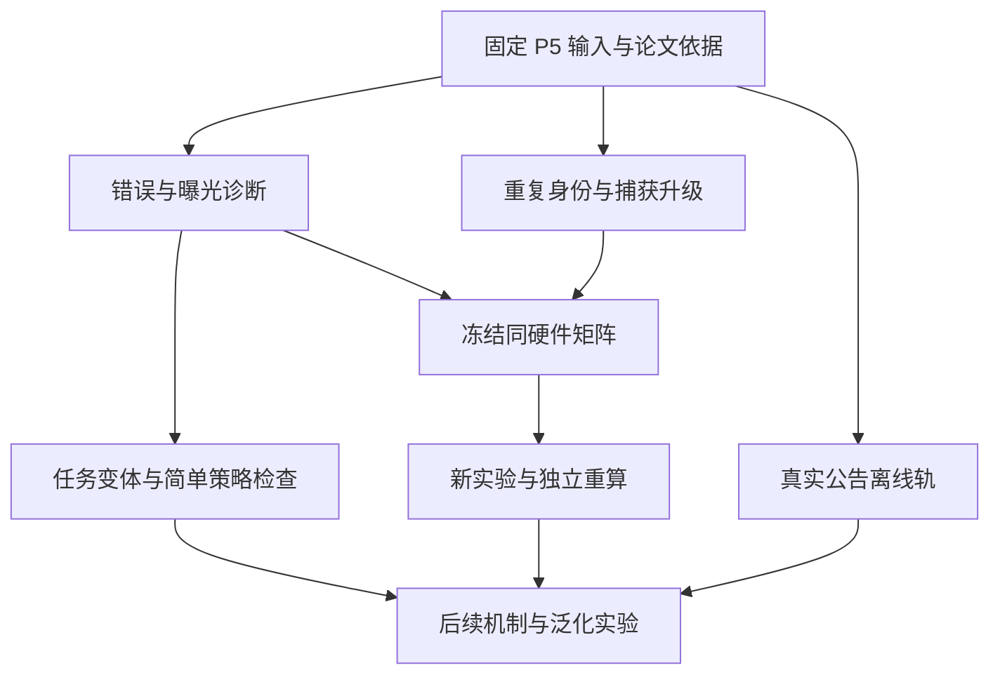

# DisasterTrace P6：基于论文与开源实现的 Codex 执行计划

版本：v1.0；研究核查日期：2026-09-08。

目标仓库：`sisuolv/disastertrace-benchmark`；起点分支：`next-phase-v1`。

本次重新核查的 HEAD：`dd5ee358f9708e2eb2f2032db9eaac14fa237adc`。

本文件是独立的后续实施计划。它继承 P5 已完成的事实，并补充论文、实际开源模块、研究问题、代码接口、实验预算和验收要求。下文“建议新增”的模块、CLI 与协议尚未因撰写本文而实现；本次没有新增模型调用，也没有运行上游 benchmark。

## 0. 给 Codex 的第一条指令

```text
请以本文件作为 DisasterTrace 后续实施计划。

先读取当前 AGENTS.md、IMPLEMENTATION_STATUS.md、DECISIONS.md、BLOCKERS.md、
REVIEW_FOR_CHATGPT_PRO_P5.md 和 README_P5_ACP_V1.md。
记录实际 HEAD；若已超出本文基线，先检查新增工作，避免重复实现或回退用户改动。

默认先完成 P6-00 至 P6-04 的离线工作，再完成 P6-05 的冻结候选与全部预检。
不要重新做已完成的 T6 校准、P2 collector、P4 或 P5 真实采集。
保持 P1–P5 的原始数据、Gold、评分器、冻结实现、回答、失败和已消耗 claim 不变。

新增主评分必须为自动 Gold + 确定性规则；不新增逐题人工标注、专家裁决或 LLM judge。
论文借鉴、代码已读取、代码已移植、离线已验证、模型已实测必须分别记录。

后续真实推理只能使用新实验身份和执行时有效的用户授权范围。
已有明确覆盖新实验的授权无需反复询问；旧实验已消耗的启动不能复用。
当前“撰写计划”任务本身不启动模型、训练或发布。

在独立新模块和 artifact 目录增量实施。每项完成后更新状态文件，写明实际命令、
退出码、产物身份、验收结果和下一项；遇到某来源无法下载，可继续独立的离线任务。
```

## 1. 现有起点：已经完成的部分不再重做

| 对象 | 本次确认的当前状态 |
| --- | --- |
| 基础任务 | 四字段；U1 局部更新、U2 修订/作用域、U3 缺失/恢复 |
| 数据设计 | 3 开发来源 × 3 任务族 × 2 case × 2 branch = 36 episodes；5 checkpoints |
| 方法 | snapshot、structured_state、answer_history；每轮累计公开证据一致，额外答案载体不同 |
| 单条件单 repeat | 540 回答、108 条轨迹；每方法 180 回答机会 |
| 自动化 | generator、Gold compiler、公开 renderer、独立 public oracle、严格 scorer、capture/audit 已存在 |
| P3 自由输出 | 540 回答中 200 契约合法；完整正确 193/540 |
| P4 结构约束 | 540 全合法；完整正确 490/540 |
| P5 三因素 | 1,620 全合法；完整正确 1,360/1,620；无重试/缺失/长度终止/提取错误 |
| P5 错误 | 90 处值/状态错误；230 处值正确但引用错误；29 动作错误与风速错误重叠 |
| 泛化范围 | 仍为 3 个依赖来源、一个本地模型、P5 每因素一次采样；7 个 heldout 未进入推理 |

依据：[P5 交接][D01]、[结果表][D02]、[实测入口][D03]。

P5 实际模型为完整 BF16 Qwen3-8B，vLLM 0.10.2 V1、XGrammar 0.1.23，thinking enabled，context 16,384，总生成上限 8,192。复验 P5 现象时保留这些设置；升级依赖或模型另建实验，不把新版本表现解释为原条件效果。

当前稳妥定位：**天气记录背景下，可验证的当前状态、当前来源和动态证据处理可靠性。** 真实事件提供初始值，后续受控记录由程序构造。当前不是数值天气预测评测；36 episodes 或 1,620 回答也不是同等数量的独立风暴。

## 2. 论文与开源依据：每项只保留能转成任务的内容

下面区分三种复用：设计借鉴、阅读过的代码参考、尚未核实可用代码。阅读论文不能被写成复现论文；同名项目不能互相替代。

### 2.1 最直接相关的研究

| 文献 | 核查结果与关键启发 | 转成本项目任务 | 不直接继承的部分 |
| --- | --- | --- | --- |
| **Can Agent Memory Systems Track Evolving State?**，2026-08，StateMemBench / StateMem | 程序事件、当前/过期状态区分、反捷径控制，与本项目很接近；官方代码未确认 | P6-01 错误分类；P6-02 简单策略分歧；后续匹配调用预算的方法控制 | 自由答案映射仍用 judge；不宣称已有可安装的 StateMem 官方实现 |
| **STALE: Can LLM Agents Know When Their Memories Are No Longer Valid?**，2026-05 | 分开测状态识别、抵抗旧前提、下游行为；CUPMem 有状态提交和失效历史代码 | 分开报告值、当前引用、动作；将来按公开规则构造失效传播 | 专家逐题验证、隐式常识标签和原 judge |
| **(How) Do Language Models Track State?**，ICML 2025 | 可执行置换任务分析状态计算与启发式 | 记录真实更新深度，构造 no-op/不同路径相同终态对照 | 训练、激活干预及论文内部机制结论 |
| **LongMemEval: Benchmarking Chat Assistants on Long-Term Interactive Memory**，ICLR 2025 | 区分知识更新、时间推理、拒答与检索证据覆盖 | 后续检索轨独立报 current-support recall；现阶段检查证据可见性 | 原 QA judge、较宽松更新答案标准、原版与 V2 混用 |
| **Enabling Large Language Models to Generate Text with Citations**，ALCE，EMNLP 2023 | 将回答正确性与引用质量分开 | P6-01 分开值正确、引用可定位、作用域正确、当前版本正确 | `eval.py` 的 AutoAIS/NLI 模型判定；本项目用事实键与 locator 规则 |
| **Lost in the Middle: How Language Models Use Long Contexts**，TACL 2024 | 相关证据位置变化应单独控制 | P6-02 记录来源位置，并准备受限的表示/位置配对 | 不据此直接断言 P5 错误就是位置偏差 |

论文来源：[StateMemBench][P01]、[STALE][P02]、[(How) Track State][P03]、[LongMemEval][P04]、[ALCE][P05]、[Lost in the Middle][P06]。

上述工作意味着，“LLM 会使用过期状态”“显式状态有帮助”已有直接先例。本项目需要新增的证据是：**明确交付时序、同值但来源变化、实体/有效时间隔离、可验证引用，以及受控轨与真实天气公告轨之间的对应关系。** 这是一项待实验支撑的贡献定位，不是本次已证明的 novelty 结论。

### 2.2 工程和领域资产

| 资产 | 已核查的可用入口 | 建议用途 |
| --- | --- | --- |
| ExtremeWeatherBench，论文 2026 | 事件目录、case 与 forecast/target 评测组织 | P6-04 来源分层和事件 manifest；未来真正测预报误差时再借 metrics |
| Microsoft STATE-Bench，官方软件/公告 | 企业流程、任务隔离、状态约束与重复运行 | 工程隔离和状态差异报告；不与 StateMemBench 混淆 |
| XGrammar，2024 首发论文；XGrammar 2，2026 | 固定版本 matcher、accept/terminate、grammar API | 保留结构与语义分层；继续固定 P5 的 v0.1.23 做复验 |
| Inspect AI，官方软件/文档 | 自定义 Scorer、Score metadata、日志 | P6-08 薄适配层与结果浏览，不替换已有冻结运行核心 |

来源：[EWB 论文][P07]、[EWB 代码][C07]、[Microsoft STATE-Bench][C08]、[XGrammar 论文][P08]、[XGrammar 2][P09]、[Inspect 文档][C10]。

XGrammar 2 的新功能不是当前升级的充分理由。P5 已解决本次主要格式失败，先用相同后端比较语义与引用，能减少变量变化和重新适配成本。

### 2.3 已读取的代码与冻结入口

| 项目 | 本次确认的版本 | 实际可参考模块 | 复用方式 |
| --- | --- | --- | --- |
| STALE | `ea7d391103a151927cd29d2f01d87597a782bdcb` | `cup_mem/store_layer/transitions.py`、`cup_mem/memory/schema.py` | 参考修订历史/失效提交的边界；其输入 UpdateDecision 的形成不是全程无 LLM |
| LongMemEval | `9e0b455f4ef0e2ab8f2e582289761153549043fc` | `src/retrieval/eval_utils.py`、`src/evaluation/evaluate_qa.py` | 借鉴检索覆盖与问答评分分层；不用后者 judge |
| state-tracking | `fc63e2db262265f42e9d2ac5c05888284f843b4c` | `permutation_task.py`、`eval.py` | 参考程序状态序列及按长度评测；不搬训练栈 |
| ALCE | `246c476a4edfc564266b7346b6e29ef4861ae937` | `eval.py` 的引用解析与 `compute_autoais` | 参考分解思路，重新实现完全确定性的结构化引用诊断 |
| lost-in-the-middle | `29b8a6d042ce29abccee3db1a73171a107d7e6af` | `scripts/make_kv_retrieval_data.py`；另确认 scripts 目录 | 参考 opaque key/value 数据构造；本项目位置实验另写 |
| XGrammar | tag `v0.1.23` → `16e5298ed9b74fba1c8674b21996b0f47d95276d` | `python/xgrammar/matcher.py` | 复用既有依赖；同时验证 token 接受与序列完整终止 |
| Inspect AI | 本次读取 main，未重新固定该主线 commit | `src/inspect_ai/scorer/_scorer.py` | 只作为接口参考；真正接入时先固定版本并做兼容验收 |

代码入口：[STALE][C01]、[LongMemEval][C02]、[state-tracking][C03]、[ALCE][C04]、[Lost in the Middle][C05]、[XGrammar v0.1.23][C06]、[Inspect Scorer][C11]。

本次读取的 STALE、LongMemEval、state-tracking、ALCE、lost-in-the-middle 代码许可为 MIT。复制时保留声明并记录具体文件；代码许可不自动覆盖所有第三方数据。对仅参考而不复制的算法，仍保留论文引用。新计划不要求安装所有这些项目，默认依赖继续采用仓库现有 CPU/GPU 环境。

## 3. 研究问题与必须对应的实验

| 编号 | 研究问题 | 可以提供证据的实验 | 不能替代它的工作 |
| --- | --- | --- | --- |
| RQ1 | 值正确但引用错误，是选旧版本、错作用域还是定位失败？ | P5 全量字段分类；ID/ASSERT 表示配对 | 仅报总正确率或主观阅读少数例子 |
| RQ2 | 三方法的差异在独立采样下是否稳定？ | 同硬件、同任务、明确 repeats 的完整轨迹对照 | 增加同一次采样的合成 episode |
| RQ3 | 压力是否增加了真实状态计算，而非只有更多相同文字？ | 简单策略分歧、竞争值链、真实更新深度 | 只增加 revision_chain 的 level |
| RQ4 | 天气数据是否引入了新的有效时间与来源更新问题？ | NHC 同 valid_at 跨公告更新与真实来源定位 | 只替换初始风速或增加风暴名称 |
| RQ5 | 新方法的收益来自状态结构，还是额外调用和输出预算？ | 状态化提取与通用提取的匹配控制 | 把两次调用的新方法直接和一次调用方法作单一排名 |

RQ1–RQ4 为下一阶段核心；RQ5 是协议稳定后的可选方法研究。当前不训练模型，不先接向量数据库或多 agent 系统。

## 4. 实现结构与数据边界

以下目录均为**建议新增**，路径相对 `disastertrace-starter/`。名称可按现有项目规范调整，但必须保留版本隔离和对应职责。

| 新模块 | 责任 |
| --- | --- |
| `src/disastertrace/phase6/diagnostics.py` | 引用分类、实际曝光、错误传播统计 |
| `src/disastertrace/phase6/shortcut_policies.py` | 简单策略与 oracle 的分歧 |
| `src/disastertrace/phase6/variants.py` | 竞争值与表示变换、新 profile |
| `src/disastertrace/phase6/schedule.py` | condition/repeat/pair 身份和调度 |
| `src/disastertrace/phase6/runtime.py` | 新版本 raw-first 捕获；保留载体传播规则 |
| `src/disastertrace/phase6/audit.py` | 重建请求、载体、seed、完整计划分母 |
| `src/disastertrace/phase6/cli.py` | 离线诊断、构建、预检与审计入口 |
| `src/disastertrace/nhc_forecast/schema.py` | 真实 forecast 独立事实键与输出契约 |
| `src/disastertrace/nhc_forecast/parser.py` | 原文、日期、单位、forecast 块及 locator |
| `src/disastertrace/nhc_forecast/compiler.py` | 按公开选择政策生成真实轨 Gold |
| `src/disastertrace/nhc_forecast/public_oracle.py` | 从公开输入独立恢复 forecast 状态 |
| `docs/P6_PROTOCOL_V1.md` | 问题、矩阵、预算、失败处理和分母 |
| `artifacts/p6_diagnostics_v1/` | 旧 capture 的新增离线分析 |
| `artifacts/p6_repeat_v1/` | 新重复协议、调度、未来捕获与审计 |
| `artifacts/nhc_forecast_v1/` | 新来源与真实轨离线验收 |

无需一次复制整套旧 runtime。先识别可直接复用的 parser/scorer/数据类型；必须改变语义或运行身份时再做最小版本化扩展。每个新执行包绑定实际使用的源码，避免后来源码修改让历史运行无法重建。



Gold、未来证据和内部来源分组只进入构建/评估进程。模型请求仅由公开证据和声明的模型载体生成。诊断工具持有 Gold 不等于模型可以调用该工具。

## 5. P6-00：固定起点与证据清单

依赖：无。模型调用：0。

动作：

1. 读取当前项目指令与 P5 入口，确认已完成状态，记录实际 HEAD 与本文基线差异。
2. 定位 P4 base、三组 P5 capture、冻结实现、analysis、comparison 和原始协议。
3. 创建 `input_manifest.json`：文件 hash、来源提交、数据与执行身份、实际可访问范围。
4. 创建 `references.json`：论文 URL、官方代码 URL、commit/tag、实际读取文件、许可读取状态、复用决定、未验证项。
5. 将本文列出的新路径标为 planned，不把目录名存在当成实现完成。

交付：`P6_STARTPOINT.md`、`input_manifest.json`、`references.json`。

验收：基线主成绩与原保存报告一致；旧 capture 与评分文件保持不变；不将早期根目录 EXPORT_MANIFEST 当成完整 P5 归档核验。若只有轻量附件，明确缺少全量 captures，不宣称完成全部错误重算。

## 6. P6-01：引用错误、真实曝光与恢复诊断

依赖：P6-00。模型调用：0。论文依据：ALCE 的分层、STALE 的多维探测、StateMemBench 的当前/过期区分；下列规则为本项目新设计。

### 6.1 新增字段级诊断记录

建议接口：

```python
def classify_field(request, gold_slot, predicted_slot, public_index) -> dict: ...
def classify_exposure(base_request, condition_request, exposure_history) -> dict: ...
def summarize_trajectory(checkpoint_rows) -> dict: ...
```

输出每个 `(condition, repeat, episode, method, checkpoint, field)` 一行：

```json
{
  "value_status_correct": true,
  "strict_current_grounding_correct": false,
  "citation_present": true,
  "citation_locator_valid": true,
  "citation_fact_key_matches": true,
  "citation_is_current": false,
  "error_tags": ["stale_revision"],
  "exposure_status": "exposed"
}
```

规则顺序：先沿用严格 parser 和 scorer；invalid/missing 保留原失败。合法回答先区分 value/status 错与 citation-only 错，再分类引用。引用检查只针对当前可见证据，不能用私有未来记录补足可见集合。

引用分类至少覆盖：`missing_citation`、`unknown_record`、`line_out_of_range`、`non_assertion_line`、`wrong_field`、`wrong_entity`、`wrong_window`、`stale_revision`、`mixed_references`、`other`。多标签可以并存，但字段级计数只计一次；若需要互斥汇总，写明分类优先级。

保留严格主分数，并补充：

- 已知值正确率；值和当前来源联合正确率。
- 当前记录选择正确率、当前 ASSERT 行选择正确率。
- 引用可定位率；引用是否支持同一事实键及回答数值。
- same-value provenance refresh：数值不变时是否更新到当前来源。
- value update / provenance-only update / unchanged retention 分开报告。

这些不是直接复现 ALCE 指标：本项目使用结构化事实键和当前版本，不调用 NLI、AutoAIS 或自由文本 judge。[ALCE 代码][C04]

### 6.2 曝光不能只按整个 episode 标记

新增 `before_first_exposure`、`exposed`、`never_exposed`；同时保存 `first_exposed_checkpoint`、公开证据 hash 是否相同、carrier hash 是否相同、完整 request hash 是否相同。

必须重现的已知分层：

| 因素 | 实际首次曝光 |
| --- | --- |
| revision_chain | 30 episodes 从 c2；其余 6 个始终零增量 |
| irrelevant_scope | 36 episodes 从 c2 |
| late_stale_replay | 36 episodes 仅从 c4 |

旧重放条件中，history 在 c0–c3 已从 P4 的 121/144 变为 P5 的 117/144。它说明前缀变化不能归因于尚未出现的重放；相同公开证据也不等于 seed 或载体相同。[P5 配对结果][D04]

### 6.3 不从行为分类推断内部心理机制

`stale_revision` 表示输出引用了可验证的旧来源，不证明模型内部为何选择它。虚构 ID 也不自动等于记忆丢失。保留自动可观察标签，机制需要后续配对实验。

交付：`field_diagnostics.jsonl`、`exposure_pairs.jsonl`、`trajectory_errors.jsonl`、`DIAGNOSTIC_FINDINGS.md`。

验收：P5 完整正确仍为 1,360/1,620；90+230 字段错误对齐，29 动作错误不重复计数；c0/c1 合计 648/648 与 c2–c4 的 712/972 仅作补充分层。针对错实体、旧同值引用、header、未来 ID、多引用和缺失回答写小型明确期望测试。

## 7. P6-02：简单策略基线与有效难度构造

依赖：P6-00；根据 P6-01 调整后续优先级。模型调用：0。

### 7.1 不让“更多记录”自动等于“更深状态推理”

参照程序化状态研究，新增独立强度字段：

```text
delivered_record_count
unique_assertion_count
effective_value_updates
provenance_only_updates
revision_depth
observed_update_checkpoints
competing_values_per_fact_key
alternative_locators
added_input_tokens
first_exposed_checkpoint
```

当前 revision_chain 中间值与最终值相同，并在同一 checkpoint 交付。因此 `revision_depth` 增大不表示 `observed_update_checkpoints` 增大。当前 scope distractor 复制初始值，也可能只有来源竞争，没有数值竞争。[P5 变换][D05]

### 7.2 计算 policy disagreement，而非依据模型失败挑题

建议策略：

- `initial_only`：始终使用最初可见支持。
- `last_delivered`：忽略有效版本，直接用最近投递。
- `most_frequent_value`：按当前公开证据中出现次数选值。
- `latest_issued_per_key`：作用域正确，按发布时间取最新。
- `public_oracle`：当前任务定义下的确定性参考。

策略仅读取公开输入，默认先按目标实体、有效窗口、measurement kind、字段与单位过滤。若需要测忽略作用域，另建明确命名的 `scope_blind_last_delivered`，不改变同名策略的含义。

`most_frequent_value` 默认以“每次公开投递中的一条 ASSERT”为计数单位，重放再次计数；按规范化数值比较，不按数字字符串出现次数。另设 `most_frequent_unique_assertion` 可去重比较，两者分别报告。最高频值平局时选最近投递的候选；同次投递按 ASSERT 行序固定选择。选中值后引用最近投递中支持该值的行，不查询 Gold/current head。没有目标支持时输出 unknown。所有策略的细节写入版本化配置，避免重放条件出现不一致实现。

输出 value/action 与完整 grounding 两种分歧，不能把值相同、引用不同吞并成同一个正确结果。

当前合法空间下 `latest_issued_per_key` 全对是应报告的充分性结果，不能筛掉这些题制造难度。记录 `policy_disagreement_signature`，用于解释任务覆盖；新题选择规则提前声明，不根据模型答案挑题。此做法借鉴 StateMemBench 的程序控制思路，具体实现为本项目新增。[StateMemBench][P01]

### 7.3 新 profile 分开准备

| Profile | 改变什么 | 必须保持什么 |
| --- | --- | --- |
| `revision_competing_values_v1` | 中间版本含不同合法值 | 每个原 checkpoint 的最终 Gold、当前 locator、动作和机会集合相同 |
| `scope_conflicting_values_v1` | 不同实体/窗口使用竞争值 | 目标 Gold 完全相同；与 no-conflict 控制分开 |
| `opaque_id_short_v1` | opaque ID 的表示长度 | 事实图、投递、语义；全部映射一致，不能编码新旧或正确性 |
| `assertion_order_v1` | 同记录 ASSERT 行次序 | 事实语义；重新生成公开位置与 Gold locator |
| `multi_checkpoint_updates_v1` | 中间更新分时到达 | 另立检查点/分母协议，不能混入 P5 五点矩阵 |

前两项是严格等 Gold 变换；ID/行变换会改变引用字节，应按明确的一一映射验证等价，不能要求 locator 原字节不变。

位置控制借鉴 Lost in the Middle，但当前合法语法要求父版本先可见，不能任意重排整段修订历史。先做 ASSERT 行置换和不违反交付/依赖规则的 distractor 位置变化；若 public oracle 拒绝，不能为了置换实验绕过输入规则。[位置研究][P06]

交付：`difficulty_manifest.json`、`shortcut_scores.json`、`policy_disagreements.jsonl`、新 profile 与 `VARIANT_ACCEPTANCE.md`。

验收：公开可解、Gold/oracle 一致；对每个变体验证机会集合和映射；no-op/同值刷新/变化值更新/应保留旧值均有覆盖。若随机 ID 长短改变 token 数，报告该差异；不预先声称已经隔离纯复制成本。

## 8. P6-03：重复调度、载体隔离与原始捕获

依赖：P6-00，可与 P6-01、P6-02 并行。模型调用：离线开发为 0。

当前执行器有 repeats=1、540 的限制；slot seed 随因素身份变化。新版本将“运行身份”和“配对随机性”分开，不复制历史 claim。[当前执行准备][D06]

### 8.1 身份定义

```python
pair_key = (
    model_fingerprint, canonical_base_episode_id,
    method, checkpoint_id, repeat_id
)
trajectory_id = hash_id(
    experiment_id, model_fingerprint, condition_id,
    episode_id, method, repeat_id
)
slot_id = hash_id(trajectory_id, checkpoint_id)
sampling_seed = hash_seed(seed_scheme_version, global_seed, pair_key)
```

条件间 trajectory/slot 不同；若采用共同随机种子配对，seed 有意排除 condition。repeat 之间独立，并检查非预期 seed 碰撞。不同 prompt 上相同 seed 不保证相同随机语义；GPU 非确定性仍需记录。

所有 carrier 以完整 trajectory_id 为键。一次 batch 只能包含同一 checkpoint 波次的不同轨迹；同轨迹下一点等待上一点处理完成。事实错误但契约合法的答案继续传播；invalid 不替换最近合法答案，仍计失败。

### 8.2 raw-first 捕获与恢复

当前 runtime 在 batch generate 后逐条 extract/parse，再写 capture，中途异常可能丢失已返回但未写入的响应。P5 没有观察到该异常影响，本阶段改善后续恢复能力，不改历史分数。[当前运行时][D07]

新顺序：

1. 写入 batch intent，绑定请求、slot、seed、模型和 token 数。
2. 后端返回后，先原子保存整批 raw token/text、finish、usage 和顺序。
3. 再逐条 extraction、严格 parse、accept/reject、carrier 更新。
4. CPU 恢复只从已有 raw 重建；未落盘的响应保持 unresolved，不自动重调用。

同时保留内容完整终止检查；XGrammar 的 `accept_token` 与 `is_terminated` 表达不同状态，不能只因为已生成 token 未违规就认定答案完整。[matcher][C06]

### 8.3 必须通过的针对性测试

- 两条件两 repeats 的 fixture 没有载体串线；配对 seed 相同、不同 repeat 独立。
- 改动 condition/repeat/seed/request 后，旧捕获审计拒绝。
- raw 保存后、首条解析前退出，整批原始结果可离线恢复。
- 第 k 条提取失败时，其余 raw 不丢失；保存前失败保持 unresolved。
- wrong-but-valid 与 invalid 两条传播路径符合旧协议。
- 停止前缀仍保留计划分母，缺失机会不能被过滤。
- grammar 仍允许合法形状的错误数值/引用/动作；未把 Gold/current locator 编码进 grammar。
- 新目录内 CPU 重建诊断结果一致；旧冻结 P4/P5 仍能按原协议复验。

交付：版本化实现、调度 manifest、故障 fixture、`RUNTIME_ACCEPTANCE.md`。先完成有界测试，再按所选矩阵生成全部无模型 slots；不因现有历史测试数量大而省略新增风险测试。

## 9. P6-04：真实 NHC forecast 更新轨与事件清单

依赖：P6-00，与执行器开发并行。初始模型调用：0。

### 9.1 用真实案例启动一个最小轨道

已核查的 NHC Ida 例型：

| 公告 | issued_at UTC | 相同 valid_at UTC | 纬度 | 经度 | 最大持续风 |
| --- | --- | --- | ---: | ---: | ---: |
| #9 | 2021-08-28 15:00 | 2021-08-29 12:00 | 28.0N | 89.8W | 115 kt |
| #11 | 2021-08-29 03:00 | 2021-08-29 12:00 | 28.4N | 89.4W | 115 kt |

它自然包含位置更新，以及风速同值但来源更新。来源：[NHC #9][N01]、[NHC #11][N02]。另一共同有效时刻 2021-08-30 00:00 的最大风为 #9 的 115 kt、#11 的 85 kt，可在原文解析通过后加入第二 fixture。

本次研究工具取得过正文，但直接重开这些 URL 有间歇 403/错误。因此“网页内容可核查”不等于“采集稳定或已冻结”。Codex 必须实际保存成功返回的原文、receipt、SHA256 与规范文本，才能将其列为 admitted；不得把搜索摘要或网页工具行号冒充原始证据。

### 9.2 独立 schema，不强塞到受控观察字段

最小事实键：

```python
ForecastKey = (
    storm_id,
    product_family,         # 初版只允许 NHC Forecast/Advisory
    measurement_kind,       # official_forecast
    valid_at_utc,
    field                  # lat_deg / lon_deg / max_sustained_wind_kt
)
```

issued_at 用于选择版本，不放入恒定事实键。初版字段规范固定单位：纬经度 degree、风速 kt。未来混入其他单位时先在独立规范层转换并保留原值，不能让同名字段装入不同单位。

建议记录：`source_url`、`raw_sha256`、`canonical_text_sha256`、`canonicalization_version`、`issued_at_utc`、`valid_at_utc`、`source_record_id`、字段值、`line_start/line_end`、原始字节或文本 span、`provenance_class=real_official_forecast`。

初版输出只含 forecast 纬度、经度、最大持续风三个字段，采用独立严格契约并分别报分。当前公告气压不能复制成未来气压；初版不附加人工天气行动标签。若以后增加气压或研究动作，先定义来源与公开规则。

预测有效时间是时刻，不能凭空造出来源未给出的半开有效区间。必要时更改新 schema，不修改 P5 的历史窗口语义。

### 9.3 parser 与 Gold 规则

1. 首先只接收能明确解析的完整 Forecast/Advisory。
2. 区分当前 center、历史 center、REPEAT、FORECAST VALID、OUTLOOK VALID；解析对应的 MAX WIND，不误读 gust 或风圈半径。
3. 从公告日期上下文解析 UTC 月/年，覆盖跨月、跨年；经度西负东正。
4. 对同一个 key，按已交付公告的 issued_at 选择当前预测。相同发布时间但无明确顺序的冲突先拒收并报告，不私自制定隐藏优先级。
5. 同值新公告刷新当前来源；其他 valid_at 不覆盖目标；重新投递旧公告不回滚。
6. 新公告未包含某个 forecast key 时，按预声明的“该 key 最新已交付支持”规则保留其最近支持；不得从未提及推断撤回。若研究撤回或失效，另立明确产品规则。
7. 新公告替代旧预测是 benchmark 的公开版本选择政策；原文没有 supersedes，就不能伪装为 NHC 声明的纠错关系。
8. source issued_at 与受控 delivered_at 分开，真实原文与模拟延迟/重放分别标记。

Gold 回答“最新已交付资料中的官方预测是什么”，不判断其最终是否预测准确。b-deck、HURDAT2 或事后最佳路径不得进入当时可见输入。

ATCF 可作为后续交叉核对来源：cycle+TAU 用于有效时间，文本公告提供实际发布时间，不能把 nominal cycle 当公众可见时刻。先用文本完成 MVP，再固定 TECH 和格式规则接 a-deck；同机构相关产品的一致不等于完全独立真值。[NHC 核验流程][N03]、[ATCF 格式][N04]

### 9.4 用 EWB 建候选清单，而非立即安装全部气象栈

EWB 固定代码 `2f37abd464eb339d3775e2e1537e2f823d87efad` 中，`events.yaml` 提供 `case_id_number,title,start_date,end_date,location,event_type`，`cases.py` 提供 case 类型和加载方式。[事件目录][C12]、[case 实现][C13]

该快照的 LICENSE 为 MIT；复制目录或加载代码时保留声明，并在本项目列明实际复用文件。

导出热带气旋候选到 manifest，确定性匹配 NHC storm ID；事件标题不等于 storm ID，未匹配项留在拒收/待解析清单。先用现有开发事件做 parser 小样本，再按预声明年份、地区、格式规则选新的开发事件。现有七个 heldout 不参与挑模板。

交付：原文 fixture/receipts、parser、独立 Gold/public oracle、`source_manifest.jsonl`、`admission_rejections.jsonl`、`NHC_FORECAST_OFFLINE_ACCEPTANCE.md`。

验收：每个 admitted 值能从公开 span 恢复；同有效时刻更新、同值刷新、其他时刻干扰、旧公告重放、跨月日期有明确期望；完整来源目录与拒收分母可追踪。暂不能取得某来源时，将该项记录为 blocked，继续受控轨工作，不以手填资料替代采集。

## 10. P6-05：同硬件重复的冻结协议与执行

依赖：P6-01、P6-03；P6-02 新任务与 P6-04 真实轨不混入本次原 P5 复验。

冻结候选同时交付人读的 `docs/P6_PROTOCOL_V1.md` 和机器读取的 `docs/p6_repeat_protocol_v1.json`；二者由同一配置生成并绑定 hash。P6-02 的变体配置另存 `configs/p6_variants_v1.json`，不得作为重复实验默认输入。

### 10.1 默认最小矩阵 P6-A

```yaml
# 建议配置；字段需由 Codex 在新版本中实现并验证
experiment: p6_repeat_v1
dataset: p5_balanced_semantics_unchanged
conditions: [base, irrelevant_scope_l4]
methods: [snapshot, structured_state, answer_history]
repeats: 2
episodes_per_condition: 36
checkpoints_per_episode: 5
planned_answers: 2160
planned_trajectories: 432
model: qwen3_8b_exact_frozen_identity
hardware: full_h100_80gb
tensor_parallel: 1
context_limit: 16384
max_output_tokens: 8192
thinking: true
max_batch_size: 12
retries: 0
generation_disabled: true  # 离线准备阶段；真实执行另产生绑定记录
```

算式：`2 conditions × 36 episodes × 5 checkpoints × 3 methods × 2 repeats = 2,160`。

选择 scope 是基于 P5 结果的开发假设；此选择不属于盲定 heldout 实验。它对三方法都有下降，structured_state 从 178/180 到 154/180，适合先检查载体与作用域问题的重复稳定性。两次重复只能初步描述波动，不能声称充分统计保证。

完整三因素方案为 P6-A-full：`4 × 540 × 3 = 6,480` 回答、1,296 轨迹。只有需要对三个因素都提出重复稳定性主张时才选择该矩阵。两个方案在推理前择一；不能看到第一轮方法表现后选择性补跑或挑报告。

### 10.2 信息与运行公平性

- 所有条件用相同完整 H100 配置、权重文件、容器、backend、grammar、thinking 和采样参数。
- 复用 P5 固定输出约束；不加入当前正确 ID 枚举、数值范围掩码或 Gold 派生提示。
- 条件在执行顺序与设备间分块/轮换，记录 batch 组成；避免每种条件永久绑定不同硬件。
- 冻结前对全部计划程序载体检查输入+8,192≤16,384；真实模型载体在每次调用前仍须检查。遇到超限按协议保留失败/停止，不静默截断。
- 全轨迹独立运行，错误合法答案继续传播。这测完整系统轨迹效应，不能解释为固定相同前缀下的局部干预效果。

如果以后做“首次曝光处分叉”，必须先生成共同自然前缀并冻结，共享前缀、后缀调用数和评分机会另行声明。不能事后把不同模型答案拼成同一个前缀。

### 10.3 报告与统计

主指标沿用完整 checkpoint correctness。固定原机会集合，missing/invalid/length/unresolved 保留；空分母的补充指标写 null 和原因，不写成 100%。

必须报告：

1. 全计划主表，按 condition×method×repeat 列分子/分母。
2. 当前可见/缺失支持、value/grounding/action 与同值引用刷新。
3. 实际曝光前后与 never-exposed 控制。
4. 每来源、任务族、case、分支的成对结果。
5. base-only correct 与 condition-only correct 的双向翻转。
6. 首次错误、持续错误和恢复的轨迹。
7. actual prompt/reasoning/final tokens、运行状态、GPU 配置；不将并行作业耗时当单条延迟。

来源级汇总以事件为单位，repeat 作为嵌套重复。只有 3 个来源时优先给点值、范围与方向，不把数千相关 checkpoint 当独立样本得到狭窄置信区间。方法排名和显著性不得仅由一个 checkpoint 的差异给出。

### 10.4 预算

| 矩阵 | 新回答数 | 单回答 8,192 下最大生成 token 配额 |
| --- | ---: | ---: |
| P6-A，两条件两 repeats | 2,160 | 17,694,720 |
| P6-A-full，四条件三 repeats | 6,480 | 53,084,160 |
| 后续第二模型，两条件一次 repeat | 1,080 | 8,847,360 |

token 配额是上限，不是实际消耗或费用估计。P5 GPU 货币成本未知；真实计划需记录实际平台资源口径，不引用未经核查的价格。冻结后按有效授权运行一个新矩阵，不复用旧启动身份。

验收：完整调度与预算绑定；所有返回和失败保留；独立 CPU 重建与新源码绑定通过。验收不是要求模型达到某个分数，低分也可以是一个正确完成的实验。

## 11. P6-06：根据诊断选择一项机制实验

依赖：P6-01/02 和稳定的 P6-03。此项为后续候选，不自动与 P6-A 全部相乘。

### 方案 B1：表示影响

如果 P5 自动分类显示大量当前 record_id 正确但 ASSERT 行定位错误，或出现需要进一步检验的虚构 ID，优先用三 profile：原表示、短 opaque ID、ASSERT 行变化。虚构 ID 的原因尚不能预先归为复制错误。完整规模为 `3 × 540 × 1 = 1,620` 回答。

所有 profile 从同一个 canonical episode 生成，配对 seed 方案预声明，Gold 引用按映射更新。不能把已保存答案中的 ID 替换后算作模型在新表示下的表现。若计划复用某个完全匹配的 base capture，必须在实验前声明复用身份与条件，报告 unique calls 和不同分析分母；最简单的默认是全部新运行。

### 方案 B2：竞争值的任务有效性

如果错误主要是 stale/scope 选择，优先比较一个新竞争值 profile 与其匹配控制：`2 × 540 × 1 = 1,080` 回答。revision 与 scope 先择一，不把所有因素同时堆叠。

先用程序控制验证竞争值确实改变策略分歧；保持原目标 Gold 和机会集合。level 的 token、来源和数值竞争强度分开报告。

### 方案 B3：显式状态组织的方法收益

参考 StateMem 的结构与预算控制思想，自行实现一个输出公开证据摘要的候选方法。不要声称复现尚未确认官方代码的 StateMem。

建议匹配两种两阶段系统：第一阶段分别输出“按事实键组织的版本/来源摘要”与“通用相关证据摘录”；第二阶段均按同一严格契约回答。第二阶段默认可见完整累计公开证据、相同载体政策下本系统的历史载体，以及自己的第一阶段产物；只给摘要的方案另列压缩轨。两个系统使用同模型、相同原始证据、相同计划调用数、各阶段相同最大输出预算；第一阶段不接收 Gold，产物只作为可检查的公开中间结果，不评判隐藏推理。

即使预算相同，摘要实际长度仍需报告；不能把两阶段方法直接当成和一次调用 baseline 相同成本。按单条件、一次 repeat，两个新系统各 180 回答机会、每机会最多两次调用，共 `2 × 180 × 2 = 720` 次计划调用上限，360 个预定答案机会。第一阶段失败导致第二阶段未发出时，仍保留对应失败/缺失机会；不能把调用数当题数，也不能只统计收到答案的部分。扩大条件时重新计算全部成本。

方法中间结构不由 Gold 修复。若第一阶段漏掉当前来源，错误应原样影响第二阶段。实现前单独冻结两阶段的 token 分配、失败传播和载体；本文不预设其一定提高分数。

## 12. P6-07：第二模型、独立来源与 heldout

依赖：对应任务和协议稳定。

1. 第二模型先在同版本两条件完整跑一次 repeat，共 1,080 回答；以后是否增加第二 repeat，在运行前声明。不能使用旧 DeepSeek 270 填新表。
2. 若第二模型不支持相同 grammar，则将 free/普通 JSON mode/严格 constrained 分轨，并分别报告格式与语义。模型卡写实际权重或服务身份，不能用猜测的版本。
3. 开发来源扩充先完成 event ID 去重与准入规则；每新增 1 个来源按当前完整受控设计，每条件每 repeat 增加 180 回答。
4. 分开报告新事件、新数值/表示、新操作组合、真实公告四种泛化，不通过合并总分掩盖轨道差异。
5. 保留现有 7 个 heldout，冻结模板、种子、模型配置、scorer、拒收与失败处理后再运行。看过 heldout 结果之后的新修改进入下一版本，不回填原成绩。

不宣称选了新 storm ID 就消除了模型预训练污染；事件级 split 与生成实例/模板泄漏是不同问题。记录可验证去重，无法证明的污染状态写 unknown。

## 13. P6-08：对外复现与薄适配层

依赖：有完整的新报告与冻结实现。

优先交付无权重 CPU 复验包、实际依赖锁、源与数据许可清单、单一验证入口和停止前缀示例。再考虑 Inspect 的 `Scorer(TaskState, Target) -> Score` 接口，导出已有确定性分数和 metadata；不要自动改成框架默认模型裁判，也不让 adapter 改动历史请求和载体。[Inspect Scorer][C11]

新报告保留源码/数据/capture 的具体绑定，区分 diagnostic program、live model、外部原版 benchmark、派生子集。已有 hosted CI 未运行的事实不变；添加 CI 可另建任务，不能把本地通过写成云端已运行。

交付：`REPRODUCE_P6.md`、数据卡、模型卡、论文相关工作表、可选 Inspect adapter。真实复现验证在无模型/无权重环境重算保存回答，不重新生成答案。

## 14. 多模态和更广天气 benchmark 的取舍

这些资源有价值，但当前优先级低于引用诊断和真实 NHC 更新轨：

| 资源 | 本次核查 | 后续用途与进入条件 |
| --- | --- | --- |
| EarthVerse，2026，动态地球系统与自然灾害 agent | 官方仓库和事件包目录可读，`computed_gt` 有 provenance/单位；主 `scripts/judge.py` 仍使用 LLM judge | 借包级来源清单与隐藏 Gold 隔离；派生确定性数值子集需自己下载原证据并重算，不冒充原版分数 |
| WeatherQA，2024，严重天气多模态问答 | 官方代码及 SFT 数据卡/样例可读，单样例含 20 图；已有答案可支持静态对照 | 作为后期独立 VLM 参照；静态题没有现成动态版本 Gold，不能仅拼接成轨迹 |
| Obshazard-bench，2026，原始地球观测灾害流 | 本次 HF 样例可读；有事件/时间字段和规则评分；未下载全数据 | 借元数据/时间编号捷径基线；不能复制过滤 API Error 的重统计流程到本项目主分母 |

来源：[EarthVerse 论文][P10]、[代码][C14]、[WeatherQA 论文][P11]、[代码][C15]、[Obshazard 论文][P12]、[代码][C16]。

EarthVerse 的 `LICENSE.md` 明确将 `scripts/` 与其配置中的原创软件标为 Apache-2.0，原创题目/Gold 等为 CC BY-NC 4.0，第三方证据另有条款；WeatherQA 本次所读许可/数据卡为 CC BY 4.0。Obshazard 的数据卡和 README 有 MIT 声明，本次未发现独立 LICENSE 文件；真正重发资料前固定原始供应方条款。这里是来源记录，不把框架许可证当成全部数据的统一许可。

## 15. Codex 任务拆分、命令与完成定义

### 15.1 建议分成可独立审查的提交

| 提交单元 | 内容 | 依赖 | 完成证据 |
| --- | --- | --- | --- |
| A | P6-00 起点与 references | 无 | manifest、实际读取范围、历史保全 |
| B | P6-01 diagnostics | A | 90+230 错误与 1,360/1,620 对齐；曝光正确 |
| C | P6-02 policies/variants | A，参考 B | 分歧签名、逐点等价/映射验证 |
| D | P6-03 runtime/schedule | A | repeat 隔离、seed、raw 故障恢复、固定分母 |
| E | P6-04 NHC parser/Gold | A | 原文 receipts、同 valid_at fixture、独立 oracle |
| F | P6-05 冻结候选 | B+D | 完整矩阵、预算、无模型预检、实际运行绑定方案 |
| G | 后续真实实验与报告 | F 与有效执行范围 | captures、全部失败、CPU 重建 |

建议 B、D、E 并行；涉及共同接口时先在 A 声明 schema，再各自实现。不要同时修改历史核心 scorer 以适应新真实轨。

### 15.2 待实现 CLI 的目标契约

以下是 Codex 应实现的**新命令接口**，当前仓库不保证存在；不得直接当成已经运行成功的命令记录。

```bash
# 从 disastertrace-starter/ 运行；各参数路径须由实际 manifest 生成
python -m disastertrace.phase6.cli diagnose --manifest artifacts/p6_diagnostics_v1/input_manifest.json
python -m disastertrace.phase6.cli audit-policies --manifest artifacts/p6_diagnostics_v1/input_manifest.json
python -m disastertrace.phase6.cli build-variants --config configs/p6_variants_v1.json
python -m disastertrace.phase6.cli prepare --protocol docs/p6_repeat_protocol_v1.json
python -m disastertrace.phase6.cli preflight --execution artifacts/p6_repeat_v1/execution --generation-disabled
```

新 CLI 应默认离线；不把 `prepare`、`preflight` 和真实 collect 混成一个可能隐式调用模型的命令。真实执行器的入口、一次性身份和中断处理另在冻结协议中写清。

测试按风险组织，建议新增 `test_p6_diagnostics.py`、`test_p6_variants.py`、`test_p6_schedule.py`、`test_p6_capture_recovery.py`、`test_nhc_forecast_parser.py`。每项测试验证具体语义或故障，不通过大量与实现同构的断言凑数量。

### 15.3 离线完成检查表

- [ ] 实际 HEAD、来源、代码版本、原始数据与模型实验身份已记录。
- [ ] 旧 P5 主分数及原始回答保持不变；新诊断可追溯到原始捕获。
- [ ] 引用错误、实际曝光、错误持续/恢复可自动生成。
- [ ] 简单策略基线如实保留；latest-issued 满分未被人为隐藏。
- [ ] 竞争值与表示变体分别验证，Gold/locator 映射正确。
- [ ] 新 repeat/seed/载体身份隔离；raw-first 故障恢复验证。
- [ ] NHC fixture 有成功保存的正文、hash、规范化规则与实际引用位置。
- [ ] 真实 forecast 与受控 observation 分轨；没有将现时气压写成未来预测。
- [ ] 2,160 或 6,480 矩阵在运行前明确选择；失败与机会分母已冻结。
- [ ] 文献、已读取代码、实际复制代码、测试与模型实测没有混淆。

### 15.4 最终给研究者的输出格式

```text
完成了什么：对应任务编号及实际新增行为。
修改了哪里：新模块、协议、manifest、测试与报告。
如何验证：实际命令、退出码、样本/机会范围、失败记录。
模型执行：0 次，或准确的计划/尝试/收到/失败数量。
研究结论：数据支持什么，不确定什么；不要预设新方法必须更高分。
下一项：一个明确可执行任务及其尚缺依赖。
```

## 16. 参考链接与核查边界

论文引用使用正式会议页或 arXiv；代码引用尽量固定本次实际提交。网页访问时间为 2026-09-08。此次为定向研究与代码阅读，没有下载全部外部数据、运行上游 benchmark 或验证其论文数值。不得把这份计划中的候选设计称为已经完成的 DisasterTrace 实验。

[D01]: https://github.com/sisuolv/disastertrace-benchmark/blob/dd5ee358f9708e2eb2f2032db9eaac14fa237adc/disastertrace-starter/REVIEW_FOR_CHATGPT_PRO_P5.md
[D02]: https://github.com/sisuolv/disastertrace-benchmark/blob/dd5ee358f9708e2eb2f2032db9eaac14fa237adc/disastertrace-starter/artifacts/p5_stress_level4_v1/analysis/RESULT_TABLES.md
[D03]: https://github.com/sisuolv/disastertrace-benchmark/blob/dd5ee358f9708e2eb2f2032db9eaac14fa237adc/disastertrace-starter/README_P5_ACP_V1.md
[D04]: https://github.com/sisuolv/disastertrace-benchmark/blob/dd5ee358f9708e2eb2f2032db9eaac14fa237adc/disastertrace-starter/artifacts/p5_stress_level4_v1/stress_comparison/comparison.json
[D05]: https://github.com/sisuolv/disastertrace-benchmark/blob/dd5ee358f9708e2eb2f2032db9eaac14fa237adc/disastertrace-starter/src/disastertrace/local_eval/difficulty.py
[D06]: https://github.com/sisuolv/disastertrace-benchmark/blob/dd5ee358f9708e2eb2f2032db9eaac14fa237adc/disastertrace-starter/src/disastertrace/stress_eval/execution.py
[D07]: https://github.com/sisuolv/disastertrace-benchmark/blob/dd5ee358f9708e2eb2f2032db9eaac14fa237adc/disastertrace-starter/src/disastertrace/stress_eval/runtime.py
[P01]: https://arxiv.org/html/2608.19652v1
[P02]: https://arxiv.org/abs/2605.06527
[P03]: https://proceedings.mlr.press/v267/li25r.html
[P04]: https://openreview.net/forum?id=pZiyCaVuti
[P05]: https://aclanthology.org/2023.emnlp-main.398/
[P06]: https://aclanthology.org/2024.tacl-1.9/
[P07]: https://arxiv.org/abs/2605.01126
[P08]: https://arxiv.org/abs/2411.15100
[P09]: https://arxiv.org/abs/2601.04426
[P10]: https://arxiv.org/abs/2608.23525
[P11]: https://arxiv.org/abs/2406.11217
[P12]: https://arxiv.org/abs/2608.00012
[C01]: https://github.com/icedreamc/STALE/tree/ea7d391103a151927cd29d2f01d87597a782bdcb
[C02]: https://github.com/xiaowu0162/LongMemEval/tree/9e0b455f4ef0e2ab8f2e582289761153549043fc
[C03]: https://github.com/belindal/state-tracking/tree/fc63e2db262265f42e9d2ac5c05888284f843b4c
[C04]: https://github.com/princeton-nlp/ALCE/blob/246c476a4edfc564266b7346b6e29ef4861ae937/eval.py
[C05]: https://github.com/nelson-liu/lost-in-the-middle/tree/29b8a6d042ce29abccee3db1a73171a107d7e6af
[C06]: https://github.com/mlc-ai/xgrammar/blob/16e5298ed9b74fba1c8674b21996b0f47d95276d/python/xgrammar/matcher.py
[C07]: https://github.com/brightbandtech/ExtremeWeatherBench/tree/2f37abd464eb339d3775e2e1537e2f823d87efad
[C08]: https://github.com/microsoft/STATE-Bench/tree/5644b1838d96bc4483da29642d058ecaa6f80f7f
[C10]: https://inspect.aisi.org.uk/custom-scorers.html
[C11]: https://github.com/UKGovernmentBEIS/inspect_ai/blob/main/src/inspect_ai/scorer/_scorer.py
[C12]: https://github.com/brightbandtech/ExtremeWeatherBench/blob/2f37abd464eb339d3775e2e1537e2f823d87efad/src/extremeweatherbench/data/events.yaml
[C13]: https://github.com/brightbandtech/ExtremeWeatherBench/blob/2f37abd464eb339d3775e2e1537e2f823d87efad/src/extremeweatherbench/cases.py
[C14]: https://github.com/CuiZHIQ/Earth-Verse/tree/6ee72d4094c23306660f503789e8f82b4431ecc6
[C15]: https://github.com/chengqianma/WeatherQA/tree/86efc693826c5fdb2f6fc736efabda5a01727bd3
[C16]: https://github.com/YYQ898/Obshazard-bench/tree/e921b66e2ffa3569ac3fc0b49818d34929269c4e
[N01]: https://www.nhc.noaa.gov/archive/2021/al09/al092021.fstadv.009.shtml?text=
[N02]: https://www.nhc.noaa.gov/archive/2021/al09/al092021.fstadv.011.shtml?text=
[N03]: https://www.nhc.noaa.gov/verification/verify2.shtml
[N04]: https://science.nrlmry.navy.mil/atcf/docs/database/new/abrdeck.html
