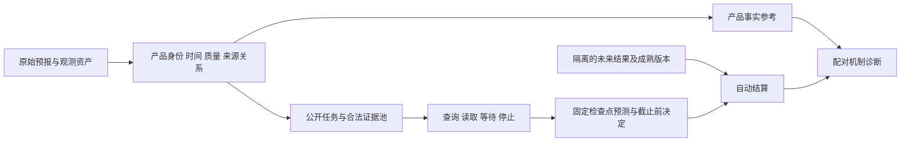

# DisasterTrace：研究主张、候选数据与整体计划（导师讨论稿）

日期：2026-09-12。状态：研究设计与数据候选建议，尚未冻结正式数据集或确认论文贡献。

本稿依据原始 `plan_v6_0911`，重点参考 [plan_2.md](../../publication/active_warning_review_20260912/user_plans/plan_2.md)、[ActiveWarning 实施规格](../../publication/active_warning_review_20260912/user_plans/DisasterTrace_ActiveWarning_Implementation_Plan_CN.md)、[Execution Plan](../../publication/active_warning_review_20260912/user_plans/DisasterTrace_Execution_Plan_CN.md) 和两份整体灾种蓝图。数据判断采用 2026-09-12 的实际样本记录；文献比较沿用 2026-09-11 已保存的定向论文与代码核查。

建议阅读顺序：先读第 1、2、5、10 节讨论研究方向；再用 [候选数据与处理明细](CANDIDATE_SELECTION_CN.md) 检查 16 类灾害的来源和目标；需要核查具体下载证据时再看 [97 项来源登记](../all_candidate_data_validation_20260912/CANDIDATE_REGISTRY_CN.md)。

## 1. 给导师的核心提案

拟研究的问题是：

> 在同一个未来极端天气目标、相同专业预报、合法信息和资源条件下，LLM/VLM 应该查询什么、何时等待或停止，才能在准备截止前提供可验证的增量判断？

暂定标题：**DisasterTrace: Deadline-Constrained Evidence Acquisition for Extreme-Weather Warning**。

这里的“预测”是对预先固定的未来变量或事件提交数值/概率，随后由观测或明确标注的事后产品结算。LLM/VLM 可以调用天气产品并解释证据；本项目并不以训练一个全球数值天气模型为目标。“预警价值”首先限定为公开准备情景下的误报、漏报、截止违约与成本，而非现实撤离效果或真实减灾金额。

建议请导师确认以下整体结构：

| 组成 | 推荐决定 | 科学目的 |
| --- | --- | --- |
| 主研究问题 | 保留限时主动取证与相对专业预报的增量价值 | 回答额外取证和推理何时值得 |
| 重点机制 | 来源依赖/重复表示，以及到达、感知、状态和决定的配对干预 | 解释收益或失败发生在哪些条件下 |
| 完整灾种范围 | 保留 H01—H16，逐类定义目标、输入、结果和缺口 | 保持整体 benchmark 的广度，同时如实报告各类完成度 |
| 第一批主实验候选 | 河流水文；地面站温度/降水；机场低能见度 | 先从这些组合中选出两条能完成历史链路和机制检验的任务族 |
| 工程与版本对照 | NHC + HURDAT2，后续考虑 IBTrACS 的跨盆地参考 | 复用已经跑通的固定未来目标与真实预报修订 |
| 多模态扩展 | SPC + 雷达/卫星 + 相应结果；洪水/野火影像库 | 检查原生视觉信息的作用，并补齐剩余灾种 |
| 实验方式 | 历史回放为主，有限前瞻采集为补充 | 立即开展研究，并单独检验真实到达和截止前提交 |

**本轮需要确定的是候选组合及其验证优先级。** 只有通过时间、变量、质量和结果配对的记录才进入正式任务。一个数据集可以只承担输入、结果、事件索引或感知诊断中的一种角色；无需要求每个来源独立承载全部 novelty。

## 2. 争取什么 novelty，怎样判断是否成立

### 2.1 三个可检验的研究假设

| 研究假设 | 比已有流程多回答什么 | 数据必须支持什么 | 关键实验 | 当前证据 |
| --- | --- | --- | --- | --- |
| N1：证据选择会影响截止前的预测增量 | 在最新专业预报之外，哪些获取策略值得其资源开销 | 同目标、多轮合法资料、内容/范围差异、专业基线、可结算未来结果 | 固定预测器和决定规则，只改变获取策略；画预算—质量和截止—质量曲线 | 小规模闭环能运行；已测主动策略没有增益 |
| N2：表示改善、同源重复与新增内容具有可区分的后果 | 多模态一致是否被误当成多份独立证据；版本整理是否改善校准或减少错误 | 产品谱系、版本、图/表/文的事实对应，以及另有来源的相关观测 | 同事实不同表示、精确副本、旧版本、相关新内容和等长度对照 | 已有旧版重送和规范化稳定性结果；通用谱系与真实新模态增量尚未验证 |
| N3：失败随信息到达和准备时限变化，且部分可被限定干预修复 | 区分资料来不及、没有查、没有理解、状态处理和决定规则的限制 | 到达/查询/提交日志、客观产品事实参考、固定未来目标和多个截止 | 合法全读、同资料事实规范化、状态干预、固定概率下的决定对照 | 已有日志和部分诊断能力；真实延迟与跨事件失效边界尚待建立 |

这些是待检验假设。论文可以发现正收益，也可以发现某些条件下主动系统只增加成本。若只是一个已知任务的接口迁移、几张新图片或单次模型失误，科学贡献仍然不足。

“截止前资料不足”的判断限定于登记资料池、访问合同和所核验的产品事实。给所有测试模型更多资料仍然失败，不能证明任何模型都无法预测该未来；这类边界需要在结论中保留。

### 2.2 与最近邻的具体关系

以下比较依据 [已保存的文献与代码核查](../v6_active_warning_review_20260911/RESEARCH_PLAN_CN.md)，并非本稿新完成的全面检索。投稿前需复查相关工作的最新版本。

| 最近邻 | 已有覆盖 | 本项目需要额外证明的差异 |
| --- | --- | --- |
| [ExtremeWeatherBench](https://arxiv.org/html/2605.01126v1)、[RealBench](https://arxiv.org/html/2605.24945v1) | 极端事件检验、业务输入、观测与提前量 | 上层获取策略在共同专业预报之外带来什么；加入边缘事件本身不作为创新 |
| [SIREN](https://arxiv.org/html/2607.24588v1)、[EarthVerse](https://arxiv.org/html/2608.23525v1) | 灾害工具流程、调查、来源与过程评估 | 固定未来结果、可核查的信息时序和截止前损失能否形成不同的测量对象 |
| [AFABench](https://arxiv.org/html/2508.14734v3)、[Bayesian Linguistic Forecaster](https://arxiv.org/html/2604.18576v4) | 预算获取、循环取证与概率更新；后者讨论信息价值停止 | 异步天气资料、专业预报基线、未来结算和截止约束下的实证发现 |
| [LEAP](https://arxiv.org/html/2609.01337v1) | 来源依赖、规范化与概率聚合 | 依赖处理如何与自然更新、视觉表示、预算和时限交互 |
| [Obshazard-bench](https://arxiv.org/html/2608.00012v1) | 原生地球观测、多灾种与生命周期任务 | 原生观测是否改变未来预测和取证策略，而非仅增加素材种类 |
| [Decide Now or Wait for the Next Forecast?](https://doi.org/10.1175/MWR-D-20-0392.1) | 预报更新与动态成本损失决策 | 选择哪份证据及其处理失败的影响；既有核查仅取得该文元数据/摘要 |

可争取的贡献表述是：**提供一组可复现的天气任务与控制实验，把信息选择、来源依赖和到达时限对未来判断的影响测量出来。** 不预先使用“首次提出主动获取”“首次多模态灾害 Agent”或“LLM 已超越专业预报”。

代码复用采用 [CODE_PINS.json](../v6_active_warning_review_20260911/CODE_PINS.json) 中的固定版本：EWB 的有效时间配对和天气评分组织、AFA 的策略/预算分离、LEAP 的依赖键与输入规范化。当前 LEAP 公共代码仍依赖外部概率 finalizer；自实现对照应标为 LEAP-style，不能写成已完整复现。MiniProphet 也未被确认是 BLF 官方实现。

## 3. 已经完成的工作对选题意味着什么

### 3.1 数据可获取性有明显进展

当前登记覆盖 **97 个来源/产品入口**，其中包含同源产品、别名和不同交付渠道。它们不是 97 个独立数据集。

| 样本状态 | 登记项数 | 解读 |
| --- | ---: | --- |
| 实际目标样本已解析 | 75 | 有科学数组、原生记录或对应标签等证据；仍需具体任务的 QC 和时空配对 |
| 目标内容不完整 | 3 | TCIR、UrbanSARFloods、SenForFlood 的关键配对内容尚不完整 |
| 仅事件/派生目录 | 6 | 可定位过程；不能直接当作像元结果或物理结果真值 |
| 尚无目标样本 | 8 | 有的只有网页、文件前缀或元数据；具体缺口保留 |
| 账号/许可流程未完成 | 4 | EM-DAT、xBD、HKO-7、ESWD |
| 仅渲染产品 | 1 | GWIS 有图像，数值预报及其语义未验证 |

统计来自 [CANDIDATE_REGISTRY.json](../all_candidate_data_validation_20260912/CANDIDATE_REGISTRY.json) 的 2026-09-12 09:07 UTC 快照。样本验证没有新增正式 benchmark 任务。

GEE 的 `disastertrace-gee` 项目现已完成认证并取得真实数值样本，见 [GEE 实测记录](../all_candidate_data_validation_20260912/gee_02/GEE_CHECK.json)。CAMS、GloFAS、EFAS、ERA5-Land、IMERG、SMAP 也已有实际科学数据；旧文档中的相应认证阻塞不能继续作为当前判断。GEE 是获取和处理渠道，不能增加独立数据源数，也不能证明某历史产品当时已经可用。

### 3.2 真实 LLM 最小闭环已经运行

既有 [最小闭环结果](../active_warning_miniloop_20260912/README_CN.md) 包括：

- 84 个固定未来目标：四个已暴露气旋过程的 80 个目标，以及一个平静河流片段的 4 个目标；78 个可结算，6 个未结算。
- 7,056 条程序轨迹，以及两轮各 200 条 Qwen3-8B 轨迹，共 1,120 次模型回复；两轮合计八个单 H100 任务，每轮最多四卡并行。
- 首轮 17 次目标编号错误完整保留；统一短编号复测的 400 次预测提交均合法。
- 已测试的主动策略全部选择官方预报，与固定查询预报的预测一致；没有观察到主动取证收益。
- 平静水文片段中，持久性基线 MAE 为 1.875 ft^3/s，所测 LLM 策略约为 13.745—15.374 ft^3/s；这提示必须认真比较简单基线。

这证明了真实数据、模型查询、未来目标提交与自动结算能够连接。它尚未证明概率校准、洪水越阈预警、原生视觉增量或泛化能力。连续检查点和多次模型调用不能扩充独立天气过程数。

现有前瞻水文采集另见 [shadow 试点协议](../hydro_shadow_pilot_20260912/README_CN.md)。它与历史回放分别报告；本稿不依赖其尚未整理的后续结果，也不重复启动既有进程。

## 4. 数据应按完整任务链选择

每条任务先固定以下合同，再决定需要下载哪些来源：

| 合同部分 | 需要固定的内容 |
| --- | --- |
| 对象 | 站点、机场、流域、栅格或多边形；父天气过程/事件组 |
| 未来目标 | 变量、单位、高度/垂直基准、空间支持、绝对窗口 `[T1,T2)` 或明确的离散采样集合 |
| 预报 | 机构/产品/版本、起报与有效时间、集合成员、站点或网格匹配规则 |
| 阈值 | 官方且时段适用的阈值，或只用开发历史期确定的统计阈值；两者分别命名 |
| 时间 | 共同检查点、准备截止 `D < T1`、资料发行/到达/完成/读取时间及其证据 |
| 资源 | 查询、字节、token、计算时间、并发与超时；标明实测和受控设置 |
| 结果 | 后续观测 O、事后分析/派生产品 P、报告 R 的身份与质量成熟政策 |
| 结算 | 缺测、区间覆盖、版本修订、无效输出和未提交的固定规则 |

三层结果分开：**E** 判断当时产品支持什么事实；**F** 评价未来数值/概率；**D** 评价共同准备情景下的决定。E 的精确参考或最小证书不会给出未来事件的唯一正确概率。

例如，“某站在指定未来 6 小时的最大水位是否越阈”是拟议任务。若观测只在离散时点提供，只能按明示采样集合或覆盖规则结算，不能把稀疏采样的最大值当作已知连续峰值。缺失时保持未结算，不补成无灾害。

### 4.1 候选进入主任务的条件

1. 真正取得并解析预定产品的样本，确认单位、缺测、质量和版本。
2. 同一对象、变量及支持范围有可用预报、此前证据和未来结果。
3. 存在多轮可访问资料及可解释的不同选择；来源关系可追溯。
4. 可明确标注历史可用性属于已验证、受控回放还是本系统前瞻首次见到。
5. 能构造普通、近阈值和极端窗口，并以父过程/时空块处理相关性。
6. 使用、衍生处理、可公开资产和引用要求有明确依据。

前两条足以开始静态或数值管线试点；只有进一步完成相关条件，才适合承担 N1—N3 的对应实验。正向收益不作为挑选测试样例的条件，所有准入失败和负结果都保留。

## 5. 推荐的候选数据组合

完整 H01—H16 目标、数据来源和处理规则见 [候选数据明细](CANDIDATE_SELECTION_CN.md)。这里列出论文实验组织。

| 任务族 | 优先候选组合 | 推荐位置 | 主要未决条件 |
| --- | --- | --- | --- |
| 河流洪水 H08 | NWPS 水位 + USGS 同站水位；或 HEFS 流量 + USGS 同站流量；MRMS/IMERG、上游站和流域属性为附加证据 | 有条件的旗舰；最贴近主动预警问题 | 多事件历史业务预报版本、有效阈值、资料增量；水位/流量必须分开 |
| 温度与降水 H10/H11/H07 | GFS/GEFS，区域可加 HRRR；GHCNh/GHCN-Daily；EWB/ExEBench 辅助定位事件 | 稳健的迁移/备选主线 | 同窗归档、站点/网格、累积时长、QC；两个 GEFS 样本成员不足以形成正式集合概率 |
| 机场低能见度 H15 | TAF + METAR/SPECI/IEM；GFS/HRRR 与合格 GOES 为附加证据 | 第三个优先核查的主线候选；适合短时更新 | 历史 TAF 版本、同机场时窗、TEMPO/PROB/FM 语义、能见度界值；低能见度与雾分开 |
| 气旋 H01 | NHC 预报修订 + HURDAT2；IBTrACS 为跨盆地事后参考候选 | 已运行的工程对照和版本机制对照 | 新的独立过程、自然可用性；结果是事后分析，不能写成独立传感器 Gold |
| 对流 H03—H06 | SPC、NEXRAD、GOES ABI/GLM、MRMS；Storm Events 与 TorNet/SEVIR 作相应参考 | 原生多模态与短时限扩展 | 同母风暴、概率空间支持、报告漏报、雷电预报缺口及 MESH/QPE 产品语义 |
| 海岸、冬季、旱尘火 H09/H12/H13/H14/H16，及大风 H02 | 复用共同预报/站点层，增加 CO-OPS、SMAP/USDM、CAMS、FIRMS 等 | 按逐类合同补齐 16 类；成熟类别可提前进入 | 基准/成因/持续性/质量与时间尺度各不相同，详见明细 |

**建议的选择规则：** 先对水文、站点温度/降水、TAF/METAR 三组做等规格链路试点，再据完整过程数、可用时间证据及机制实验条件确定首批两组。水文若缺历史版本或合适附加信息，就保留为受控/前瞻扩展，由通过条件的站点任务承担首轮主实验；不等待未来天气来决定是否能开始研究。

NHC 用于联调和真实修订对照，不以已暴露四个气旋来替代新事件测试。其他类别继续保留具体目标及准入工作，正式发布时逐类显示完成的 E/F/D 轨道与数量。

### 5.1 已有 benchmark 的角色

- EWB、ExEBench：借用事件定义、观测组织和天气评价思路；合并上游身份并处理已暴露样本。
- SEVIR、TorNet：雷达/雷电时序与继承标签；先检查是否处于预测截止前。检测时刻输入不能自动成为灾前预测输入。
- GEOID-Flood、KuroSiwo、WorldFloods、SpaceNet8、Sen1Floods11：空间事实、分割参考及表示诊断；取得灾后影像不等于具备洪水预警数据。
- WildfireSpreadTS、Next Day Wildfire Spread、TS-SatFire：优先核查下一时刻火活动/范围目标；像元、火场和传感器缺测分别处理。
- WeatherQA、CyPortQA：图文配对和预报材料理解；其答案与预报讨论不充当未来独立结果。
- DAWN：当前先作天气视觉条件辅助材料；不承担没有可靠时间地点的未来预警任务。

## 6. 数据处理与评测环境的整体架构

处理顺序：

1. **原始资产层。** 保存来源、产品/版本、请求回执、响应字节和哈希；失败、缺测与修订也保留。GEE 导出需绑定 collection、image、band、投影、尺度、裁剪和 QA 配置。
2. **规范记录层。** 统一时间格式及单位，保留原值/原单位；分别处理气温高度、降水累计、潮位基准、雷达质量、云掩膜、站报删失和卫星缺测。
3. **来源关系层。** 区分产品、表示和交付事件，记录 `identity_duplicate`、`lossless_reexpression`、`derived_from`、`uses_observation`、`shared_provider`、`dependency_unknown`。不同机构不保证独立，同机构也不一律合并。
4. **目标与分组层。** 先按父天气过程、流域/地区、季节和重叠时窗切分，再生成阈值/预算/表示变体；同一场风暴造成的风、洪水和风暴潮不能泄漏到不同切分。
5. **公开运行层。** 只暴露当时合法目录和已经取得的内容；未来可用性、未读质量和结果不能通过候选列表、工具或文件名暗示给模型。固定机会下记录原始输出与失败。
6. **私有结算层。** 独立存放 O/P/R 参考、质量、修订和阈值；程序化核验并复算数值。无需新增逐题人工标注或 LLM judge，仍须明确继承专家标签的来源。

### 6.1 三种时间条件分别报告

| 条件 | 数据使用方式 | 可以支持的结论 |
| --- | --- | --- |
| `archive_controlled` | 真实历史内容 + 明示的受控释放/服务时间 | 在这些访问条件下的可重复机制实验 |
| `verified_historical` | 有足够当时版本及可用时间凭据的历史资料 | 对所验证业务信息条件的历史回放 |
| `prospective_first_seen` | 预先登记并记录本系统首次获取、截止前提交和后续结算 | 本系统真实网络/版本/时间条件下的运行表现 |

历史窗口中的“未来”是相对于预测截止的未来，实际结果今天可以已经存在并被隔离。因此主研究可以立即开展。今天下载一份旧日期文件、GEE `system:time_start` 或普通 `Last-Modified` 都不自动证明历史公开时间；`first_seen` 也只是本系统首次观察到的上界。

### 6.2 复用现有代码，补齐研究缺口

当前 [active_forecast](../../disastertrace-starter/src/disastertrace/active_forecast/) 提供产品事实与证书；[active_warning_v1](../../disastertrace-starter/src/disastertrace/active_warning_v1/) 已有查询、提交、点预测与结算闭环；[hydro_shadow_v1](../../disastertrace-starter/src/disastertrace/hydro_shadow_v1/) 已实现有限前瞻采集；多模态旧版本提供表示/交付诊断。

后续新增工作是多来源身份、更多任务适配、成熟概率基线、可比较的准备决定、真实时序和成对诊断。现有试点只有预置获取机会，尚不能当作自主 WAIT/STOP 和行动时机实验。新协议使用独立版本，保留已完成实验和原始失败。

## 7. 如何先验证研究价值

### 7.1 先做不依赖复杂 Agent 的资料检验

对通过配对的开发过程，比较最新专业预报、持久性/气候态、开发期固定的简单校准，以及加入候选观测的简单融合。检查附加资料的相关时间、范围、覆盖和取得代价。

某个简单方法能利用附加资料，说明值得测试获取策略；所有已测方法无收益时，保留该结果并检查任务/质量/覆盖，不能据此证明信息论上的无价值。若资料很少且并行全读便宜，全读是应当保留的强基线，不人为增加读取延迟来制造主动选择优势。

### 7.2 两种获取问题分开

**主比较建议采用共同专业预报更新。** 在每个共同检查点，按预先登记的相同可用性和交付规则向所有方法提供最新合法专业预报，额外预算用于其他证据。这样直接测试“在专业预报之外的增量”。这属于新协议建议，既有最小闭环未采用这个完整设计。

另设端到端比较，把获取专业预报本身也计入预算，研究查新版预报、查观测或等待之间的权衡。两种问题分别报告，避免把“取到了更新预报”的收益写成“改善了更新后的预报”。

预测器、融合接口、目标、初始信息、预算和决定规则在主获取对照中固定；表示处理和后端模型变化另做实验。

| 基线/对照 | 目的 |
| --- | --- |
| 最新合法专业预报 + 固定决定规则 | 测量增量必须超越的直接基准 |
| 持久性、气候态、简单校准/融合 | 检查额外推理是否优于廉价统计方法 |
| 固定轮询、最近优先、覆盖/贪心获取 | 检查复杂主动选择的必要性 |
| 固定 LLM/VLM 的主动获取；后续加入概率取证基线 | 隔离策略与预测器，并对照最接近方法 |
| 同预算可行的并行全读 | 检查是否存在真实访问瓶颈 |
| 更多预算或特权事实的全信息诊断 | 观察限制位置；与同资源主比较分表 |

### 7.3 配对机制实验

| 对照 | 保持不变 | 改变内容 | 可解释范围 |
| --- | --- | --- | --- |
| 同产品图/表/文 | 同一合法事实、目标与窗口 | 呈现方式 | 表示/感知效果；图像可能帮助理解原有信息 |
| 精确副本与同源转述 | 规范事实及相应曝光/长度控制 | 重复次数、来源标识 | 是否出现没有预测收益的确信膨胀 |
| 相关新观测 | 专业预报、预测器与预算框架 | 可合法取得的新增内容 | 该内容在这些条件下的实际增量，独立性另核 |
| 旧版重送与错域资料 | 当前目标及合法版本语义 | 到达顺序、时空作用域 | 状态回退或范围匹配问题 |
| 已读事实规范化/状态修复 | 同一已读前缀、后续资料与策略设置 | 可明确支持的产品事实或状态 | 相应干预下的恢复；不强行解释内部认知机制 |
| 自然到达与受控延迟 | 产品内容、目标与合同 | 到达时刻和准备截止 | 截止敏感性；两种延迟分表 |

概率在重复表示后发生变化不自动判错，必须结合事实理解、proper score 和校准看后果。规范事实如果使用了图外信息或未来结果，应标为特权诊断，不能解释成单纯“修复读图”。多个修复效果可能交互，不把它们相加成总误差的 100%。

## 8. 评分、抽样与统计

主要评分采用成熟方法，避免用新造总分承担 novelty：

- 二元结果用 Brier score，连续数值用相应单位的 MAE；提供合格分布时考虑 CRPS。按固定检查点和提前量评价。
- 报告相对最新专业基线的配对差，例如 `Delta_BS = BS_base - BS_policy`，正值代表改善；概率从确定性预报转换的方法在开发期固定。
- 在预登记成本—损失情景下报告准备损失，另列查询、token、时长和截止违约；不任意相加不同单位的分数。
- 按事件/时空块统计区间，按灾种、地区、极端程度、信息覆盖和时限分层；多个种子不算更多天气过程。
- 保留所有预登记机会，分别报告数据缺测、未结算、模型无效、超时和回退。缺少灾害报告不自动作为物理无灾害的负例。

最简准备情景可用 `J = C*a + L*y*(1-a)`，只允许截止前的准备生效；其阈值、成本比例和完全避免情景内漏报罚分的假设必须公开。若等待免费且截止前的准备效果相同，等到截止才行动是必要基线。研究更早行动的价值，需要另行定义准备时长、成本或效果函数。

数据分为两类队列：自然固定监测窗口用于相应发生率下的误报/校准；额外富集的极端和近阈值窗口用于机制诊断。未掌握抽样概率时，不把富集集的分数直接解释为总体业务价值。

训练污染控制以事件/来源身份去重、已暴露登记、时空切分及有限前瞻为依据；无法证明 LLM 未预训练见过所有历史事件。正式确认集在策略和阈值冻结后使用，不能按模型错误反向筛题。

## 9. 无硬截止日期下的整体实施节奏

阶段按完成条件推进，周数用于安排工作，不作为数据或显著性的保证。已有最小闭环直接复用。

| 阶段 | 建议节奏 | 交付内容 | 决定是否进入下一阶段 |
| --- | --- | --- | --- |
| A：导师讨论与设计收口 | 当前 | 本稿、16 类候选表、近邻差异和关键未知 | 确定主问题、首批任务组合、历史条件和贡献边界 |
| B：成组数据链试点 | 讨论后约第 1—2 周 | 三组优先候选各选约 3—5 个独立开发过程，补普通/近阈值/缺测；生成任务合同与准入报告 | 至少两组完成相应未来目标、资料与结果配对；这是工程规模，非统计充分性 |
| C：强基线与信息增量 | 约第 3—4 周 | 程序基线、简单融合、真实版本/内容差异、查询成本与覆盖报告 | 判断首批主线和资料选择需求；保留无收益或全读占优的条件 |
| D：LLM/VLM 与机制试点 | 约第 5—7 周 | 固定后端和有限策略，先 N1，再 N2/N3；通常先扩到每任务族约 20—40 个开发过程评估方差 | 协议稳定、结果可复算、样本结构和资源代价可解释 |
| E：确认性跨事件评测 | 约第 8—10 周 | 依据试点做事件级规模估计，冻结新事件/地区和主要对比；执行强基线与模型比较 | 报告效应及区间、负结果和覆盖，不以显著性作为删改样本依据 |
| F：完整数据说明与论文 | 约第 11—12 周及以后 | 按合同扩展 16 类，补有限前瞻；发布许可合格资产/下载配方、协议和研究结论 | 逐类公开 E/F/D 完成情况；缺口继续明确列出 |

对流、野火和干旱等模块可在公共数据层稳定后并行准备，但是否进入首篇论文主实验取决于准入证据和导师选择。若讨论后目标是“首个版本必须 16 类全部完成未来预警”，应把它作为更大的交付范围单独估算；当前数据尚不能承诺该完成时间。

模型阶段可使用已授权的最多四张 H100 并行执行不同事件/条件/模型，固定配置并记录共享资源争用。数据配对、质量解释和未来标签成熟通常不是 GPU 瓶颈；当前讨论稿准备无需追加模型调用。

## 10. 希望导师 double check 的问题

| 希望确认的问题 | 当前建议 | 改变决定的影响 |
| --- | --- | --- |
| 论文最重要的贡献是什么？ | 主动取证是否有专业预报之外的价值，来源依赖和时限作为机制 | 决定主实验和论文叙事，而非继续扩充 QA 类型 |
| 第一批主实验选哪些任务族？ | 有条件优先水文，站点温度/降水与 TAF/METAR 中选合格迁移任务；NHC 作对照 | 水文历史链不足时可切换主线，避免研究被滚动归档卡住 |
| 16 类广度在首篇中的要求是什么？ | 完整定义 16 类，以 2—3 类深入检验机制，其余按准入程度提供扩展结果 | 若要求 16 类同等深度，需显著增加数据适配和确认性样本 |
| 历史可用时间的证据标准？ | 三种时间条件分轨，主研究允许明确标注的受控回放 | 更严格的历史业务要求会缩小可用来源/事件范围 |
| 是否接受 NHC/USDM 等事后分析参考？ | 可以用于标明 P 的特定任务；站点 O、产品 P、报告 R 分开解释 | 决定哪些灾种能够立即形成可结算任务 |
| 若主动策略没有收益，什么发现足够有价值？ | 可复现的适用边界、来源依赖/时限造成的系统性失效及有效修复 | 若没有区别于近邻的稳定发现，应进一步收窄问题而非夸大 novelty |

导师对科学问题、变量和取舍的审核与逐题人工 Gold 复核是不同工作。本计划继续遵守不新增逐题人工标注、不用 LLM judge 作为主要事实与评分依据的约束。

## 11. 建议随稿提交的材料

1. 本文：研究问题、候选组合、实验设计和整体节奏。
2. [CANDIDATE_SELECTION_CN.md](CANDIDATE_SELECTION_CN.md)：16 类灾害各自的候选来源、结果、处理和数据缺口。
3. [数据实测说明](../all_candidate_data_validation_20260912/README_CN.md) 与 [逐来源登记](../all_candidate_data_validation_20260912/CANDIDATE_REGISTRY_CN.md)：区分访问成功、目标样本和任务准入。
4. [真实模型试点报告](../active_warning_miniloop_20260912/README_CN.md)：包含未观察到主动收益的实际结果。
5. [文献/代码核查](../v6_active_warning_review_20260911/RESEARCH_PLAN_CN.md) 和 [原始计划副本](../../publication/active_warning_review_20260912/user_plans/)：检查本稿是否忠实于原始 idea，以及差异是否足够。

讨论稿及其引用证据的文件校验与统计核对记录保存于同目录的 `REVIEW_VALIDATION_02.json`。该核验只检查文档、登记和样本绑定的一致性，不会把研究假设升级成已证明的贡献。初次核验也保留；最新记录绑定最终文档与脚本。
