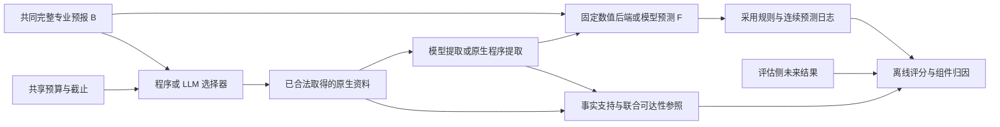

# DisasterTrace：v10 执行后的整体路线与下一阶段

本文件基于 `plan_v10_0914` 的六份复查包、独立实施审查和本轮真实代码执行。
开始时间为 2026-09-14 15:56 UTC，自治窗口截止 2026-09-15 01:56 UTC。
动态完成状态以 `CANONICAL_STATUS.json` 为准，最终数值以本目录最终结果报告为准。
这里的 v10 是执行版本；研究主线仍是 v7 固定的 C1/C2/C3。

## 1. 要回答的研究问题

- **C1：资源受限时，取证与修订何时值得？** 各方法获得相同的完整专业预报；额外资料、
  选择器、预测器与等待消耗明确记录。比较固定分额/全局预算、目标私有/会话共享，
  再在相同全局共享条件下比较强程序策略与 LLM。
- **C2：已知什么，与还能预测好多少，如何区分？** 当前事实的支持集合、逐槽提取、
  逻辑归约与未来概率分别评价。预算下可判定目标的上界来自同一合法会话路径，
  不把不同目标各自最优路径拼接成不可实现的联合参照。
- **C3：可复现的多灾种任务体系。** 每个灾种分别标记数据可获取、可解析、目标可结算、
  同目标基线、合法补证、模型闭环和可搬迁重建的资格；目录规模不作为创新性证据。

论文最有价值的结论可以是明确的失败边界：何种证据错误影响未来预测、何时专业流程更好、
以及哪些调度收益在排除批处理和基线复制后仍然存在。当前不能声称 LLM 普遍提高预报精度。

未来结果只进入离线评分。完整专业预报对所有方法共同提供；已取得资料的预测作用、
提取作用和获取顺序的作用通过不同对照分别检验。

本轮 H15 的 FOLLOW 是完整原生 TAF 经冻结规则和概率银行得到的研究基线，
不是 TAF 直接发布的同目标原生概率。共同专业产品、其研究概率映射及真正同目标原生概率
产品应分别标注；后者如 LAMP 仍须通过窗口、阈值和时间资格审查。

## 2. 本轮实际推进到哪里

| 工作面 | 已执行内容 | 仍需限定的范围 |
|---|---|---|
| N1 正式测量 | 不可变逐调用 API 预留、严格重复键拒绝、正式入口、来源结果政策、事件先后、原目录恢复 | 单会话串行 pending；不是通用分布式事务或 Python 安全沙箱 |
| N3 E/F 接口 | 原 E02 程序汇总、同失败掩膜 F 对照、原生站报三类数值后端、独立数值重算 | 原布尔归约修复不一定改变只消费槽位计数的 F |
| N4 强对照 | 两种修订协议、多截止、COPY/KEEP/采用规则、固定预测日程下的分配共享因子 | 当前为已暴露开发数据，不是独立确认 |
| N4 模型分解 | 27B 与 235B 同题事实提取和温度 F；235B 单独作为取证选择器的新实验 | 固定输入模型、主动会话模型分别报告；API 未调用不能作为模型分数 |
| N2 新开发日历 | 预选 2025 年 3/6/9/12 月完整周，纽约/芝加哥/丹佛共 12 区域周 | 四个全局日历块，尚非经外部标准确认的独立天气过程 |
| N5 温度 | 24 个月集合/站点轨迹复核；2017 拟合、2018 开发的 EMOS/ECC 强概率对照 | 无合法补证时只做 F-only；不声称温度 C1 已验证 |
| 交付 | 旧真实运行的小型完整日志包已在独立 CPU 节点搬迁重建 | 阅读包、抽样重建包、全量本机档案分清范围 |

四季数据的补采、数值评估和选择器会话的最终状态，应查看最后的运行总结，不能用“已准备”
替代“已完成”。本轮保留 Bay 2025-02-17 至 23 确认周，不读取其载荷。

## 3. 数据方案保持总体覆盖，按任务资格推进

16 类灾害仍为：热带气旋、温带/非对流大风、雷暴大风、龙卷风、冰雹、强雷电、
极端降水、河流洪水/山洪/城市内涝、风暴潮/沿岸淹没、热浪、寒潮/霜冻、暴雪/冰冻降水、
干旱/闪旱、沙尘、浓雾/低能见度、天气相关野火/火险。

本轮直接研究的是 **H15 原生低能见度站报**，以及 **H10/H11 温度事件**。
5 km 低能见度可能由降水、降雪、薄雾等导致，不自动等于浓雾，更不能据此新增灾种计数。
其他灾种沿用既有数据准入清单；本轮没有重新下载并验证全部 16 类候选来源。

| 优先层 | 数据及处理 | 进入正式机制实验的条件 |
|---|---|---|
| 当前主链 H15 | IEM 归档的完整原生 TAF、常规 METAR；保存原文、来源行、版本、窗口、删失和缺测 | 完整来源合同、同信息强数值后端、足够的正/负天气过程、完整分母 |
| 第二主链 H10/H11 | EUPPBench 集合与 DWD 日极值；UTC 完整日、同成员三日事件、2017/2018 严格分期 | 强后处理复核；补证需另证截止前可用，未来日结果只能评估侧使用 |
| 下一物理准入 H07/H08 | 既有 MRMS/降水与 HEFS/水文候选；对齐变量、单位、累积窗、站点/流域与起报版本 | 数值物理含义双解码、同目标基线、可结算结果和合法证据链同时成立 |
| 后续灾种与 MM | 沿用 NHC/IBTrACS、SPC、GLM、GFS/GEFS/HRRR、CAMS、USDM、GWIS 等既有候选体系 | 每来源继续按 A0—A5 及 E/F/D/MM 分项放行；影像 Gold 不混入可见事实 |

“归档资料现在能下载”不证明其历史首次公开时间。本轮时延按已声明的归档情景使用；
获得前瞻 first-seen 记录后，才另行建立真正的在线时间资格。

## 4. 根据结果需要修改的部分

### 4.1 从单一总分改为组件归因

主表至少包含：专业共同信息的 FOLLOW、相同信息的程序后端、模型预测、
模型逐槽提取加程序后端，以及固定后端下的程序/模型选择器。
全体注册机会、结果缺失、调用失败、超时回退、额外资料开销必须一起出现。

不能把程序原生解码当成模型提取成功，不能把未调用 API 的基线回退当成该 API 模型成绩，
也不能把“产生不同的小数”当成增加天气信息。完全相同与数值容差相同分别记录。

### 4.2 明确报告标签与物理测量的差别

本轮 METAR 任务明确使用主报文、忽略 remarks/trends；标签合同下无不等号的数值采用
单点支持，而 `P`/`M` 等保留删失及端点。模型将 `10SM` 改写为物理传感器下界，或者用
remarks 中更精细的温度替代主报文温度，均不满足本轮合同，原分数照常保留。

本轮已另行注册并完成 `clarified_feature_trial_01`：对全部 84 个原站报提取任务统一追加例子，
在原 235B 模型、原数值后端和相同输出上限下重测。普通日历的 72 个任务共 144 个槽位，
能见度正确数从 25 提升到 140，温度从 49 提升到 141，露点从 59 提升到 142。
但普通 5 km 的流水线 Brier 从 0.070288 变为 0.070545，未改善，也仍差于 FOLLOW 的 0.065545。
这说明合同理解是当前提取错误的重要来源，而提取变准不保证固定概率后端改善。

另 12 个按结果选择的诊断任务单独报告；全部 84 个任务有 2 个格式无效回答，保留在分母中。
该轮是看过原错误后的开发诊断，不能视为独立验证，也不替换原始成绩。
下一批将清楚的主报文与支持语义直接冻结在初始合同和提示中，再在未暴露资料上检验。

### 4.3 充分性、概率后端与季节迁移分开

`E` 更容易判定，不保证 `F` 更准。旧后端只用读槽计数时，改变最终布尔答案可能完全不改变 F。
新后端显式使用能见度区间、温度、露点差、时效和完整 TAF 特征，另设 common/mask-age/value
对照，从而检验数值内容的作用。

冬季拟合的季节特征不具备全年外推保证。四季开发数据先用于揭示迁移缺陷与数据质量，
不用于反向挑选一个最有利的后处理银行。后续拟合应扩到过去完整年或多个完整季节，
再冻结新的独立开发/确认分期。

四季完整资料现已全部下载、解析并评估：每个阈值 6,048 个注册机会，6,008 个可结算，
1 km / 5 km 分别有 29 / 307 个正例。原冬季银行在非冬季的年周期特征明显超出拟合范围。
因此本轮另行登记了一次**看过开发结果后的特征消融**：只去掉 `year_sin/year_cos`，
仍用原 2024 年 12 月拟合和校准 ID，季节数据的标签不进入优化器。原银行和原分数保留。

该消融在 5 km 下的原始概率 Brier 为：共同基线 FOLLOW 0.04313、
只用共同信息的 common 银行 0.03645、values 银行不补证 0.03883、
values 银行读全注册补证 0.03322。它同时显示“后端改变”与“信息增加”的作用，
不能把 0.04313 到 0.03322 的全部差值归于主动获取或 LLM。
1 km 下读全补证为 0.004738，共同信息 common 为 0.004667，补证并未统一占优。
这些数值和共同缺失掩膜已独立复算，仍只是四个日历块上的开发结果。

为连接离线信息价值与预算内实际可达性，`seasonal_controls_01` 固定选取全部 12 个区域周的
首个 UTC 截止日、两个阈值、九种程序策略，共 216 条会话；不按当日正例筛选。
每会话保留 48 次来源查询预算、相同预测日程、四格分配/共享与强批量基线。
全部 216 条会话和完整日志审计已通过：每阈值 864 个注册机会，861 个可结算，
1 km 没有正例，5 km 有 16 个正例。5 km FOLLOW / values 不补证 / coverage / batch
分别为 0.009835 / 0.011709 / 0.009626 / 0.009752。

这个平均值仍不能说明恶劣天气改善：16 个正例全部落在 12 月首日块，coverage 在该块
相对 FOLLOW 的平均增益是 -0.010882，也差于 batch；其余三个无正例日期块的收益抵消了损失。
全部日期与失败分母保留，按日期的配对增益及缺失结果界另已复算。
因此必须区分后端、补证及过程差异，不能用“读全补证”或总体平均的成绩代替严重天气能力。

### 4.4 统一六份复查对模型启动的不同建议

部分复查建议在程序补证产生稳定增益后再加入模型；另一个 `CODEX_NEXT_PLAN_CN.md`
明确允许“没有合格补证时先保留无补证 F 模型评价，C1 未验证，不创造收费动作”。
本轮采用后一条用于温度 F-only 可行性检查；取证选择器实验属于有限、已暴露开发诊断。
这两类结果都不能替代有合法补证、跨过程复现的 C1 确认证据。

## 5. 下一阶段的执行顺序与退出标准

可执行工作包、数据分期、模型资源和逐项交付物见 [下一阶段计划](NEXT_PHASE_PLAN_CN.md)。

1. **冻结本轮收尾清单。** 已注册模型、12 区域周和会话审计均已完成；最终清单继续保留
   完成、失败和未尝试状态，按实际资源终态发布，不重复原 launcher。
2. **冻结论文候选测量合同。** 固定 E 支持语义、原生主报文/remarks 规则、可见范围、
   同预算与同预测日程、两种修订协议、提供方结果版本、缺测界及独立过程分组方式。
3. **补足跨季节强基线。** 拟合与校准各自覆盖预测之前的完整季节/年份，保留当前冬季银行、去季节特征
   的开发消融及所有负结果。先比较 f(B) 与 f(B,E)，再比较固定后端下的程序/模型取证。
   同时检验原始概率、EMOS/ECC、简单门控和强批量共享策略；参数选择只在合法开发分期进行。
4. **完成小规模真实机制实验。** 固定信息比较提取/预测；固定后端比较调度；保留弱正例支持的
   1 km、较多正例的 5 km 与按结果选定的诊断分表。围绕预注册自然天气过程做配对分析。
   四季首日控制属于当前开发扩展；后续必须预先指定完整日历或外部过程标准，不能在看过
   216 条会话结果后挑选有利区域、阈值、策略或银行充当确认结论。
5. **再放行独立确认。** 首先冻结拟合 ID、完整来源依赖、模型和提示、终止规则及全部指标，
   核验保留资料未暴露与统计支持后执行一次完整确认；不根据确认结果返调方案。
6. **扩展第二、第三灾害主链。** 温度先补合法近期观测证据；MRMS/HEFS 先过物理准入。
   D 行动、原生 MM、联合目标、前瞻 online shadow 分别拥有自己的准入与失败条件。

建议节奏仍以门槛为准：先完成一轮可复核机制报告，再用约一至两周补齐跨季节基线和自然
过程样本；独立确认合格后并行扩展灾种。没有硬截止日，不应为赶齐 16 类而降低目标合同。

## 6. 交付与复查方式

最终交付应包含：当前代码与测试、逐批注册和真实回答计数、强对照与组件归因、数据来源
及处理合同、成功与失败日志、预算未决项、完整小型重建包、整体计划与下一阶段出口。
GitHub 保持原私有仓库和分支，使用独立 Git 数据库构造提交，保留开发 worktree 的 HEAD
和已有索引；凭据、模型权重和受限的大体积原始资料不进入代码仓库。

“验证器通过”只说明相应合同与算术重建通过；“模型优于专业预报”“覆盖全部灾种”以及
“novelty 已被证明”都需要额外的实际研究证据，不能由工程完成标记推出。
