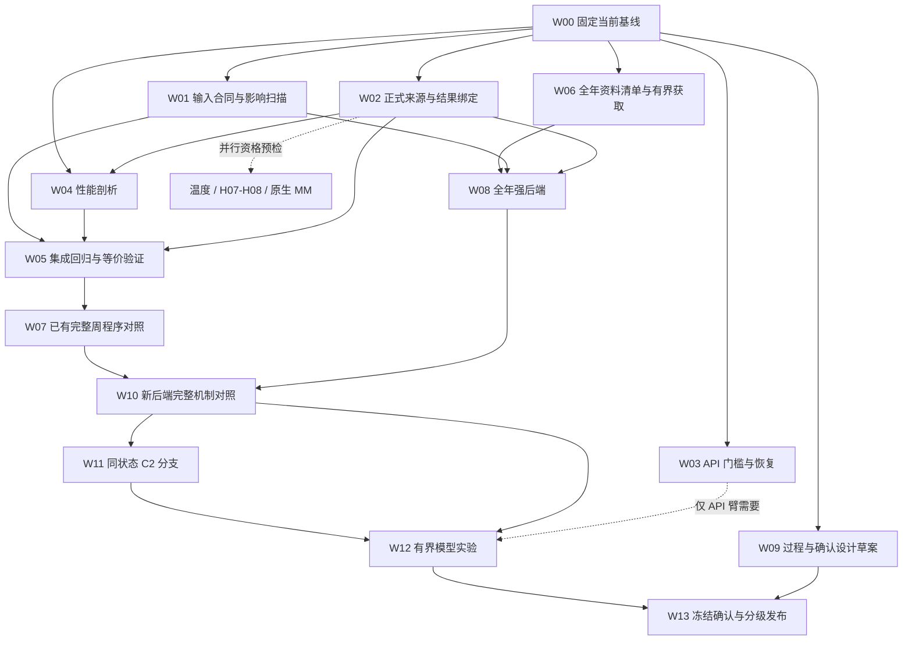

# DisasterTrace：七份 v11 材料整合后的整体路线

日期：2026-09-15。状态：**供用户审阅的实施方案，尚未启动下一批科学实验。**

本文中的 v11 是计划批次，研究方向继续使用 C1/C2/C3、E/F/D/MM 和六组 16 类灾害。
已完成的运行以 v10 `FINAL_RESULT.json` 为准；本文的工作量、时间和新接口均为建议，不能计入完成量。
七份材料的逐项取舍见 [复查整合](REVIEW_SYNTHESIS_CN.md)，第一批操作见
[首批执行方案](NEXT_BATCH_EXECUTION_CN.md)。执行者通常只需先读 [短入口](START_HERE.md)。

## 1. 建议固定的研究问题

**在相同专业资料、可核查的时间限制和共享资源下，额外资料能改善多少未来预测；
程序或 LLM 能取得并利用多少这种价值，失败发生在哪个环节？**

这需要同时区分四件事：共同资料的概率后处理、补充资料本身、取得和处理资料的策略、
以及预测能否及时生效。不能只用相对旧 FOLLOW 的一个差值概括它们。

| 贡献 | 本阶段要交付的可检验内容 | 目前不能作出的主张 |
|---|---|---|
| C1 信息获取与修订 | 固定后端、完整日历、同预算和日程下的程序/LLM 对照，含强批量、共享和时延分析 | LLM 已稳定优于专业流程；同查询数就是同总成本 |
| C2 证据与未来预测的分离 | 真实支持/版本/覆盖任务，同状态分支，提取、归约、后端和采用的配对诊断 | E 充分保证 F 好；有限 E 可达参照就是未来预测上界 |
| C3 多灾种可复现体系 | 至少两种物理过程的合格任务、逐来源准入、范围明确的复算和确认 | 来源多、模型大或 16 类目录齐全就证明 novelty |

模型没有净收益也可以产生论文结果，前提是任务有真实信息竞争、强对照、足够过程支持，
结论能在未参与方法选择的数据上复现。代码正确、任务有区分度、模型获胜是不同出口。
保留无逐题人工 Gold、无 LLM judge 的原则：程序使用明确的原生产品、已有标注或测量合同评分；
不确定的来源或时间资格标记缺失/情景/未准入，不让模型补造标签。

## 2. 当前起点：有些建设已经完成

公开到私有 GitHub 分支的版本为 `1fd6821fef15b26898a57c74d4715714f33ea779`。
开发工作树 HEAD 仍为 `36082c42a93e11f67d274d8000c87cd1dc098d74`，此前采用隔离发布，
因此两个值不同不代表代码被回退。原索引和历史改动保留。

本次核对七份材料中的 **31 份源码副本，对应 13 个当前模块，全部字节一致**。
另直接检查正式评分、结果政策及训练/会话脚本。13 个当前模块离线探针复现了输入和发送门槛边界；
没有重跑 720 项全套测试、扫描全部天气数据、重新调用模型或打开确认数据。
绑定证据见 `REVIEW_BASELINE.json` 与 `checks/CURRENT_BOUNDARY_PROBES.json`。

| 已有资产 | 现有资格 | 新工作的边界 |
|---|---|---|
| FormalSession、measurement.v3、不可变 API 预留、串行恢复 | 已实现和运行 | 加强正式成绩来源绑定、发送门槛及不完整 claim 恢复，不重建引擎 |
| common / mask_age / values，三类 softmax、PAV/CDF | 已实现并核算 | 全年适用性；当前训练已包含空证据和合法子集，不能写成完全没有缺证训练 |
| 四季 TAF/METAR，12 区域周、12,096 机会 | 已下载、解析和开发评测 | 四个全局日历块，完整周预算对照尚未完成 |
| 首日 216 程序轨迹、235B 的 288 次选择 | 已运行和审计 | 不能将首日和全周分母混用；原选择器仍配原冬季后端 |
| 2,812 条 benchmark 回答 | 多种模型和角色已实际执行 | 424 个 API 任务未尝试，不能列入模型答错；无需再做模型规模扫描 |
| 温度 24 月、EMOS/ECC、27B/235B | F-only 已运行 | 严格历史补证合格天数仍为 0；不能通过固定延迟制造可得性 |
| 818 / 1,162 成员两个复算包 | v10 已在其他 CPU 节点重建 | 后续用于有改动的回归，不每次规划都重新打包或全重跑 |

## 3. 先补的工程边界

以下优先级表示在哪条新路径启用前应完成，不表示所有历史成绩已错。

| 项目 | 当前证据 | 最小处理 | 何时需要 |
|---|---|---|---|
| 温度准入分叉 | 当前函数实测接受非午夜日窗、重复日期、NaN/布尔等，另一入口拒绝 | 共用输入校验，保留独立成员概率核算；扫描原 128 题及相关 POLICY | 新温度任务前 |
| 模型数值响应边界 | `[+inf,+inf]` 能见度被接受；401 位整数概率抛 OverflowError | lower 有限非负；upper 可无界；数值先做安全类型/区间判断，统一 invalid | 新提取/概率任务前 |
| claim 后 STOP/超时 | 本地假运输层复现仍进入发送步骤 | 明确最后发送许可点，再检 STOP/截止/合同；已发请求仍保留费用未知 | 新 API 任务前 |
| 正式评分来源闭合 | `score_formal` 验 journal 字段，未读取对应正式目录合同/终态；静态确认 | 正式运行引用、输入角色 manifest、完整绑定；兼容旧日志复算 | 新正式成绩前 |
| DWD 目标语义 | 现有 policy 验单位/窗口/质量，但目标变量等约束较宽 | 版本化政策绑定日极值/持续事件及原生结果构造；先做生产路径反例 | 新温度正式结果前 |
| claim 崩溃与截断回执 | mkdir 到 reserve 存在间隙；有界 body hash 命名不清，静态确认 | 可解释的不完整状态/原子发布、分清截取与完整 body hash | 新 API 任务前 |
| 重复评分 | 九方法正常路径 19 次完整 replay，且结果循环重复建 registry | 先 profile，再在单次调用内复用已验证只读状态 | 大规模全周/全年重放前 |

必须先做真实调用路径核验和旧数据影响扫描，区分 `unchanged / affected / unavailable_to_review`。
影响未知不等于影响为零；存在非法合成输入也不等于已有 11,644 个温度机会都无效。
修复影响旧派生分数时另存修订表，保留原合同、回答、分数和失败，不重新生成旧模型答案。

对较激进建议作以下调整：

- **正式终态不能只准 `completed`。** 合法失败、超时、STOP 也必须进入登记和缺失/回退分母。
  无法恢复可信快照的臂标为不完整，阻止把比较声明为完整，而非静默删除它。
- `experiment_spec` 已经哈希 data 与 bank。需要补的是完整来源链和角色证明，不是宣称数据从未绑定。
  支持内容寻址和规范序列化，不强迫所有输入再复制成固定文件名。
- 内部只读评分对象不能成为外部传入任意对象即可绕过验证的新入口。
  先不建立跨运行永久缓存，也不按路径/mtime 判断可信。
- API 当前把空 claim 目录保守记为未决，不能把这一情况写成已发生免费重试或预算丢失。
  新协议明确其状态与恢复，仍不得自动重发不确定请求。
- 继续保留旧 schema 的显式只读复算。新合同字段改变导致结果包哈希变化时，分别比较科学字段等价
  与旧格式兼容输出字节等价，不能要求不同 schema 的所有字节相同。

## 4. 整体工作顺序：两条可并行的主线

W04 的测量可立刻开始；优化接口要与 W02 一起确定。W06 清单也可立刻准备，实际获取与
拟合前分别冻结范围。W09 先设计，最终确认冻结必须等选择的方法、代码和后端固定。
网络或 API 故障只阻塞相应分支，不让已有数据 CPU 工作停等。

### 阶段 A：合同、影响扫描和性能，建议 0.5—2 个工作日

交付最小修复、原结果影响表、分阶段 profile、旧/新评分等价表及状态摘要。
先处理同次评分重复计算；来源快照哈希在可信冻结边界复用，运行时可变内容照常核验。
重放、provider 验证、结果登记、序列化、I/O 和推理等待分别计时。

退出：目标路径非法输入拒绝，合法旧输入结果不变或有完整修订解释；篡改仍被拒绝；
不要求预先达到某个加速倍数。CPU 工作和本地模型不必等待 API 可用。

### 阶段 B：已有完整周程序对照，与全年数据工作并行

先在**已经暴露的全部 12 区域周**上检查首日之外的表现，不按正例日期补样。

第一层完整日历采用五个条件：旧 FOLLOW、当前冻结 common、同 values 后端空证据、
B11 batch、B11 coverage。它们分别回答共同信息利用、同后端信息利用和实际预算策略的问题。
common 与 values 的独立训练差异不得解释为纯证据作用。

默认先保持逐 UTC 日独立会话：**48 次来源查询/日，无余额结转**。公开共同 TAF 的初始化、
证据授权、缓存、pending 和 override 在日界的处理必须同规则冻结。七个日会话不能称一条连续周会话。
持续一周、按日释放共 336 次信用的设计另作机制轨，不在第一批同时改变。

若每个单阈值日仍有 72 个机会，计划规模是：

| 范围 | 日会话数 | 不重复的方法无关预测机会 | 方法机会数 |
|---|---:|---:|---:|
| 12 区域周 × 7 日 × 2 阈值 × 5 条件 | 840 | 12,096 | 60,480 |
| 补齐原九策略并加 common，共 10 条件 | 1,680 | 12,096 | 120,960 |

这是**每一种协议**的预期规模，构建器须用 ID 清单核对；缺结果仍登记，不能用这些数代替实际执行量。
第一轮主表采用 `base_bound_override`；`persistent_override` 先在预定同候选/完成时刻子集中
做配对机制诊断。如果论文要比较两协议在完整日历上的表现，再冻结同规模第二轨，不混表。

第二层固定 coverage 补分额/全局预算 × 私有/共享四格，再在 B11 中加入 risk、round-robin。
coverage 和 round-robin 同分不等于路径相同；先核 query/version、授权、预测输入、状态和时间。
只有在完整目标范围及全部相关状态上证明等价才允许标为复用结果；不能据小样本同分省掉不同策略。

报告自然日历总损失、日期/地区/过程块、1km/5km 正负支持、事件/非事件损失贡献、
最差块退化、未交付、费用和时延。首日全部 16 个正例在 12 月这一事实保持可见。

### 阶段 C：全年拟合/校准和强共同信息基线，建议与 B 合计约 1—2 周

优先继续 IEM 原生 TAF/METAR，不新增主数据概念。站点保留：
纽约 KJFK/KLGA/KEWR，芝加哥 KORD/KMDW/KRFD，丹佛 KDEN/KBJC/KAPA。

| 角色 | 候选日期 | 使用规则 |
|---|---|---|
| 拟合与内部选择 | 2023 全年 | 内部时间/过程分块选择特征与正则；标准化、缺值处理均在相应训练折拟合 |
| 最终校准 | 2024 全年 | 不同时承担无限调参；如果还需要策略训练，必须另划角色或只用 2023 折外输出 |
| 已暴露开发 | 2025 已读资料 | 可作诊断，永久保持已暴露身份 |
| 一次性确认 | 未读历史连续区间，另登记 | 数据、代码、方法、指标、停止规则冻结后才读取结果 |

2023/2024 全量**尚未下载完成**。按年/月/站点/产品共有 432 个逻辑分片；接口支持批量，
实际 HTTP 请求数不等于 432。先用预定月份核请求粒度、字节量、格式和限流，再固定请求/磁盘上限。
IEM 历史接口与只提供滚动历史的实时接口分开，不能用近期服务通畅证明两年档案完整。
仅补缺片，保留原 429/503；按提供方统一退避，不增加并发绕过限流。

每条输入/结果足迹包含 TAF 版本及完整有效窗、站报回看、未来支持、派生父资产、跨目标共享和
持续模型状态。跨角色足迹冲突须清除或隔离；不能只按起报年份或固定一天缓冲宣布无泄漏。
小时记录的缺失、日界、站点变更、routine/SPECI 差异都进入资格表。

先复用三类 softmax 的 common/mask_age/values，少量训练内候选比较周期项保留/移除/收缩。
当前枚举合法缺证子集且每个信息单元总权重为 1 的实现继续保留；新增检查重点是部署时
自适应选择、过期、失败和冲突的分布是否覆盖，不能假定离线校准自然适用于每个策略。
原始概率为主；PAV 和同信息 CDF 投影分开列出。

**可选而不阻塞的强对照：common 锚定的三类残差。** 使用训练内折外 common logits，
使完全未获取补证时残差为零；已查询但缺报的情形另保留 mask-age 信息。
这是一种防止空证据后端比 common 更差的参照，不是新的 novelty，也不保证补证后不改坏。
先完成简单同信息基线；首轮只允许一个此类候选，不能扩成无界算法搜索。

### 阶段 D：C2 与少量模型，建议在后端资格成立后 2—5 个工作日

C2 至少加入一个比 JSON 格式更接近任务的真实问题：完整 TAF 条件段是否覆盖目标窗口、
同目标版本是否适用/替代、原生站报缺槽或删失是否足以判断当前命题。
合法程序解析开放给所有策略；评估器标签和未读档案只在诊断侧。

同一个真实前缀比较 2—4 条已登记路径，例如不再查询、查询相关站报、处理已读资料、
使用预先登记的另一处理方式。继承时钟、已花/预留资源、权限、缓存、pending、当前覆盖和续行策略。
替代数据必须真实存在；未归档分支标不可评估。事后最佳路径只是有限诊断。

输出逐环节链：字段变化 → 输入特征是否变化 → 概率是否变化 → 是否及时采用 → 最终 F 损失。
如果某项 E 归约根本未被后端消费，不将其正确率提高解释为 F 干预。
visibility 端点开闭未进入现有特征是有损表达；先数真实边界碰撞，再决定是否改特征并重拟合。
各类差值可能交互，不强制分成总和为 100% 的错误原因。

新模型优先使用已经验证的本地 235B。先选择一个角色：查询选择器；提取轨在另一批固定输入对照。
建议首批上限 **12 个开发会话 × 24 次选择 = 288 个正式请求，兼容性最多 2 次**，
最终上限以新机会/决策 ID 清单为准，不按结果加跑。先不重复多模型、全部协议和全部预算的笛卡尔积。
27B 可作后续效率参照；不因为名称更新下载另一套大模型。API 余额不足不阻塞本地路径。

同来源预算主表之外，记录模型输入/输出 token、生成批次、排队、交付、处理与漏交时刻。
不得为节约 Codex token 而缩短 benchmark 模型提示、输出上限或样本量；这些是不同资源。
固定查询计划的声明时延回放与真实模型会话分表。

### 阶段 E：独立确认与发表出口

先完成 W09 的依赖/过程设计，再冻结 W13 的实际方法。主表保留 1km 与 5km 两个阈值，
不因严重阈值难而删除它，也不把较宽阈值的收益称为严重事件识别改善。
确认前固定各主假设与多重比较处理；若两阈值均作为显著性主张，应预设如 Holm 校正。

自然日历上的配对 Brier 为主，校准、预定阈值的召回/虚警/提前量为辅助。
发生/未发生条件分数说明误差结构，不能替代自然分布上的 proper score。
无正或无负时不填造 ROC/AP。普通背景机会、结果缺失、未交付和格式失败一直保留。

建立两层分组：机械来源/目标足迹依赖块，以及自动外部规则支持的天气过程组。
无法识别真实过程时采用保守时空块，另报区域周、72h/7d/全局周敏感性；
**不把区域周直接升级为已证明独立的天气过程**。不进行逐题人工复核。

样本范围和区间精度通过训练内/开发过程变异估计及稀有事件模拟设计，不写“有 100 个正例就足够”。
先冻结最大连续日历和不足时的处理。只有四块不能靠逐小时 bootstrap 得到可信窄区间。
缺失标签补全界与抽样区间分别命名。

Bay 2025-02-17 至 23 继续封闭，一个周只能承担有限确认。可使用其他未读历史连续资料，
不必等待现实未来。研究未暴露不代表模型预训练未见，真正前瞻资格由 online 轨另外验证。
所有负结果可发布；不以得到正收益或显著性作为停止条件。

## 5. 16 类路线与支线如何推进

本次没有重新验证所有来源的下载可用性。下表是沿用既有候选的优先安排，非新的已完成数据清单。

| 范围 | 主要数据/职责 | 本阶段安排 |
|---|---|---|
| H15 低能见度 | IEM TAF/METAR；LAMP 的同目标概率须另核窗口和历史版本 | 核心 C1/C2；不能把所有低能见度称为浓雾 |
| H10/H11 高温、低温 | EUPPBench 集合，DWD UTC 日极值 | 温度 F-only 分季节/时距稳定性；统计 ECC min/max 修复和热日退化 |
| H07 极端降水 | MRMS；匹配的 HRRR/WPC 等预报或合格短临 | 精确累计起止、单位、QC、版本、空间覆盖与同窗结果先准入 |
| H08 洪水 | HEFS/NWPS/USGS，既有 GloFAS/EFAS 候选 | QINE、成员、调控、断面、瞬时/平均流量及阈值对齐；不将流量直接当淹没面积 |
| H01/H02 风暴 | NHC/IBTrACS/HURDAT2，GFS/GEFS/HRRR/站报 | 保留既有样例资格，后续选择可形成同目标基线的链 |
| H03—H06 强对流 | SPC/Storm Events/MRMS/NEXRAD/GLM | 雷暴大风、龙卷风、冰雹、雷电分别定义目标；不把灾后目录当事前证据 |
| H09/H12 | CO-OPS/沿岸预报；冬季数值预报/站报/SNODAS 等 | 风暴潮与冬季灾害各自按物理窗口和质量合同扩展 |
| H13/H14/H16 | USDM/SMAP；CAMS/站报；GWIS/EFFIS/FIRMS 等 | 干旱、沙尘、火险分别区分物理预测、产品发布预测和回顾标签 |

MRMS 与 HEFS 可以并行做小型资格核验，先完成一条足以检验新机制的物理链；
失败的另一条留在缺口表，不让整个主项目等待。A0—A5 和 E/F/D/MM 的各项资格分别记录。

### 原生 MM：保留近期入口，但不阻塞文本主链

采纳 R02 的提醒，不能将多模态永远停留在路线末尾。阶段 A/B 同时做 **24 个预定目标的资产配对**：
3 区域 × 4 季节日期 × 2 个预定昼/夜时刻，站点、时刻和 ROI 用元数据规则固定，不按未来事件选图。
优先 H15 同期 GOES ABI，缺资料按预设资格规则记录；若整条路线不合格，再选择已有 H07/H01，
不能按 VLM 分数换灾种。24 是建议检查上限，不是已获得的合格样本数。

先验资产哈希、投影/覆盖、观测/发布/可得时间及实际 processor 接收图像，后做有界 VLM smoke。
本轮文本 235B 的运行资格不能自动变成视觉模型资格；实际 checkpoint、processor 和多图预算要重新核验。
文本、原图、同源合法专业工具及特权标签诊断分开。首个出口是图像实际参与一个未来目标的闭环，
不是图像路线已提高预测，也不是原图覆盖处的 Gold 自动成为已知事实。

### D、X09、online：独立出口，按问题启用

D 先写 Scenario Card，并用固定 F 比较准备时长、容量、撤销和截止；预测头只看天气资料，
不看行动偏好，固定证据下更换 DecisionSpec 不应改变 F 请求。需要查询与准备并行时再增加
两个在途任务的有限支持，不将通用多 pending 设成现在全部工作的前置。只报告情景损失。

X09 保持同信息的单目标/联合目标推理，组级总 token 与每请求上限分别控制；E/F 两个字段
不等于 X09。采用规则先对固定候选做 CPU 配对，不默认增加模型门控。

online 可在离线后端冻结后另开短时段 shadow：来源收取、截止前持久化预测、结果成熟与结算
分别有证据。先程序后一个冻结模型，不向公众发布预警。无需让历史主研究等待天气发生。

## 6. 如何节省执行时 Codex token，而不减少验证

### 6.1 区分三本账

- Codex 编排 token：读材料、写代码、诊断、解释所需上下文，是本节优化对象。
- 被评测模型 token：实验变量和成本，必须按注册保留，不能跟随编排优化暗改。
- CPU/GPU/网络/存储：由脚本和调度器承担，与 Codex token 不可互相当作同一计费单位。

官方 Codex 文档此次访问返回 403，见 `checks/DOCUMENTATION_FETCH.json`。
因此这里是项目执行设计，不依赖未核实的自动唤醒、缓存折扣或新 CLI 开关，也不承诺节省百分比。

### 6.2 默认执行结构

**Codex 负责一次性设计/修改与异常判断；后台脚本负责分片、运行、校验、汇总和按预定依赖推进。**
复用现有提交器、worker、`status_and_reconciliation` 与收尾脚本的机制，新增薄调度层，
不能复用已经消费的 launcher 或建立另一套 benchmark 引擎。

| 环节 | 后台程序的工作 | Codex 正常只读什么 |
|---|---|---|
| 开始一批 | 验输入身份、生成精确 ID roster、写范围和依赖、领取一次运行身份 | 当前任务条目、相关代码、一次预检摘要 |
| 下载/解析 | 按片缓存与校验，限流退避，只补缺片 | 完成/失败计数、数据资格阻塞和预计剩余量 |
| 重放/拟合 | 有界 CPU 并行，完整日志落盘，自动结果 ID 校验 | 参数身份、聚合指标、失败摘要 |
| GPU | 同一模型服务处理已登记队列，批次记录，完成即释放 | 调用分母、失败、关键质量/时延指标 |
| 结束 | 自动审计、生成图表/结果摘要，确认资源终态 | 最终摘要及异常指向的最小原始片段 |

后台可以定期检查作业，但检查不需要每次触发一次 Codex 推理。优先依赖完成事件；
没有事件接口时由脚本按 1—5 分钟间隔轮询，只有完成、失败、超时或资格变化形成待处理事件。
不承诺当前聊天会被后台主动唤醒；预登记后续步骤由调度器自行运行，留存摘要供下次读取。

### 6.3 短上下文交接与完整证据分开保存

每批保持三层文件：

1. `STATUS.json`：当前节点、精确进度、资源、heartbeat、阻塞、输入与结果哈希。
2. `RESULT_SUMMARY.json` / `NEXT_ACTION.md`：完整分母、关键指标、失败类别、证据路径和唯一下一步。
3. 原始请求/回答、journal、数组、全日志、测试回执：完整保留，只有查错时定向读取。

建议短入口约 2 KiB、单任务交接约 4 KiB、常规摘要约 6 KiB。它们是输出体积目标，不是科学证据裁剪上限；
异常需要更长上下文时可以展开。大型 manifest 由脚本检查并给哈希/计数，不把上万行重新贴进上下文。
恢复时读短入口、队列中唯一任务和状态；不再重读七个 ZIP、全部历史对话与所有日志。

失败按签名汇总数量、受影响 ID、第一处栈和完整日志路径。科学输入改变、评分差异、未知费用或
来源身份不符时停相应分支交给 Codex 判断；下载 429 这类已登记的可重试故障由程序处理。
模型回答不因格式差或分数差自动重试。

### 6.4 省去重复计算和重复分析

按内容/代码/合同身份复用成功数据片、确定性特征、只读审计中间量；未变的模型回答只重新评分，
不重新调用。一次性生成自然日历、过程、阈值和失败分母报表，不让 Codex 临时写多个相似统计脚本。
同批已完成的相关测试不无理由重复；核心改动完成后做一轮完整相关回归，失败或新改动再扩大验证。

记录可获得的 Codex input/output/cache usage；取不到则填 null，另记录工具调用次数、输出字节、
状态检查次数等代理指标，不能把中文字符数随意除以 4 当成实际 token 或账单。
比较优化前后相同工作量的成功率、审计覆盖、结果一致性、总墙钟和编排开销。

## 7. CPU/GPU 资源方案

当前 CCI 实测 cgroup 是 **2 核、8 GiB**，虽然 cpuset 显示 192 个逻辑 CPU。
本机用于协调和小探针。大规模解析、拟合、日志重放转 ACP/SCO CPU 作业；
建议先两片、每片申请 16 vCPU/64 GiB 作为候选，实际配额和内存剖析后调整。
独立区域/日期可以并行；同一会话仍保持一个状态所有者，不能为并行破坏共享预算与时间语义。

模型阶段最多同时 4 张 H100：235B 使用 4 卡张量并行，同一冻结模型服务多个已注册批次，
独立请求可批处理，但不把目标私有上下文合并成共享记忆。私有模式必须隔离上下文和摘要。
没有推理任务时释放 GPU，把最终评分放 CPU。CPU 配额不足时，可按既有授权考虑带 GPU 资源的
作业承载 CPU，但仍计入四卡峰值；这只是调度备选，不能解决远端限流或串行重放。

## 8. 出口、停止条件与建议节奏

| 批次 | 主要交付 | 建议安排 | 放行依据 |
|---|---|---|---|
| A 工程闭合 | 合同修复、历史影响、profile、等价回归、下一步登记 | 0.5—2 个工作日 | 正确性和可解释失败，不要求分数提高 |
| B/C 数据与程序 | 完整已有周、全年资料、强后端、过程分层 | 约 1—2 周，可并行 | 数据资格、完整分母、后端/信息区别清楚 |
| D 机制与模型 | 真实 C2 分支、固定后端的有限模型比较 | 2—5 个工作日 | 有明确可检验问题，不要求 LLM 赢 |
| E 确认 | 一次冻结、未读连续资料、过程级结果与复算 | 依支持量决定 | 方法冻结、统计精度与完整失败记录 |
| 支线 | 温度稳健性、H07/H08、MM；后续 D/X09/online | 按资格并行 | 各自出口，不要求同步到齐 |

上述是资源安排，不是完成承诺。停止规则应包括最大范围/请求数/时长、模型不重试、
数据不足的明确标记及失败后的分支隔离。不以正收益决定继续采样。

用户此前给出的资源及私有 GitHub 发布授权继续作为执行依据，无需每条命令重复确认。
**本次请求是先审阅后续计划，因此本轮交付停在计划与有界离线核验；没有自动开启新实验。**
后续执行使用新范围与新运行身份，不能重开 v10；确认数据的开放时点由冻结流程单独控制。
