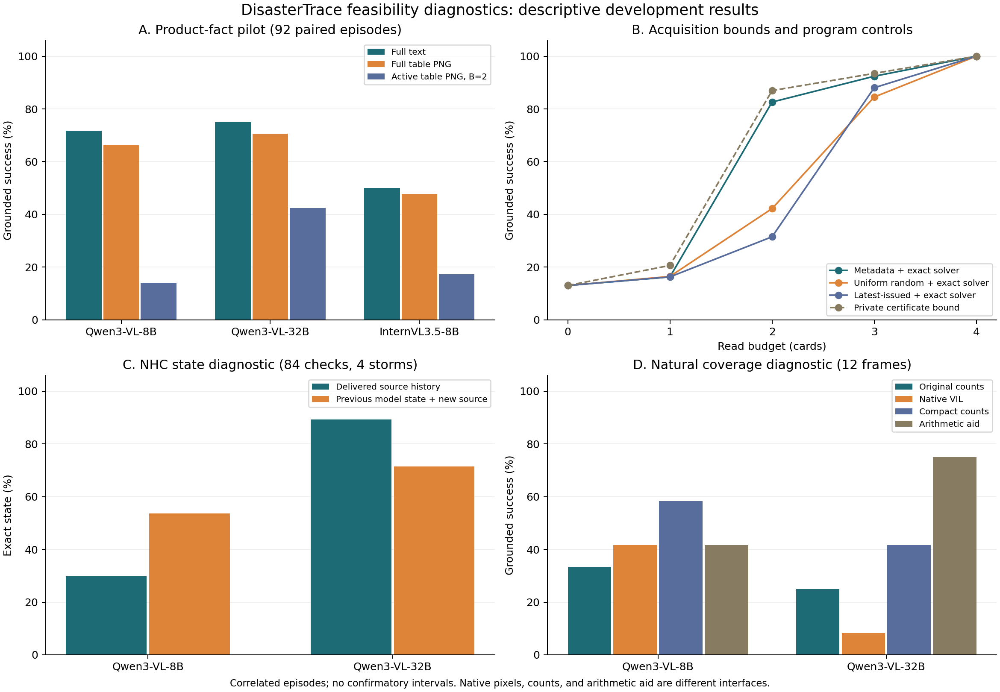

# DisasterTrace V5 可行性实测报告

本轮完成数据语义、近邻文献、参考程序和开发模型验证。原始响应、冻结输入、图像处理器记录和失败均保留。完整研究设计见 [最终方案](FINAL_PLAN_CN.md)，数据取舍见 [来源清单](FINAL_DATASETS.json)。

## 1. 本轮实际规模

共 28 个单卡 H100 作业，全部成功结束；累计 3,599 次模型调用。请求并发峰值 4 张，H100 硬件回执区间重叠峰值 4 张。没有付费 API、训练或 heldout 推理。

作业创建到结束的合计资源区间为 3.248 GPUh，开始到结束为 3.080 GPUh；它们不是账单或 GPU 利用率。输入 8,409,309 token、输出 102,892 token，跨模型 token 不视为等成本单位。

| 批次 | 内容 | 调用数 | 解释 |
| --- | --- | --- | --- |
| Wave1 | 最初输出协议 | 1,018 | 保留测量缺陷，不并入主要成绩 |
| Wave2 | 相同 92 episode 的完整配对协议修订 | 1,040 | Qwen3-8B 与 Qwen3-VL-8B |
| Wave3 | 相同开发题、32B VLM | 453 | 模型规模诊断 |
| Wave4 | 相同开发题、InternVL | 432 | 视觉架构不同，语言骨干仍来自 Qwen3 |
| Wave5 | NHC 状态、固定选读、原生 VIL | 560 | 336 个状态检查点 + 224 个静态提交 |
| Wave6 | 自然缺测的文本计数与原生 VIL | 48 | 12 帧 × 2 表示 × 2 模型 |
| Wave7 | 紧凑计数与程序上下界辅助 | 48 | 看到 Wave6 后追加的探索诊断，保留全部 12 帧 |

主要产品任务是 46 个基础问题及 46 个受控删资料变体，共 92 episode。NHC/GHCND/USDM/SEVIR 分别为 24/32/16/20。它们来自 4 个风暴、4 个站点、8 个旱情点位和 5 个初始雷达序列，不能解释为 92 个独立极端事件。状态任务继续使用相同 4 个风暴。自然缺测另取 6 个序列。

## 2. 输出协议问题与修订

Wave1 的 736 条轨迹中，643 条结构无效、86 条正常结束、7 条非法读取。586 个原始响应使用了 `final_contract` 外层包装。原提示同时呈现两个 contract 字段，引入了明显歧义。

Wave2 改为明确的顶层动作示例，重新冻结并完整运行同一配对矩阵；733 条正常结束、3 条非法读取。旧批次与事后包装恢复分析单列，未覆盖失败项，也未挑选失败题重测后拼成一份成绩。

## 3. 主要模型结果

主指标是 `grounded_success`：完整池判断正确、引用已实际读取、引用集合足以证明结论或完整池不足。以下每格均为 92 条开发 episode 的样本平均。文本是结构化产品事实；图像是同一组事实的表格 PNG。

| 模型 | 完整文本 | 完整表格图像 | 主动文本 B=2 | 主动表格图像 B=2 |
| --- | --- | --- | --- | --- |
| Qwen3-8B | 57.61% | 未测 | 13.04% | 未测 |
| Qwen3-VL-8B | 71.74% | 66.30% | 41.30% | 14.13% |
| Qwen3-VL-32B | 75.00% | 70.65% | 未测 | 42.39% |
| InternVL3.5-8B-HF | 50.00% | 47.83% | 未测 | 17.39% |

只有 80/92 个 episode 在预算 2 下存在可获得的证书。预算不可达、取证不足、解释和引用错误须分别报告；不能将全部低分归因于模型选读策略。按来源宏平均、逐来源成绩和实际成本在 [机器结果](analysis/FINAL_RESULTS_02.json) 与 [CSV](analysis/MODEL_RESULTS.csv) 中。

### 主动图像任务的错误分解

| 模型 | 成功 | 预算不可达 | 可达但未读足 | 已读足但判断错 | 判断对但引用错 | 协议失败 |
| --- | --- | --- | --- | --- | --- | --- |
| Qwen3-VL-8B | 13 | 12 | 57 | 7 | 0 | 3 |
| Qwen3-VL-32B | 39 | 12 | 8 | 33 | 0 | 0 |
| InternVL3.5-8B-HF | 16 | 12 | 45 | 19 | 0 | 0 |

这是按固定优先级形成的互斥记账，不是对模型内部机制的因果解释。32B 的未读足明显减少，但取得足够资料后的判断错误仍多，说明只看总准确率会遗漏不同的错误来源。

## 4. 强规则和固定选读

| 预算 2 的程序策略 | 证据支持成功 |
| --- | --- |
| always_unknown | 13.04% |
| latest_issued_rule | 31.52% |
| metadata_rule | 82.61% |
| private_certificate_bound | 86.96% |
| uniform_random_exact_mean | 42.21% |

| 模型 | 主动图像 | 元数据固定选读后一次提交 | 仅主动成功 | 仅固定成功 |
| --- | --- | --- | --- | --- |
| Qwen3-VL-8B | 14.13% | 58.70% | 0 | 41 |
| Qwen3-VL-32B | 42.39% | 45.65% | 2 | 5 |

固定策略只读取公开目录中的目标匹配信息，不预看数值。程序策略带精确求解器；私有证书上界带完整隐藏池，均不是 LLM 的同权限竞争方法。固定一次提交与主动多轮的历史和调用成本也不同，因此上述差异是诊断结果，不能单独归因为策略因果收益。

## 5. 自然版本与状态维护

| 模型 | 载体 | 完整状态正确 | 风速正确 | 来源正确 | 输入 token |
| --- | --- | --- | --- | --- | --- |
| Qwen3-VL-32B | full_history | 89.29% | 89.29% | 100.00% | 382353 |
| Qwen3-VL-32B | last_state | 71.43% | 75.00% | 71.43% | 123438 |
| Qwen3-VL-8B | full_history | 29.76% | 36.90% | 77.38% | 382353 |
| Qwen3-VL-8B | last_state | 53.57% | 60.71% | 71.43% | 123255 |

每格 84 个检查点，来自 12 条轨迹、4 个风暴。自然公告产生 24 次换源，其中 20 次数值变化；旧资料重送、重复、当前强度与其他风暴干扰是受控交付。84 个参考状态已由第二套原文解析重建。

全历史与上次状态的输入信息和 token 不相等。8B 与 32B 的载体趋势不同，不能据此宣布结构状态普遍有益。32B 的上次状态条件在旧版本重送 12/12、其他风暴干扰 12/12 检查点未达到完整状态正确；具体原始输出保留在 Wave5。

## 6. 原生栅格与自然缺测

初始 SEVIR 的 20 个问题中，原生 VIL 渲染下的支持成功为 8B 30%、32B 45%。图像直接来自归档像素、使用固定色阶，PNG 反解与数组逐像素一致；图像上不写超阈值计数。处理器缩放后的可辨性仍需单独考察，不能将这里等同于精确表格对照。

新增 6 个序列按官方目录缺测比例分层选择；全部 294 帧的产品参考为 no=189、unknown=58、yes=47。模型用的 12 帧按缺测位置规则选择，参考为 no=6、unknown=5、yes=1，未依据 VIL 阈值答案选帧。它是覆盖机制诊断，不是自然发生率样本。

| 模型 | 原始精确计数 | 原生 VIL | 紧凑计数 | 程序上下界辅助 |
| --- | --- | --- | --- | --- |
| Qwen3-VL-8B | 33.33% | 41.67% | 58.33% | 41.67% |
| Qwen3-VL-32B | 25.00% | 8.33% | 41.67% | 75.00% |

Wave6 的 8B 原生视觉输出 12/12 都为 unknown，因此 41.67% 仅匹配了 5 个 unknown 标签。完整读取并引用全卡时，恒答 no/unknown/yes 在这个诊断集可分别取得 50%/41.67%/8.33%；不能把某一格分数当作真实感知进步。

Wave7 在看到上述问题后冻结，保留两模型与全部 12 帧。紧凑条件重排同一公共计数、显式给出缺测数，并澄清对可能补全世界的判据；上下界条件再提供由公共计数计算的冗余数值辅助，不提供答案或私有证书。它同时改变了表示与解释方式，是探索性诊断，不能作为单因素因果实验或替换 Wave6 成绩。

建议首版单列纯视觉、精确测量值和确定性工具轨。对缺测的稳健理解应要求跨标签成功，并与恒答基线和充分性引用一起报告。

## 7. 来源核验与后验结果

GHCN 的独立历史基准已完成，4 站形成 8 个按声明研究规则定义的连续高温过程；本轮 35°C 模型试点没有被换成新标签。USDM 原几何存在 3 处自相交，但 32 个测试点在原始环交点算法、原 GEOS 和修复几何下标签一致；这不授权把所有面积任务直接视为有效。

SEVIR 初始 8 个 ID 只有 5 个通过身份/时钟准入，其他原始资产保留。洪水配对和权利的不足也保留为来源决策依据，未用成功下载的少量标签假装完整多模态洪水集。

NHC 422/461 条预测行匹配冻结 HURDAT2。在 326 个可结算的版本变化中，122 次误差减小、89 次增大、115 次不变；另 20 次版本变化未结算。正确更新来源与更接近事后最佳路径结果不同，后者必须单独评价。

## 8. 可复查证据与剩余工作

[文献核查](reports/NOVELTY_AUDIT_CN.md)、[最终数据清单](FINAL_DATASETS.json)、[逐模型结果](analysis/FINAL_RESULTS_02.json)、[资源账](RESOURCE_ACCOUNTING.json)、[最终离线复核](verification/final_01/VERIFICATION.json) 和 [复查说明](REVIEW_FOR_CHATGPT_PRO_CN.md) 构成阅读入口。

本轮捕获 288 次来源 HTTP 尝试，正文 256.9 MiB；权重接收 78.04 GiB。权重下载器保留文件请求和字节，但没有逐跳记录自动重定向，无法事后精确证明其底层 HTTP 交易次数；失败分片与有界续传记录均保留。

当前结论是工程可行，值得沿证据支持性与错误分解推进。尚需增加地区/季节与独立分组、固定更清楚的产品任务接口、加入不同语言骨干、实现统一工具权限、冻结未见测试集，再判断研究主张能否稳定成立。

