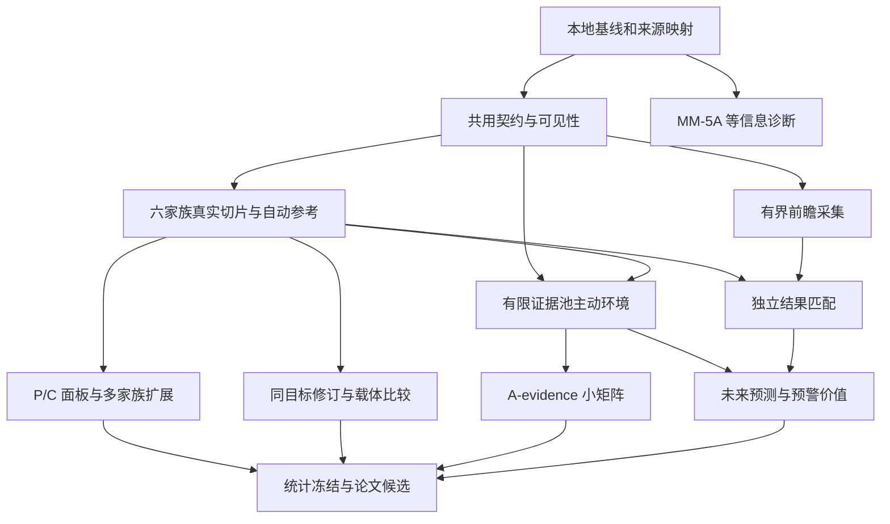

# DisasterTrace V5：多灾种、多模态证据与主动取证研究路线

规划日期：2026-09-10。状态：**整合规划，尚未执行本计划的新实验**。

用户确认没有硬截止日期。本计划按首轮一周、两周开发试点、约 12 周目标路线安排；数据权限、独立事件数量或结果结算不足时顺延。单人持续实施更稳妥的工期是 16–24 周，12 周不是完成保证。

## 1. 推荐的方向

建议把 DisasterTrace 建设为：**检验 LLM/VLM 如何从多灾种的合法证据中形成判断，在新证据到来时修订判断，并在有限取证预算下减少可避免错误的 benchmark。** 对具有独立结果验证的数据，再评估未来预测和预警价值。

核心研究对象是模型使用证据的能力。数值天气预报、遥感产品和机构公告既可以是输入，也可以是专业基线；它们的角色必须由任务协议明确。不能因为把气象数据变成问答，就宣称测量了模型的气象预测能力。

下一阶段同时推进四条工作线：

| 工作线 | 要解决的问题 | 首个可交付结果 |
| --- | --- | --- |
| 测量有效性 | MM-4 中的空间、名单、逻辑、版本错误怎样分解；输入表示是否造成额外障碍 | MM-5A 等信息对照和独立空间覆盖版本 |
| 共用协议与自动参考 | 多种灾害怎样使用同一时间、来源、可见性、状态和评分规则 | 一个新内核、三个参考视图、可重建报告 |
| 多源真实数据 | 不同灾种、格式、时标是否能形成合格任务 | 六个家族的真实小样与逐样本准入表 |
| 前瞻证据与结果验证 | 历史可用性不足、短保留期产品和未来结果怎样取得 | 有界采集、NHC 固定未来目标闭环、水文匹配试点 |

这四条线有接口依赖，但不应排成“一个模型满分后才能接入下一个灾种”的长链。模型低分是研究结果；数据准入取决于参考、公共输入和测量是否有效。

## 2. 当前真实起点

规划基于当前本地工作区，Git HEAD 为 `36082c42a93e11f67d274d8000c87cd1dc098d74`，分支为 `next-phase-v1`。本地存在尚未提交的 MM 阶段产物，因此 Git HEAD 不能独立代表本地最新状态。附件中的旧远端代码判断只作为历史参考。

| 已有基础 | 本轮核对后的解释 |
| --- | --- |
| P6–P14 文本实验、捕获、审计和关闭记录 | 已有可复用工程经验；旧运行窗口与一次性启动凭据均不可重开 |
| MM-0–MM-2 多模态种子 | 一个真实 Francine 开发事件、受控投递分支、确定性空间与逻辑参考；不是多灾种数据集 |
| MM-3 VLM 管线 | 实际图像、processor、token 与生成记录已接通；模型能力门槛没有因管线接通而通过 |
| MM-4 原子诊断 | Qwen3-VL-8B-Instruct 共 40 次请求全部返回、结构有效、查询完整且 EOS；空间 8/9，名单 3/9，逻辑 9/12，版本 7/10 |
| MM-4 有效性限制 | 13 个错误请求；有图空间题全答 inside，名单值也符合仅看证据是否存在的事后控制；不能据此推断内部机制 |
| MM-4 复现与资源 | 1,130 个绑定文件本轮哈希核验一致；四个一卡 H100 作业成功，实际峰值为三卡；旧 40/40 修订入口门槛失败 |

历史 MM-4 资源记录为预约约 0.2091 GPUh、分配约 0.1904 GPUh；这不是账单或利用率。四个分片各自模型加载约 42–45 秒，40 个短答案合计生成约 40.95 秒。不能用它直接推算长历史、多图、主动轨迹的吞吐。

实际代码存在 `forecast_source`、`forecast_task`、`multimodal_v1`、`multimodal_live_v1`、`multimodal_atomic_v1`。拟议的通用 `active_forecast` 内核尚不存在。具体复用和缺口见 [代码复用与文献核查](CODE_REUSE_AND_RESEARCH_CN.md)。

参考入口：[MM-4 结果](../../disastertrace-starter/artifacts/multimodal_v1/mm4_atomic_20260909/RESULTS_CN.md)、[MM-4 原后续计划](../../disastertrace-starter/artifacts/multimodal_v1/mm4_atomic_20260909/NEXT_STEP_CN.md)、[本轮基线哈希](BASELINE_SNAPSHOT.json)。

## 3. 五套输入怎样整合

目录包含七个文件，对应五套不同计划。两个独立 Markdown 与 P58 压缩包内同名文件逐字节一致。原件已复制到本目录 `inputs/`，压缩包和成员哈希见 [输入清单](INPUT_MANIFEST.json)。包内脚本没有执行。

| 简称 | 输入 | 主要价值 | 本计划的处理 |
| --- | --- | --- | --- |
| P43 | 无编号 Master ZIP，43 条 registry | 先构建多家族真实工程闭环，严防规模虚增与信息泄漏 | 采用首轮真实小样和数据计数规则；不把全部轨迹目标当首轮承诺 |
| P45 | Complete ZIP，45 条 registry | goal/visible/sufficiency 三类参考，取证可避免性，任务资格拆分 | 作为主动取证和 unknown 评分的核心补充 |
| P52 | Master `(2)`，52 条 registry | 多时间配置、物理事件/泄漏双图、表示与预算分解 | 采用严谨的时间和统计设计；3,000 事件、54,000 检查点不直接照搬 |
| P58 | Master `(1)` 与两个独立 MD，58 条 registry | Catalog/Broad/Trace 三层产品，22 标签，六家族首轮 | 作为数据产品和首轮工程组织骨架；保留补充观测依赖 |
| P59 | Master `(3)`，59 条 registry | 15 家族/34 子类、任务资格非严格递进、固定未来目标 | 作为分类工作骨架和预测/预警子集设计依据 |

五份清单共有 **257 条带计划命名空间的候选记录**，不是 257 个独立来源。独立产品数当前为 `null`。例如 NHC 公告、GIS、HURDAT2 可以出现在一个组合条目中；同一机构的这些产品又有不同角色，不能只按机构域名去重。

[候选记录](SOURCE_CANDIDATES.json) 保留全部原字段和原 ID；[可读索引](SOURCE_INDEX.md) 便于查找。第一轮再形成 `provider → product → release → acquisition interface → evidence role` 的映射。FPA-FOD 6/7、GESLA 3/4、CHIRPS 2/3、IMERG 版本和 ISD/GHCN-Hourly 关系须核对后锁定，不能静默合并。

材料中的来源在线性、保留时间、许可证和论文介绍属于输入材料的结论，**本轮没有重新联网验证这些外部事实**。因此相应接入均是候选状态；计划结构校验通过不代表数据接入或 benchmark 已通过验收。

## 4. 科学问题与可证伪结论

| 问题 | 比较方式 | 可能否定的主张 |
| --- | --- | --- |
| RQ1：错误来自哪里 | 原始多模态、冻结产品表示、测量值特权诊断；分别测空间、名单、逻辑、版本、引用 | 如果主要损失来自接口或图像分辨率，就不能把它写成状态记忆缺陷 |
| RQ2：状态是否有帮助 | 相同当前证据、相同取证权限与预算；比较 snapshot、结构状态、自己的原始回答历史 | 若最新合法版本规则已足够，或收益只来自更长输入，就不能声称状态方法普遍优越 |
| RQ3：模型能否识别证据不足 | 完整合法池参考与实际已读参考分开；对必要证据、无关证据、重复送达做对照 | 若一直 unknown 即可高分，主动任务的评分设计失败 |
| RQ4：主动读取是否值得 | 同一场景、证据池、截止时刻和成本，比较固定顺序、声明过的随机策略、自主选择 | 若额外调用/多看数据解释了提升，就不能归因于更好的取证策略 |
| RQ5：能否改进未来预测或预警 | 与持久性、历史气候、机构预报/专业产品在兼容目标上比较；独立后验结果结算 | 若没有可结算结果，或只能复述机构预报，就收缩为证据理解/产品预测研究 |

主报告采用任务分项和成本曲线。初版不把 P/C/R/F/A 合成一个综合分，也不把野火扩展与核心天气任务无权重地混成“极端天气总能力”。

## 5. 数据产品、灾种与任务资格

### 5.1 三层产品，两个交叉子集

| 层/子集 | 定义 | 最低凭据 |
| --- | --- | --- |
| Catalog | 可追溯的候选来源、事件或监测窗口 | 原机构标签、来源版本、记录粒度、访问/再分发条件 |
| Broad | 可解码、可定位、已通过质量和泄漏检查的真实资产及 episode | 哈希、时空支持、单位、质量标记、真实样本往返检查 |
| Trace | 具有明确目标、可见性和多个有意义决策点的 episode | 任务资格、自动参考、投递表、完整 opportunity 分母 |
| Active 子集 | 可以在预算内选择证据的 episode | 可执行动作、同一候选池、动作成本、充分性/可避免性参考 |
| Prospective 模式 | 由采集器实时留存的证据和后续结果 | first_seen/capture 记录、端点版本、采集缺口、固定截止时间 |

Active 是已有数据的任务子集；Prospective 是取得和评估数据的模式。二者不能再作为互不重叠的数据量相加。

### 5.2 分类采用分层标签

建议使用 P59 的 15 家族/34 操作子类作初始工作骨架。其 15 家族中，火灾与烟羽为扩展，另外 14 个家族作为核心气象、水文与海洋极端过程；降雨触发滑坡另列扩展。保留 P58 的 22 个原标签，逐条做多对多映射。该骨架不是新的官方互斥分类标准。

每条记录至少保存 `source_hazard_label`、`family`、`subtype`、`scope(core/extension)`、`process_tags`、`compound_event_links` 和定义版本。大气河可为过程标签；热带气旋引发的降雨、洪水、风暴潮可以多标签，但共享同一物理事件主键。地震、火山、非天气触发海啸不计入天气覆盖。

“极端”必须落实到变量、地理区域、持续时段、质量要求和阈值来源。推荐优先采用产品的正式分级或基准期阈值；分位数只能由独立历史/开发期估计后冻结。USDM 等级是产品事实；FIRMS 火点不自动等于极端野火；普通水体不自动等于洪灾。

### 5.3 五种能力的资格独立判断

| 任务 | 测量对象 | 自动参考条件 | 典型限制 |
| --- | --- | --- | --- |
| P 感知/读取 | 公开地图、表格、文本、栅格的值与位置 | 可复算的产品事实和 locator | 私有高精度几何不能要求低分辨率公共图回答不可见细节 |
| C 对齐/充分性 | 目标、时空支持、来源、覆盖是否匹配 | 明确的匹配规则、有效覆盖及质量标记 | 同地点不同时间、不同累计量不能直接比较 |
| R 修订 | 同一目标下更新、保留、撤回和来源刷新 | 目标不变、版本关系和修订义务明确 | 时间演化、可见范围变化、估计修订必须分别标记 |
| F 未来预测 | 固定未来时间/窗口的事件或连续值 | 目标兼容的后续结果与冻结结算规则 | 未来帧可以验证产品预测，不自动验证真实灾害影响 |
| A 主动取证 | 选读什么、何时停止、是否减少可避免错误 | 有限动作、预算、合法池、充分性参考 | A-evidence 可先做；A-forecast/warning 还需要 F 资格和结果 |

这些资格不是严格梯子。静态洪水图可以只有 P/C；SEVIR 可有未来帧 F，但没有自然订正链 R；NHC 同有效时刻的公告可以有 R。没有独立灾害结果不妨碍合格的 P/C/R/A-evidence 数据发布。

## 6. 首批数据选择和接入顺序

第一轮做六个家族，重点验证六类处理路径。优先复用已保存的真实开发样本；新样本采用有界来源清单。合成 fixture 用于异常语义测试，始终单独计数。

| 首轮家族 | 候选源及角色 | 第一项自动任务 | 要明确排除的错误解释 |
| --- | --- | --- | --- |
| 热带气旋 | 已有 NHC 公告/GIS；另配 HURDAT2 结算候选 | 同目标版本选择、地图关系；之后固定未来风速/位置 | 风暴中心最大风速不是港口风速；风圈不等于实际损失 |
| 强对流/降水 | SEVIR，之后 NEXRAD/GOES | 多通道和时序对齐、区域阈值、后续 VIL 帧 | VIL 不等于地面降雨量；未来帧预测不自动是灾害预测 |
| 洪水 | GEOID-Flood 或 WorldFloods/Sen1Floods11 的明确版本 | 水体/有效覆盖、空间范围与缺测判断 | 掩膜可能继承算法误差；静态标签不伪造订正时间线 |
| 高温/低温 | GHCN-Daily；小时目标才另核对 ISD/GHCN-Hourly | 单位、质量、阈值和连续时长判定 | 台站日界/时区不同；事后清洗数据不能伪装成实时可用 |
| 火活动扩展 | FIRMS 与 FPA-FOD/MTBS，角色分开 | 当前检出、时间/覆盖、活动变化 | 无火点不是无火灾；FPA-FOD 影响记录不能进入早期输入 |
| 干旱 | USDM，之后 CHIRPS/SPEI 等 | 不同发布期覆盖/等级读取与变化 | 周际旱情演变不等于同一目标的版本订正 |

Storm Events、EONET 和 IBTrACS 优先作为目录与关联支架，不将事后事件叙述注入早期模型上下文。全球覆盖不能由美国数据量推断；首轮明确是开发覆盖。

第 3–6 周依据首轮结果扩展雪/冰、非气旋强风、沿海水位与海浪、沙尘/低能见度、海洋热浪。中国数据和国际站点作为地域外推目标；账户或许可迟迟不能落实时保留目录，不阻塞已有开放源。

每个来源只有通过“权利/版本 → 有界取得 → 解码 → 时空/质量检查 → 公共投影 → 自动参考 → 逐任务资格”后才计为接入完成。来源清单里填了 `enabled`，或 fixture parser 可以运行，都不是完成。

## 7. 共用内核应解决什么

推荐只创建一个新命名空间 `active_forecast/`。其中 `providers/` 承担附件 `source_stream/` 的来源职责，环境模块同时支持 evidence 与 forecast profile，避免并列维护三个近义框架。历史模块保持冻结，通过薄适配接入；不得直接放松旧固定 scope。

### 7.1 分开内容、产品和送达

至少区分 `Blob`、`ProductVersion`、`Capture`、`Delivery`、`Target`、`Episode`、`ReadEvent`、`Commit` 和 `Outcome`。相同字节允许内容去重；一次重播仍生成自己的 delivery 记录。引用包含产品版本和完整 locator，不能只剩 artifact ID。

`Target` 应包含变量/单位、实体或 AOI、CRS/高度或垂直基准、有效时间/窗口、统计量、阈值规则版本、lead time 和 reference kind。模型不能通过重定义目标、改时间窗口或改阈值避开错误。

`KEEP` 值与来源刷新分开：值没变但权威版本变了，仍可能需要更新来源及 locator。当前历史 `StateLedger.apply` 遇 KEEP 直接跳过，新内核需要独立处理；这不意味着修改已冻结的历史判分。

### 7.2 时间规则

分别保存观测时刻、有效时段、产品签发、被证明的历史可用区间、采集 first_seen、受控投递、模型逻辑提交、墙钟提交。未知值为 `null`，不可用下载日期或 issue time 补成已证明历史可用。

建议声明四种 profile：静态产品、观测时序、发行版本受控回放、采集端点前瞻。严格历史回放仅对有可用性证据的资产开放；不满足时可以保留受控回放资格，并明确模拟性质。

合法性基于证据何时公开/送达，而非要求有效时间必须小于当前时间。已签发的未来预报可以合法；未来才公布的旧观测订正版不可以提前进入输入。所有派生资产还要递归检查父资产。

### 7.3 三类参考加独立结果

| 参考 | 使用范围 | 回答的问题 |
| --- | --- | --- |
| `goal_reference` | 当前截止时间下全部合法潜在证据 | 若正确取得必要证据，最多能支持什么结论 |
| `visible_reference` | 模型此时实际读到的证据与自己合法历史 | 当前提交是否得到已读证据支持 |
| `sufficiency_reference` | 目标、候选证据、成本和覆盖关系 | 已读是否足够；剩余错误能否在预算内避免 |
| `verified_outcome` | 评估器私有的后续观测/权威结果 | 对固定未来目标，事后能结算为什么结果 |

unknown 至少分为源缺测、质量不足、覆盖不足、目标不适用、合法池无证据、池中有证据但未读、模型缺答/无效输出。前几类可能是正确的认识状态；“有证据但不读”不能靠 unknown 在目标完成度上拿满分；缺答不是正确 unknown。

自动 Gold 来源需标成产品事实、已有发布标签、派生代理、后续结果。双解析可以降低实现错误，但不是两个独立天气来源。继承已发布的人工或算法标签符合“不新增逐题人工复核”的目标，但应披露来源误差与测量对象。

### 7.4 防泄漏与可解性

公共投影采用字段白名单。模型能看到的目录、搜索索引、文件名、HTTP 缓存、切片范围、可读 metadata 和 parent asset 均纳入审计。私有标签不得藏在 public 路径或索引关键词里。

禁止用完整未来洪水最大掩膜选早期 AOI，禁止按全序列 min/max 归一化当前图像，禁止利用最佳路径中心裁剪却声称评估在线无先验定位。固定物理色阶、查询坐标、有效区域、像素/几何容差在生成前声明。

洪水面积界只能在目标时间、分母、CRS 和有效支持相同的条件下计算。若 AOI 面积为 A、有效观测覆盖为 V、其中水体为 W，则覆盖比例逻辑界为 `[W/A, (W + A - V)/A]`；它描述未观测区域的不确定性，不是洪水真实性的统计置信区间。重叠区域用并集计面积，NoData 不当作陆地。

## 8. 测量改进与自动验收

MM-5A 延续原建议：40 个原任务 × 2 个等信息表示，共 **80 次新请求**。公共语义、图片字节、输出结构、参考、模型和推理设置固定；比较原 JSON 与显式字段/行号文本。新增行号只能标识已有行，不能透露 watched、选定版本或空间关系。

MM-5A 不增加点标记或修改空间样本。标记图、平衡 inside/outside、边界邻近和坐标密度分别放入之后的独立数据版本。否则无法区分文本、视觉提示和题目难度的影响。

新版本的数据/仪器门槛建议为：

1. 通过 schema、时间、权限、公共投影与历史保留检查；预先定义的泄漏反例必须被拒绝。
2. 对 admitted 的有限任务，参考和独立程序解答全部一致；不一致样本先隔离并记录原因，不能等模型回答后择优删除。
3. 面向真实公共表示验证可解性。高精度私有几何与低分辨率像素不一致时返回明确边界/不可辨状态。
4. 预先运行恒答、存在性、latest-issued、目标匹配、完整合法证据规则等控制；覆盖正负例、无变化、同值换源、冲突、迟到和重复。
5. 模型输出全部保留，按格式、值、来源、locator、修订、充分性和结果分别报告。没有要求被测模型先达到 100% 才能计入数据集。

这是一套新的预声明门槛。MM-4 原 40/40 门槛及其失败不改变。MM-5A 只有单事件结果时，也不声称一般化的格式优劣。

## 9. 主动取证与未来预测怎样逐步加入

### 9.1 先做有限主动取证

初版先做 A-evidence：固定目标和截止时刻、离散证据池，最多 4 次 `GET_EVIDENCE` 加 1 次最终 `SUBMIT`，每轨最多 5 次模型决策。不在这一批同时引入任意工具、自由搜索、多代理和无限 WAIT。

模型只能访问共同合法目录中已公布的候选及其允许公开的 metadata。实现可见性后，读动作返回对应证据，成本与失败都记账。小池可穷举预算内证据集合，证实 `avoidable_under_profile` 或 `unavoidable_under_profile`；较大池搜索未找到解只能写 `not_certified`。

对照至少含固定顺序、预声明种子的随机可用读取、自主选择；另用程序完成全证据和不读取控制。所有策略共享同一潜在目标参考，自主选择按自身实际读取接受支持性评分，不能各拿自己的较弱 reference 获得不公平高分。

第二版才加 `WAIT`、`COMMIT_DECISION` 与有日程的证据到达。固定评价时点不会因模型 WAIT 或提前 STOP 消失；carry-forward 必须标记为沿用历史提交。研究损失和获取成本分别报告；没有截止收益或成本依据时，不凭空奖励更早停止。

### 9.2 再做固定未来目标

首个验证闭环推荐 NHC 预报 → HURDAT2 后验风速/中心位置，按 storm ID、valid time、单位、插值规则、质量和版本匹配。它首先验证风暴尺度目标，不将最佳路径直接扩展为站点风险或实际灾害损失。

第二个闭环候选是 NWPS/HEFS → USGS 或 CO-OPS 观测。必须匹配站点、stage/flow、垂直基准、时间窗口、预报起算点和质量标记；站点映射模糊就不结算。大浪目标另需 NDBC，不能用水位代替波高。

F 任务分别报告连续量误差和概率的 Brier/log score、校准及 skill。预报一个概率不会有“每题唯一正确概率”；未来 0/1 结果只能用于 proper scoring rule。罕见事件概率评分应使用自然机会队列；平衡诊断集不能直接计算自然发生率、校准或警报精确率。

预警价值可以用明确的研究损失 `L(a,y)=C*a + D*y*(1-a)`，冻结若干 C/D 比例作敏感性分析；不得把 token、GPU 时间与真实社会经济损失随意相加。只有专业基线可比、结果可结算时才讨论价值增益。

### 9.3 前瞻采集尽早但有界

前瞻捕获不依赖整个主动模型环境写完。先核对 NWS、NWPS/HEFS 等短窗口产品的最新文档，再冻结 provider、产品、AOI/站点、频率、截止时间、请求数及字节上限。附件中的约 7 天、10 天或 6 小时保留描述不能当成本轮已验证事实。

建议先跑 72 小时工程采集，成功后扩至 30–60 天研究观测窗口。这里的“成功”是时间戳、哈希、缺口、停止和恢复记录完整，不是保证期间一定出现足量极端事件。每一轮有自己的有界 scope；未来模型提交也必须在目标截止前捕获，否则只能评估历史回放。

数据 GET 可按政策有限重试且每次留 capture；模型或作业未知提交不能自动重发。采集器的断点续接不等于再次推理。具体建议预算见 [资源草案](RESOURCE_SCOPES_DRAFT.json)。

## 10. 样本规模、分组和统计

必须分别计数：原来源记录、物理事件组、监测 episode/window、唯一 blob、产品版本、delivery、task、checkpoint/opportunity、模型轨迹、模型调用与 token。没有实测的计数填 `null`；目标与实际分列。

| 阶段 | 建议规模目标 | 解释和退出条件 |
| --- | --- | --- |
| 第 1 周 instrument | 六家族均有真实可解码样本；每家族至少 2 个完整来源切片 | 这是工程覆盖；不足的家族列缺口，synthetic 不补真实数 |
| 第 2 周 pilot | 60–120 个真实开发 episode；去重后争取至少 24 个物理事件/独立过程组 | 至少六家族、正常/边缘/极端/缺测机制可报告；规模不足则只发布实际数 |
| 第 3–6 周 broad-beta | 2,000–5,000 个合格 episode，覆盖 8–10 家族；目标至少 300 个事件/过程组 | episode 与组不等价；资格和相关性分开统计，阈值不是统计充分性证明 |
| 第 7–12 周论文候选 | 10,000–30,000 个 Broad episode；2,000–5,000 个 Trace；300–800 个 Active 候选 | 交叉子集不能相加；独立组目标 1,000 以上，但以来源、地域、时标审计为准 |

这些是路线目标，不是现在拥有的数据量，也不是必须跑完全部模型的矩阵。论文候选达不到数字目标但测量严谨时，优先发布较小可靠版本，不靠重采样坐标或复制窗口凑数。

构建两类图：物理事件关联图负责同一风暴/洪水过程的分组；信息泄漏图负责共同截图、相同文件派生物、重叠时间/空间瓦片和标签传播。共同提供方或一个全球 NetCDF 容器本身不能把全球事件合成一个组；相同局部有效支持也不能跨 split 伪装独立。

分别形成类别平衡诊断集和自然监测机会集。自然队列由事先确定的站点/区域/时间表抽取，不能只选事后灾害目录命中的窗口。无报告不代表负例；有完备观测且满足否定判据才记负例。

主统计采用事件/过程组聚类的成对 bootstrap，慢变过程还要按季节、地区和时间块做敏感性分析。先每组汇总再跨组，避免大风暴靠更多地点支配主分数；同时报告按灾种宏平均、分层结果和样本量。组少时只作探索分析，不用数千个同事件 checkpoint 宣称显著。

F/A 报告计划机会数、有效提交覆盖、可结算覆盖、共同可比子集和各类失败。缺答不填 p=0；如使用共同 fallback，须事先冻结并与原始提交成绩分列。冻结后的解码、运行、超时和未知提交都保留在相应分母中。

现有 heldout 不进入开发推理。最终 heldout 仅在目标、阈值、模板、模型设置和统计规则稳定后另行冻结；未来可准备范围与保密存储，当前不执行。公开历史资料是否进入模型预训练不能完全证明，需明确污染风险；前瞻时间切分和固定封闭工具能减少部分风险，但不能承诺零污染。

## 11. 模型矩阵与四卡资源安排

建议按问题逐步加调用，而不是直接做“所有来源 × 所有模型 × 所有载体 × 所有干预”的全组合。

| 新批次 | 最大规模算式 | 调用上限 | 条件 |
| --- | --- | ---: | --- |
| M1 / MM-5A 表示对照 | 40 任务 × 2 表示 × 1 模型 | 80 | 沿用 MM-4 模型和 2048 输出上限；两条件均重新调用 |
| M2 / 多家族 P/C 面板 | 6 家族 × 8 episode × 2 原子任务 × 2 模型 | 192 | 48 个 episode 尽量来自不同事件组；不足则减小预冻结规模，不复制补齐 |
| M3 / R 载体比较 | 最多 24 合格轨迹 × 4 实际检查点 × 3 载体 × 2 模型 | 576 | 只进入 R 合格数据；没有自然修订的静态样本不造四个时间点 |
| M4 / A-evidence 小矩阵 | 最多 24 场景 × 3 读取策略 × 2 模型 × 5 决策 | 720 | 每轨最多 4 次读加 1 次最终提交；程序控制不计模型调用 |
| 前四批合计 | 80 + 192 + 576 + 720 | **1,568** | 各批分别冻结、一次重复、无模型重试；这是上限提案，不是已执行 |

使用两种开放权重 VLM 家族：先复用当前 Qwen3-VL-8B-Instruct；第二种优先评估 InternVL 系列约 8B 的兼容快照，若许可证/实际 processor 不合适再选择另一独立家族。型号、revision、许可证与单卡可运行性必须先核验，不能把模型名称写进表就视为已接入。文本 LLM 只参与其声明过的结构产品输入轨，不能与原始视觉输入成绩无标记混排。

结构状态、snapshot 和原始回答历史只在有历史可比较的 R 轨上做完整因子。对静态 P/C 重复跑三种空历史没有研究价值。Active 首轮固定一种公共表示和一种载体，避免把读取策略与记忆格式一次全部交叉。

用户已持续授权最多四张 H100 并行。后续执行时沿用该权限，按 [ACP 操作指南](/mnt/afs/260010168/ACP-GPU-QUICKSTART.md) 的 CCI 提交、ACP 运算方式进行；当前规划轮未启动新作业。

推荐独立单卡副本：MM-5A 四个 worker 各 20 次；P/C 按独立任务分片；R/A 按完整轨迹分片。每个分片内混合条件与任务类型，并预先平衡顺序，防止某张卡或时间段与一个条件完全重合。轨迹检查点保持顺序，不跨卡拼接模型历史。

单个第二模型若必须张量并行，则最多占用两张或四张并计入总额，重新计算并发；不能把每个 worker 的 GPU 数默认成一。QUEUEING、STARTING、RUNNING、已提交但状态未知和本地未确认的提交意图都占相应请求资源槽，终态释放后才补位。MM-4 已暴露的 `role.total_replicas` 与 `resource_spec.replicas` 差异必须纳入新调度回归。

CPU 负责解码、规则 Gold、数据审计和统计；GPU 主要用于 VLM 推理和确有价值的批处理。先把任务准备好，再集中加载模型，四卡不需要为了维持占用而空转。

建议前四批累计预约上限 **64 GPUh**，分批为 4/8/24/28 GPUh，并分别设绝对截止。调用上限、墙钟和资源上限任何一个达到即停止，剩余机会记录为未执行。此预算是工程建议，不是测得成本或吞吐；后续根据新批次真实 p50/p95 时延、加载和输入尺寸调整新 scope。

在每调用 2048 输出上限下，1,568 次的请求输出容量为 **3,211,264 token**；实际输出与输入 token 另计。长任务若需要调整上限，应先做共同上下文可行性设计并在该批冻结前定下，不能看到错误后只替换失败回答。付费 API、训练和正式 heldout 推理不在这份首批资源草案中。

## 12. 从第一周到完整路线

详细首轮操作见 [首轮执行计划](FIRST_SPRINT_CN.md)，工单依赖见 [机器可读 backlog](IMPLEMENTATION_BACKLOG.json)。下表日期随真正启动日整体平移；不把写计划当天当成已启动。

| 时段 | 重点 | 可检查交付 | 进入下一阶段的条件 |
| --- | --- | --- | --- |
| D1–D2 | 基线、来源/分类映射、目标与时间协议 | 新 scope、身份映射、公共/私有 schema、独立目录 | 无重复事件计数、无历史改写、语义冲突已显式记录 |
| D3–D4 | 共用储存/公开投影、六家族切片、MM-5A 离线 | 真实往返样本、自动参考、泄漏负例、等信息证明 | 公共可解性与独立程序一致；未接通的来源不报成功 |
| D5–D7 | 六家族 instrument、MM-5A、72 小时捕获准备/启动 | 可搬迁 CPU 重建包、80 次批次或未启动原因、采集状态 | 单轨失败隔离、资源统计和运行记录完整 |
| 第 2 周 | 扩展真实 episode、空间平衡、第二模型适配、P/C 面板 | pilot inventory、静态面板、缺口表；R 数据足够时准备 M3 | 模型低分不阻塞数据；参考/权限错误阻塞相应版本 |
| 第 3–4 周 | 真实 R 轨迹、NHC outcome、有限 A 环境 | M3、NHC 结算表、小池穷举、成本记账 | R 的同目标语义成立，A 的参考不随策略放宽 |
| 第 5–6 周 | 8–10 家族 beta、A 小矩阵、水文观测匹配 | M4、beta 数据卡、分灾种/参考类型报告 | 明确可结算目标与不可结算缺口，强基线齐全 |
| 第 7–8 周 | 重复性、地域/时标外推、未来决策 profile | 等预算消融、预警损失分析、初步前瞻覆盖 | 有充分独立组，至少两个模型家族；结果层资格独立检查 |
| 第 9–12 周 | 统计冻结、论文候选、独立复现与发布准备 | 固定版数据/代码卡、论文证据表、CPU 重建包、heldout 执行提案 | 结论范围与证据一致；后续正式计算范围另行具体化 |

关键依赖可简化为：

图中 M 的结果影响后续公共表示选择，但不是来源接入的门槛；F 的结果决定未来价值主张，P/C/R/A-evidence 可以独立形成较小发布版本。图中的汇聚表示研究材料整合，不代表所有分支都成功才允许发布。

## 13. 风险处理和下一步决策

| 实际情况 | 继续方式 |
| --- | --- |
| 候选源权限/版本不明 | 暂停该源的取得或再分发，保留目录；使用同家族已明确开放的真实来源 |
| source reader 成功但自动参考不可验证 | 保留 Broad 资产，暂不生成相关任务；不把解码失败伪装为 unknown 问答 |
| 同目标 R 数据不足 | 继续 P/C/F 合格任务和受控 R 诊断，分别标记自然与受控来源 |
| VLM 普遍较低 | 用公开信息等价、测量值诊断和程序控制定位；扩大数据仍可进行，不按答案删题 |
| 两模型都被简单规则解释 | 诚实报告规则足够的任务边界，新增有真实科学需要的条件；不单纯堆噪声制造难度 |
| 前瞻时段无足量事件 | 报告监测机会和覆盖；延长有界观察或缩小未来预警主张，不事后只挑出事日期 |
| outcome 质量/兼容性不足 | 发布证据理解与主动取证结果，将真实预测/预警价值列为未证实 |
| GPU 排队/未知提交/单轨失效 | 按实际状态保留占槽与失败，继续独立未执行轨迹；不重启已消耗 worker |

用户已确认无硬截止；后续日常技术选择可按这份推荐推进。只有实际需要新账户条件、付费资源或显著改变研究范围时，才提出具体缺失信息。已有四卡授权不因附件模板中的默认 `false` 再次失效。

**下一次执行的具体起点是 V5-00 至 V5-08 的共用协议与六家族 instrument，同时推进 V5-09 的 MM-5A 离线对照；达到各自验收后再运行 MM-5A 和有界采集。** 第一轮结束交付实际来源/事件/机会清单、完整失败表、CPU 重建结果和真实资源报告，使后续扩容有明确依据。
