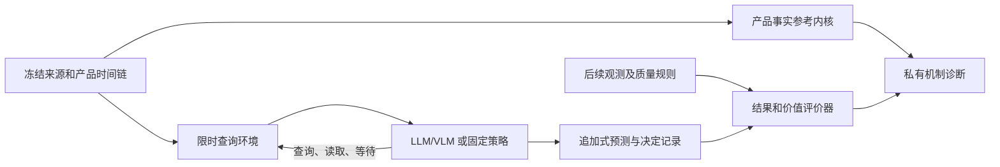

# DisasterTrace V6 后续研究计划：限时主动取证如何产生可验证的预警增量

核查日期：2026-09-11。本文依据用户提供的 [plan_2.md](/mnt/afs/260010168/extreme_weather_benchmark/plan/plan_v6_0911/plan_2.md)、当前工作区代码、已保存的实验记录，以及本轮获取的论文、公开代码和水文样例制定。本文中的新任务、方法、规模和里程碑均为建议；已执行的核查另列。

## 1. 推荐决定与论文定位

建议把下一阶段的主问题确定为：

> 在相同的专业预报基础、初始信息、可访问资料、预算和准备截止时间下，LLM/VLM 能否选择值得获取的证据，合理停止或等待，并改善由未来观测结算的预测与预警价值？

这正是 `plan_2.md` 相对前一阶段最重要的推进。前一轮将整个项目概括为“证据充分性、版本追踪与错误分解”，低估了这份计划的研究范围。上述能力应成为新任务的可信底座和诊断工具；论文主线应当回答它们能否产生**及时、校准、具有成本意义的增量判断**。

建议暂用工作标题：**DisasterTrace: Deadline-Constrained Evidence Acquisition for Verifiable Extreme-Weather Warning**。正式标题随实验结果确定，不预先写入“优于专业预报”等结果性表述。

下一阶段采用以下整体结构：

| 层次 | 研究用途 | 建议范围 |
| --- | --- | --- |
| 主实验 | 固定未来目标的主动取证、概率提交和截止前决定；测量相对强基线的增量 | 一个旗舰灾种，优先条件合格的河流水文任务 |
| 迁移实验 | 检验结论是否依赖某个产品或灾种 | 一个独立任务族；优先评估温度极端，NHC 可先用于协议联调 |
| 机制诊断 | 感知、时间/空间对齐、来源依赖、版本与状态、获取和停止 | 复用现有精确证据内核，形成与主实验成对的对照 |
| Broad Data Bank | 保留广灾种覆盖及后续扩展空间 | 延续 16 类目标和现有来源登记，不要求全部立即进入未来预警主榜 |

当前最有希望形成的贡献，是一个**能隔离增量来源的评测问题、可核验的数据时间链，以及能够支持或否定机制假设的实验设计**。主动获取、概率更新、来源去重、截止时间和成本损失各自已有文献基础；最终论文需要通过下述实验建立组合后的科学价值。

## 2. 怎样取舍 plan_2.md 中的 idea

该文件合并了多份建议及基于旧提交的代码审查，各段的任务边界并不完全一致。建议以文件开头及末段的限时主动预警目标为主，按以下方式收口。

| Idea | 处理决定 | 在新方案中的位置 | 对应的可检验问题 |
| --- | --- | --- | --- |
| 主动选择下一份证据 | 主线 | 固定预算下的获取策略 | 相同预测器下，选择策略是否改善截止时的 Brier 与决策损失？ |
| 等待、停止和准备时限 | 主线，分两阶段实现 | 外部时钟、截止规则和提交记录 | 新资料是否赶得上使用？更早承诺是否确有收益或代价？ |
| 相对已有专业预报的价值 | 主线必须项 | 共同专业基础与强规则基线 | LLM 增益是否超过简单获取更新、校准和阈值规则？ |
| 同源重复与真正新增信息 | 重点机制实验 | 来源图、等价呈现、新观测对照 | 模型是否重复计算证据，影响校准和预警成本？ |
| 感知、状态和决定的失效分解 | 重点机制实验 | 配对替换与状态干预 | 修复哪一环后，损失发生变化？修复之间是否交互？ |
| 极端强度 × 信息条件 × 时限 | 泛化主实验 | 分组留出与受控压力实验 | 平均表现能否延续到高强度、缺失或紧时限条件？ |
| 精确证据充分性与最小证书 | 保留并限制语义 | 产品事实的支持判定、合法性检查 | 当时读到的产品是否支持特定事实？ |
| 扩展更多灾种与模态 | 延续数据工作 | Broad Data Bank 与迁移任务 | 机制结论能否跨资料形态和灾种成立？ |
| AutoResearch / 自动探索方法 | 后置 | 仅开发集上的策略搜索和消融 | 在固定搜索成本下能否改善策略？冻结测试集后禁止反馈优化 |
| 开放式撤离、真实经济收益 | 首版不作为结算目标 | 保留为远期应用动机 | 需要额外行为模型和结果因果依据，现有资料尚不支持 |

### 2.1 三个应当争取的论文贡献

**贡献 A：具有准备截止时间的取证增量评测。** 固定预测目标、基础预报、合法资料池和资源条件，比较“查什么、查到后如何更新、何时停止”如何影响后续可验证结果。核心产物是可重复的时间环境与真实数据任务，而非一个新的查询数量指标。

**贡献 B：来源依赖、版本和状态如何影响预测价值的机制证据。** 让同源重复、重新呈现、旧版本回放、真实新观测成为可区分的条件；用预测校准和决策损失衡量后果，再用等信息、等成本的配对对照定位失效。来源链在这里承担实验控制作用。

**贡献 C：极端程度、信息可用性与准备时限共同变化时的可靠性。** 在独立事件组上测量性能曲面，区分自然日志中的缺口与人为设置的压力条件。目标是发现可复现的失效边界及有效修复，而非预设模型排名必须翻转。

这三个贡献都有被实验削弱的可能。如果低成本全读或固定轮询始终足够好，应报告主动规划的增量有限；如果去重对强基线没有收益，也不应把它硬写成方法突破。这样的结果仍可以回答信息系统设计问题，但论文贡献表述应随证据调整。

## 3. 相关论文与代码带来的具体约束

本轮成功获取九篇论文的 HTML 正文；EarthVerse 使用此前已冻结的全文副本。另取得 2021 年等待决策论文的 Crossref 元数据和摘要，出版社全文请求为 403。下面的比较是针对所读版本的定向核查，不代表穷尽了所有相关工作。

### 3.1 最接近的研究

| 工作 | 已经覆盖的能力 | 对 DisasterTrace 的直接要求 |
| --- | --- | --- |
| [SIREN](https://arxiv.org/html/2607.24588v1) | 600 道 QA、12 类灾害、19 个子任务及 24 个预警链案例；包含预测、影响与响应工具流程 | 避免声称首次研究端到端灾害预警 Agent。重点比较真实结果结算、时间约束和相对专业预报的增量；其局限部分也指出回顾评估与实际部署条件的差距 |
| [EarthVerse](https://arxiv.org/html/2608.23525v1) | 405 任务、199 事件、19 类自然灾害；科学调查、工具、记忆、来源和过程诊断 | 不能把它描述成简单静态 QA。论文说明使用固定事件资料包，轨迹延迟/token/访问统计不进入主评分；我们的对照应突出未来结果与截止前效用 |
| [LEAP](https://arxiv.org/html/2609.01337v1) | 概率预测中的证据贡献与聚合，包含 dependency keys、规范化、分组、代表选择和相关性处理 | “防止同源重复计数”已有直接近邻，必须加入 LEAP 风格的强对照；新增问题是依赖处理如何与资料到达、预算、时限和真实天气结果交互 |
| [Bayesian Linguistic Forecaster](https://arxiv.org/html/2604.18576v4) | 循环取证、概率/置信度、支持与反对证据、未解问题的信念状态 | “记忆 + 滚动概率 + 检索”不足以区分。附录讨论信息价值停止，但不是主要实验已实现的完整停止系统，不能夸大近邻覆盖 |
| [AFABench](https://arxiv.org/html/2508.14734v3) | 主动特征获取，硬/软预算、贪心及非短视方法 | 必须有简单获取策略和同预算对照；贡献应落在时变资料、未来结算及可核验气象任务 |
| [Interactive Benchmarks](https://arxiv.org/html/2603.04737v1) / [Gaia2](https://arxiv.org/html/2602.11964v1) | 预算交互、动态异步环境、时间与执行约束 | 工具调用、外部时钟和异步运行本身均不能单独作为创新主张 |
| [Extreme Weather Bench](https://arxiv.org/html/2605.01126v1) | 高影响天气的事件验证、提前量、空间影响与边缘事件，讨论事件选择偏差 | 采用成熟预报检验；不要声称现有天气评测只看全球均方误差，也不要把添加正常样本作为独立创新 |
| [RealBench](https://arxiv.org/html/2605.24945v1) | 业务条件、低延迟初始资料、站点观测与极端事件挑战 | “真实观测 + 业务输入”已存在；需要额外证明上层取证和决策策略的作用 |
| [Obshazard-bench](https://arxiv.org/html/2608.00012v1) | 原始地球观测流、多灾种、多模态与生命周期任务 | 模态数量和原生观测不是充分差异；应比较固定 QA 与限时概率/决定的结算对象 |
| [Decide Now or Wait for the Next Forecast?](https://doi.org/10.1175/MWR-D-20-0392.1) | 真实预报和观测上的动态决策及多阶段成本损失分析 | 等待下一版预报的理论已有基础；采用其问题意识，并说明本轮只核验元数据/摘要，未取得出版社全文 |

论文的差异论证应写成“在这些已知能力基础上，共同固定哪些条件并测量什么”，而不是为每篇近邻寻找一个笼统的“没有 Agent / 没有动态 / 没有多模态”。

### 3.2 实际读取公开代码后的复用决定

固定提交及完整 SHA 见 [CODE_PINS.json](CODE_PINS.json)。本轮读取六个仓库的 20 个选定源码、说明或许可文件，未执行作者训练、模型或 notebook。

| 代码与本轮固定提交 | 可借鉴部分 | 适配时必须解决的问题 |
| --- | --- | --- |
| [ExtremeWeatherBench](https://github.com/brightbandtech/ExtremeWeatherBench/tree/2f37abd464eb339d3775e2e1537e2f823d87efad)，`2f37abd464eb` | `inputs.py` 的初始化时间/提前量/有效时间配对；`metrics.py` 的天气验证组织；MIT | 这些接口不能证明历史公开可用时间；建议复用狭窄数据适配和数值参考，不整体改造当前任务内核 |
| [AFA-Benchmark](https://github.com/Linusaronsson/AFA-Benchmark/tree/8ebf5e9f0287a7dac09218e1c3c9684b546faddb)，`8ebf5e9f0287` | 获取预算、mask、策略与评价器分离；MIT | 硬预算的 `force_acquisition` 可覆盖 STOP，与停止实验不兼容；通用评估回调可收到 `label`、unmasker 可见全特征，普通被测策略必须另建隔离接口 |
| [LEAP](https://github.com/layingfish/LEAP/tree/3677fbb50242fcbeaafdfe258ba3b4767aeaf34e)，`3677fbb50242` | trace 规范化、依赖键、聚合输入合同；MIT | 实际仓库提供适配层，最终概率后端要求外部 `AGENTFUTURE_FINALIZER_BIN`。当前不能写“已完整复现 LEAP”；自实现应明确标注 LEAP-style 及差异 |
| [MiniProphet](https://github.com/ai-prophet/mini-prophet/tree/cfdc8a1ea653fb2d005b8ddfdb31838e66f0b40d)，`cfdc8a1ea653` | `forecast_env.py`、`source_registry.py` 的环境与来源组织 | BLF 论文把它作为另一类方法的例子引用；它不是已验证的 BLF 官方实现。文件索引中的 `blf` 是发现路径，不能用作方法归属证明 |
| [Obshazard-bench](https://github.com/YYQ898/Obshazard-bench/tree/e921b66e2ffa3569ac3fc0b49818d34929269c4e)，`e921b66e2ffa` | 图像/站点样例输入和任务组织 | 所读 `evaluate.py` 主要评固定布尔、数值、分类和文本答案；不能直接当未来概率与预警损失评价器 |
| [NOAA-OWP/data-service-notebooks](https://github.com/NOAA-OWP/data-service-notebooks/tree/620412553cbaaf9d178cce3dc043b21d312d7b40)，`620412553cba` | HEFS 官方 REST 查询示例 | 仅检查 notebook 内容；真实产品值、站点交集和长期归档要单独验证 |

本轮没有找到可确认归属 SIREN 作者的代码仓库；限定查询返回的同名气象项目不能作为 SIREN 复现。公开可读、代码许可、数据重分发和方法可完整运行分别记录。

### 3.3 建议最终采用的 novelty 表述

> 我们研究在固定专业预报与可核验资料时间线下，限时多模态证据获取如何影响未来极端天气风险的预测和准备决定；通过来源依赖、状态修复和强度—信息—时限对照，测量增量价值与失效机制。

这是待实验支撑的研究主张。目前不应写“首次提出信息价值”“首次支持动态灾害 Agent”“已经获得经济收益”或“仅凭更多模态获得更强预警”。

## 4. 最新代码已经具备什么，还缺什么

### 4.1 版本核查口径

本轮按工作区实际文件内容审查。当地 `HEAD` 为 `36082c42a93e11f67d274d8000c87cd1dc098d74`；已有本地远端跟踪引用 `origin/next-phase-v1` 为 `a08486dca0cb08c481a44ebaf6d289520857f4fd`。此前发布使用了独立索引/提交树，旧提交号不能代替当前文件状态。该引用是本地观察，不代表本轮重新获取了远端最新状态。

`plan_2.md` 中一部分审查针对旧提交；其中已实现的工作不再列为待开发。当前源文件及计划输入哈希记录于 [LOCAL_INPUT_BINDINGS.json](LOCAL_INPUT_BINDINGS.json)。

### 4.2 能力与缺口对照

| 位置 | 当前实有能力 | 下一阶段的正确处理 |
| --- | --- | --- |
| [active_forecast/schema.py](../../disastertrace-starter/src/disastertrace/active_forecast/schema.py) 的 `Availability`、`eligible` | 区分可用性政策、逻辑交付和已证明的公开时间上界 | 作为准入基础；新增独立外部时钟和请求完成时间，不能只给字段换名 |
| 同文件的 `TargetBase`、`RevisionTarget`、`CountTarget`、`AreaTarget` | 已有通用实体/变量/单位/支持域、版本修订、计数及面积边界 | 不再声称主内核只有风速阈值；另加固定未来结果目标，保留产品事实任务 |
| [active_forecast/core.py](../../disastertrace-starter/src/disastertrace/active_forecast/core.py) 的 `Evaluator` | `Fraction` 精确计算、支持边界、最小充分证书及预算可达性 | 继续作为离线证据参考；其私有全池搜索不能当普通在线策略 |
| [active_forecast/public.py](../../disastertrace-starter/src/disastertrace/active_forecast/public.py) | 白名单公开 DTO，未读值/质量/私有定位符/证书不公开 | 用新的运行器兑现进程/文件/工具权限隔离；已有字段投影不能直接等同于安全执行环境 |
| 当前 `Episode` / `Answer` | 最多八张卡；有限产品池；`yes/no/unknown` 与引用 | 新大池和概率轨道采用独立协议；不直接放宽八卡上限并保留指数枚举 |
| V5 主动获取原型 | 已做预算 2 下的 READ/SUBMIT 开发实验 | 已有主动选择起点；后续补的是外部时间、WAIT、并发请求、概率和结果闭环 |
| [multimodal_v1/types.py](../../disastertrace-starter/src/disastertrace/multimodal_v1/types.py) | 有 `DeliveryEvent`；`select_version` 只从已交付、兼容目标/模态中选择 | 保留正确语义；`FactKey.threshold_kt` 仍是种子专用定义，跨灾种通过适配而非改写历史协议 |
| [multimodal_v1/compiler.py](../../disastertrace-starter/src/disastertrace/multimodal_v1/compiler.py) | 分支交付交集、交付日志与资产去重分开、值/来源的更新保持义务 | 可复用作控制材料和状态诊断；避免声称当前编译器会直接泄露所有未交付资产 |
| [multimodal_v1/runner.py](../../disastertrace-starter/src/disastertrace/multimodal_v1/runner.py) | 已有局部失败记录、原始输出捕获和恢复 | 延续到新运行器，不重新制造一套互不兼容的日志体系 |
| 未来预测/预警结算 | 当前主源码未见新任务所需的预测提交注册、未来结果结算及成本损失环 | 下一阶段的主要新增实现 |

现有内核禁止未经明确融合政策的重叠兼容支持。研究同源重复时，应区分**规范事实/产品、表示资产、交付事件**：一份产品的图、文、重复送达不应伪造三个独立事实。通过新包装层表达它们，保留现有重叠保护。

### 4.3 本轮实际验证与继承结果

本轮重跑了两组有针对性的现有 CPU 测试：`active_forecast` 59 项，以及 `multimodal_v1` core/runner 68 项，共 127 项通过。首次使用包内环境运行混合测试时因缺少 `shapely` 在收集阶段失败；随后分别在已有正确环境中运行，失败记录仍保留。

验证记录为 [TESTS_active_forecast_02.json](TESTS_active_forecast_02.json)、[TESTS_multimodal_02.json](TESTS_multimodal_02.json) 与对应日志。没有重跑完整历史测试集或全部来源回放，也没有产生新模型成绩。

历史 104 个冻结开发 episode、1,296 个合法阅读子集、41,600 个评分场景的兼容验收来自已有报告，本轮不重复算作新实验。V5 的 92 个模型开发 episode 和 3,599 次调用同样不等于独立天气事件数。当前 `CURRENT_PHASE.md` 仍保留更早 MM 阶段语境，项目现状需结合实际模块和 [最新进展入口](../../LATEST_PROGRESS_20260911_CN.md) 理解。

## 5. 数据选择：先证明完整链，再确定旗舰任务

### 5.1 本轮新增的水文样例验证

这次实际读取了官方接口和少量数据，并保留响应字节、时间、URL 和 SHA256。结果见 [HYDRO_FEASIBILITY.json](HYDRO_FEASIBILITY.json)，图像解码见 [NIMS_IMAGE_DECODE.json](NIMS_IMAGE_DECODE.json)，三张缩略图见 [NIMS_CONTACT_SHEET.png](NIMS_CONTACT_SHEET.png)。

| 环节 | 本轮取得的证据 | 能确认什么 | 尚不能确认什么 |
| --- | --- | --- | --- |
| USGS NIMS 摄像头 | `05366800` 站关联 `WI_Chippewa_River_at_Grand_Ave_at_Eau_Claire`；三张完整 JPEG，均为 1920×1080 RGB | 官方站点与实际河流场景影像可关联、图像可解码 | 未证明影像中存在极端事件，未建立像素到精确水位的 Gold |
| 同站连续水位 | `00065`，单位 ft；2026-09-11 00:00 至 02:15 UTC 的十个 15 分钟记录，水位 3.64–3.65 ft | 三张图分别可与 00:00、01:00、02:00 观测配对，每对相差 2 秒 | 所有记录均为 Provisional；不是已经通过最终质量核验的结果标签 |
| RTFI 同站参考点 | 查询 `05366800` 返回 404，原因是未找到该 NWIS ID 的参考点 | 本次目标站没有通过该端点取得 RTFI 参考点 | 不能把 NIMS、连续水位、RTFI 三个接口分别可用写成三者同站链已成立 |
| RTFI 独立样例 | 参考点 ID 6040，NWIS `11479560`，NWS `FRNC1`，位于加州 Eel River/Fernbridge | RTFI 参考点接口与真实记录可读取 | 它与上述 Wisconsin 摄像头不是同一站；参考点高程和水位不可未经垂直基准核查直接相减 |
| NOAA HEFS | 两个真实 header：`ABEC2` / `ABVC2`，`QINE` / CFS，起报 2026-09-11 00:00 UTC，创建 01:15 UTC | 集合水文预报服务和当前产品头可获取；起报时间与创建时间确实不同 | 未下载集合数值，未和摄像头站/RTFI 配对；流量不能直接对比水位阈值 |

三张影像的文件名为 UTC，而可视叠字采用 CDT；后续适配应以经过核查的时间字段为准。相差 2 秒的配对须保留容差记录，不能称为完全同时间观测。影像元数据的 `fs` 与 overlay JPEG 大小也不能直接当同一资产的长度或校验依据。

**本轮新增完整预警 episode 为 0。** 当前证据支持“真实同站影像与水位可以取得并近时对齐”，尚未支持“洪水预警数据集已经建成”。这一步明确了最有价值的下一项工作：查询站点交集与变量/阈值匹配。

### 5.2 历史预报时间链是准入条件

官方文档与本轮查询揭示了以下限制：

- [NWPS API 说明](https://api.water.noaa.gov/about/api) 表示普通接口不提供一般历史序列，历史 crest/low-water 信息另列；不能假定能从今天的 API 重建多年前每个预报版本。
- 同一文档将 HEFS 描述为十天滚动服务。已通过官方说明找到可用的 `/hefs/v1/schema/`；先前猜测的 `/openapi.json` 返回 404，失败记录保留。
- [noaa-nwm-pds 登记](https://registry.opendata.aws/noaa-nwm-pds/) 描述四周滚动的业务短期预报。对 `nwm.20240911/` 的有界列举为零对象，只证明该前缀此次未找到，不能外推成全网不存在历史业务归档。
- [nwm-archive 登记](https://registry.opendata.aws/nwm-archive/) 指向 retrospective simulation。回溯模拟可用于方法开发或独立标注的再分析条件，不应充当当年实际已经发布的业务预报。

因此建议并行推进两条数据路线：查证可用的历史业务版本及发布时间证据；从下一实现阶段开始，对预注册站点和固定时刻进行有界的前瞻捕获，避免滚动产品过期。前瞻捕获的 `first_seen_at` 是本系统首次观测到的时间，不是全球首次公开的证明。

USGS 新接口还有一个版本细节：`id` / `last_modified` 可能因普通数据库刷新变化。连续观测的稳定匹配应优先使用 `time_series_id + time`，再比较值、单位、质量和语义内容；不能将 UUID 更新自动解释为科学订正。旧文档入口已链接 v1，后续适配以当前官方模式和捕获回执为准。

### 5.3 最终数据组合的建议顺序

| 优先级 | 数据组合与任务 | 选择原因 | 进入主实验的条件 |
| --- | --- | --- | --- |
| P0-A | HEFS/NWPS 业务预报 + 同站 USGS 未来观测；NIMS 作为候选附加证据 | 固定站点、数值结果、准备时间和异步更新较容易定义 | 起报/创建/可用时间、站点映射、变量、单位、支持区间、阈值和未来观测完整匹配 |
| P0-B | NHC 不同版本预报 + 后续 HURDAT2 参考 | 已有公告解析和同目标修订基础，适合最快打通提交与结算接口 | 预报轨迹/强度与 best-track 对齐，历史可用性仍需证明；HURDAT2 是同机构事后参考，不能称独立原始传感器真值 |
| P1 | GFS 或其他可证明归档的业务预报 + ISD/GHCN-hourly 或合格日观测；EWB/ExEBench 辅助事件定位 | 温度极端的未来阈值较易客观定义，适合与水文构成迁移对照 | 实际下载所需预报值并验证起报版本、预报/观测高度和统计时间支撑；小时极值与当地站点日值不能混用 |
| P2 | CO-OPS 潮位 + 可验证业务水位/风暴潮预报 | 已有同基准潮位配对，是潜在沿岸扩展 | 天文潮预测不等于完整风暴潮预报；水位残差不等于单一灾害成因；须有正确阈值和未来目标 |
| 诊断/扩展 | SEVIR/GLM、USDM、GEOID/CEMS、WildfireSpreadTS/FIRMS 等 | 延续多模态、长期/短期演化与广灾种资产 | 依各自数据合同进入事实理解、产品修订或演化轨；只有具备未来结算和时间链才进入预警主轨 |

水文主线内部应再做一个务实选择：如果最可靠的组合是 HEFS 的流量与 USGS `00060` 流量，则首先定义“未来窗口极端流量超过阈值”；如果得到同站水位预报与 `00065` 水位，则可做“水位越阈”。训练期分位数阈值必须称为统计极端，不能直接称为官方洪水警戒水位。RTFI 设施影响只在映射和基准确认后增加，不作为所有水文任务的强制依赖。

NIMS 摄像头也不应成为所有任务的硬门槛。首先检验它在相同初始数值信息下能否提供额外可解释信息；若影像只是重复叠字或已公开读数，应归入表示/感知对照。多模态必要性需要实测，不能用“附了一张图”代替。

NHC 的首版评估总体应限定为起始时刻已经在监测的热带气旋，例如其未来强度是否越阈。不能利用 HURDAT2 中后来确认的登陆或强风暴来反向挑选初始任务，再将结果解释为全年任意时刻的灾害发生预警。

### 5.4 保留 16 类覆盖，但分开计算覆盖与研究样本量

延续现有 [数据准入报告](../v6_0911_dataset_selection/DATA_READINESS_REVIEW_CN.md) 和 [16 类覆盖表](../v6_0911_dataset_selection/HAZARD_COVERAGE.md)。目标仍包括：热带气旋、温带风暴/非对流大风、雷暴大风、龙卷风、冰雹、强雷电、极端降水、河洪/山洪/内涝、风暴潮/沿岸淹没、热浪、寒潮/低温/霜冻、暴雪/积雪/冻雨、干旱/闪旱、沙尘暴、浓雾/低能见度，以及天气相关野火/火险。

现有 74 个登记项包含原始产品、benchmark 和派生资料，不是 74 个独立、全部通过准入的数据源。前期验证的 TorNet 三个样例全部为负例，GEOID 三个瓦片洪水正像素为零，部分冬季/沙尘现象码仍无正例；这些缺口继续按原清单补齐。

数据表至少分开报告：登记来源、成功下载资产、可解析记录、监测窗口、极端正例、独立事件组、可结算任务、进入正式测试的任务。首篇主实验可以聚焦两到三个灾种，Broad Data Bank 同时提供跨灾种诊断与下一批扩展；不能将全部覆盖资产算作主动预警测试集。

## 6. 首版任务合同：未来目标、外部时钟与自动结算

### 6.1 固定一个尚未发生的目标

建议 `ForecastTarget` 至少定义：

```text
target_id
entity_id / spatial_support
variable / unit / vertical_datum_if_needed
absolute_valid_start / absolute_valid_end
aggregation / observation_cadence / missingness_rule
threshold_value / threshold_authority / threshold_baseline_period
decision_deadline / minimum_preparation_lead
outcome_source / outcome_version_policy / quality_policy
```

一条任务可以是“站点 S 在 [T1,T2) 内、规定采样时刻的最大水位是否超过 h”，要求决定截止时间 `D < T1`。图文证据可能先后到达，但整个 episode 的地点、变量、阈值和未来窗口不变。每轮重新问“未来 24 小时”会换掉目标，需作为不同任务处理。

主预测检查点固定在 T1 之前；目标开始后获得的判断如需研究，应另列临近监测或事后诊断，避免混入提前预报成绩。

如果只有 15 分钟离散观测，Gold 是规定采样上的越阈，不是未经验证的连续物理最高水位。日温度则保留站点日支持与质量规则，不补造通用 UTC 全天支持。

下面仅为教学时间表，不代表已采集的事件：

| 时间 | 可用信息或动作 | 评价作用 |
| --- | --- | --- |
| 09:00 | 共同基础预报和初始观测；注册固定 15:00–18:00 目标 | 固定所有策略的起点 |
| 10:00 | 上游观测已可获取；模型选择是否查询 | 评价选择是否有价值 |
| 12:00 | 某影像交付；模型可能尚有其他请求未完成 | 检验到达、读取、融合的区别 |
| 13:00 | 准备截止，冻结本次决定 | 此后不能补回本次行动机会 |
| 14:00 | 新专业预报到达 | 可评预测更新；不能回写 13:00 决定 |
| 18:00 之后 | 收集目标窗口观测，按质量/版本政策结算 | 不向早期模型暴露未来结果 |

### 6.2 时间与信息状态必须分开

至少区分以下时刻：观测/产品有效时间、起报或签发时间、公开可用区间、捕获时间、请求开始、请求完成、交付时间、模型实际读到时间、预测提交时间与决定提交时间。

某个文件已经存在于评估器磁盘上，不代表模型在相应时刻能读到。请求发出也不代表已经取得结果。运行器需显式维护 `available`、`requested`、`completed`、`delivered`、`read` 集合与待完成请求。

首版提供两种分开报告的运行条件：

| 条件 | 时间定义 | 可以声称的结论 |
| --- | --- | --- |
| 受控回放 | 冻结资料和明确的交付/服务情景，使用可重复逻辑时钟；未知历史可用性保持未知 | 在公开实验情景下的策略表现和机制对照 |
| 有证据的 as-of / 前瞻影子评估 | 合法资料时间有记录，预测先提交，结果后到达；另记真实计算和网络耗时 | 对本系统实际资料链及时间条件的结果；不外推为全球最早可得时间 |

逻辑时钟不应简单等同于模型思考轮次。主回放可固定服务时间以便匹配比较；真实 H100/API 延迟另报，或在明确的墙钟赛道中影响任务时间。产品要等几小时才能发布与一次请求几秒完成是不同成本，不能随意合并。

### 6.3 首版动作与提交规则

建议允许 `QUERY(source, parameters)`、`READ(delivery_id)`、`WAIT_UNTIL(t)`、`SUBMIT_FORECAST(target_id, p)`、`COMMIT_ACTION(target_id, action)` 和 `STOP`。具体命名可在实现中收敛；关键是语义可执行。

查询只能返回该时间和权限下的内容。返回 pending、空值、错误和超时均有回执与预注册计费规则；并发查询受相同额度限制。等待的资料若在 D 之后才完成，不得用于 D 的预测/决定。已知产品发布计划可以公开，未来真实发生的缺测和到达事件不能提前泄露。

预测和决定采用追加记录，至少包含 episode/target、环境时间、已读资产 ID、模型配置、原始输出哈希、解析结果与有效性。新提交生成新记录，不覆盖旧提交。首版行动语义宜采用“及时准备”一旦承诺不可撤销；截止前无有效承诺记为未准备，重试不能消除历史成本。若研究可撤销行动，另定版本与转换成本。

### 6.4 自动 Gold 的范围

未来事件的 `Y` 来自质量合格的观测和冻结规则；概率 `p` 没有逐题唯一标准答案。评分通过一组独立事件/监测窗口上的 proper scoring rule、校准和决定损失完成。

结果记录缺失、无效或单位/支持不一致时标记无法结算，保留在数据质量分母；不能当成 `Y=0`。负例必须有足够覆盖来证明目标未发生。初始 Provisional 值可以作当时输入，最终结果遵循预注册的确认版本或稳定期政策；后续订正以新数据集版本公开。

产品支持证书只能证明“给定有限资料能否支持某个产品事实”。它不能证明“当时未来天气客观不可预测”，也不能为某个未来概率提供唯一正确值。只有在明确有限动作、模型类别和情景下，才可以计算相应的特权上界。

这套任务可以满足不新增逐题人工复核和不使用 LLM judge 作为主 Gold 的要求。研究者仍需预先确定变量语义、单位、阈值、质量和数据准入规则；自动化依据规则执行。使用已有专家标注的资料时披露标注来源，不将其描述为完全无人标注。

## 7. 评分与一个必须避免的时间退化问题

### 7.1 概率预测：共同检查点与完整分母

主概率指标采用固定检查点的 Brier score：`BS = mean((p - Y)^2)`。按灾种、提前量、事件强度和信息条件分别报告，与共同基础预报或强固定策略比较。可以补充可靠性图、分辨率、log score 及预注册的数值裁剪政策；少量极端正例上的校准图需要不确定性区间。

检查点由评估协议决定，模型不能只在有信心时参加评分。到检查点没有有效新提交时，沿用最后一次有效预测；若从未提交则使用所有系统共同的注册起始概率。协议失败、超时和无提交率另报，不能通过删除这些记录提高成绩。

概率质量不能从一次更新“是否更接近最终的 0/1”判断。合理更新可能在某一条任务上变差；应在预先固定的总体和分组上评价。模型的证据支持回答与概率预测也分开计分。

### 7.2 决策价值：公开情景和强基线

首版采用公开成本损失情景。设 `Y` 为未来事件，`a=1` 为在截止前有效承诺准备，`rho` 为相对准备成本：

```math
ell_rho(a, Y) = rho * a + (1 - a) * Y
J_rho(pi) = mean_i ell_rho(a_i^pi, Y_i)
Delta_J_rho = J_rho(reference_policy) - J_rho(agent)
```

正的 `Delta_J_rho` 表示该情景下 Agent 的平均损失更低。给定概率 `p`，截止时的标准规则是比较 `p` 与 `rho`。所有方法使用相同的 `rho`、任务集和截止条件；模型拥有较好的概率却做出差的决定时，要能分开观察。

这是假设及时准备能避免所定义损失的理想化研究模型。它不直接等于实际避免了多少人员或经济损失。建议预注册多个成本比例及预算/截止情景，画价值曲线，避免只挑一个有利点；成本比例的示例网格如 0.05、0.1、0.2、0.5，最终取值在看到确认性结果之前冻结。

查询次数、token、GPU 秒、端到端延迟和数据量分别报告。除非有公开且一致的换算依据，不把秒、token、货币代理值和天气损失随意加成一个总分。可以先给出硬预算下的价值与资源曲线，再补充明确假设的成本敏感性。

### 7.3 关键问题：当前简单公式不能单独证明行动时机更优

如果等待本身免费、任何 `t <= D` 的行动都产生相同成本和效果、等待不影响截止时执行能力，那么“等到 D 再决定”可以复制任何更早的决定，也可能利用额外信息。在这些假设下，提前承诺没有内在优势。

因此，不能仅设置 `D<T` 再用上面的时间无关公式，就声称评测了“何时行动的最优权衡”。它确实能检验资料能否赶在 D 前转化为决定，以及获取是否值得，但未必能区分两个都在 D 前执行的决定时间。

建议按以下顺序推进：

1. **首版采用指定准备截止的价值评估。** 比较多个预注册截止条件下的预测和决定，包含始终等待至 D 的合法基线；停止获取可因进一步查询的真实成本而有意义。
2. **扩展版再加入行动时间的实质后果。** 使用有依据的准备成本随时间变化、准备效果随剩余时间变化，或不同准备措施的多个截止时间。可用 `C(t)*a + (1-eta(T-t)*a)*Y` 表达研究情景，并公开 `C` 与 `eta` 的依据及敏感性。
3. **只有存在真实日志或可靠业务说明时，才作业务性解释。** 人工成本/效果曲线可用于受控研究，不能宣称它们测量了真实撤离或防洪收益。

这项检查应该先由程序化基线验证：免费等待的简单环境应允许等待策略达到不差表现；显式准备代价改变后才应出现真正的早晚权衡。若测试只通过给普通读取虚构长时间来制造主动优势，说明任务仍需修订。

### 7.4 及时性与误报的可比口径

分别报告 `FPR = FP/(FP+TN)` 与 false-alarm ratio `FP/(TP+FP)`，不混用名称。策略阈值在开发集选择，测试集报告实际 FPR、召回与区间；不能利用测试标签调到指定 FPR 后再当作部署结果。

提前量应结合所有正例的检出率报告，例如“至少提前 L 的正例检出比例”，漏报保留在正例分母。若没有可靠发生时刻，只能报告对目标窗口起点/准备截止的及时性，不能伪造精确灾害发生提前量。仅在成功预警样本上平均提前量会奖励漏掉困难事件的策略。

## 8. 参考方法、基线与机制实验

### 8.1 先把信息获取和最终预测分开比较

至少建立两个实验层：获取策略对比固定同一预测器、状态接口、提示词和决定规则，只改变选择/等待；端到端对比才允许不同模型与融合方法。所有方法拥有相同初始预报和同一合法资料池。

专业基线应同时提供起始版和按公开固定规则取得的最新合法版本。主比较包含后者，避免 Agent 因为独占更新资料而轻易胜过一个被固定在旧预报上的基线。官方确定性预报如需变成概率，应使用开发集拟合的校准器，并明确称为“基于官方预报的校准概率”，不称为官方发布概率。

| 基线 | 作用 | 注意事项 |
| --- | --- | --- |
| 气候态、持续性 | 给出最低限度预测参考，检查样本分布 | 基准期仅来自合法训练/开发历史；极端阈值与气候态不要读取测试未来 |
| 专业预报 + 共同阈值规则 | 回答附加 Agent 是否值得 | 允许同预算内的固定更新；同时报告原始预报和开发校准版本 |
| 数值/结构化观测融合模型 | 区分 LLM 的作用与新增观测本身的价值 | 可先用简单回归、树模型或预注册统计更新，训练与校准分组隔离 |
| 固定轮询、最新优先、最低成本优先、随机 | 检验复杂获取是否必要 | 同预算、同并发上限、相同失败计费，随机重复种子预先固定 |
| 读取全部合法资料、并行全读 | 强基线及容量检验 | 实际预算允许时属于普通基线；超预算/突破时间可见性时只作特权诊断 |
| 贪心不确定性下降 | 检验“信息量”与“决定价值”的差别 | 下降估计只能来自可见状态和开发拟合，不读当前任务的隐藏 Gold |
| LEAP-style 依赖分组与聚合 | 控制来源去重和相关证据累积 | 当前公开后端不完整，自实现需写清公式、参数和与论文的偏差 |
| BLF-style 结构化信念状态 | 控制已有的循环取证/状态维护方法 | 依据论文实现明确子集；MiniProphet 不当作官方 BLF 代码 |
| 相同预测轨迹 + 固定截止规则 / 总等到 D | 隔离决定和停止问题 | 固定目标和公共成本模型；等待退化时应诚实体现 |

### 8.2 建议实现的参考 Agent

推荐一个易消融的结构化参考策略，而不是一开始训练大型新的天气模型。它维护固定目标、基础概率、已读证据、来源/版本关系、未解决问题和剩余资源；根据可见状态选择下一查询。

优先级估计可以围绕以下量：

```math
V(q | s) = E[ R(s) - R(s updated with q before D) | visible_state s ]
```

这里 `R` 是公开决定规则下的期望损失，期望中包含查询失败、过期和来不及返回的可能。查询效果、延迟和增益估计来自开发集或预注册模型；当前测试任务的未来结果与未读私有内容不得进入估计。硬预算下可优先选择预期增益高且来得及完成的请求；跨单位成本换算仅作为单列的敏感性设置。

状态中可以维护相同源产品的 canonical ID，避免将三个表示累计为三次独立观测。新观测也未必独立：不同传感器可能共享天气驱动，专业预报可能已同化该测站。来源图表达“已知来自同一产品/派生链”，不能在缺乏统计依据时宣称条件独立。

这是一种可解释的决策理论基线。若没有实质性新估计器、学习机制或理论结果，不应把它命名成新的 VOI 理论贡献。首要价值是让 benchmark 可以检测策略是否有效。

### 8.3 六组重点实验

| 实验 | 保持相同 | 改变的因素 | 主要观察 |
| --- | --- | --- | --- |
| E1 获取增量 | 事件、预测器、融合/决定规则、初始资料、预算 | 固定轮询/贪心/主动规划/全读 | 截止时 Brier、Delta_J、资源；增益是否超过简单更新 |
| E2 来源重复 | 规范事实、目标、初始状态；匹配暴露和开销 | 原样重复、等价图文重呈现、真实新增观测、旧版回放 | 概率变化、校准、决策损失；重复阅读是否修复感知，还是引发无依据确信 |
| E3 时间与准备 | 同一事件、产品内容、允许工具 | 自然到达或标明为受控的延迟、不同 D、等待策略 | 到达前后收益和截止违约；先检验免费等待退化 |
| E4 感知/对齐诊断 | 获取路径、事实来源、后续输入与决定规则 | 原生图像、从同一公开材料可支持的精确结构化事实 | 视觉/时空解析是否限制了未来预测；精确事实属特权诊断 |
| E5 状态干预 | 固定后续输入与选择随机性 | 实际状态、无状态、删去/替换特定字段、参考状态 | 错误传播、版本回退、恢复幅度；尽量匹配信息量和 token |
| E6 强度 × 信息 × 时限 | 训练/开发冻结、共同协议 | 留出极端强度、信息缺口、准备窗口及其组合 | 泛化边界、交互项、不确定性；真实缺口与受控缺口分表 |

E2 不要求重复输入后的概率逐字不变。首次读图错误可以在重复阅读中被修复，应以规范事实确认后的对照、匹配呈现和重复强度曲线帮助区分。也不能因为新证据没有提到地点 B，就强制 B 的预测不变；真实天气存在空间关联，局部保持规则要有明确的依赖语义。

E4 的精确事实必须可由同一时点合法公开资料支持。若结构化参考使用了图外元数据或未来结果，其身份应升级为更强特权条件，不能解释为“只修复感知”。摄像头没有可靠事实抽取 Gold 时，可先保留端到端结果，不臆造数值参考。

E5 以及获取/感知/决定修复的收益不能相加成互斥的“错误原因百分比”。这些因素有交互；采用成对差异、必要的组合干预和事件组区间描述。

### 8.4 抽样、分组和统计要求

主数据按预注册的站点/流域与固定监测时刻抽样，包含正常窗口、近阈值窗口、真实越阈事件，以及早期预报高风险但最终未发生的窗口。只从灾害目录抽正例会使预警看起来过于容易，也无法评估真实误报。

若为机制实验额外抽取极端/近失案例，单列这个富集子集。人口分布上的校准和经济价值需来自代表性监测样本，或有已知抽样概率的适当加权；不能将人为平衡后的发生率当实际基准概率。

切分前建立资产、产品和事件/气象过程的依赖关系。同一流域相近时段、同一台风及其洪水/风暴潮、同一影像衍生的多个问法、跨国同一次寒潮不能分散到开发与测试来扩大独立样本量。原有数据集 split 保留为来源事实，已经读取的测试样例只作已观察材料，不冒充新盲测。

主统计按独立事件/过程组进行配对比较与 cluster bootstrap；连续正常监测也要考虑时间/空间块相关。多个成本、预算和时限是预注册曲线或明确的多重比较，不事后只选显著项。极端强度阈值优先来自外部标准或冻结基准期，避免使用全部测试分布反向调整阈值。

最终规模取决于正例数量、独立组数量及成对差异方差。先用数十个独立开发组估计可检测效应与区间，再决定数百还是更多正式窗口。GPU 调用次数、截图数、同事件检查点数均不作为统计功效的替代。

## 9. 最小实现：增加一个编排层，复用已有内核

建议新增独立的 `active_warning` 协议/命名空间，保持 `active_forecast.v1`、`multimodal_v1` 和历史冻结产物的解释边界。名称为建议；本轮尚未新增这些模块。



### 9.1 三个新增接口

| 接口 | 主要职责 | 必须隔离的内容 |
| --- | --- | --- |
| `ActiveWarningEnv` | 独立时钟、合法来源目录、pending 请求、预算、交付和阅读、WAIT/STOP | 未到达资产、隐藏值、未来实际到达事件、结果标签、私有证书 |
| `PredictionLedger` | 服务端时间戳、预测/决定追加记录、截止校验、原始输出和失败记录 | 防止覆盖、倒填、重复跑后选择性保留成功轨迹 |
| `OutcomeEvaluator` | 对齐未来观测，冻结质量/版本，计算概率、决定和及时性指标 | 与被测运行器分开持有未来结果和可用的特权参考 |

数据适配器和规则尽量复用现有捕获/定位方式；新目标类型显式包含未来结果与决定规则。大规模池的图遍历、检索和统计与旧内核八卡证书枚举分开，不把小规模穷举算法直接用到数百份产品。

### 9.2 拟新增的最小对象

| 对象 | 最小内容 | 用途 |
| --- | --- | --- |
| `SourceProduct` / `PresentationAsset` | 规范产品 ID、版本、支持域、来源边、资产哈希与表示类型 | 区分事实、表示、交付和派生关系 |
| `ForecastTarget` / `DecisionSpec` | 固定未来目标、阈值、质量规则、截止/行动/成本语义 | 防止每轮换目标或事后改评价规则 |
| `AcquisitionReceipt` | 请求、完成、交付、阅读时间；返回状态和各项开销 | 让预算和时间可审计 |
| `PredictionCommit` / `DecisionCommit` | 当时状态、合法证据 IDs、概率或行动、时间、原始输出绑定 | 保存不可回写的过程 |
| `OutcomeRecord` | 实际观测支持、覆盖、质量、版本、是否可结算、结果 | 与输入时间链独立管理 |

未知时间保留 `null` 及理由；推定值与实测值分字段。公开目录可以包含当时可知的站点、产品类型、固定更新计划和标称价格，不能包含由隐藏结果挑选出来的候选清单或质量信号。

### 9.3 必要的协议验收

以下属于下一实现阶段的关键行为测试，不能由“代码能运行”代替：

- 截止前请求、截止后返回的资料不能进入截止前提交；在不可用时查询不能提前拿到未来内容。
- pending、失败、超时和重复读取的开销与可见性遵循同一规则；重启后预算和时间不重置。
- 相同产品的重复表示不会自动变成独立事实；真实语义订正仍保留版本；旧图回放有完整交付记录。
- 同一时刻输入、随机种子和策略的受控回放可以复现；异步请求并发顺序有确定的事件序和日志。
- 无效概率、NaN、协议失败、无提交有预定义处理；原始响应先留存，解析不修补事实。
- 未来结果和私有证书在被测文件挂载、工具输出、缓存和提示中不可访问；测试含主动请求隐藏资源的负对照。
- 缺失观测不会变负例，Provisional/确认版订正不会静默覆盖旧结果；阈值等号、单位和边界时间可重算。
- 免费等待退化、最新专业预报、合法全读、固定阈值规则等程序化基线给出符合合同的预期行为。

## 10. 执行路线与阶段准入

没有硬截止日期，建议采用首周最小闭环、第二周交互试点、随后约十二周的研究路线。时间是组织节奏；独立极端事件和合格归档的供给决定实际推进速度。

| 阶段 | 建议节奏 | 具体工作与交付物 | 完成条件 |
| --- | --- | --- | --- |
| M0 数据链核验 | 第 1–3 天 | 站点交集、变量/单位/阈值表；下载匹配预报值与观测；查历史可用性；启动有界前瞻捕获；输出 `SOURCE_JOIN_AUDIT` | 至少一条完整目标链可以构建并结算；说明正负窗口从何而来；部分匹配不伪装成完成 |
| M1 数值最小闭环 | 第 1 周余下时间 | 固定未来目标、基础预报、追加提交、结果评价器；气候态/持续性/专业规则基线 | 少量真实完整窗口可重算，含正负与缺测处理；无模型调用也能执行全流程 |
| M2 限时交互 | 第 2 周 | `QUERY/WAIT/STOP`、pending、预算和截止；固定轮询/全读；泄漏负对照；时机退化检查 | 合法资料、预算、失败分母和日志一致；说明每种时间条件的适用范围 |
| M3 机制开发试点 | 第 3–4 周 | 在数十个独立开发组上运行 E1/E2/E3 和少量 E4/E5；校准增益估计；评估方差 | 得到可解释的正/零/负增量和区间；排除协议/数据问题；冻结下一步模型与基线设置 |
| M4 扩样和迁移 | 第 5–8 周 | 分组隔离扩样；第二灾种；E6 因子设计；自然与受控条件分开；补 Broad 长尾 | 正式数据版本、独立事件统计、预注册比较、源资料权利与可复现清单完成 |
| M5 前瞻结算与论文 | 第 9–12 周及后续 | 冻结影子预测、等待未来结果、结算；发布重放包、基线和论文 | 测试反馈不用于调参；主张与实证一致；不足的季节/地区/灾种明确界定 |

M0 的第一批技术样例可以很小，例如若干完整目标窗口，但三个窗口不能证明统计可行性。技术打通后，应先估计独立正例、正常窗口和季节跨度能提供多少有效样本，再承诺正式样本量。

### 10.1 数据门槛未通过时如何推进

| 情况 | 自动采用的后续路线 |
| --- | --- |
| 水文同站预报和观测匹配，但 NIMS/RTFI 无交集 | 先做正确变量的水文预警闭环；视觉/设施影响保留条件扩展 |
| 水文只能取得当前滚动预报，缺历史 as-of | 开展有界前瞻采集；受控回放单列；用已验证 NHC 接口联调，继续查历史业务来源 |
| NHC 能结算但历史可用性未知 | 用于结果接口与受控资料交付实验；不宣称已具备严格历史实时预警测试 |
| 温度极端的历史预报和观测链更完整 | 将其提升为首批实证任务，水文作为持续采集的旗舰候选；主科学问题保持一致 |
| 图像没有增量或没有可信感知参考 | 报告该条件的冗余性；继续用原生图像测试，不伪造必须读图的任务 |
| 全读/固定更新已经足够好 | 保留强基线胜出的结论，研究主动策略何时才有边际价值，不修改样本只追求胜出 |
| 正例不足或多窗口高度相关 | 延长采集或扩大独立地区/过程，缩小确认性主张，避免用重复问法补数量 |

准入条件检验数据、协议和结论是否可信；不要求 Agent 必须胜过基线才准许发布。

### 10.2 四张 H100 的使用安排

完成 M1/M2 后，最多四张 H100 可用于独立模型/策略/事件分片并行。优先复用已有 Qwen3-VL 8B/32B 环境；单卡是否容纳目标上下文由既有配置与预检决定，必要时某模型使用两卡，其余卡运行独立分片，总数不超过四。

首轮只运行少量模型和最有区分力的获取/来源/时限对照，先确认样本和协议有信息价值，再扩到跨模型家族。增加 InternVL 等模型时核对语言骨干；同样采用 Qwen 骨干不能自动算独立语言家族。

各分片固定 episode ID、配置和种子，写独立运行目录，保留失败及累计资源；统一聚合后按事件组计算区间。批处理或跨任务并发提高吞吐，不应悄悄改变单个任务的预算与允许并发。CPU 负责数据对齐和结算；GPU 用于已明确任务上的推理。

## 11. 下一步最具体的交付单

紧接本报告，建议按如下顺序实施。这里列的是可直接开工的产物及验收内容，不是本轮已经生成的新数据集。

| 顺序 | 产物 | 具体内容 |
| --- | --- | --- |
| 1 | `SOURCE_JOIN_AUDIT.json` / `.md` | USGS/NWPS/HEFS/NIMS/RTFI 的实际站点交集；变量、单位、垂直基准、覆盖时段、阈值依据；匹配/不匹配理由 |
| 2 | `FORECAST_ARCHIVE_AUDIT.json` | 实际取得的预报数值与版本、可用时间证据、历史覆盖和滚动保留期限；把业务预报与回溯模拟分开 |
| 3 | `PROSPECTIVE_CAPTURE_CONFIG.json` 与捕获日志 | 预注册监测站/时间、来源频率、存储上限、失败与退避、原始字节和 first_seen；在滚动产品过期前留存 |
| 4 | `WARNING_TASK_SPEC_V1.md` 与小型 fixtures | 一个变量、一种未来窗口和阈值规则、决定截止、允许工具、失败及无提交处理；真实样例与合成协议测试分开 |
| 5 | `BASELINE_SETTLEMENT_REPORT` | 起始/最新专业基线、持续性/气候态的原始提交和结果；先确认自动评分可正确运行 |
| 6 | `ACTIVE_ENV_PILOT` | 有限查询/等待/停止、预算和时间测试、原始轨迹；包含免费等待和全读控制 |
| 7 | `PILOT_PREREGISTRATION.md` | E1–E3 的固定模型、事件组、预算、截止、主要指标、统计方法和增量解释规则；随后启动 GPU |

对于当前决策，最重要的不是立刻再下载一批互不相连的数据，而是第 1–2 项的交集结果。它会决定水文作为旗舰是否可立即成立，还是先用温度/NHC 的可结算链建立主框架。与此同时，第 3 项具有滚动数据会消失的时间敏感性，应在下一实现阶段尽早推进。

## 12. 本轮已完成的证据与复查入口

本轮新增工作集中在研究、代码核验和有界数据探测：

- 对 `plan_2.md` 的主张进行取舍，修正旧代码审查与当前实现的差异，形成本文的研究路线。
- 共 72 次有界 HTTP 捕获，68 次完整 HTTP 200 响应；三次非 200 与一次超时均留存；响应体累计 7,133,694 字节。次数含文档、代码、API、图像和失败尝试，不是数据集样本量。
- 固定六个公开仓库提交，读取 20 个选定代码/说明/许可文件；识别 LEAP 后端依赖与 MiniProphet/BLF 归属问题。
- 解码三张 NIMS 实图，并与同站水位建立三对近时关联；核验 RTFI 同站缺口和 HEFS 产品头，未将其登记为完整预警 episode。
- 在正确现有环境中重跑 127 项相关 CPU 测试；保留首次依赖不匹配的失败记录。

本轮没有新增模型推理或 GPU 作业，没有启动长期采集，没有提交/推送 GitHub，也没有执行 ChatGPT Pro 外部复查。既有冻结科学产物和源码保持原内容。本报告区分了已观察事实、继承结果和建议，避免将计划当成完成报告。

| 文件 | 复查用途 |
| --- | --- |
| [REFERENCE_CAPTURE_SUMMARY.json](REFERENCE_CAPTURE_SUMMARY.json) | 所有捕获的 URL、状态、字节、时间、文件和哈希 |
| [CODE_PINS.json](CODE_PINS.json) | 六个仓库的完整提交与代码角色说明 |
| [HYDRO_FEASIBILITY.json](HYDRO_FEASIBILITY.json) | 新水文样例、近时配对、失败和未完成链的精确计数 |
| [LOCAL_INPUT_BINDINGS.json](LOCAL_INPUT_BINDINGS.json) | 用户计划、实际源代码、继承报告与 EarthVerse 副本的内容绑定 |
| [CURRENT_CODE_TESTS.json](CURRENT_CODE_TESTS.json) / [日志](CURRENT_CODE_TESTS.log) | 初次测试收集失败记录 |
| [TESTS_active_forecast_02.json](TESTS_active_forecast_02.json) / [日志](TESTS_active_forecast_02.log) | 59 项 active_forecast 测试的命令、状态和输出 |
| [TESTS_multimodal_02.json](TESTS_multimodal_02.json) / [日志](TESTS_multimodal_02.log) | 68 项多模态测试的命令、状态和输出 |
| [WORKTREE_BEFORE_DOCUMENT.json](WORKTREE_BEFORE_DOCUMENT.json) | 撰写报告前的既有修改、暂存状态、代码引用与哈希，用于结束核查 |
| [VERIFY_REPORT.json](VERIFY_REPORT.json) | 本轮文档、本地来源绑定、HTTP 原始字节及既有修改状态的结束核查 |

论文正文与官方资料的原始捕获位于 `references_01` 至 `references_05`，每批有 `MANIFEST.json`，每个响应有单独记录；`probe_references.py` 与五份 `reference_spec` 说明捕获方式。失败响应同样保留，无法获取全文的材料只按实际观察范围引用。

建议复查者重点检查六个问题：固定未来目标是否与现有产品判断清楚分开；等待是否有实际代价或仅是指定截止测试；强基线是否拥有相同的更新机会；来源相关性是否被误当独立；正负样本及分组是否足以支撑校准/价值结论；拟议贡献与 LEAP、BLF、SIREN、EarthVerse 等是否有精确可测的差异。
