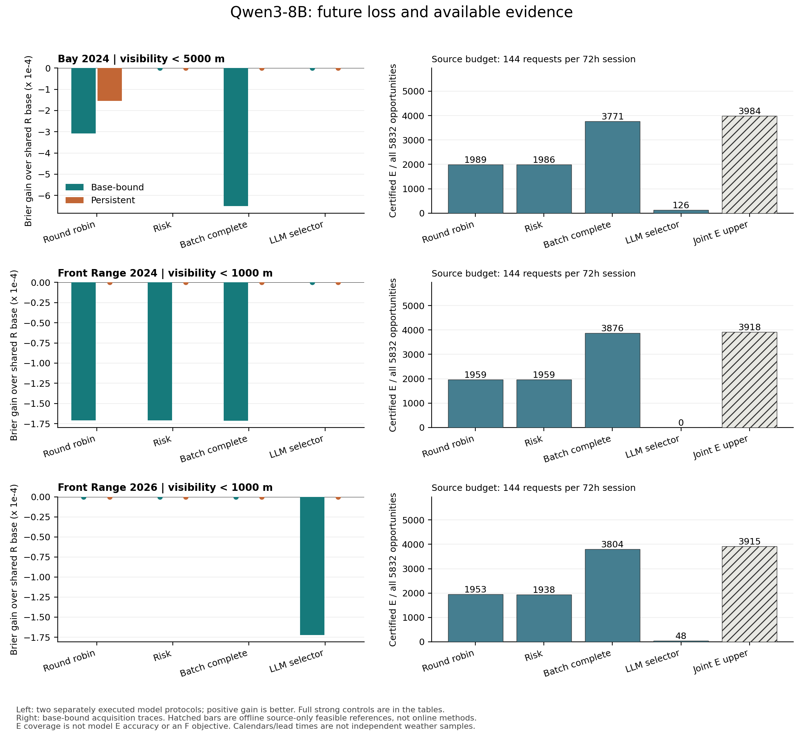
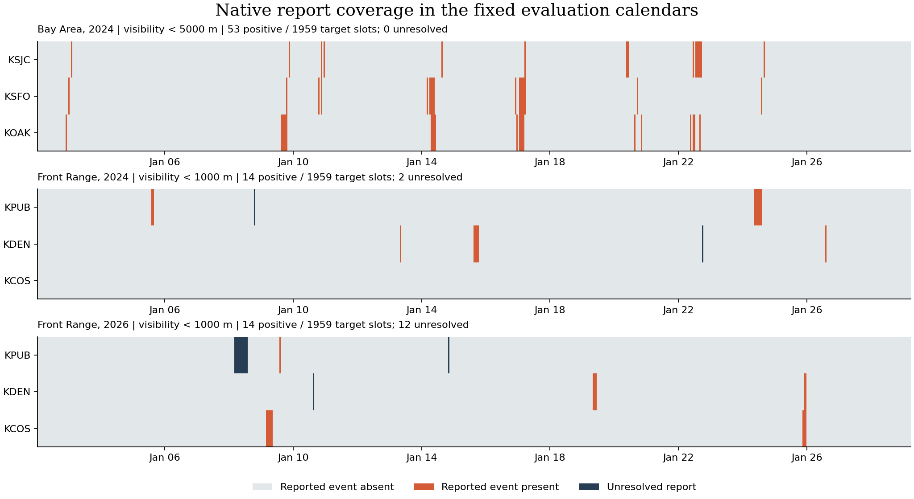
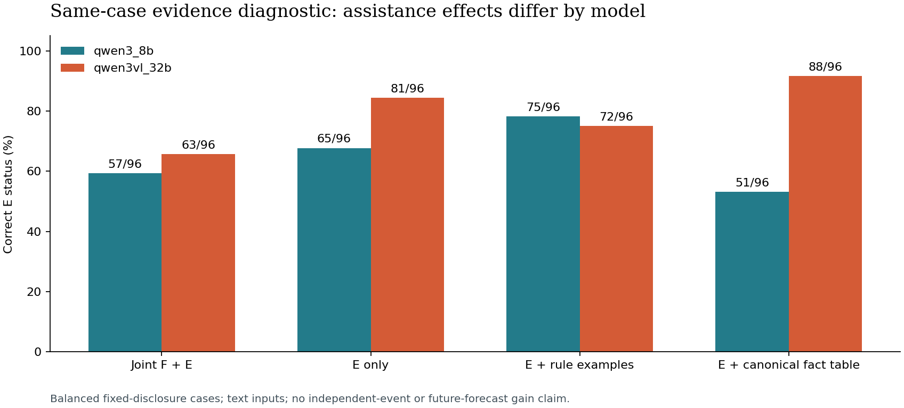

# v7 复查落实后的实际结果与交接

生成时间：2026-09-13T01:28:33.917217+00:00。统计依据为已完成回执，未完成任务不计入验证数量。

本轮保持 v7、C1/C2/C3 和 16 类整体目标，补严复查要求并实现 monitoring_v1。
真实区域开发闭环、模型推理和离线结果重建均已有证据；当前仍不是独立机制确认或完整 16 类科学发布。
完整后续路线见 `OVERALL_EXECUTION_ROADMAP_CN.md`，逐项合同见 `PLAN_AMENDMENT_CN.md`。

推荐文件与历史版本的区别见 `ARTIFACT_INDEX_CN.md`；所有计数均按当前核验记录解释。

## 1. 实际完成数量

- 当前测试记录：109 项，失败 0、错误 0、跳过 0。
- 另列 4 项排序指标检查、3 项重排案例配对检查、5 项发布扫描检查和 1 项真实本地 Git 发布隔离测试；不计入上述 109 项实现/分析分母。
- 实际独立核验模型调用：33,944；实际核验 token：82,231,506。
- 已验证完成 GPU 作业：50；已提交作业：50。每作业 1 卡 H100，队列按账户合计最多 4 卡调度。
- 原始两份复查包 11 个清单成员核验；分别 8 和 6 个示例复跑，单列于实现测试。
- 原审阅 11 项与补充 R1–R5 均有问题映射；81 份真实联合 E 参照重新核验一致。
- 无新增付费 API、模型训练、人工逐条标注或 LLM judge。模型回放不重复计作新推理。

### 已核验批次

| 批次 | 实际调用 | 实际 token | GPU 作业 |
| --- | ---: | ---: | ---: |
| gpu_active_pilot_01_validation_02 | 64 | 150,283 | 4 |
| gpu_bay_secondary_base_01_validation_01 | 5,184 | 12,990,627 | 4 |
| gpu_bay_secondary_persistent_01_validation_01 | 5,184 | 12,976,759 | 4 |
| gpu_e_diagnostic_01_validation_01 | 384 | 388,537 | 1 |
| gpu_e_diagnostic_32b_01_validation_01 | 384 | 388,847 | 1 |
| gpu_e_order_32b_ab_01_validation_01 | 192 | 115,773 | 1 |
| gpu_e_order_32b_ba_01_validation_01 | 192 | 115,773 | 1 |
| gpu_e_order_8b_ab_01_validation_01 | 192 | 116,584 | 1 |
| gpu_e_order_8b_ba_01_validation_01 | 192 | 116,584 | 1 |
| gpu_front_primary_base_01_validation_01 | 5,184 | 13,224,805 | 4 |
| gpu_front_primary_persistent_01_validation_01 | 5,184 | 13,210,234 | 4 |
| gpu_mm_01_validation_01 | 72 | 180,867 | 4 |
| gpu_pilot_02_validation_01 | 16 | 23,871 | 4 |
| gpu_replication_primary_base_01_validation_01 | 5,184 | 13,184,119 | 4 |
| gpu_replication_primary_persistent_01_validation_01 | 5,184 | 13,169,414 | 4 |
| gpu_x01_base_01_validation_01 | 576 | 939,279 | 4 |
| gpu_x01_persistent_01_validation_01 | 576 | 939,150 | 4 |

ACP 保存回执重建的最大请求 GPU 重叠为 4；50/50 个作业已核验，未核验提交 0 个。
最终在线账户核对见 FINAL_ACCOUNT_CHECK.json，本轮所有作业均已成功结束，核对时账户活跃请求 GPU 为 0。该检查不等同于 GPU 利用率或费用账单。

最新队列状态见 `gpu_queue_01/STATUS.json`。收到响应不等于通过 token、费用和分数核验；已消费批次不能重新启动。

## 2. 复查意见落实到哪里

| 合同问题 | 本次实现与验证 | 仍然不代表 |
| --- | --- | --- |
| 模型可见支持与隐藏答案混淆 | 明确 reference/support/scope/version；产品事实、估计、隐藏标签分开 | 原生图像自动具有正确物理 mask |
| 空集、订正、无穷上界、空间重叠 | inconsistent 独立状态；合法版本替换；无上界缺测保留 +∞；唯一 cell 面积 | 所有测量误差已经统一建模 |
| 单目标与共享预算联合可达 | 同一合法路径、向量预算、并发/截止、Pareto 组合、独立见证检查 | 每个单目标可达就能全部同时完成 |
| 未来物理与未来发布混淆 | 完整 TargetSpec；physical/product-release/partial-window 分轨 | 产品晚发布就描述未来天气 |
| 两修订协议与指纹 | 相关完整内容、同刻顺序、过期/撤销、当前状态、固定轨迹回放 | 自动回退带来的收益全部属于模型 |
| X01 因素和私有状态泄漏 | 分配/权限/selector 分离，私有 fresh contexts，公开时槽；派生资产继承权限 | 缓存或实际时延差异已被识别为智能调度 |
| 缺失掩膜与总体外推 | 全机会保留；共享目标结果的更紧界，风险/时段/来源/质量分层 | 掩膜相同就不存在选择性缺失偏差 |

见证验证器新增完成时刻/求解窗口检查之前，已有求解器结果未被发现错误。新增反例先失败后修复，随后 81 个已存参照保持一致。
原生 TAF 严格解析失败保留原文和原因，冻结 fallback 取代静默沿用旧映射；历史失败目录和首次失败日志均保留。

## 3. 实际数据与任务分母

| 日历/阈值 | 登记机会 | 可结算 | 正例机会 | 唯一正例目标小时 | 未解析新版 TAF 回退机会 |
| --- | ---: | ---: | ---: | ---: | ---: |
| extension_bay_area_01, <5000m | 5832 | 5832 | 159 | 53 | 0 |
| extension_front_range_03, <1000m | 5832 | 5826 | 42 | 14 | 18 |
| replication_2026_01, <1000m | 5832 | 5796 | 42 | 14 | 6 |

每段是预先固定的 27 天日历，9 个 72h 资源会话，3 个站点和 1/3/6h 提前量。多个提前量共享同一目标结果；资源会话和连续正例片段都不是独立风暴数。
湾区严格 <1000m 没有正例，<5000m 是明确的次要低能见度任务。Front 正例含雪和冻雾；不能把低能见度都称为浓雾，也不能称跨区域即跨独立物理过程。
原生 METAR 两批独立解码分别核对 6,120 和 3,671 条，检查过的站名/时间/阈值一致。独立 TAF 比较的 2,753 份唯一公告中，2,680 份匹配检查字段；67 份保留 72 个 FM 分钟差异，6 份严格解析隔离。外部 AVWX 丢弃 FM 分钟，原文与 NWS 规则支持保留精确分钟；不声称整份 TAF 语义已经完全双解码一致。
2024 使用此前 2023 年 12 月映射；2026 先登记完整日历与方法，再下载数据，使用此前 2025 年 12 月映射。拟合和检查之间保留隔离段，但跨年份不自动证明独立过程或排除训练污染。

两年的映射拟合地区都是湾区 KSFO/KOAK/KSJC；Front Range 没有用当地评测结果重拟合。因此 Front 比较同时包含跨地区 R 映射迁移，不是经过本地校准的官方概率。2026 的这一设定在 REPLICATION_2026_METHODS.json 中事先登记。

## 4. C1：全机会预测与强对照

共同完整 TAF 转换出的概率属于 **R 研究轨**，不是官方原生事件概率。增益定义为共同基线 Brier 减系统 Brier；正值才表示损失下降。

### 湾区 2024 / <5000m

依据：`calendar_analysis_bay_02/REPORT.json`。

| 方法 | Brier | 相对共同基线增益 | 实际模型调用 |
| --- | ---: | ---: | ---: |
| model/qwen3_8b/round_robin/base_bound_override | 0.029922526 | -0.000308735 | 1296 |
| model/qwen3_8b/risk/base_bound_override | 0.029613791 | +0.000000000 | 1296 |
| model/qwen3_8b/batch_complete/base_bound_override | 0.030264701 | -0.000650909 | 1296 |
| model/qwen3_8b/llm/base_bound_override | 0.029613791 | +0.000000000 | 1296 |
| model/qwen3_8b/round_robin/persistent_override | 0.029768306 | -0.000154514 | 1296 |
| model/qwen3_8b/risk/persistent_override | 0.029613791 | +0.000000000 | 1296 |
| model/qwen3_8b/batch_complete/persistent_override | 0.029613791 | +0.000000000 | 1296 |
| model/qwen3_8b/llm/persistent_override | 0.029613791 | +0.000000000 | 1296 |
| program/FOLLOW/base_bound_override | 0.029613791 | +0.000000000 | 0 |
| program/FOLLOW/persistent_override | 0.029613791 | +0.000000000 | 0 |
| program/all_read/base_bound_override | 0.029335874 | +0.000277918 | 0 |
| program/all_read/persistent_override | 0.029459672 | +0.000154119 | 0 |
| program/capacity_revise_defer/base_bound_override | 0.029647135 | -0.000033344 | 0 |
| program/capacity_revise_defer/persistent_override | 0.029544391 | +0.000069400 | 0 |

### Front 2024 / <1000m

依据：`calendar_analysis_front_02/REPORT.json`。

| 方法 | Brier | 相对共同基线增益 | 实际模型调用 |
| --- | ---: | ---: | ---: |
| model/qwen3_8b/round_robin/base_bound_override | 0.007963165 | -0.000171074 | 1296 |
| model/qwen3_8b/risk/base_bound_override | 0.007963165 | -0.000171074 | 1296 |
| model/qwen3_8b/batch_complete/base_bound_override | 0.007963277 | -0.000171186 | 1296 |
| model/qwen3_8b/llm/base_bound_override | 0.007792091 | +0.000000000 | 1296 |
| model/qwen3_8b/round_robin/persistent_override | 0.007792091 | +0.000000000 | 1296 |
| model/qwen3_8b/risk/persistent_override | 0.007792091 | +0.000000000 | 1296 |
| model/qwen3_8b/batch_complete/persistent_override | 0.007792091 | +0.000000000 | 1296 |
| model/qwen3_8b/llm/persistent_override | 0.007792091 | +0.000000000 | 1296 |
| program/FOLLOW/base_bound_override | 0.007792091 | +0.000000000 | 0 |
| program/FOLLOW/persistent_override | 0.007792091 | +0.000000000 | 0 |
| program/all_read/base_bound_override | 0.007999122 | -0.000207031 | 0 |
| program/all_read/persistent_override | 0.007989076 | -0.000196985 | 0 |
| program/capacity_revise_defer/base_bound_override | 0.007868011 | -0.000075920 | 0 |
| program/capacity_revise_defer/persistent_override | 0.007908701 | -0.000116610 | 0 |

### Front 2026 / <1000m

依据：`calendar_analysis_replication_01/REPORT.json`。

| 方法 | Brier | 相对共同基线增益 | 实际模型调用 |
| --- | ---: | ---: | ---: |
| model/qwen3_8b/round_robin/base_bound_override | 0.007193127 | +0.000000000 | 1296 |
| model/qwen3_8b/risk/base_bound_override | 0.007193127 | +0.000000000 | 1296 |
| model/qwen3_8b/batch_complete/base_bound_override | 0.007193127 | +0.000000000 | 1296 |
| model/qwen3_8b/llm/base_bound_override | 0.007365302 | -0.000172175 | 1296 |
| model/qwen3_8b/round_robin/persistent_override | 0.007193127 | +0.000000000 | 1296 |
| model/qwen3_8b/risk/persistent_override | 0.007193127 | +0.000000000 | 1296 |
| model/qwen3_8b/batch_complete/persistent_override | 0.007193127 | +0.000000000 | 1296 |
| model/qwen3_8b/llm/persistent_override | 0.007193127 | +0.000000000 | 1296 |
| program/FOLLOW/base_bound_override | 0.007193127 | +0.000000000 | 0 |
| program/FOLLOW/persistent_override | 0.007193127 | +0.000000000 | 0 |
| program/all_read/base_bound_override | 0.007194351 | -0.000001224 | 0 |
| program/all_read/persistent_override | 0.007195003 | -0.000001876 | 0 |
| program/capacity_revise_defer/base_bound_override | 0.007193127 | +0.000000000 | 0 |
| program/capacity_revise_defer/persistent_override | 0.007193127 | +0.000000000 | 0 |

全零概率和冻结此前月份频率是看到首轮结果后补充的强对照，属于事后诊断。它们对所有机会直接预测，不是 wrapper 行动轨迹；不使用评测月份结果拟合。

| 日历 | 全零 Brier | 前月频率 Brier |
| --- | ---: | ---: |
| Bay 2024 | 0.027263374 | 0.028793760 |
| Front 2024 | 0.007209063 | 0.008425698 |
| Front 2026 | 0.007246377 | 0.007195582 |

全零预测即使 Brier 更低，也没有在正概率预警阈值下识别正例的能力。必须同时查看事件率和正例目标数。
真实 IEM 批量请求显示，三站一小时报告仅 944–958 字节，一天 72 条报告为 17,155 字节。归档按站点槽位计费并不证明现实的数据获取稀缺。
模型调用次数/源请求额度与 token/计算时间硬上限分别报告；没有耗尽的预算不能称为实测瓶颈。廉价程序 1ms 是声明记账，不是 CPU 性能测量。
本轮当前证据未确立主动 LLM 的一般正预测增益。任何后续新结果应按对应已验证报告解释，不能从单条改善推断总体优势。

图中两类纵轴分别对应 F 损失与可见 E 支持；联合 E 上限是离线源查询参照。完整强对照与分母以表和机器报告为准。

### 概率排序与实际资源

AP/ROC 是看到首轮 Brier 结果后补充的描述性检查，所有同分预测一起处理，不选择获胜阈值。排序能力和概率损失分开报告。

| 日历 | 共同 R 基线 AP | 共同 R 基线 ROC AUC | 常数预测 AP / 事件率 |
| --- | ---: | ---: | ---: |
| Bay 2024 | 0.02809536 | 0.49010263 | 0.02726337 |
| Front 2024 | 0.03952583 | 0.73728841 | 0.00720906 |
| Front 2026 | 0.00719119 | 0.41602115 | 0.00724638 |

2026 共同 R 基线的 Brier 略好于全零，但 AP/ROC 未显示良好事件区分；在可结算机会上，其分数均未达到这里事后固定的 0.01 阈值。概率损失较小不能直接等同于预警识别好。Front 2024 的排序较好，也不能外推到另一年。

实际预算与全日历 E 核验：`resource_analysis_02/REPORT.json`。

| 日历 | token 额度使用区间 | compute 额度使用区间 | 达模型调用上限的会话 / 总会话 |
| --- | ---: | ---: | ---: |
| calendar_analysis_bay_02 | 16.83%–33.99% | 0.99%–1.91% | 72/72 |
| calendar_analysis_front_02 | 17.08%–34.47% | 0.97%–1.81% | 72/72 |
| calendar_analysis_replication_01 | 17.09%–34.53% | 0.91%–1.89% | 72/72 |

这些是冻结实验的配额，不是自然数据稀缺或 GPU 满载证据。selector 和 predictor 同账计费；完整日历中的主动 selector 占模型调用的一半。
全日历的 E 混淆矩阵、模型实际更新的目标数和错误都保留。各方法选择更新的目标及已读资料不同，因此不能把条件正确率当作同分母 selector 排名，也不能用平衡 E 诊断替代全日历表现。

## 5. C2：可测的证据判断错误与辅助条件

先分开看合法已读产品能确定多少 E、以及模型是否正确理解这些产品。联合参照每个会话只使用一条满足源资源/截止的路径，单目标可达数不是共同可完成数量。

| 日历，每会话 144 次源查询 | 单目标可达数之和 | 联合源查询 E 上限 | 轮询实际 E | 强批量实际 E | LLM selector 实际 E |
| --- | ---: | ---: | ---: | ---: | ---: |
| Bay 2024 | 5646 | 3984 | 1989 | 3771 | 126 |
| Front 2024 | 5814 | 3918 | 1959 | 3876 | 0 |
| Front 2026 | 5718 | 3915 | 1953 | 3804 | 48 |

每个日历均保留全部 5,832 个 E 机会，包括未来 F 尚未结算的目标。这里只优化源查询的 E 覆盖，不优化模型计算或未来损失；上限与实际的差额是会话整体的诊断空间，不是把每个未获取的目标都判为失败。
参照由评估侧完整归档离线求得，不传给模型，也不保证在线策略可以识别最优路径。这也不是模型判断正确率。可见产品已能确定 E 时，模型仍可能读错；F 策略也没有义务最大化 E 覆盖。各预算和全部方法见 `joint_E_analysis_*`。

| 96 个相同案例的条件 | Qwen3-8B 正确数 | Qwen3-VL-32B 文本条件正确数 |
| --- | ---: | ---: |
| joint_F_E | 57/96 | 63/96 |
| E_only | 65/96 | 81/96 |
| E_examples | 75/96 | 72/96 |
| E_fact_table | 51/96 | 88/96 |

supported/refuted/undetermined 各 32 个案例，来自真实可见报告状态，不按未来 F 结果挑选。32B 在某些辅助条件下更好，而事实表对 8B 并非一律改善。
四条件比较同时涉及任务负荷、输入和输出合同变化，且首轮按固定顺序执行，只能作为诊断，不能称单因素因果效应。E-only 与事实表这两个子条件的 system/输出合同相同，后续另做保持消息不变的执行顺序复核。E 可判定也不意味着该证据足以改善未来 F。
真实 E 只涉及预登记的邻站 routine 槽位，槽位开始为 cutoff 前两小时。不是全部最新观测，更不是隐藏结果或自动理解的图像 mask。

### 保持消息不变的执行顺序复核

此补查在看到首轮结果后登记，改变案例排列及条件先后，消息和 greedy 参数不变。每行仍是相同的 96 个案例，不增加独立天气样本。

| 批次 | 条件 | 正确 / 96 | 相对原轮判断变化 | 原始回答变化 |
| --- | --- | ---: | ---: | ---: |
| gpu_e_order_8b_ab_01 | E_only | 65 | 0 | 0 |
| gpu_e_order_8b_ab_01 | E_fact_table | 51 | 0 | 0 |
| gpu_e_order_8b_ba_01 | E_fact_table | 51 | 0 | 0 |
| gpu_e_order_8b_ba_01 | E_only | 65 | 0 | 0 |
| gpu_e_order_32b_ab_01 | E_only | 81 | 0 | 0 |
| gpu_e_order_32b_ab_01 | E_fact_table | 88 | 0 | 0 |
| gpu_e_order_32b_ba_01 | E_fact_table | 88 | 0 | 0 |
| gpu_e_order_32b_ba_01 | E_only | 81 | 0 | 0 |

四次顺序复核的 768 条回答均与原轮对应案例的原始回答和 E 判断一致。本轮的 8B 事实表下降、32B 事实表上升因而没有被这两种执行排列改变。

逐案例实际输入 token 与原轮一致，实际案例顺序与冻结排列一致。条件先后由冻结的串行 worker 执行；没有跨任务同步时钟日志。
变化与不变化都保留；不能据此证明没有任何硬件效应、区分案例与条件顺序的单独因果效应，或声称新增 F/图像收益。

## 6. 两修订协议与多模态的边界

两协议均有独立推理轨迹，同时保留固定候选/完成时间的直接 wrapper 回放。湾区固定输出比较中，八个模型方法/协议轨迹的全部 5,832 个机会分数都未改变。分别运行的差异不能因此归因于回退收益。详见 `wrapper_analysis_bay_01/REPORT.json`。
GOES-18 C07/C13 的两组同区域同期原生数据已实际读取并进入 Qwen3-VL-8B 图像处理器，72 条输出有 tensor/token 核验。原生图、数字摘要和辅助表示具有不同信息损失；结果只覆盖一个区域过程。
这不证明表面雾真值、第二种独立多模态物理过程或原生图像预测收益。32B 的原轮及顺序复核均为文本诊断，不能计为新图像实验。

| 固定原候选的协议改换 | 损失发生变化的可结算机会 | persistent 相对 bound 的 Brier 增益 |
| --- | ---: | ---: |
| wrapper_analysis_front_01/model/qwen3_8b/batch_complete/base_bound_override | 1 | -0.000170986 |
| wrapper_analysis_replication_01/model/qwen3_8b/llm/base_bound_override | 2 | -0.000344351 |

上表只列固定候选回放中非零的损失变化；完整零变化方法也保留在报告中。Front 2024 的具体失效/截止案例见 `WRAPPER_CASE_WALKTHROUGH_CN.md`，不能把协议作用全部归给模型。

## 7. 复现和交付

本次按模型、原始数据、程序对照和 tokenizer 分别生成内容寻址证据包，逐个完整解压检查哈希；不包含权重或已安装库。精简阅读 ZIP 与完整证据分开，见 `../../publication/v7_review_execution_20260912/EVIDENCE_INDEX.json`。
第一轮实际从这些 ZIP 恢复独立目录，109 项测试通过，2026 的 11 个派生 JSON 逐字节一致，并回放 5,656 次已记录输出。原项目数据/代码读取与外网被阻断，不加载权重，不重新生成回答。回放引用已保存 ACP 回执，不声称新查询了线上资源。
第二轮使用可配置 Python 路径的驱动，也已完成同样的 109 项测试、11 个派生 JSON 一致性和 5,656 条输出回放；两轮不是新增模型样本。见 `packaged_replay_02_receipts/COMPLETE.json`。环境版本、复现命令与未测平台边界见发布目录的 `REPRODUCE_CN.md`。

另外，从三份实际 ZIP 单元恢复了 2026 base 批次，在新的隔离根目录重建 5,184 条已记录输出和 13,184,119 个 token；报告逐字段匹配原核验。
此检查同样禁用原项目读取与外网、不加载权重；没有新增模型调用。见 `packaged_replay_replication_01_receipts/COMPLETE.json`。

有界实时观察器已完成并核验：12 轮、40 次请求、19 个唯一产品发现；其中 18 个是初始左删失发现，1 个具有前后成功轮询的发现区间。
KDEN 新版在本服务的发现区间为 2026-09-12 21:51:40.521483 至 22:01:41.410366 UTC。这不证明全球 first-seen，也不把这些新回执反填历史输入时间；没有要求等待未来灾害才能完成历史闭环。

H08 来源成熟度补查实际重取了同一历史窗口的 3 个 USGS 文件，新下载 474,746 字节；687 条原生记录完整配对，无流量、质量或 last_modified 变化。
两次原文和此前六个目标都保留。当前仍为 provisional；一次重复稳定不保证以后不订正。此项是 H08 来源版本预检，不是新洪水预警引擎或官方流量阈值验收。见 `hydro_revision_validation_01/REPORT.json`。
三个响应的文件哈希都变化，但原生 features 完全相同，仅封装的 timeStamp 改变；`HYDRO_PAYLOAD_VERSION_CHECK.json` 保存逐文件证据。文件身份变化不能自动等同于目标事实订正。

H08 的官方 NWPS 元数据另外完成 3 次请求，核对 3 个 NWS–USGS 映射。三站均有当前 minor 水位阈值（NRWI4 22 ft、CRHA2 17.2 ft、SCOC1 51 ft），但流量阈值均为缺失 -9999。
因此保留原 QINE/CFS 连续流量任务；下一阶段须核验水位预报、USGS 00065/NWPS 水位、共同 datum 和阈值历史，或取得正式且适用于相应时段的水位—流量关系。历史洪峰表中的配对数值不能代替该关系。

随后实际下载了三个站点的 NWPS 原生水位预报/观测及 USGS 00065 水位：6 次请求、1,334,376 字节，275 条精确同刻水位全部相等。NRWI4 另有 4 条 USGS 时刻在本次 NWPS 观测中缺失，未用邻近记录补齐。
NWPS 三站共有 160 条原生确定性水位预报点；其 secondary 流量单位为 kcfs。NWPS 可能转发 USGS 数据，两个接口不是两份独立真值；当前数值一致不证明历史 datum/阈值始终不变。该预检缩小 H08 下一步的来源缺口，尚未形成新引擎预警任务。见 `hydro_stage_validation_01/REPORT.json`。

## 8. 下一阶段如何推进

先保留当前所有结果，检查实际生效的资源约束、研究基线的迁移稳定性，以及补充证据对程序对照是否有可测增量；不要继续扩大一个未显示收益的同类模型矩阵。
按整体路线优先将新引擎接到 H08 的 HEFS/USGS 同目标链，再向 H01、H07、H10/H11 扩展。H03–H06 要解决原生概率窗口与报告/传感器参考；H13/H16 需正确命名未来产品发布；H14 需成因和同步 CAMS 合同。
目前所有 16 类的正式新 monitoring 准入标志仍为 false。H15 是真实开发链，其余已有历史样例和计划合同不等于本轮完整新任务。H08 新引擎链、六组独立迁移、第二物理过程 MM 和完整 16 类科学发布仍待执行。
发布等级保持工程/开发验证。C2 已有可重建的测量对象和错误证据；C1 正收益、C3 完整体系以及论文的最终 novelty 认可仍须独立任务、强对照和实际交付证明。
