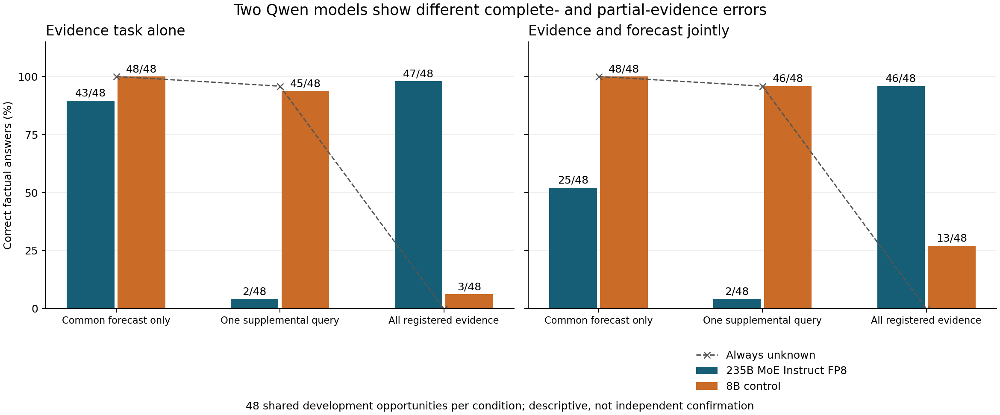
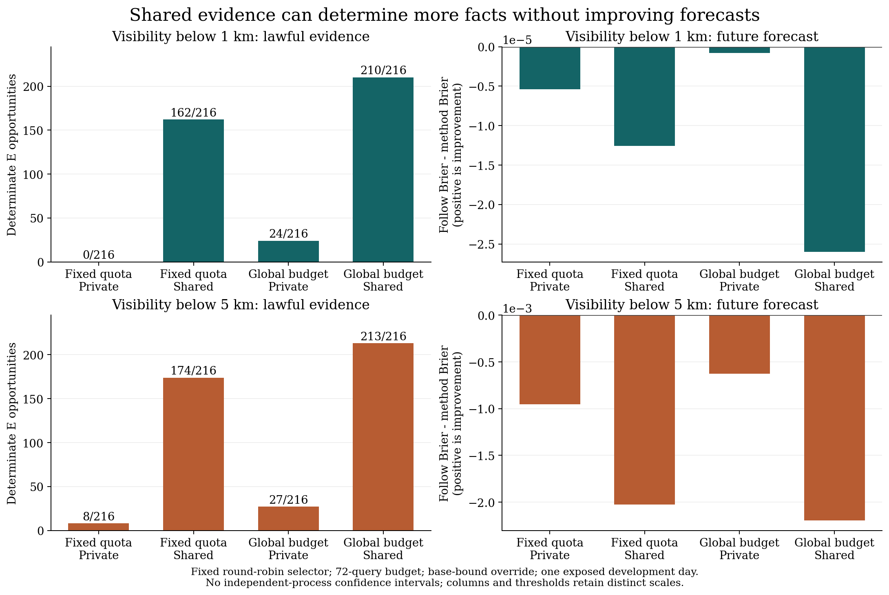
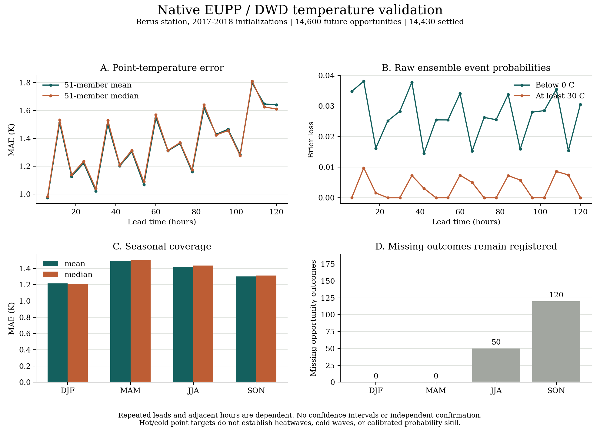

# DisasterTrace v8：本轮实际执行与证据说明

本轮授权时段：2026-09-13 14:45:50 至 2026-09-14 02:45:50 UTC。
最多同时使用 4 张 H100。本文对应 `v8_measurement_execution_20260913_01`，
状态由 `EXECUTION_STATUS.json` 和各实验的原始回执更新。未将这些开发结果作为独立确认。

## 本轮收尾结果（2026-09-14）

**52 个全日会话全部结束，5,108 次自适应真实调用完成独立对账与四组计分。**
加上固定输入实验 1,010 次调用，本轮共 6,118 次实际模型调用，X09 为零。
11,232 是重复方法机会数，只对应同一个 Bay 开发日的 432 个不同 cutoff 机会。
完整方法表、E 混淆、费用和 F 分数见 [自适应结果表](ADAPTIVE_SCORECARD_CN.md)。

4,916 次预测回答中，4,915 次精确等于输入显示的当前生效概率，另一次等于显示的最新基线。
其中 1,054 次不同于最新基线，零次同时不同于这两个可见概率。数值相等不证明内部推理过程，
但不能将沿用旧值以及系统自动 OVERRIDE 的效果归为模型创造了新的预测概率。
5km/base-bound 条件下，批量取证的模型 E 正确为 192/216，单条取证为 78/216；
但模型 F 都与共同基线同分。持续覆盖条件的模型 F 在 1km 条件略好、5km 条件略差，
均应结合旧值保留解释。1km 零正目标、5km 只有两个正目标，不能支持独立预报收益。

原自动审计在任务时限前完成 35/52 个单会话核验，已完成者均通过；它没有完整成功回执。
最终审计来自 `gpu/adaptive_large_02/audit_parallel_merged_01/`：51 个增量核验加一个同冻结
验证器的原自动核验，逐项绑定原报告、checkpoint、journal 和调用。三组由原规范评分器
完成，最后一组并行执行原 journal 回放、缓存相同引擎供原评分函数使用；另一个完整
13 臂对照组与原串行评分逐项完全相同。原始不完整审计及导入来源全部保留。
GPU 平台状态为 FAILED，终止时刻 02:35:06 UTC；推理 worker exit=0，52 控制器均 exit=0，
原自动审计因既定外层时限未完成。不能将平台状态写成 SUCCEEDED，也不能把它等同推理失败。
所有 GPU 已退出，本轮未新增 GPU 作业、模型重试或 API 请求。

本轮 502 项不同相关测试通过；另有 1,083 个冻结文件、分离评估器和原 Git 暂存身份保全核验。
结果图已生成并人工查看排版，评分和标签仍由自动程序核验，不新增人工标签。

## 1. 本轮已经从计划走到哪里

本轮优先修复测量链，再用真实资料、大模型和独立回放验证它。主线仍是：
共同专业预报持续更新，策略在有限预算内选择补充资料与预测计算，评估器分别结算
当前事实 E、未来预测 F，后续再扩展决策 D 和原生多模态 MM。

### 代码与协议

- 统一原生产品“先选当前版本，再判断目标覆盖”的规则；订正、撤回、同刻冲突不靠文件名决胜。
- 单时钟事件先验证再原子提交，避免非法事件留下半注册状态；保留收到但超时、未知费用和失败记录。
- 结果按目标合同与结果版本唯一登记；多提前量共同引用同一结果，公平比较检查基线、机会、资源和允许干预。
- source、selector、predictor 的执行身份分别绑定。程序预测和模型预测明确分开计费。
- 本地提交式 outbox 支持 pending source/selector/predictor 在新进程中恢复，原请求不重发、旧截止不被晚到资料改写。
- 准备任务沿用同一个时钟，补充阈值、EDF 和两步滚动对照；外生计划与在途请求共同恢复通过，并新增读取当时已生效 F 的条件 D 策略回放。

当前 **485 项核心相关测试通过，另有 5 项启动边界、6 项联合分析和 6 项可见概率归因检查通过；均无失败、错误或跳过**。GPU 批次保留其 439 项测试对应的原冻结代码。
这是本轮测量代码与相关合同测试，
不是整个历史仓库的所有测试。各次失败和修复均保留，不能把重复运行的通过数累加。
证据：`REGRESSION_MATRIX_07.json`、`validation/full_joint_targets_24.xml`。
原 `REGRESSION_MATRIX.json` 保留 GPU 冻结版本的历史记录。

### 原始数据和旧结果保全

94 个原生捕获、432 个原基线选择和 360 个历史模型回答重新核验。
没有用新回答替换旧错误；216 个与基线同值的旧 F 提议仍记为 OVERRIDE。
原 Git 索引及源码快照保留，旧任务的单次 launch 不重开。
本轮没有 Git stage、commit 或 push。

## 2. 实际大模型实验

已完成 **Qwen3-235B-A22B-Instruct-2507-FP8** 和新的 Qwen3-8B 固定输入对照。
235B 是 MoE 总参数规模，名称中的 A22B 表示约 22B 激活参数；不能将其表述为 235B 稠密模型。
两模型结构、训练和量化不同，因此比较不能单独识别参数量的因果效应。

权重 35 个文件、24 个 safetensor 分片已校验，共 236,449,101,384 bytes。
四卡任务 `pt-kb7tiwn5` 成功：每模型 504 个正式诊断回答，加 1 个兼容性调用，
合计 **1,008 个正式回答、1,010 次实际调用**。
全部正式回答通过原文/token/持久化绑定检查，及时、EOS 终止、可解析；无选择性重试。

每模型包括 72 个 TAF 时间表示任务和 432 个 E/F/联合输出任务。
后者由同一批 48 个开发机会重复组合证据条件和输出头，不能算作 432 个独立天气过程。

| E 任务与证据条件 | 235B 正确数 | 8B 正确数 |
| --- | ---: | ---: |
| E-only，只给共同专业信息 | 43/48 | 48/48 |
| E-only，一条补充资料 | 2/48 | 45/48 |
| E-only，所有注册资料 | 47/48 | 3/48 |
| E/F 联合，只给共同专业信息 | 25/48 | 48/48 |
| E/F 联合，一条补充资料 | 2/48 | 46/48 |
| E/F 联合，所有注册资料 | 46/48 | 13/48 |

关键问题是**部分证据下的无依据确定性**。235B 经常将一个已读槽位的情况推广为整个
注册集合的结论。原提示已经说明“部分未读时，没看到正例不等于证明不存在”，因此
不能把这些失败归因于评测未告知规则。8B 的高分则常接近一直回答 unknown 的平凡对照。

235B 的 **288 个 F 提议全部保持 dispatch 时的基线概率**；8B 改动 3 个，且一个
严重阈值条件变差。固定输入集在 1km 阈值没有正例，5km 只有一个正目标，
这批不能支持可靠的稀有事件预测收益结论。

TAF 条件覆盖仍有明显错误：235B 的 epoch/ISO 分别为 6/18、5/18；版本任务均为 17/18。
8B 的覆盖均为 6/18，版本为 16/18、18/18。改变时间表示没有产生一致改善。

证据：`reports/large_model_diagnostic_01/`、`reports/large_model_analysis_01/`。
所有解释均属于暴露开发集上的描述性结果。

补充的 `reports/evidence_witnesses_01/` 对 576 个 E 回答重新按可见产品区间核算，
全部标签与原评分一致；144 个 TAF 回答绑定原生参考。`EVIDENCE_CASEBOOK_CN.md`
列出无依据确定性、不必要未知和有效期错误的原文例子，不依靠隐藏报告解释 E 标签。

## 3. 自适应评测与程序对照

全日历程序批次 `reports/program_calendar_02/` 包含 10 个方法、两个阈值、两种修订协议，
共 40 条完整轨迹，每条 216 个机会。方法包括 Follow、B-only、one-read、batch、risk、
coverage，以及固定 selector 的分额/全局预算 x 私有/共享授权 2x2。
40 条原运行、各臂回放和四组独立规范评分均已通过。结果见
`reports/program_calendar_optimized_audit_01/BATCH_COMPLETE.json` 和
`reports/program_calendar_analysis_01/`。

原始慢评分器的四组结算随后也全部结束；与加速独立评分器共享的规范分数、合同、结果
及采纳字段逐项完全一致，见 `reports/original_scorer_comparison_03/VALIDATION.json`。
这次核对没有重跑原 40 条轨迹，也没有替换旧结果。

W07 每会话的 source 查询预算是 72，使用公共 30s 调用时隙；W12 自适应批次预算是 48，
采用模型实际成本/交付时序。二者分别分析，不能把跨批次差异归因于 LLM。
W12 内部重新运行自己的程序对照，才能进行同条件比较。

以 5km 阈值、`base_bound_override`、固定 round-robin selector 的 2x2 为例：

| 配置 | 实际 source 查询 | E 已判定 / 216 | F Brier，越低越好 |
| --- | ---: | ---: | ---: |
| 分额预算、私有授权 | 68 | 8 | 0.02270634 |
| 分额预算、共享授权 | 65 | 174 | 0.02377673 |
| 全局预算、私有授权 | 72 | 27 | 0.02237892 |
| 全局预算、共享授权 | 72 | 213 | 0.02394641 |

共同 Follow 基线的 Brier 为 0.02175241。因此，共享条件下虽然更多 E 可判定，
F 总体却没有改善。全局共享有 124 个机会改善、43 个改坏，但改坏的幅度更大。
这是同一天、只有两个正目标的描述性机制结果，不能推出一般天气预报结论。

新的自适应批次为 `gpu/adaptive_large_02/`：

- 13 个方法 x 两个阈值 x 两种协议，共 52 个 24h 开发会话。
- 每会话每小时释放 2 个 source 查询信用，最多 9 个预测和 10 次总模型调用。
- 交叉程序/LLM predictor 与 batch/risk/coverage/LLM selector，另有无补充资料对照。
- 使用一个四卡 TP4 的 235B 模型，最多 4 个相互隔离的会话并行等待/推理。
- 最多 5,376 次模型调用。每条真实请求再次检查输入上限、费用、原始持久化与截止。
- 两轮 52 会话演练及新费用说明的 8 会话演练均通过，每个演练会话为 18 个机会；正式批次每会话为 216 个机会。演练回调不是模型调用。

准备阶段发现选择器文字仍称“每次预测都消耗模型调用”，与程序预测计费不一致。
旧的 `adaptive_large_01` 在零推理时作废并留存；新版显式给出预测器类型及 0/1 次调用费用。
重测 240 个完整日历请求并补充 24 个程序选择器输入形状，最大 9,782 tokens，
低于 15,360 输入上限。此长度检查不穷举每个可能策略分支。

**程序计算使用声明的 1ms 情景，模型计算和传输使用实测时间。** 本轮不将其解释为
业务端到端速度或成本效益。E/F 联合输出也不等于 X09 的多目标联合推理。

## 4. C2 和恢复是否已经有真实证据

`reports/residual_c2_01/` 包含从真实资料与实际剩余状态构造的 3 目标小图和
10 条引擎回放见证。剩余查询为 2 时，三个目标分别可达，但联合最多完成 1 个；
预算为 3 时可完成 3 个；故意延迟起点后可完成 0 个。
这是取得证据的有限合同实验，不能把它的最优值当作未来预测或决策的最优值。

三个恢复实验分别覆盖 pending predictor、pending selector、三条连续 source 请求。
它们使用真实原生归档资料和独立本地进程，每个保留 27 个机会；恢复后结果精确一致。
查询结果在支付和合法完成前不可见，晚到结果不能改写过去 E 状态。
它们尚不证明真实远程 API 的物理 exactly-once，也不覆盖任意并发请求组合。

## 5. 数据究竟验证到哪一级

当前继承 97 个登记产品项和 16 类灾害合同。`decoded_sample` 只说明特定样本已下载、
解码；不意味着所有当前版本/端点都可访问，更不意味着对应完整预测任务已完成。
具体逐项状态见 `data_governance_01/CANDIDATE_SOURCE_DELTA.json`。

| 数据家族 | 本轮实际完成 | 仍未完成 |
| --- | --- | --- |
| Bay TAF/METAR | 原始日历、随后连续 7 日，原生 TAF、缺报/删失、版本和自动结果结算；大模型诊断 | 稀有事件统计与独立机制确认 |
| 纽约、芝加哥、丹佛 TAF/METAR | 各 3 站 x 连续 7 日，共 9,072 个机会；全部真实下载和解析 | 各区域独立基线拟合/校准、模型评分、独立过程划分 |
| EUPPBench + DWD Berus | 2017-2018 两年，51 成员，14,600 个正时效点温度机会，14,430 可结算、170 缺失；960 次标量准入回放 | 热浪、寒潮、多日定义、空间和损失任务 |
| DWD Berus 官方日极值 + EUPP 原生六小时极值 | 730 天 TXK/TNK；1,489,200 个原生预报值和完整时间坐标；2,920 条未来日配对、2,920 条三日事件；独立核算及 480 个准入快照通过 | 连续自适应会话、完整共同基线/补充信息合同、最终持续定义、真实可用时间及独立确认 |
| MRMS MultiSensor QPE Pass2 | 12 个连续小时，2.94 亿原始数值；固定区域裁剪；官方表核单位 mm、缺失 -1、无覆盖 -3、标称 1h 积累 | 具体物理时间端点、历史 first-seen、同目标 F、原生 MM |
| HEFS QINE | 两个循环、43 列、721 个时刻/循环、697 个共同有效时刻；2,788 个版本 E 状态 | 成员定义、调蓄/断面/平均语义及物理 F 等价 |
| 实时 AWC TAF/METAR | 固定 4h 的 17 轮、34 次请求全部完成；25 个不同原生产品解析成功，含 18 个 METAR、7 个 TAF | 实时模型提交、结果成熟和未来分数 |

Bay 连续 7 日的 5km 阈值有 17 个唯一正目标，1km 没有正例。新增三个区域中，
纽约和芝加哥在 1km 仍无正例，丹佛有 3 个唯一正目标。丹佛每个阈值保留 12 个缺报机会。
附近机场、相邻小时、多个提前量和两个阈值都存在依赖，不能当作独立事件计数。

5 份日历合计 **12,528 个不重复 cutoff 机会、4,296 个阈值目标、2,148 个站点时间窗口**。
这是不同分母的说明，不是声称 12,528 个独立极端天气样本。
已有 Bay 银行来自 2023-12 的开发期，跨年使用明确披露，不自动保证整个主动系统已校准。

HEFS 还有一个重要对照：如果完整专业 HEFS 是共同信息，697 个本产品 E 问题已经全部
在零补充查询费用下可判定。其付费 archive 例子仅保留为传输诊断，不能计作 C1 收益。

日值扩展还实际比较了原生小时观测：在相同 720 个完整日上，每 6 小时采样仅识别
14/22 个高温日与 96/114 个霜冻日。因此不能将现有瞬时 EUPP 温度的采样最大/最小值
直接冒充整日极值。详见 `TEMPERATURE_DAILY_REFERENCE_CN.md`；这是数据支持核验，
不是模型预测分数。完整日值档案已可访问，未统计年份也不再视为未接触的确认集。

后续找到并实取另一官方产品中的 `mx2t6/mn2t6`，因此当前已经有明确六小时区间极值
构造的未来日/多日数值闭环。它与此前的瞬时采样诊断不同。730 个起报日中当日已部分
发生的 day0 不作完整未来日，日1-4共2,920条配对保留全部10条参考期外记录。
三日概率沿同一成员轨迹求事件频率，不乘边际概率；独立概率/标签/16组评分复核通过。
11,680个机会在规范结果注册器中对应3,661个目标，120个月度选定机会的480个准入
快照回放通过。可用时间仍为明确声明的归档情景，未校准，也未进入连续LLM取证会话。
详见 `TEMPERATURE_DAILY_FORECAST_CN.md`。

## 6. 决策 D 的状态

本轮实现 6 个明确合成场景，比较不准备、阈值、EDF、两步滚动方法；
24 条轨迹分别结算 8 个二元需求向量，共 192 次合成结算。
24 个 journal 回放和 24 次独立进程延续均精确一致，所有方法的 F 保持相同。

这些场景测量准备、取消、清理、容量、过期与截止的机制，**不包含真实防灾收益**。
两步滚动只在常数概率假设下枚举，不是通用最优调度。策略计算耗时有记录，
但没有计入此合成资源预算，不能用于推导部署效率。
证据：`preparation_controls_01/VALIDATION.json`。

后续工程扩展增加 `preparation_schedule`：在原有会话时钟中执行预先冻结的准备和取消事件，
不另建调度时钟。真实原生记录上的 predictor、selector、source 共 5 次本地跨进程
恢复均通过；每个会话在等待请求时保留已花费 3、清理预留 1，随后取消并清理，最终
已花费 4、清理预留 0，准备与清理各执行一次。共 3 个角色会话使用同一组 27 个机会，
不得当作 81 个独立天气样本。该验证使用确定性程序响应，新增 LLM 调用为 0。

首轮驱动对原生查询耗时的假设不成立，第二轮在成功完成两个角色后遇到目录命名冲突；
两次失败均保存，第三轮只补做尚未执行的 source 角色，成功结果没有重复生成。
汇总入口为 `reports/real_preparation_recovery_summary_01/VALIDATION.json`。
在此基础上新增 `choose_admitted_preparation`，只读取同一时钟当时已生效的概率。
12 项新回归覆盖未来版本不可提前进入、修订协议、候选过期、标量不可冒充概率，
以及选择不改变原状态、恢复后选择一致。

`reports/admitted_decisions_01/` 从一个已独立验证的程序会话提取固定 08/16/24 UTC
三个目标时刻，每时刻全部三个站点，保留 9 个目标、27 个原生机会。四种 D 方法共
12 条轨迹，所有 108 条重复方法机会的 F 与原轨迹完全相同，12 次 journal 回放和
12 次新进程延续通过。两个目标时刻有两种实际 F 概率向量，控制器按当时的值重新判断。
前两个时刻所有方法均未准备；最后一个时刻三个主动方法各准备一个目标、花费 1。
没有为制造策略差异而重新选时段或改成本。

该实验只条件回放已捕获的 F 流；不重新运行取证或预测器，不读取真实未来天气结果，
仅结算 96 个明确合成需求向量。完整会话中 D 与取证/模型共同反馈、任意并发恢复、
模型选择 D 以及真实防灾收益仍未验证。

## 7. 完成度应怎样理解

| 包 | 当前可支持的完成范围 | 剩余范围 |
| --- | --- | --- |
| W00-W05 | 保全、生产入口回归、原生版本、事件原子性、规范结果、资源/身份在当前 H15 合同内通过 | 其他来源/任意异步并发不自动继承全部资格 |
| W06 | 94 捕获、432 选择、360 旧回答重审 | 旧错误不能通过替换结果消失 |
| W07 | 40 条全日历程序轨迹、四组独立评分和 help/harm/2x2 汇总全部通过 | 单日结果不足以作跨过程推断 |
| W08 | source/selector/predictor 的真实资料串行恢复，含外生合成 D 状态和清理费用 | 通用并发、物理远端对账、D 与取证/预测器的完整反馈 |
| W09 | 真实剩余状态的小规模联合可达图及 10 个回放见证 | 更大图的界和跨过程机制确认 |
| W10 | 235B/8B 时间表示诊断与固定输入诊断完成 | 不能将其解释为独立确认 |
| W11 | 更长自然日历、三地区来源、信息条件对照和暴露/缺失登记 | 区域校准、外部极端诊断集、过程分组和样本量 |
| W12 | 52 个真实全日会话、5,108 次调用、四组独立分数与可见概率归因完成 | X09、独立确认、强数值映射与真实部署成本 |
| W13 | 两年点温度、原生六小时极值/日值配对、三日候选概率、规范结果和480个准入快照 | 连续自适应会话、真实可用时间、最终极端定义及独立过程 |
| W14 | 连续 MRMS 原生数值与官方单位/QC/时长 | 确切时间窗、F 配对、原生 MM |
| W15 | HEFS 版本 E 和免费共同专业信息对照 | 物理数值、流量/水位/淹没 F |
| W16 | 固定 F 的 24 条合成 D 轨迹、当前生效 F 的 12 条条件 D 轨迹及 5 次准备/在途请求跨进程恢复 | 完整会话反馈、一般并发、真实场景与独立 D 确认 |
| W17 | 暴露登记与独立过程设计 | 尚未打开预留确认集，未完成独立确认 |
| W18 | 四小时17轮、34次来源请求与25个不同原生产品解析全部完成 | 实时预测提交与成熟结果结算 |
| W19 | 97 登记项/16 类资格差量、回归矩阵和本地复查材料 | 完整 16 类研究级发布未完成 |

## 8. 对整体计划的调整

不需要重起一个 v9。保留 v8 主合同，把执行重心放在：

1. 结束当前冻结的公平自适应开发实验，独立审核原始成本、支持状态和有效概率。
2. 解决部分证据的无依据确定性，并验证主动获取能否改变这一错误；保留无收益结论。
3. 为多区域补齐独立开发基线、自然集/富集集分流和过程分组，再冻结独立确认。
4. 按物理目标资格推进温度、MRMS 和 HEFS；原生 MM、X09 和 D 分别设置出口。
5. 将 source-only 实时采集接入冻结预测协议，作为前瞻扩展；不阻塞历史核心研究。

完整下一阶段说明见 `NEXT_PHASE_PLAN_CN.md`。本轮最重要的新增证据是可复现的
测量链和真实大模型错误结构；当前不能声称模型预测收益、独立 novelty 确认或 16 类完成。
