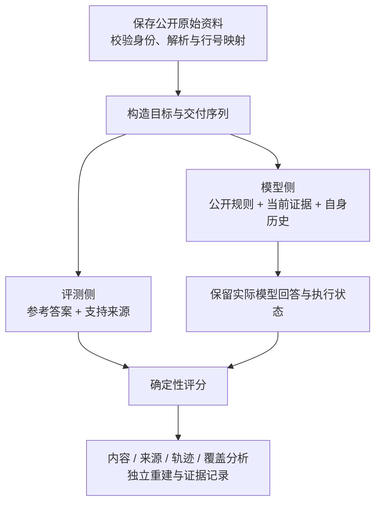

# DisasterTrace 总体汇报：动态天气证据中的 LLM 持续可靠性

本文件是可直接用于制作幻灯片的 Markdown 页面稿。正文 28 页，附录 8 页，以水平分隔线划分页面。配套演讲稿为 `DisasterTrace_Overall_Speech_CN.md`，页码一一对应。

建议完整讲述约 35—40 分钟；以此前已核验结果为依据，证据截止 **2026-09-09 02:44 UTC**。这是一版完整研究汇报，背景、构建过程、实验、局限与下一步均可独立阅读。阶段编号仅在附录用于证据定位。

---

## 01｜DisasterTrace：当天气证据更新，LLM 能否持续给出可信答案？

**研究对象：LLM 对持续发布的天气资料的理解、更新与来源追踪。**

一个可靠答案需要同时满足三项要求：

- **内容正确**：回答对应对象、目标时间、数值与状态。
- **来源正确**：依据来自按公开规则应选取的当前可见版本。
- **过程可靠**：多轮更新中持续成功，而不只是偶尔答对。

今天围绕三个问题展开：benchmark 怎样构建？它怎样保证结果可检查？现有实验揭示了什么？

---

## 02｜为什么天气资料使用需要“动态证据评测”

天气公告连续发布，但用户关注的目标可以始终不变：

> “根据现在已经发布给我的资料，Francine 在明天 18:00 UTC 的持续风速与位置是什么？”

| 资料中的变化 | 系统需要完成的判断 |
| --- | --- |
| 同一目标得到新预报 | 更新答案，并更新支持来源 |
| 新公告没有覆盖这个目标时刻 | 判断是否存在此前的明确陈述 |
| 出现其他时刻、阵风或其他对象的数字 | 保持目标范围，不误取无关数字 |
| 尚无明确陈述，或来源给出消散状态 | 按状态回答，避免填入没有依据的数值 |

**动机：资料会变，答案与证据之间的对应关系也需要持续维护。**

---

## 03｜先看一条真实案例：最新公告不总是覆盖同一个目标

固定目标：**Francine，2024-09-10 18:00 UTC，最大持续风速**。

| 已交付公告 | 发行时间（UTC） | 对这个目标的明确预报 | 按本任务规则应回答 |
| --- | --- | --- | --- |
| 第 005 号 | 09-09 21:00 | 75 KT | 75 KT，引用 005 |
| 再交付第 006 号 | 09-10 03:00 | 没有这一目标时刻的行 | 仍为 75 KT，引用 005 |
| 再交付第 007 号 | 09-10 09:00 | 70 KT | 70 KT，引用 007 |

第 007 号原文节选：

```text
L0025|FORECAST VALID 10/1800Z 25.4N  95.6W
L0026|MAX WIND  70 KT...GUSTS  85 KT.
```

这是**实际来源与参考规则的演示**，不是展示一条已观测模型回答。保留旧公告中的明确目标陈述是本任务政策，不代表 NHC 对旧预报业务有效性的声明。

依据：E1，来源保存了原始字节、行号映射与哈希。

---

## 04｜先界定：当前 benchmark 直接测量什么

| 问题 | 当前评测对象 |
| --- | --- |
| 模型读完资料后能否答对？ | 对已发布陈述的对象、时间、值、状态与来源进行核对 |
| 模型有没有正确处理后续更新？ | 对同一目标连续提问，检查何时修改、何时保持 |
| 这是不是天气预测能力？ | 当前参考是公告陈述；物理预测能力需要另外对照真实观测 |
| 这是不是撤离／救灾决策质量？ | 当前没有以开放行动建议或业务收益作为主评分 |
| 是否已经覆盖所有极端天气？ | 原生资料目前主要是热带气旋预报公告 |

**研究定位：极端天气信息使用中的一个基础环节——动态证据可靠性。**

---

## 05｜已有研究提供基础，我们把测量要求落到具体任务

| 研究方向 | 相关工作 | 对本项目的启发 |
| --- | --- | --- |
| 回答与引用 | ALCE | 内容正确与引用质量分别测量 |
| 知识更新、时间与状态 | LongMemEval、StateMemBench、STALE | 区分当前状态、旧状态及更新行为 |
| 重复成功与可靠性 | tau-bench | 单次成功之外，还要观察重复过程 |
| 高影响天气验证 | Extreme Weather Bench | 以明确事件与时间组织天气评测 |

本项目把**对象与绝对有效时间、当前明确支持来源、逐轮交付和整段可靠性**结合成可执行任务。

动态状态与引用已有直接近邻研究。论文贡献需要由具体任务定义、实证价值与更完整的文献比较支撑。

依据：E8；沿用已核对的原论文标题与摘要，本次未新增文献检索或外部复现。

---

## 06｜benchmark 的整体结构：从资料到可复算的结果



**benchmark 包括数据、任务规则、输入输出契约、执行协议、评分与基线。**

三种历史配置是被测条件；Gold 是评测侧参考；公开规则求解器是程序基线。它们分别承担不同职责。

---

## 07｜为什么构建两条互补任务

| 维度 | 受控更新诊断 | 官方预报原文 |
| --- | --- | --- |
| 为什么需要 | 明确控制“应当改什么、应当保留什么” | 检验自然资料中的时间、覆盖与版本关系 |
| 材料怎样形成 | 真实来源初值＋明确标记的程序生成变化 | 保留完整官方 Forecast/Advisory 文本 |
| 主要观察 | 局部更新、同值修订、作用域干扰、缺证恢复 | 绝对时刻对齐、覆盖缺口、真实修订与终止陈述 |
| 输出 | 四字段状态及任务规定的动作 | 风速、经纬度、状态与来源行号 |

**共同问题是动态证据使用；两条任务分别出分。**

真实来源初值不意味着后续受控变化是真实天气演变；官方原文的真实来源也不使所有任务政策自动成为业务规则。

---

## 08｜数据怎样选、怎样保留、规模怎样计数

| 当前资产 | 独立来源组 | 主要结构 |
| --- | ---: | --- |
| 受控主实验 | 3 个风暴来源组 | 36 条基础 episode，每条 5 个检查点 |
| 原生试点 | 2 个风暴：Francine、Ida | 12 份公告，46 个目标，257 个未来检查点 |
| 原生扩展开发队列 | 6 个新增风暴 | 36 份公告，144 个目标，804 个未来检查点 |

六个新增风暴为 Dorian、Isaias、Henri、Fiona、Lee、Helene，各取最初六份编号公告。

- 保存原始响应、来源身份、规范文本与原始字节映射；解析失败保留准入记录。
- 模型条件、重复和模板变体增加回答机会，**不会增加独立风暴数**。
- 原生两组共八个不同风暴、48 份产品；不与可能重叠的受控来源简单相加。

依据：E1、E2、E5；当前主要是开发数据，未形成独立 heldout 模型结论。

---

## 09｜一道原生题如何生成：目标 × 可见前缀

1. 从选定公告中提取对象与**绝对有效时刻**，固定目标集合。
2. 按发行时间排序公告，逐次构造“截至本轮已交付”的可见前缀。
3. 对每个目标、每个前缀，保留目标时刻仍晚于当前发行时刻的检查点。
4. 仅从该前缀内明确覆盖同一目标的来源计算参考答案。

六风暴队列的机会守恒：

```text
144 个目标 × 6 次交付 = 864 个候选检查点
864 − 60 个非未来检查点 = 804 个纳入检查点
804 × 3 种方法 × 1 次重复 = 每条件 2,412 个计划回答
```

目标集合由所选公告整体构造，属于**离线设计的查询分布**；当轮输入与参考只用可见前缀。发行时间用于受控回放，历史公开可见时间仍有证据限制。

依据：E1、E5。

---

## 10｜模型实际看到什么，需要交出什么

| 模型输入 | 模型输出 |
| --- | --- |
| 公开任务规则与固定格式说明 | 风暴、绝对目标时间与测量种类 |
| 本轮查询和交付位置 | numeric／未陈述／明确终止状态 |
| 累计可见的带行号完整公告 | 风速与经纬度的数值和单位 |
| 方法规定的自身历史载体 | 来源 ID、预报行号、风速行号 |

对第 03 页第 007 号公告，正确输出包含：

```text
Francine / 2024-09-10 18:00 UTC / forecast / numeric
latitude = 25.4 deg; longitude = -95.6 deg; wind = 70 KT
source = al062024-fstadv-007; forecast_line = 25; wind_line = 26
```

这里展示的是参考示例，完整 JSON 见附录 A1。模型请求不包含 Gold 表、正确引用候选清单或纠正后的历史答案。

依据：E1。

---

## 11｜“当前答案”怎样定义，什么时候应该留空

**公开规则：选最新发行、当前可见、明确覆盖同一绝对目标时刻的公告。**

| 当前可见证据 | 应输出的状态与支持 |
| --- | --- |
| 存在目标的明确数值预报 | numeric，三项数值及对应当前来源 |
| 新公告没有目标行，旧公告明确覆盖 | 按本任务政策保留此前最近明确覆盖的陈述 |
| 所有可见公告均未明确覆盖目标 | not_stated，数值与 citation 为空，保留单位字段 |
| 目标行明确写 DISSIPATED／ABSORBED | 对应终止状态，数值为空，引用该目标行 |

不插值，不把阵风当持续风速，不按相同相对时长替代绝对时间。终止陈述只作用于它明确对应的目标时刻。

**not_stated 描述证据状态，不表示现实世界没有该现象。**

依据：E1；schema 支持的状态与实际数据覆盖的状态分别统计。

---

## 12｜不用逐题人工判分，Gold 的可信度来自哪里


- 原始资料、目标规则和行号定位可追溯，参考不是由另一个 LLM 临时打分。
- 两套解析实现的一致性、公开求解和程序反例提供不同检查入口。
- 对解析歧义采用明确准入规则；扩展标头支持时新建版本并保留原失败。
- 共享规范化逻辑、任务政策与数据选择仍可能存在共同盲点。

**自动化减少逐题主观判分，任务范围与科学有效性仍需要研究复查。**

依据：E1、E5；本次材料整理引用已有重建记录，没有重新执行全部研究审计。

---

## 13｜严格正确怎样计算，为什么还要展示分项

原生一份回答的严格正确要求以下条件**同时满足**：

```text
输出结构可解析
AND 目标对象、绝对时刻、测量种类正确
AND 状态、三个数值及规定单位正确
AND 当前来源选择与目标行号正确
```

| 分项 | 用途 |
| --- | --- |
| 返回率、结构合法率 | 判断是否完成交付与格式要求 |
| 值、状态、单位、目标键 | 判断答案内容及对齐情况 |
| 字面支持、当前版本、定位 | 区分“有出处”与“引用满足当前规则” |
| 互斥主错误类别 | 对全部计划机会做不重复的错误分解 |

组件错误可以重叠；互斥类别按固定优先级归属。主严格分数以计划机会为分母，不删除无效、未尝试或未知返回。

依据：E1；受控完整回答还要求其动作正确，不能与原生分数混用。

---

## 14｜三种历史配置究竟比较什么

**共同前提：三个方法都能看到截至当前累计交付的原始资料。**

| 条件 | 原生任务额外携带的内容 | 要观察的问题 |
| --- | --- | --- |
| snapshot | 不附加自己的历史答案 | 直接重新读取累计证据能做到什么程度 |
| structured_state | 上一轮合法解析的答案；无效／缺失时有明确标记 | 上轮状态有助于保持还是带来干扰 |
| answer_history | 此前各轮最终文本，含不可靠历史 | 更多自身历史会怎样改变过程 |

语义错误不会用 Gold 修正，条件之间不交换答案，重复之间不共享历史。

这些条件同时改变历史信息、表示和长度。当前测量不能单独识别模型内部记忆机制；若研究仅靠记忆处理增量证据，需要另建协议。

依据：E1；两个任务的无效历史处理分别冻结，不能仅按方法名推定完全相同。

---

## 15｜模型评测如何执行，失败怎样留下证据

```text
冻结任务 / 模型 / 提示 / 采样 / 计划槽位
→ 按目标轨迹逐轮构造实际请求
→ 提交前检查真实 token 长度与输出预留
→ 先保存原始返回，再提取最终答案与评分
→ 用本方法的实际历史进入下一轮
→ 终态后从保存记录重建结果
```

- 当前原生模型实验使用固定本地模型与公开结构约束，约束格式不保证语义正确。
- 保存请求、输出、种子、终止原因及作业状态；不通过语义修补把失败变成成功。
- 未提交、无效返回和已提交但结果未知分开记录；未知结果不能静默重发。
- 三件事分别报告：**是否收齐、已有运行是否可重建、证据是否完成统一发布**。

当前收集器仍有整 worker 停止造成的轨迹牵连，后面用实际结果说明。

---

## 16｜公开程序能满分，为什么仍然值得评测 LLM

六风暴任务，每个程序策略均保留 2,412 个机会：

| 程序策略 | 严格正确数 | 说明 |
| --- | ---: | --- |
| latest_explicit：按公开规则求解 | 2,412 | 任务有可验证的确定性解 |
| 总选最新公告 | 1,434 | 最新公告未必覆盖目标 |
| 总取同一相对预报时长 | 1,020 | 相对时长不等于相同绝对时间 |
| 总取最后一行 | 108 | 文本位置不等于正确目标 |

任务测量通用模型能否在原文、契约与自身历史共同输入下可靠实现这些步骤。规则程序是应公开报告的强基线，也界定了当前任务的结构性。

**数据规模、来源变化和失效类型决定研究价值；不以规则程序做不到为成立条件。**

依据：E5；这里都是程序诊断，不计入真实模型回答数。

---

## 17｜结果应该按什么单位读：检查点、轨迹和重复

| 单位／指标 | 具体含义 | 回答什么问题 |
| --- | --- | --- |
| 字段正确 | 一份回答中的某个字段满足要求 | 某项内容或引用怎样出错 |
| 检查点严格正确 | 本轮整份答案满足全部要求 | 单个时刻能否完整答对 |
| 轨迹／整目标成功 | 某目标在某方法的一次运行中，所有检查点均正确 | 能否持续可靠 |
| 两次均整段成功 | 同一目标的两次运行都完整正确 | 成功是否能重复出现 |
| 回答覆盖 | 返回数／固定计划数 | 分数包含多少缺失与执行失败 |

“两次都成功”不同于“两次至少一次成功”。一次重复的六风暴队列只能报告单次整目标成功。

风暴是独立来源分组；同一风暴的大量相关检查点不构成大量独立事件。

---

## 18｜实验如何对应研究问题

| 要回答的问题 | 对应实验 | 已有证据规模 |
| --- | --- | --- |
| 值正确是否可能掩盖来源错误？ | 受控更新与同值修订 | 2,160 份 Qwen 回答；8,640 字段机会 |
| 无关资料与自身历史怎样影响持续性？ | 基础／无关作用域干扰，三方法、两重复 | 同一受控矩阵中的配对与轨迹 |
| 在官方原文中能否可靠完成？ | 两风暴原生任务 | Qwen 1,542 份收齐；另有本地第二模型停止前缀 |
| 方法差异能否进一步解释？ | 固定前缀的 JSON／文本对照 | 422 对，844 份单步回答 |
| 事件、状态、协议与收集过程有何影响？ | 六风暴及角色／空白设置对照 | 每模型／协议条件计划 2,412 份 |

受控与原生任务分别报告；表示实验是条件化单步诊断；六风暴是开发队列。后续分析包含探索性解释，不声称所有问题都是最初预注册的假设。

---

## 19｜受控结果：内容正确会漏掉当前引用的失败

同一组 **8,640 个字段机会**：

| 成功要求 | 正确数 | 比率 |
| --- | ---: | ---: |
| 值／状态正确 | 8,517／8,640 | 98.58% |
| 值／状态及当前引用正确 | 8,258／8,640 | 95.58% |

相差 **259 个内容正确但引用未满足要求的字段**，其中 116 个属于同值旧来源。

受控语义示意：

```text
R1：目标 A = 60 → R2 明确替代 R1，目标 A 仍 = 60
回答 60 + 引用 R1：数值没有错，当前来源没有更新。
```

完整回答另需四字段与动作全部正确，为 **1,861／2,160＝86.16%**。这与字段正确率是不同粒度，不把全部差额归于引用。

依据：E2；示意序列不作为真实官方修订案例。

---

## 20｜受控结果：干扰与完整过程揭示了单点分数之外的问题

Qwen3-8B，目标 Gold 不变的无关作用域干扰：

| 方法 | 基础：检查点正确／360 | 干扰：检查点正确／360 | 基础：两次均整段／36 | 干扰：两次均整段／36 |
| --- | ---: | ---: | ---: | ---: |
| snapshot | 340 | 309 | 22 | 11 |
| structured_state | 349 | 319 | 30 | 15 |
| answer_history | 279 | 265 | 13 | 10 |

以上轮状态为例，检查点正确率为 **96.94% → 88.61%**；两次均整段成功为 **83.33% → 41.67%**。

更多历史没有保证更高分。这里的分差是整个输入与闭环过程的表现，混合了长度、历史信息与既有错误；并未单独证明内部记忆机制。

依据：E2；干扰前配对一致，曝光后也保留“仅干扰正确”的反向结果。

---

## 21｜原生结果：官方原文上出现了实际的内容与来源失败

两风暴 Qwen：**1,542／1,542** 份全部返回且结构合法，目标键与单位字符串也全部正确。

| 方法 | 检查点严格正确／514 | 两次均整段成功／46 |
| --- | ---: | ---: |
| snapshot | 187 | 1 |
| structured_state | 194 | 2 |
| answer_history | 146 | 2 |

- 合计严格正确 **527／1,542＝34.18%**。
- 276 条目标×方法×重复轨迹，只有 **19 条**所有检查点正确。
- 互斥失败：764 个值／状态类别，251 个定位或来源相关类别。
- 两个风暴上的 snapshot 与 structured_state 顺序相反。

**结构合法远不足以保证原文证据使用可靠；小规模结果也不足以产生通用方法排名。**

依据：E3；受控与原生材料、字段和契约不同，不把两者分数相连成能力变化曲线。

---

## 22｜固定历史前缀，进一步观察载体表示的差异

在 422 个保存的非初始状态前缀上，分别用 JSON 与可逆文本编码同一信息，生成下一步回答。

| 配对情况 | 数量 |
| --- | ---: |
| 两边都正确 | 88 |
| 仅 JSON 正确 | 30 |
| 仅文本正确 | 55 |
| 两边都错 | 249 |

JSON：**118／422＝27.96%**；文本：**143／422＝33.89%**，差 **+5.92 个百分点**。

两边保留相同历史信息与错误，使用配对的新种子；分支输出不继续串接。文本每个请求多 36—54 token，平均多 47.34。

**结论只针对这些前缀的具体单步表示方案，包含长度与语法差异。**

依据：E4；不能据此声明纯格式效应、完整轨迹收益或文本普遍优于 JSON。

---

## 23｜扩展事件后，方法排序与状态构成仍需分开解释

六风暴 Qwen，收齐的 system／任意空白条件：

| 方法 | 检查点正确／804 | 单次整目标成功／144 |
| --- | ---: | ---: |
| snapshot | 356 | 4 |
| structured_state | 345 | 22 |
| answer_history | 299 | 15 |

两个完整 system 条件的状态分解：

| 条件 | numeric 正确／1,794 | not_stated 正确／588 | 终止正确／30 | 总正确／2,412 |
| --- | ---: | ---: | ---: | ---: |
| 任意空白 | 485 | 502 | 13 | 1,000 |
| 默认分隔符空白 | 502 | 545 | 13 | 1,060 |

单点最多的方法并非整段最多；增加的 60 个正确中，43 个来自 not_stated。**总分变化需要回到问题构成解释。**

依据：E6；一次重复；默认分隔符空白不是零空格 JSON。

---

## 24｜第二模型让输出协议与故障牵连成为测量问题

本地 **DeepSeek-R1-Distill-Qwen-7B**，六风暴每条件计划 2,412：

| 契约角色／空白 | 返回 | 严格正确 | 未尝试 |
| --- | ---: | ---: | ---: |
| system／任意空白 | 1,604 | 3 | 808 |
| system／默认空白 | 1,994 | 9 | 418 |
| user／默认空白 | 2,064 | 6 | 348 |

单位、目标、数值、引用与长度失败并存；严格正确全部属于 not_stated。本轮未做单位归一化或答案修补。

更关键的执行现象：一条 history 请求超限会停止整个 worker。首行 808 个未尝试中，5 个属于最先超限轨迹，803 个属于其他轨迹。

**收集器会影响哪些方法得到继续执行的机会。** 其他未执行请求并不被假设为一定可容纳或一定正确。

依据：E6、E7；此为本地蒸馏模型，与 Qwen 共享来源，不是早期托管 DeepSeek API 模型。

---

## 25｜最后一组对照说明：不等完成预算会改变表面结论

Qwen 的 user／默认空白条件返回 **1,628／2,412**，严格正确 952；另有 780 未尝试、4 结果未知。

| 读法 | 比率 | 应如何使用 |
| --- | ---: | --- |
| 固定计划分母 | 952／2,412＝39.47% | 主结果，保留缺失 |
| 仅返回部分 | 952／1,628＝58.48% | 条件化描述，不能替代主结果 |
| 完整 system 条件 | 1,060／2,412＝43.95% | 已收齐，但不能直接与上行比较 |

user 条件的 not_stated 几乎收齐（567／588），numeric 只返回 1,053／1,794。共同返回子集仍受执行过程选择。

后启动条件共享同一截止窗口；当前条件各自产生历史，也没有完整覆盖角色×空白因子组合。

**下一次应先明确比较完整任务准确率还是固定资源效果，并统一相应预算。**

依据：E6、E7；阶段验收通过不改变该矩阵未收齐的事实。

---

## 26｜当前成果与限制：怎样回答听众最重要的追问

| 听众关心的问题 | 当前可以支持的回答 |
| --- | --- |
| 是一个怎样的 benchmark？ | 围绕动态天气证据建立任务、数据、执行、评分、基线与重建流程 |
| 已经观察到什么？ | 内容与当前引用可分离，单点与整段可靠性可分离，协议与覆盖影响比较 |
| 自动判分是否足够可信？ | 有可追溯规则与多入口检查；解析、任务约定与抽样盲点仍需复查 |
| 数据是否足够支撑泛化？ | 目前八个原生开发风暴、早期公告偏多，扩展队列仅一次重复 |
| 是否能排名所有 LLM？ | 两个本地模型共享 Qwen 来源，且部分运行缺失，不支持广泛家族排名 |
| 数据污染与历史可见时间解决了吗？ | 尚未建立充分证据；发行时间回放与公开历史文本均有边界 |

**当前成果是一个可执行、可复核、能解释失败的开发版测量框架。**

---

## 27｜下一步：先补妨碍解释的环节，再做独立验证

| 顺序 | 为什么现在优先 | 交付与进入条件 |
| --- | --- | --- |
| 1. 逐轨迹故障隔离 | 一条超限会牵连其他方法 | 离线故障注入、未知返回与恢复规则通过 |
| 2. 冻结共同公共协议 | 空白、长度、单位与模板影响行为 | 公开表示边界，不把正确答案编码进语法 |
| 3. 分层扩展真实资料 | 最初六份公告不代表完整生命周期 | 补真实终止修订、登陆阶段与时间依据 |
| 4. 可比较预算的新开发矩阵 | 共享截止窗口造成时间不等 | 固定主问题、资源、失败规则，再加独立模型与重复 |
| 5. 独立 heldout | 当前分析与协议选择都在开发阶段 | 冻结后登记新评测，按风暴组织统计 |

当前旧实验、原始回答与得分保留；新收集器或评分规则使用新版本。以上是后续计划，本次汇报制作没有启动这些实验。

---

## 28｜结论：这个 benchmark 最终要让什么变得可测

**资料持续更新时，一个答案需要同时对齐目标、内容、当前来源与连续过程。**

- 受控诊断解释了为什么“数字正确”仍可能遗漏更新失败。
- 官方原文把这些要求落到真实对象、绝对目标时间与可定位预报行。
- 原生模型实测显示，格式合法、单点正确与整段可靠存在明显差别。
- 表示、状态构成、协议和收集完整性决定了分数该如何解释。

DisasterTrace 当前提供的是这套任务与测量工具，以及由它得到的可复查实证。后续通过更可靠的执行、更明确的共同协议和独立数据，检验结论能推广到什么范围。

---

## A1｜一份完整原生参考答案与出处

第 03 页最后一个检查点的参考示例；不是实际模型输出：

```json
{
  "storm_id": "AL062024",
  "valid_at": "2024-09-10T18:00:00+00:00",
  "measurement_kind": "forecast",
  "status": "numeric",
  "latitude": {"value": 25.4, "unit": "deg"},
  "longitude": {"value": -95.6, "unit": "deg"},
  "max_sustained_wind": {"value": 70, "unit": "KT"},
  "citation": {
    "source_id": "al062024-fstadv-007",
    "forecast_line": 25,
    "wind_line": 26
  }
}
```

`95.6W` 对应带符号经度 `-95.6 deg`；`85 KT` 是阵风，目标持续风速应为 `70 KT`。行号来自保存的规范显示文本，并映射回原始来源字节。

依据：E1。

---

## A2｜受控轨怎样生成，真实性应该怎样表述

| 任务族 | 受控变化 | 正确行为 |
| --- | --- | --- |
| 局部更新 | 部分字段变化，或同值来源替换 | 修改相应字段或来源，保留其他字段 |
| 同键修订与作用域 | 不同目标混入，旧版晚到 | 对齐目标，识别修订关系，抵抗重放 |
| 支持恢复 | 支持证据尚未交付，之后到达 | 缺证时 unknown，有支持后 known |

主受控矩阵：

```text
3 个来源 × 3 任务族 × 2 case × 2 branch = 36 基础 episode
36 × 5 检查点 × 3 方法 × 2 条件 × 2 重复 = 2,160 回答
```

真实资料提供初始字段，后续变化明确属于程序构造。干扰条件在不改变目标 Gold 的情况下加入无关作用域资料。生成变体不增加真实事件数。

依据：E2。

---

## A3｜原生构建的几项容易混淆的边界

| 边界 | 当前规则／状态 |
| --- | --- |
| “最新”是什么 | 同目标、当前可见、明确覆盖中的最新发行版本 |
| 目标时刻来自哪里 | 从选定公告整体构造，随后对每个可见前缀提问 |
| 是否实时自然查询分布 | 当前是离线任务设计，不作此声明 |
| 发行时间是不是公开可见时间 | 不是同一概念；不足的证据保留未知标记 |
| 有终止状态是否等于有终止修订 | 不等于；六风暴有 10 个终止状态检查点，但无终止修订检查点 |
| ABSORBED 是否已充分评测 | 属于支持的 schema 状态；不能由支持代码推定真实样本覆盖 |
| 解析器都通过是否证明 Gold 绝对正确 | 两实现可能共享规范化盲点，仍需独立资料与反例检查 |

原六风暴解析准入为 26／36；新版本扩展 `POTENTIAL TROP CYCLONE` 标头后为 36／36，原始字节及初始失败保留。

依据：E1、E5。

---

## A4｜关于数据泄漏、污染与无人工判分

| 风险或疑问 | 当前控制 | 剩余边界 |
| --- | --- | --- |
| 当轮输入混入未来公告 | 请求仅渲染可见来源前缀 | 目标集合本身是离线构造的查询设计 |
| Gold 或正确引用进入提示 | 请求与参考分离，格式约束不指定正确值／来源 | 仍需核对实际保存请求与冻结代码 |
| 历史答案被参考修正 | 使用本方法实际输出，不注入 Gold 修补 | 历史错误会传播，并可能造成上下文问题 |
| 公开历史文档进入训练语料 | 记录来源与开发／heldout 分组 | 时间切分不能单独证明去污染 |
| 没有人工逐题评分是否可信 | 规则、来源、解析、求解、反例与重建 | 任务定义与科研结论仍需要复查 |

无需逐题人工判分，是建立在任务边界明确的前提上；当前不覆盖全部开放式天气理解或行动质量问题。

---

## A5｜六风暴模型条件完整表

每行计划 2,412；一次重复；各条件生成自己的历史。

| 模型 | 角色／空白 | 返回 | 结构合法 | 严格正确 | 主正确率 | 未试＋未知 |
| --- | --- | ---: | ---: | ---: | ---: | ---: |
| Qwen3-8B | system／任意 | 2,412 | 2,411 | 1,000 | 41.46% | 0＋0 |
| Qwen3-8B | system／默认 | 2,412 | 2,412 | 1,060 | 43.95% | 0＋0 |
| Qwen3-8B | user／默认 | 1,628 | 1,628 | 952 | 39.47% | 780＋4 |
| DeepSeek-R1-Distill-Qwen-7B | system／任意 | 1,604 | 1,514 | 3 | 0.12% | 808＋0 |
| DeepSeek-R1-Distill-Qwen-7B | system／默认 | 1,994 | 1,943 | 9 | 0.37% | 418＋0 |
| DeepSeek-R1-Distill-Qwen-7B | user／默认 | 2,064 | 2,011 | 6 | 0.25% | 348＋0 |

另有两风暴本地 DeepSeek 试点：返回 986／1,542，严格正确 1／1,542，未尝试 556。该试点与六风暴条件单列。

默认空白指 XGrammar 默认分隔符格式；role 移动也改变聊天模板。没有 user／任意空白单元，不是完整因子设计。

依据：E6。

---

## A6｜为什么固定分母和共同返回子集都需要解释

Qwen system／默认空白与 user／默认空白的配对覆盖：

| 配对集合 | 槽位数 | system 正确 | user 正确 |
| --- | ---: | ---: | ---: |
| 双方均返回 | 1,628 | 884 | 952 |
| 仅 system 返回 | 784 | 176 | 0 |
| 全计划 | 2,412 | 1,060 | 952 |

共同返回部分的正确数差为 +68，单边返回部分为 −176，总差 **−108**。

固定分母保留端到端损失，但不自动分离时限与协议效果；共同返回子集有助于描述缺失，但仍由运行过程选择。

要估计完整任务上的协议差异，应预先给予可比较的完成预算；要测固定资源效果，应预先统一资源起点与时长。

依据：E7。

---

## A7｜评测设置、验收与早期资产怎样交代

原生主设置包括：本地模型、BF16、单卡 TP=1 的独立 worker、32,768 上下文、8,192 输出上限、公开结构约束、固定采样与槽位种子；具体模型条件以冻结记录为准。受控主实验上下文设置另行登记，不能默认完全相同。

| 听众追问 | 应回答的边界 |
| --- | --- |
| 验收通过是否表示作业成功 | 失败停止前缀也可通过重建；收齐与验收分别报告 |
| 有没有完整统一发布 | 本版未重新核验跨阶段归档、资源账本和最新 GitHub commit |
| P11 是否有证据清单修正 | 原清单漏绑 14 个分析／命令文件，有独立 30 文件补充，得分不变 |
| 已有港口问答／规划资产算不算当前成绩 | 早期适配与探索保留，不加入动态天气主结果 |
| GPU 并行是否已经证明加速 | 分配时长不等于有效利用率或纯推理加速，需统一口径另测 |

工程阶段用于追溯，当前整体贡献以任务与证据来表述。

---

## A8｜证据与相关工作索引

| ID | 证据内容 | 工程定位 |
| --- | --- | --- |
| E1 | 原生任务契约、编译、历史协议、评分及 Francine 示例 | 冻结的 forecast_task 源码；旧版来源快照 |
| E2 | 受控主实验、字段／轨迹／重复与配对分析 | 已验收受控主实验 P6 |
| E3 | 两风暴 Qwen 原生结果 | P7 live 报告与分析 |
| E4 | 422 对同前缀表示结果 | P8 配对报告 |
| E5 | 六风暴数据构建与程序对照 | P10 离线结果 |
| E6 | 扩展模型、状态、方法与覆盖 | P11—P14 分析；P9 两风暴第二模型补充 |
| E7 | 超限牵连与配对覆盖 | context_censoring_v1、pair_coverage_v1 |
| E8 | 已核对相关论文标题与摘要 | 补充包保存的 references.json |

相关文献：[ALCE](https://aclanthology.org/2023.emnlp-main.398/)、[LongMemEval](https://arxiv.org/abs/2410.10813)、[StateMemBench](https://arxiv.org/abs/2608.19652v1)、[STALE](https://arxiv.org/abs/2605.06527v1)、[tau-bench](https://arxiv.org/abs/2406.12045)、[Extreme Weather Bench](https://arxiv.org/abs/2605.01126)。

本目录 `evidence/facts.json` 保存核心数字与来源示例，`evidence/source_manifest.json` 记录实际读取来源及哈希。完整研究归档位于原项目；本汇报不是原始实验复现包。
